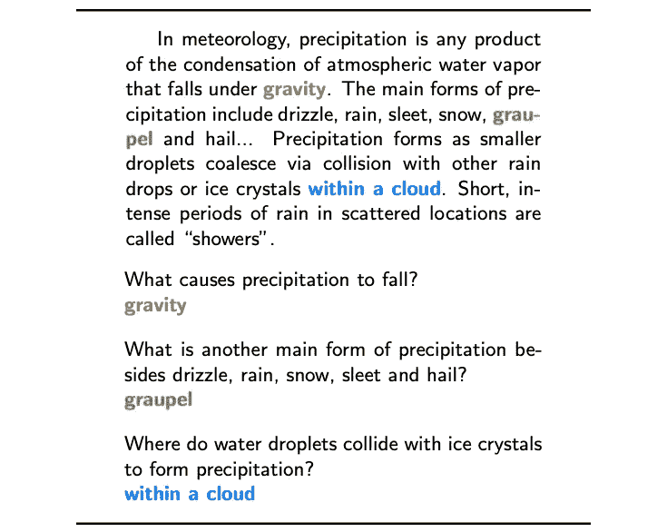
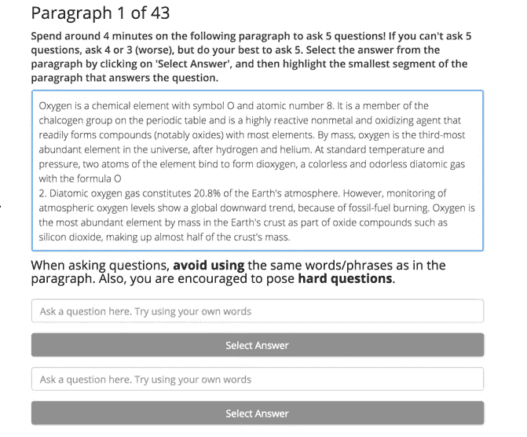
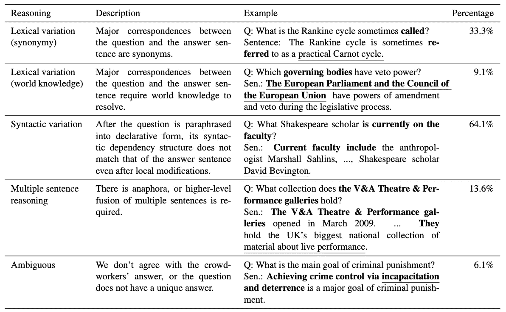

# 小队快速指南

> 原文：<https://towardsdatascience.com/the-quick-guide-to-squad-cae08047ebee?source=collection_archive---------12----------------------->

## 关于斯坦福问答数据集(SQuAD)你需要知道的所有基本信息。

斯坦福问答数据集(SQuAD)是一组问答对，对自然语言处理模型提出了强有力的挑战。无论您只是对了解流行的 NLP 数据集感兴趣，还是计划在您的项目中使用它，这里都是您应该知道的基础知识。

由[艾米丽·莫特](https://unsplash.com/@emilymorter?utm_source=medium&utm_medium=referral)在 [Unsplash](https://unsplash.com?utm_source=medium&utm_medium=referral) 上拍摄的照片

小队有什么任务？顾名思义，SQuAD 专注于问题回答的任务。它测试一个模特阅读一段文字，然后回答相关问题的能力*(闪回 SAT 的阅读理解)。这是一项相对简单的任务；数据集的创建者举了一个例子:*

班底资料中一段的问题和答案范例。图像归功于 Rajpurkar 等人，数据集的原始创建者。

**小队是怎么创建的？为了编制 SQuAD，创建者们从维基百科的前 10，000 篇文章中抽取了 536 篇。从每篇抽样文章中，他们总共提取了 23，215 个段落(确保过滤掉过小的段落)。他们按文章划分数据集，这样 80%的文章进入训练集，10%进入开发集，10%进入测试集。**

**注释小队。**创建数据集最重要的部分——注释——是由土耳其机械工人完成的。*经典！我看到机械土耳其人在许多 NLP 文件中客串。*这些员工只有在拥有高质量工作历史的情况下才会被选中(通过点击率来衡量)。对于每个选定的段落，工作人员被要求就该段落的内容提出并回答 5 个问题。他们被提供了一个文本字段来输入他们的问题，他们可以在段落中突出显示答案。SQuAD 的创建者确保工人们提出的问题是用他们自己的话来说的，甚至禁用了复制粘贴功能。不不不！不是我的复制粘贴工具！

用于从土耳其机械工人收集注释的程序示例。图像归功于 Rajpurkar 等人，数据集的原始创建者。

**数据集分析。**一个好的数据集的关键部分是理解它的属性。为此，创作者探索了三个领域:

1.  **答案的类别。**每个答案被分成以下类别之一:“日期”、“其他数字”、“人”、“位置”、“其他实体”、“普通名词短语”、“形容词短语”、“动词短语”、“从句”和“其他”。他们发现日期和数字占答案的 19.8%，名词占 32.6%，名词短语占 31.8%，其他类别占剩余的 15.8%。
2.  **推理所需。**创建者从开发集中抽取问题，并手动将问题分为回答问题所需的不同推理类别。例如，类别“句法变异”意味着问题本质上是转述的，需要重新排列单词才能找到答案。在这些要点下面，我包含了所有类别的原始表格以及属于该类别的问题的百分比。
3.  **句法分歧。**创作者测量问题和包含答案的句子之间的句法差异，以衡量问题的难度。基本上，他们创建了一个度量标准，来评估将一个问题转换成带有答案的句子所需的编辑次数。具体细节可以在原始论文[这里](https://arxiv.org/pdf/1606.05250.pdf)中找到，但重要的是数据集被发现具有不同范围的语法差异。确保数据集的多样性总是好的！

回答问题所需的每一类推理的发展集的例子。图像归功于 Rajpurkar 等人，数据集的原始创建者。

**是什么让班底如此优秀？当然，对于像问答这样的任务，有大量的数据集。将 SQuAD 与其他数据集进行比较时，有几个主要区别:**

*   **阵容大。**其他阅读理解数据集如 [MCTest](https://www.aclweb.org/anthology/D13-1020.pdf) 和 [Deep Read](https://www.aclweb.org/anthology/P99-1042.pdf) 太小，无法支持密集复杂的模型。MCTest only 共 2640 题，Deep Read only 共 600 题。SQuAD 拥有这些由多达 100，000+个问题组成的数据集。
*   **小队具有挑战性。**在关注答案抽取的其他基于文档的问答数据集中，给定问题的答案出现在多个文档中。然而，在《小队》中，模型只能访问一个段落，这是一个更加困难的任务，因为错过答案是不可原谅的。
*   **小队需要推理。**一种流行的数据集类型是完形填空数据集，它要求模型预测文章中缺失的单词。这些数据集很大，他们提出了一个有点类似于小队的任务。SQuAD 在这方面的关键改进是它的答案更复杂，因此需要更密集的推理，从而使 SQuAD 更好地评估模型理解和能力。

**总结思想。** SQuAD 可能是最受欢迎的问答数据集之一(它被引用了 2000 多次),因为它创建良好，并在许多方面改进了其他数据集未能解决的问题。我强烈推荐任何想要评估 NLP 模型的人在 SQuAD 上测试它，因为它是测试模型对语言的理解甚至只是总体性能的一个很好的数据集。

延伸阅读:

*   [小队原纸](https://arxiv.org/pdf/1606.05250.pdf)
*   [小队网站(含下载链接)](https://rajpurkar.github.io/SQuAD-explorer/)
*   [其他问答数据集的列表，以防我没有让你相信 SQuAD 是一些好东西](http://nlpprogress.com/english/question_answering.html)