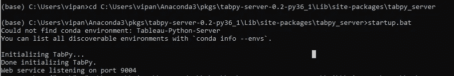
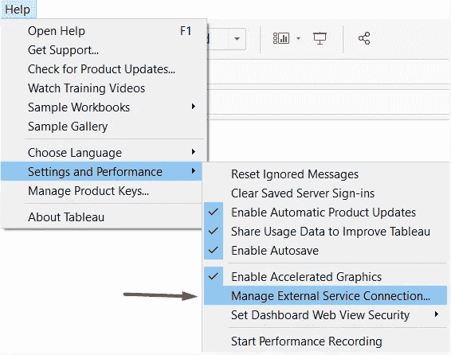
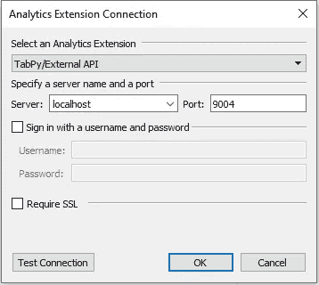
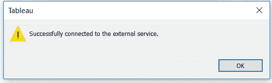
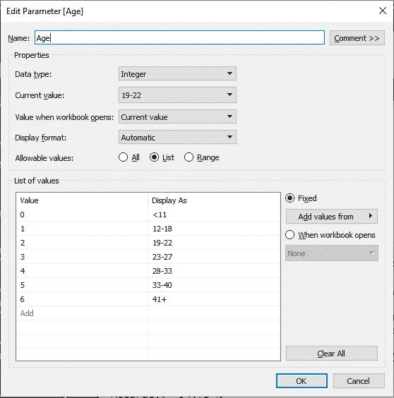
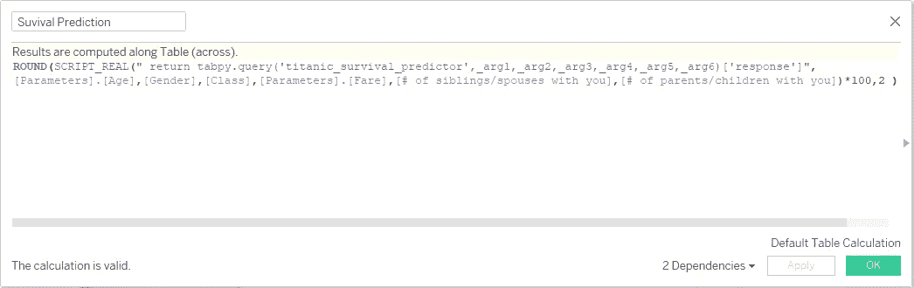

# 部署您的机器学习模型的最快方法！！

> 原文：<https://towardsdatascience.com/the-quickest-way-to-deploy-your-machine-learning-model-12af348e0783?source=collection_archive---------17----------------------->

## 使用 Python，Tableau，机器学习和 TabPy

照片由 [Subash Patel](https://www.flickr.com/photos/subashpatel/43432945112/) 拍摄

数据科学就是尽可能以最简单的方式向最终用户呈现洞察力。你在一个机器学习/深度学习模型上工作，从数据清理到超参数调整。然而，您意识到向最终用户呈现它的最重要的任务甚至还没有开始。在这里，我将讨论一种使用 **Jupyter 笔记本**和 **Tableau** 部署 ML 模型的简单快捷的方法。

> 我们将使用 [Scikit-Learn](https://scikit-learn.org/stable/) 来处理数据并构建模型。然后我们使用 [TabPy](https://www.tableau.com/about/blog/2020/1/python-tableau-now-10) 来部署构建好的模型，并在 Tableau 中访问它。如果您正在寻找一种方法来部署模型，以便在云平台或分布式系统中使用它，您现在可以停止阅读。

# **数据**

我们将使用 Kaggle 上可用的 [Titanic](https://www.kaggle.com/c/titanic) 数据集来构建一个随机森林模型。该项目的目标是预测一名乘客是否可能在泰坦尼克号灾难中幸存。我们将使用人口统计变量，如年龄、性别、兄弟姐妹数，以及乘客的机票等级作为独立变量。

> 该项目的目标是预测一名乘客是否可能在泰坦尼克号灾难中幸存。

显示最终部署模型的仪表板。

数据集包含 891 行，其中 177 个年龄值缺失。我们用平均值一个标准差内的随机数替换缺失值。同样，我们将 Fare 中的 NaNs 修改为 0。

# 建模

我们用默认参数构建一个随机森林分类器。然而，我们仅用 6 个变量就达到了约 94.5%的准确率，这表明它可能过度拟合了训练数据。但是，我们的重点是快速部署训练好的模型。因此，我们不会试图获得最好的评估指标，如精确度或召回率。Kaggle 上有很多其他的[资源](/predicting-the-survival-of-titanic-passengers-30870ccc7e8)关注这一点，这里有一个简单的模型，没有交叉验证或参数调整。

# 要求

我们需要在我们的机器上安装 Python 2.x 或 Python 3.x 来开始部署，或者您可以使用 [Anaconda](https://docs.anaconda.com/anaconda/install/windows/) 来安装 Jupyter Notebook 和 Python。此外，我们需要安装 TabPy 来启动一个可以托管已部署模型的服务器。你可以简单地按照[这里](https://www.theinformationlab.co.uk/2019/04/09/how-to-set-up-tabpy-in-tableau/)的步骤来做。如果您觉得安装命令花费时间，那么关闭 cmd 提示符并在另一个提示符下尝试。我不得不做了几次才弄对。

> **TabPy**(Tableau Python**服务器**)是一个分析扩展实现，它通过允许用户通过 Tableau 的表计算执行 Python 脚本和保存的函数来扩展 Tableau 的功能。

## 启动并运行服务器的步骤

1.  在 conda 环境中安装了 TabPy 之后，打开一个新的 anaconda 命令提示符，使用“CD C:\ Users \ vipan \ anaconda 3 \ pkgs \ TabPy-server-0.2-py36 _ 1 \ Lib \ site-packages \ TabPy _ server”将目录更改为 TabPy 服务器目录。使用您的 PC 用户名和相应的目录路径代替 vipan。
2.  运行命令“startup.bat ”,您应该会看到下面的屏幕。不要关闭此窗口，因为我们需要服务器在线。

启用服务器连接

# **部署**

我们需要创建一个函数，该函数可以将 Tableau 中选定的参数值作为输入，并返回该人在泰坦尼克号上幸存的概率。现在，我们**将函数和来自 Jupyter Notebook** 的训练模型一起部署到 Tableau-Python 服务器上。模型在服务器上保存为 **pickle 文件。**在这个步骤之后，经过训练的模型被托管在本地的 TabPy 服务器上，该服务器可以从 Tableau 访问！！

如果您得到任何错误消息说“tabpy_client”没有找到，那么您可以在 anaconda cmd 提示符下运行“pip list”命令来查看已安装库的列表并安装所需的库。通过使用“override = True ”,您可以训练和部署相同的模型，同时用最新或更新的版本替换旧版本。当您需要每天根据新数据训练模型时，这很有帮助。_arg1、_arg2 等将从 Tableau 中传递。

# Tableau 配置

服务器运行后，在 Tableau 中转到:

测试连接，您应该会看到下面的通知。单击确定。

将“train.csv”文件导入 Tableau。为了访问 RF 模型，我们必须从 Tableau 传递参数。因此，让我们创建具有所需数据类型的参数来访问模型，如下所示。

类似地，使用数据标签为等级、性别、费用、兄弟姐妹/配偶数量(SibSp)和子女或父母数量(Parch)创建参数。( [Tableau 工作簿](https://github.com/VipanchiKatthula/Titanic_survival_prediction)供参考)。

使用下面的[脚本](https://gist.github.com/VipanchiKatthula/1a765baf76e880581418e5f0752575b4)创建一个计算字段，以连接到 TabPy 服务器。

Tableau 中计算字段的脚本。

我们必须将生存概率乘以 100 才能得到百分比值。此外，我通过创建另一个新的计算字段来创建死亡概率(请记住，您不能在另一个计算字段中访问之前的计算字段，因为这是一个具有分析扩展的字段)。瞧啊。！现在，我们可以使用我们创建的参数来创建可视化效果。 [***这里的***](https://github.com/VipanchiKatthula/Titanic_survival_prediction/blob/master/Titanic.twbx) ***是我创建的互动仪表盘*** 。

不幸的是，tableau-public 不允许发布带有分析扩展的仪表板，但您可以将它们发布到各自的工作服务器上。

Jupyter 笔记本的数据和代码以及 Tableau 工作簿可以在 [Github](https://github.com/VipanchiKatthula/Titanic_survival_prediction) 上找到。

1.  [https://github . com/shlok 6368/App-Rating-Predictor-Model-and-tabby-Integration/blob/master/Model % 20 building . ipynb](https://github.com/shlok6368/App-Rating-Predictor-Model-and-Tabpy-Integration/blob/master/Model%20Building.ipynb)
2.  [https://medium . com/@ shlok 6368/end-to-end-data-science-pipeline-using-python-and-tabby-data-scraping-data-cleaning-model-41 B2 dcb 63667](https://medium.com/@shlok6368/end-to-end-data-science-pipeline-using-python-and-tabpy-data-scraping-data-cleaning-model-41b2dcb63667)
3.  https://towards data science . com/predicting-the-survival-of-titanic-passengers-30870 ccc7e 8
4.  [https://www . theinformationlab . co . uk/2019/04/09/how-to-set-up-tabpy-in-tableau/](https://www.theinformationlab.co.uk/2019/04/09/how-to-set-up-tabpy-in-tableau/)