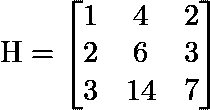
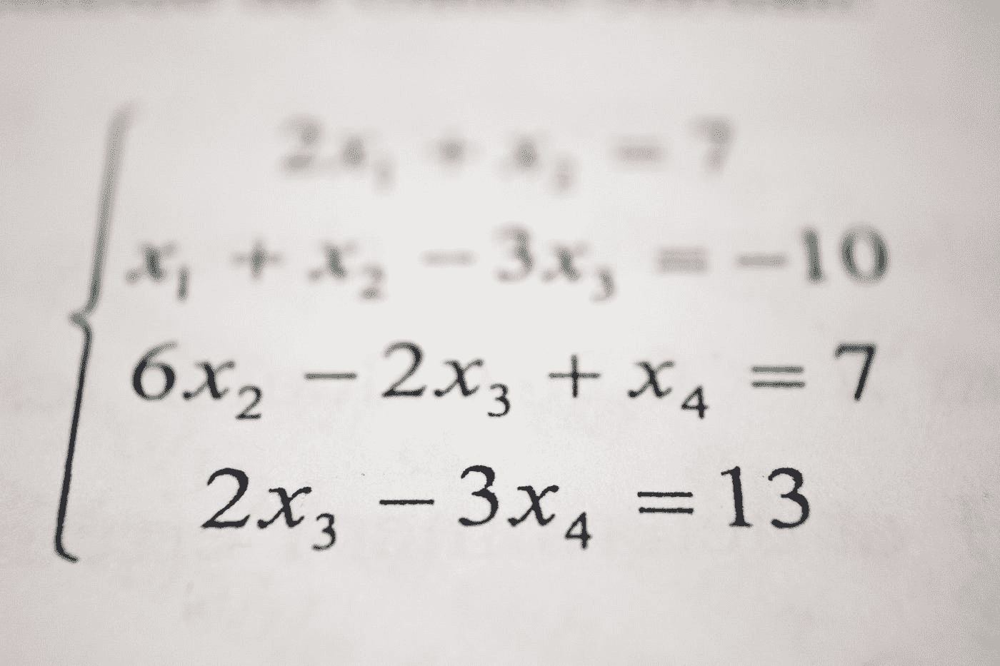

# 数据科学家的典型线性代数—A 部分

> 原文：<https://towardsdatascience.com/the-quintessential-linear-algebra-for-a-data-scientist-part-a-7d567504a6d9?source=collection_archive---------42----------------------->

## 教程系列

## 这个由多个部分组成的教程系列试图简明直观地掌握线性代数概念，同时又不遗漏难懂的概念。第一部分涵盖了进入这一领域所必需的基本定义。

沃洛季米尔·赫里先科在 [Unsplash](https://unsplash.com?utm_source=medium&utm_medium=referral) 上的照片

这篇文章是多部分教程的第一部分，目的是理解线性代数的基本定义，并从矩阵和向量的角度开始思考。这也是以编程方式理解和验证概念的开始。

> **如果任何部分或概念不清楚，请在下面评论。**

# 基础

让我们从一个**矩阵**开始，命名为 **H** (代表快乐！？！)**。**一个矩阵**、**顺便说一下**、**就是一个按行和列排列的数字的矩形阵列。

矩阵 **H** 由三个*行* **向量**组成，布局如下:

而从另一侧抓起，包含三个*列的*向量**和**的布局如下:

现在观察中间的列向量与最后一个列向量方向相同，因为中间的列向量实际上是最后一个列向量的 2 的标量倍数。

既然我们已经看到了一个标量被乘以一个向量，那么让我们看看一个向量 **x** 是如何被乘以矩阵 **H** 的。

可以看出，矩阵 h 的每一列都乘以向量 **x** = **[** x₁，x₂，x₃ **]** 的元素，然后相加在一起。

根据定义，这代表了 **H.** 列的**线性组合**

这个线性系统跨越一个二维平面。换句话说，他们平面上的每个向量都可以用列向量**【1 2 3】****【4 6 14】**的线性组合来导出。

注意，如果列向量**【2 3 7】**与列向量**【4 6 14】**(或**【1 2 3】**)**不在同一方向，那么 **H** 列的线性组合实际上将跨越整个三维空间。**

**现在，根据定义，矩阵 **H** 的**列空间**是其列的线性组合，在这种情况下，如刚刚所示，是一个*平面*。**

## **矩阵乘法**

**已经看到了标量与向量以及向量与矩阵的乘法，现在让我们考虑两个矩阵的乘法，如下所示。**

****

**只有当左矩阵的列数与右矩阵的行数相同时，两个矩阵才能相乘。你可能已经猜到，矩阵乘法**不是可交换的**，除非在特殊情况下。这就是为什么术语:*右*和*左*。**

**矩阵乘法的经验法则是输出矩阵的行数与左矩阵的行数**相同，其列数*等于右矩阵的行数。*****

****因此，对于我们示例中考虑的矩阵乘法，左侧*上的 3(行)x 2(列)矩阵与右侧*上的 2 x 3 矩阵相乘时，必须得到 3 x 3 矩阵。******

***现在让我们看看乘法是如何进行的。(众多方式中的[之一！)](https://medium.com/@ghenshaw.work/3-ways-to-understand-matrix-multiplication-fe8a007d7b26)***

***对于乘法的输出矩阵，其*第一列向量* 将是左矩阵的两列向量**【1 2 3】****【4 6 14】**与右矩阵的第一行向量的线性组合，如下图所示:***

******

***通过对所有列重复这个计算，你会发现矩阵乘法的输出就是矩阵 **H** 本身。***

******

***让我们使用 SymPy 来验证这是正确的。***

******

***对应于 In[45]和 In[49]的代码定义两个矩阵，In[52]进行乘法运算。输出与 **H** 相同。***

***在下面的代码中，注意矩阵乘法是不可交换的。当我们交换左右矩阵时，我们得到不同的结果。***

******

***但是，还要注意，我们仍然遵循经验法则，输出矩阵现在的维数是 2 x 2。***

# ***秩因子分解***

************

***注意我们刚刚相乘的两个矩阵(上面用 **C** 和 **R** 表示)本质上是矩阵 **H** 的**因子**。***

***其实矩阵 **R** 是一个特殊的矩阵，称为矩阵 **H** 的**降排梯队形式**。我们将看到它是什么以及它是如何确定的，但让我们总结一下我们迄今所看到的。***

***我们看了标量，向量和矩阵。然后我们定义了矩阵的列空间。看到了一个向量如何乘以一个矩阵。刚才，我们看到了两个矩阵是如何相乘的。***

***现在让我们回到更多的定义上来。***

***在上面显示的矩阵 H 的两个因子中，矩阵 **C** 的列被定义为 **H** 的 的**基**和矩阵 R 的行被定义为*行空间*的**H** 的**基**。***

***基本上，向量空间的**基**是那些元素的集合，使得向量空间中的每个元素都是它们唯一的线性组合。因此，列空间的每个元素(在本例中是一个平面)都可以由 **C** 中元素的线性组合生成。***

***类似地， **H** 的行空间中的每个元素可以由 **R** 中的向量的唯一线性组合生成。但是首先，**行空间**，类似于列空间，只不过是行向量的线性组合。***

***(坚持住！随着我们继续前进，这将变得更加清楚。)***

## ***矩阵的秩***

***此外，矩阵的**秩被定义为矩阵中线性无关的列向量的最大*数量*。正如你所直觉的，我们的矩阵 **H** 的*秩* 是 **2** 。*****

***另一个矩阵 **H₁** 的秩是多少，如下图？***

******

***这个矩阵的秩也是 **2。*****

***这是因为第一列向量是第二列向量与最后一列向量的两倍之和。(稍后，我们还将使用 SymPy 验证这一点。)***

***换句话说，第一个列向量*依赖于另外两个列向量*。因此，我们只有两个独立的列向量。***

***而且一个矩阵的**秩**也是一个矩阵中线性无关*行*向量的最大个数。这意味着对于矩阵，行秩等于列秩。***

***这些新的定义可能有点混乱，但是当我们更深入地研究矩阵的*行梯队形式*时，所有这些都将变得非常清楚。***

***线性代数的一个有用的应用是解线性方程组。而**高斯消去法**就是一种用来做到这一点的算法。我们谈论这个算法是因为它使用了从矩阵生成缩减的行梯队形式的方法。***

***因此，在我们进一步行动之前，让我们了解这一点。***

# ***解线性方程组***

***高斯消去法或行归约法是线性代数中用于求解线性方程组的一种算法。***

***这包括以矩阵的形式表示线性方程组，然后在矩阵上执行一组行操作。***

******

***由[安托万·道特里](https://unsplash.com/@antoine1003?utm_source=medium&utm_medium=referral)在 [Unsplash](https://unsplash.com?utm_source=medium&utm_medium=referral) 上拍摄的照片***

***高斯消去法迭代地采用矩阵(代表线性方程组)上的三种基本行操作之一，将矩阵简化为*行梯队*形式。基本操作是:***

*   ***将一行乘以一个非零数字，***
*   ***交换两行。***
*   ***将一行的倍数添加到另一行。***

***让我们用一个例子来清楚地理解这一点。我复制了一个来自维基百科的例子来说明这种方法的工作原理。***

***考虑线性方程组:***

******

***线性方程组。(来源:[维基百科](https://en.wikipedia.org/wiki/Gaussian_elimination))***

***作为第一步，线性方程被表示为如下所示的增广矩阵。本质上，变量的系数用于形成 3×3 矩阵，该矩阵增加了一个向量(对于常数)。***

******

***现在，通过一系列的行操作，矩阵被转换成梯队形式。***

***例如，通过行操作，增广矩阵的第二行向量被第二行向量与第一行向量的三分之一的和所代替。如下所示。***

******

***第二行和第三行的行操作。***

***经过一系列的行运算，得到梯队形式或上三角矩阵。注意，(根据定义)上三角矩阵在矩阵的对角线(2，，-1)下面有零点。***

******

***继续行操作，该方法成功地求解了 **x** 、 **y** 和 **z** 。***

******

***解线性方程组的高斯消元法***

***增广矩阵中的 3×3 单位矩阵是*缩减行梯队形式*。***

***矩阵的**秩**是矩阵的行梯队形式中非零行的数量。所以对于线性方程组对应的增广矩阵，秩为 **3** 。***

## ***行等级=列等级***

***现在让我们回到我们的矩阵 **H** 并连接所有的点得到完整的图片，同时我们证明以下。***

*****证明**:矩阵的*行秩*始终等于其*列秩*。***

***那么为什么 **H** 的缩减行梯队形式，即 **R** 是其行间距的基础呢？这是因为，在 H 上得到 R 所需的每个行操作(如解方程组时所示)只不过是对 **H** 的行向量的线性组合。所以本质上，我们总是可以通过反转从 **R，**回到 **H** 的行向量。***

***此外， **R** 中的向量是独立的，因为它尽可能减少到 **0** s 和 **1** s。(如前所述，对于与方程组相关的矩阵，对应的 R 是一个**单位矩阵**，其对角线上有 1，其他地方有 0)。***

***所以， **R** 是一个依据(不是唯一！ **H** 的行间距。***

***并且通过展示 **CR** = **H** ，我们展示了 **H** 中的每一行是 **R** 中的行的线性组合，并且 **H** 中的每一列也是 **C** 中的列向量的线性组合。(我们就是这么定义矩阵乘法的！)***

***由于 **C** 中的列向量数量和 **R** 中的行向量数量必须相等，为了使 **CR** = **H** 起作用，行秩必须与列秩相同。***

***(如果你还有疑问，欢迎随时评论。)***

***让我们使用 python 为我们的矩阵以编程方式验证这一点。***

# ***使用 SymPy 演示[列秩=行秩]***

***让我们使用 Python 中的 SymPy 库来计算我们的矩阵的行梯队形式。***

******

***在上面的代码片段中，我们确定了矩阵的行梯队形式 **H.** 行梯队形式与前面使用的相同。***

***现在，让我们确定 **H** 的**转置**的行梯队形式。矩阵的转置将矩阵沿对角线翻转，使行变成列。***

***所以为了验证矩阵 **H** 的列秩和行秩相等，我们确定转置矩阵的行梯队形式。***

******

****的行梯队形式转置了 **H** 的*，如上图输出所示。同样，非零行的数量是 **2，**再次显示行秩和列秩相等。***

# ***基于 SymPy 的 H₁秩因子分解***

***与此同时，我们忘记了我们的另一个矩阵 **H₁** ，我们想做秩因子分解。这是使用 SymPy 的代码。***

******

*****H₁** 的列空间的基础只包含 **H₁** 的前两个列向量。因为这足以在列空间中生成每隔一个的向量。行空间的基础也只包含 **2** 个向量。不出所料！***

***本文介绍的秩因子分解是将矩阵分解成更简单的矩阵的许多有趣方法中的第一种，这些方法的性质对于计算效率和分析非常有用。***

******

***照片由 [Antoine Dautry](https://unsplash.com/@antoine1003?utm_source=medium&utm_medium=referral) 在 [Unsplash](https://unsplash.com?utm_source=medium&utm_medium=referral) 上拍摄***

***在本教程的后续部分，我们将介绍这些矩阵和它们的性质，同时也深入研究它们的应用。***

***我对线性代数的理解很大程度上要归功于麻省理工学院的吉尔伯特·斯特朗教授，而学习其有趣应用的动力要归功于印度理工学院的 G.N.S .普拉桑纳教授。这个教程系列的很多元素都受到了他们讲课的影响。***

***🔵在 Linkedin 找到我🔵***