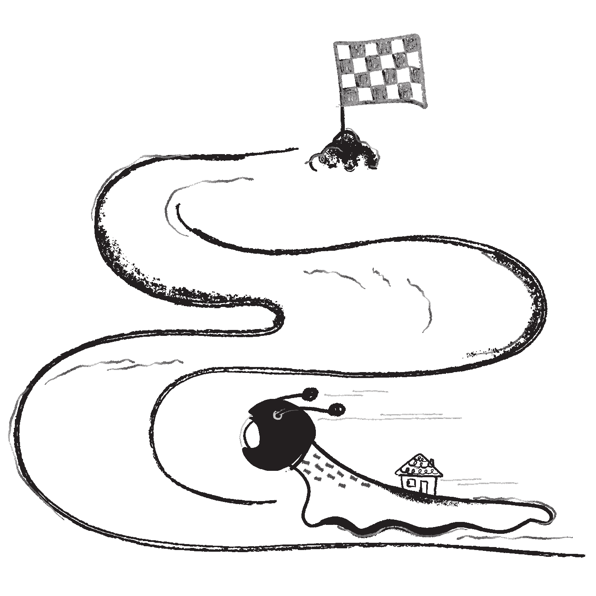
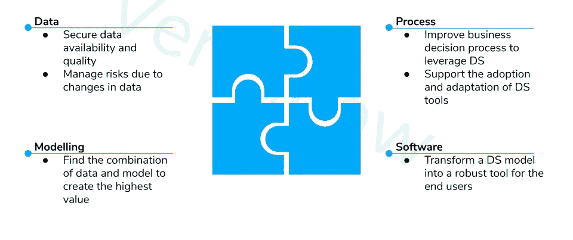
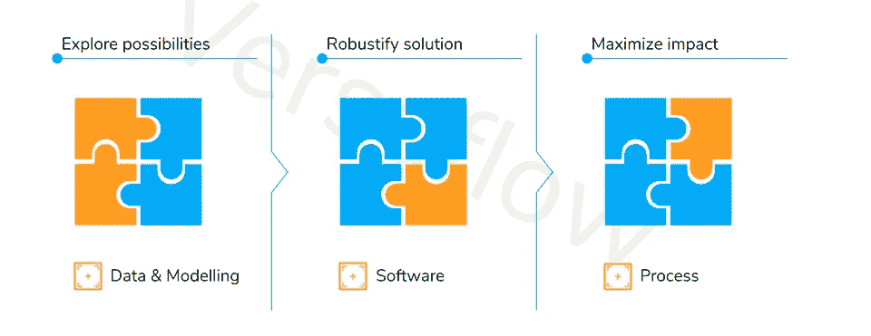
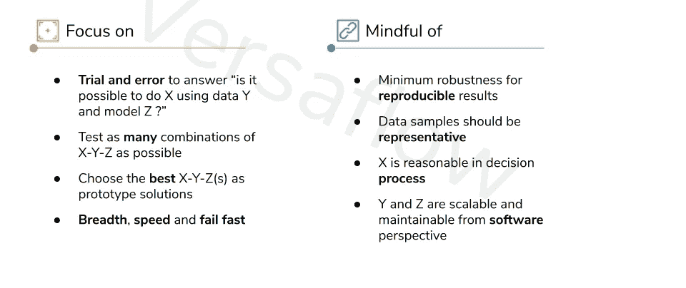
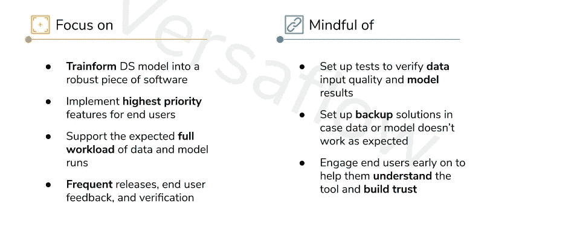
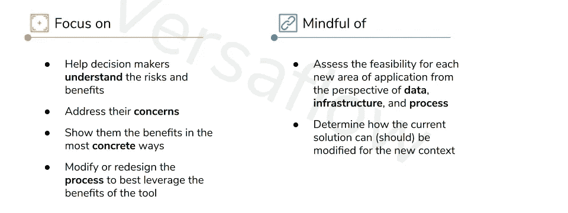

# 数据科学项目的怪癖

> 原文：<https://towardsdatascience.com/the-quirks-of-data-science-project-b92cd33b3357?source=collection_archive---------70----------------------->

## 数据科学和商业战略

## 第 2/4 集—完成项目

# 介绍

让我们从上次停止[的地方继续，假设您已经为您的业务找到了完美的数据科学用例。](/how-to-find-the-right-data-science-use-cases-for-your-business-55002d0cde2b)

那么，下一步是什么？

自然，一个项目应该遵循使事情真实。很快，你聚集了一群杰出的人。你们讨论问题的潜在解决方案。你写用户故事，制定计划，绘制图表，在白板上贴大量的便利贴。你遵循敏捷(或 Scrum 或看板)方法，虔诚地组织演示、演示和回顾。您的团队决心拿出最佳解决方案并产生巨大影响。然而，事情仍然变得阴暗。突然间，“模型”不再起作用了。你的团队必须投入大量时间进行调试。最后期限无情地临近，而利益相关者不耐烦地等待着，对人工智能的变革力量越来越不相信。经过英勇的努力，您的团队终于在截止日期前几秒钟交付了结果。仍然满身冷汗的你，看到结果一点也不差就放心了。然而，当你最终回到涉众身边，自豪地向他们展示结果时，你会注意到他们的热情似乎已经消失了。“毕竟，数据科学没有那么神奇”，他们皱着眉头总结道，让你完全沉默。

那真是一个不幸的故事。然而，以这种方式失败的数据科学项目并不少见。哪里出了问题？我们如何才能成功管理一个数据科学项目？和正常的 DevOps 有什么不同？在“数据科学和策略”系列的第二篇文章中，我们将讨论数据科学项目的特点，并为您提供增加成功机会的工具。我们开始吧:)

# 一个 DSP 的四个流

如果你还记得[的第一篇文章](/how-to-find-the-right-data-science-use-cases-for-your-business-55002d0cde2b)，你知道数据科学用例有两个先决条件——数据和业务决策。数据科学用于从数据中发现机制，以改进业务决策并产生影响。数据科学项目(DSP)旨在实现这一目标。这是发展部、德国、SE⁴、OP⁵和其他利益攸关方之间的密切合作。DSP 有 4 个流，每个流都需要特定的技能，但也深深地交织在一起:

[点击这里阅读全部内容](https://docs.google.com/presentation/d/e/2PACX-1vSeIogBDRq3mKEsPtw_xQjywyWZNLd8FwY-fApLQZ90cC5aNMc9cpCmyRcAf0Vgu5Nk1xYisqWmyYU8/pub?start=false&loop=false&delayms=30000)

1.  **数据**
    数据是一切的起点。数据的可用性和质量可以决定项目的可行性。此外，数据不是静态的。它可以因行为改变或地理差异而改变。数据的变化可能发生在 DSP 的范围之内或之外，并在 DSP 中引发连锁反应，使其成功面临风险。因此，除了确保数据可用性和质量，管理数据易失性对 DSP 也至关重要。
2.  **流程**
    流程是执行商业决策的一系列操作。由于 DSP 旨在改善业务决策，因此通常需要修改或重新设计当前流程，以便能够从数据科学中受益。这要求运营部适应新工具，并改变他们的工作方式。他们对数据科学(或数据科学驱动的工具)的认可和采用直接决定了 DSP 能够产生多大的影响。因此，DSP 的一个重要部分是了解 OPs(或最终用户)的需求，设计一个他们认可的流程，并在他们的适应过程中为他们提供支持。
3.  **建模**
    建模不仅仅是关于算法或者特征工程。这也是我们将现实世界中的问题转化为数学术语的方式，这些术语可以被编码并通过数据进行测试。尽管现在，训练一个 ML 模型似乎是世界上最容易的事情，但是建模仍然是一个繁重的过程。它不可避免地需要(许多)反复试验和错误，其中我们修改数据，假设，算法，特征和参数，以实现更好的结果。然而，即使是最好的模型也是以数据集为条件的，当数据发生变化时，它也可能无法正常工作。(这通常是重大崩盘背后的罪魁祸首。)而且，造型的最终目的甚至不是表现。它是为了在性能、业务需求和基础设施限制之间实现良好的平衡，以创造最高的价值。
4.  **软件**没有它，DS 很难超越漂亮的图表和令人印象深刻的数字。DSP 中的软件工程与典型的软件开发过程有许多共同之处:频繁的测试和发布，以捕捉客户(OPs)的需求，并逐步构建最终产品。然而，DS 也给 SE 带来了额外的挑战:它需要支持数据管道和模型运行，还需要处理伴随数据和模型而来的不确定性。因此，DSP 中的软件工程可能比您在正常的 DevOps 环境中预期的更像过山车。

好了，给定这四个流，让我们用一个 DE 来处理数据，用一个 DS 来建模，用一个 OP 来代表流程，用阿瑟来构建软件。这样够了吗？

不完全是…

你可能已经注意到这四个部分是多么的不确定，多么的交织在一起。毫无疑问，单独解决它们是不可能的。另一方面，试图一下子控制所有的事情会让人不知所措。一个更好的策略是将 DSP 构建成不同的阶段，每个阶段专注于一个或两个流，同时关注其他流中的依赖关系，并为下一阶段做准备。让我给你演示一下它是如何工作的:)

# 成功运行 DSP 的三个阶段

[点击此处阅读全部内容](https://docs.google.com/presentation/d/e/2PACX-1vSeIogBDRq3mKEsPtw_xQjywyWZNLd8FwY-fApLQZ90cC5aNMc9cpCmyRcAf0Vgu5Nk1xYisqWmyYU8/pub?start=false&loop=false&delayms=30000)

## 阶段 1:探索可能性

[点击这里阅读全部内容](https://docs.google.com/presentation/d/e/2PACX-1vSeIogBDRq3mKEsPtw_xQjywyWZNLd8FwY-fApLQZ90cC5aNMc9cpCmyRcAf0Vgu5Nk1xYisqWmyYU8/pub?start=false&loop=false&delayms=30000)

**【关注】**

这是 DSP 非常早期的阶段。数据还有待评估，BDA⁶(业务决策或行动)需要细化。对于如何解决这个问题，我们可能有一个很好的预感，但是这些想法需要被检验。在这一阶段，我们应该回答的关键问题是:

> 有没有可能用 Y 和 Z 做 X？

这里，X =改进 BDA 的方法，Y =一些数据集，Z =算法或模型。

在这个阶段，广度、速度、失败快是关键词。目标是探索尽可能多的 X、Y 和 Z 的组合，以便在数据和建模中获得风险的整体情况。自然，对 XYZ 的肯定回答是迷你原型，我们可以比较、选择并在此基础上创建一个好的解决方案。

**【铭记】**

为了提高速度，我们不应该全神贯注于软件工程，但需要最低限度的健壮性来确保结果是可重复的和无错误的。同样，较小的数据样本比大块数据集更可取，但我们应该非常小心，数据样本是整个数据集的真正代表。

同时，在流程和软件组件方面也有研究工作要做。我们还应该检查:

*   一个动作(X)在过程中是否真的有意义
*   SE 是否能够合理地支持和维护模型管道(Y 和 Z)

如果这两个问题都没有响亮的“是”，我们找到的答案就不会成为现实中可行的解决方案，而且(深深地叹了口气)我们不得不再试一次。

最后，帮助每个人从 DSP 一开始就了解关键风险非常重要。它不仅有助于期望管理，还提高了团队成员和涉众的警惕性，并动员他们减少风险。这将为意外发生时的合作打下良好的基础。

# 第二阶段:强健的解决方案

[点击此处阅读全部内容](https://docs.google.com/presentation/d/e/2PACX-1vSeIogBDRq3mKEsPtw_xQjywyWZNLd8FwY-fApLQZ90cC5aNMc9cpCmyRcAf0Vgu5Nk1xYisqWmyYU8/pub?start=false&loop=false&delayms=30000)

**【关注】**

如果我们成功地完成了第一阶段，我们应该有一个或多个工作原型(比如说，X、Y 和 Z 的组合)来解决我们的问题。这一阶段的目标是将原型转化为一个强大的解决方案，一个 OPs 可以使用的工具，而不需要 DS/DE 的任何看护。这一阶段的重点自然是软件工程，并附带处理数据和模型的反复无常。

在这一阶段，我们的目标应该是:

*   仅实施最终用户真正需要的最高优先级的功能，避免在“最好有”上花费时间
*   构建基础架构以支持数据和模型运行的预期全部工作负载

为了实现这一点，我们应该频繁发布，积极收集最终用户的反馈，并不断验证原型解决方案的功能没有被削弱，而是得到了加强。

**【忌惮】**

正如我们前面所强调，数据和建模是有风险的事情。为了限制风险(并使我们的工具超级健壮)，我们应该非常认真地对待以下任务:

*   设置测试以定期验证数据输入的质量
*   设置集成测试，以确保新功能不会改变模型结果
*   实施备份解决方案，以防数据或模型管道不按预期工作

此外，我们需要确保最终用户理解该工具，最重要的是，信任该工具。尽早接触运营部门并积极收集他们的反馈有助于建立这种信任。

与第一阶段相似，在此阶段也需要进行进一步的调查。为了产生更大的影响，我们的解决方案应该适用于更广泛的环境。评估潜在的应用范围可以让我们在下一阶段有一个良好的开端:最大化影响。

# 第三阶段:最大化影响

[点击此处阅读全部内容](https://docs.google.com/presentation/d/e/2PACX-1vSeIogBDRq3mKEsPtw_xQjywyWZNLd8FwY-fApLQZ90cC5aNMc9cpCmyRcAf0Vgu5Nk1xYisqWmyYU8/pub?start=false&loop=false&delayms=30000)

**【关注】**

最后，工具(软件)已经准备好了:只需点击一个按钮，一些数字和图表就会立刻跳出来。数据 ETL 总是一路绿灯，准确性看起来也不错。它拥有改变世界的所有潜力。但是怎么做呢？

让我们回忆一下，数据科学用例通过改进业务决策来创造价值。高影响力的决策通常由多层验证过程来保护，不会轻易被软件所取代。无论我们多么确信该工具的潜力，我们都需要说服团队之外的决策者将该工具集成到他们的过程中。这一阶段的重点是过程，我们应该忙于以下活动:

*   帮助决策者(运营、利益相关者)理解该工具的风险和好处
*   通过进一步的澄清或缓解计划来解决他们的顾虑
*   用最具体的方式向他们展示好处(生活演示、A/B 测试)
*   与决策者合作修改或重新设计流程，以充分利用该工具的优势

这不仅是一场采用工具的运动，也是流程变革的催化剂。通常，采用更好的流程本身已经可以创造巨大的价值，更不用说随之而来的数据科学力量了。

**【铭记】**

通常，这种影响运动有一个自然的起点:我们首先研究的 BDA。为了最大限度地扩大影响，我们自然会寻找该工具同样适用的其他环境。这可能是一个新的地理区域，一套新的产品，或 BDA 的上游/下游决策。我们应该评估新环境中的数据、基础架构和流程是否与当前的解决方案兼容。如果结果是积极的，这意味着我们可以扩大我们的采用活动，并争取更大的影响！

# 结论

我写的字比我预期的多得多。一个 DSP 是个相当复杂的东西，很难把不同的零碎整理成类别和阶段。实际上，这 4 个流和 3 个阶段不会以明确的方式发生。但是，我相信用这些术语来思考仍然是有帮助的，这样我们就知道目标是什么，应该关注哪些活动，陷阱在哪里，以及如何积极地限制风险。最终，通常是我们处理变化的能力决定了项目的成功。我希望这个框架可以为您提供应对这些风险的工具，并让您的 DSP 更加成功。

顺便说一下，我知道 3 阶段结构可能会给你一个瀑布项目的印象。恰恰相反，DSP 必须以敏捷的方式进行管理，其透明、检查和适应的价值观融入到每个阶段。不过下次再说吧！

**符号**

DSP:数据科学项目。

DS:数据科学家，但也是机器学习工程师，他们更擅长建模而不是软件工程

DE:数据工程师，每天与数据争论以确保数据科学和其他安全的战士。

SE⁴:的软件工程师致力于制造好的、健壮的产品或管道。

OP⁵:运营和生产部门，他们确保日常业务的良好运转。

BDA⁶:商业决策和行动。