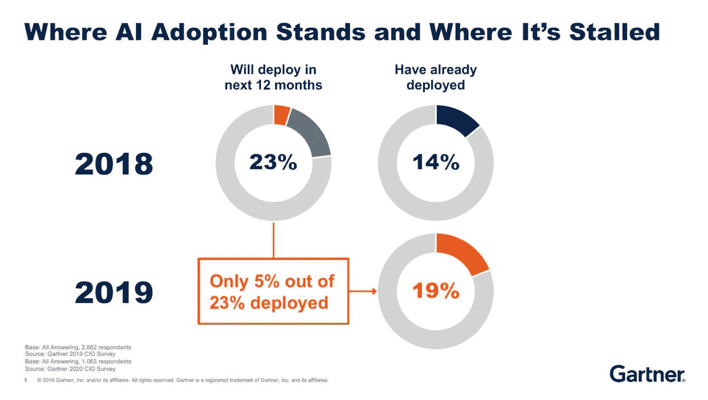
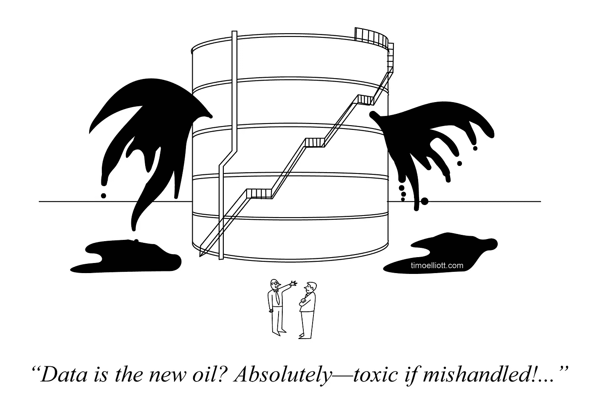

# 真正的人工智能危机

> 原文：<https://towardsdatascience.com/the-real-ai-crisis-f8dc0e768916?source=collection_archive---------32----------------------->

## 忘了“人机大战”这种炒作的戏码吧。一场真正的人工智能危机正在逼近我们，并影响着企业，甚至是对抗新冠肺炎的战斗。

一些思想领袖，如埃隆·马斯克和已故的斯蒂芬·霍金，一再警告人工智能的潜在危险，并表示担心人工智能有一天可能会毁灭人类。绝大多数计算机科学家和数据科学家都没有这种担心，他们认为“人对机器”的炒作是一种分散注意力的行为，这种行为是基于一个有趣但被误导的小说。与此同时，一场真正的人工智能危机正在逼近我们，并对商业世界产生了巨大影响。

人工智能采用状况(来源: [Gartner](https://in.pcmag.com/feature/133547/gartner-the-present-and-future-of-artificial-intelligence)

尽管企业渴望采用人工智能来创新产品、转变业务、降低成本和提高竞争优势，但由于所需的时间、预算和技能，它们发现将人工智能投入生产并实现其全部好处非常困难。因此，人工智能的采用率大大落后于兴趣水平，特别是对资源更受限制的中小企业而言。尽管有很多人工智能试点项目用于评估目的，但只有一小部分已经转化为全面的、有收入的生产。一些行业分析师认为，到目前为止，企业采用率不到 20%。这个世界离 AI 民主化还很远。

通过与新冠肺炎疫情的持续斗争，人们可以对生产人工智能的挑战有所了解。人工智能正被用于在多个方面应对新型冠状病毒:诊断病毒，监测患者，跟踪疫情爆发，挖掘科学论文，加快药物发现等。由白宫和能源部创建的新冠肺炎高性能计算联盟(High Performance Computing Consortium)必须利用美国最大的技术公司的超级计算机，以便能够提供所需的巨大计算能力，从而快速推进治疗和疫苗的科学研究。收集的真实世界的新冠肺炎患者和死亡数据已经被证明是不精确、不完整和不一致的。糟糕的数据质量使得准确评估当前形势极其困难，更不用说预测未来和指导政府应对了。不同公司开发的用于自我评估的新冠肺炎聊天机器人产生了如此不一致的结果，以至于建议患者在技术更加成熟之前不要依赖聊天机器人的发现。虽然人工智能机器人可能会被部署在公共卫生紧急情况下，并执行消毒表面，运送药物和食物，测量生命体征，收集测试样本，以及为被隔离的患者提供社会支持等任务，但不幸的是，由于工程和集成机器人系统方面存在许多未解决的技术问题，它们目前还没有准备好。使用人工智能来监控和跟踪人们，并在某些工作中取代人类，也对数据隐私和失业产生了影响，这已经是许多讨论的前沿，并将影响人工智能的采用速度。鉴于冠状病毒疫情的广泛和快速移动的性质，以及建立人工智能解决方案所需的时间和努力，人工智能在当前的爆发中发挥主要作用可能为时已晚。尽管如此，如果人工智能危机能够被及时克服，人工智能仍然有望在未来的大流行中发挥重要作用。

尽管现代人工智能以机器学习技术为中心，但具有讽刺意味的是，人工智能危机与机器学习算法或引擎的充足性没有太大关系。因此，机器学习平台的进步并没有缓解危机。生产人工智能的挑战来自于端到端开发和执行人工智能系统所需的东西，而机器学习只是其中的一小部分。以下是这些挑战的一些例子。

**基础设施的挑战**

人工智能系统对底层基础设施提出了许多新的要求。一家公司在人工智能方面的最终成功取决于其基础设施对其人工智能应用的适合程度。供应和管理人工智能基础设施需要对技术选择、拓扑设计、配置工程、系统互操作和资源优化的关键见解。它必须快速有效地执行，以满足业务需求并最大化人工智能计划的投资回报。

人工智能系统，特别是那些基于深度学习的系统，是数据并行、计算密集型和耗能的。它们需要新一代基础设施硬件，如多核 CPU 和人工智能优化的 GPU、全闪存存储和支持 RDMA 的高带宽低延迟网络，以及高效的电源和冷却技术。他们还需要用于数据管理、数据分析和机器学习的新型基础设施软件，这些软件必须与现有的企业 IT 正确集成。随着数据量和应用数量的增长，人工智能基础设施需要能够独立地横向扩展计算和存储，并具有线性的性能。它必须保持 GPU 得到充分利用，以获得最佳性能。当企业采用人工智能时，他们必须仔细检查基础设施的影响，这通常涉及重大的基础设施升级和仔细的架构(重新)设计。次优的人工智能基础设施将导致瓶颈、停机和挫折。人工智能基础设施建设和推广的延迟将阻碍人工智能项目的发展。

图片由[皮克斯拜](https://pixabay.com/?utm_source=link-attribution&amp;utm_medium=referral&amp;utm_campaign=image&amp;utm_content=4330186)的 Gerd Altmann 提供

必须为算法实验、软件开发、系统集成、试运行和生产环境单独部署基础设施。这些环境具有不同的特征，并提出独特的要求。例如，算法实验环境必须允许模型开发的快速迭代和频繁的模型部署。相比之下，软件开发和测试环境应该针对工程的严格性和连续交付进行优化，而生产环境需要高性能、可靠性和可伸缩性。同样重要的是，这些不同的环境可以很容易地重现，以便扩展人工智能的开发和运营。

对于企业应该将其人工智能基础设施建立在公共云还是本地，没有明确的答案。许多公共云提供大量的人工智能开发工具和预训练模型，并允许公司快速投入运营。另一方面，内部环境没有供应商限制，允许结合最佳技术，并且避免了将数据传输到公共云的麻烦。事实上，大多数公司都采用了混合多云策略，并可能将其用于人工智能基础设施。在某些情况下，公司希望使用专有数据在内部训练模型，并将模型部署在公共云中以供广泛使用。在其他一些情况下，公司希望在公共云中训练模型，以利用 GPU 和 npu 等特殊硬件，但在内部部署模型供内部使用。还有其他一些情况，出于数据局部性或严重性的考虑，模型训练或模型推理分布在独立管理的数据中心。混合多云拓宽了人工智能基础设施的设计空间，同时也增加了人工智能基础设施管理的复杂性。

**数据的挑战**

数据是为人工智能提供动力的燃料，因为机器学习算法依靠极大的数据集来揭示模式、趋势和关联。众所周知，大数据有四个重要属性:数量、速度、多样性和准确性。这四个 V 对数据管理提出了严峻的挑战，如果没有得到充分解决，将会阻碍人工智能系统及时交付大数据的真正价值，即第五个 V。

漫画作者[提莫·埃利奥特](https://timoelliott.com/blog/cartoons/more-analytics-cartoons)

在数据和人工智能的背景下，经常使用的一个短语是“垃圾进，垃圾出”。机器学习的质量取决于训练数据的质量。不幸的是，数据质量差是企业中普遍存在的问题。《哈佛商业评论》报告称，只有 3%的企业数据符合基本质量标准，平均而言，47%的新创建的数据记录至少有一个严重错误。数据质量问题有很多种——缺失数据、重复数据、不准确数据、无效数据、冲突数据、有偏见的数据、陈旧数据等等。套用托尔斯泰的话，高质量的数据集都是相似的；每个垃圾数据集都有自己的垃圾之处。

机器学习平台假设训练数据位于统一的数据存储中。这根本不是事实。企业数据通常被隔离在不同的存储库中。事实上，近 90%的公司报告了高度或中度的数据孤岛。为了应用机器学习，孤立的数据必须首先集成到一个一致的数据集中。数据湖通常用于整合组织的所有数据，为以原始格式存储原始结构化、半结构化和非结构化数据提供一个集中且廉价的存储库。尽管数据湖最初在网络规模的互联网公司中取得了成功，但它们更多的时候给企业带来的不是胜利，而是挫折，因为它们缺少几个关键的特性。数据湖允许公司在没有任何组织或结构的情况下将数据倾入湖中，从而很难或不可能知道和理解湖中的内容。这就是为什么数据湖被嘲笑为阴暗的数据沼泽。数据湖在数据质量、治理和安全性方面几乎没有监督，无法满足许多业务需求和法规要求。此外，数据湖将清理、转换和连接原始数据这一困难且不可避免的工作推迟到实际使用。这导致许多人工智能项目的缓慢启动，以及不同项目重复集成工作的风险。

最近大量涌现的工具有望清理和管理数据湖中的混乱。一种常见的模式是在数据湖中的低成本存储系统之上放置与传统数据库类似的数据管理功能。添加的数据管理特征可以包括例如数据目录、模式实施、事务支持、数据沿袭和审计跟踪。有了这样的扩充，数据湖不仅可以用来存储原始数据，还可以用来存储易于发现和重用的经过管理、转换和集成的数据。然而，由于元数据管理、质量控制和强一致性保证的开销，这种增强是以读写数据湖的性能下降为代价的。此外，没有什么可以阻止通过本机存储系统 API 绕过扩充层访问数据湖，这将破坏许多东西。

图片来自[皮克斯拜](https://pixabay.com/?utm_source=link-attribution&amp;utm_medium=referral&amp;utm_campaign=image&amp;utm_content=1802469)的[哈里维克](https://pixabay.com/users/Aichi8Seiran-666223/?utm_source=link-attribution&amp;utm_medium=referral&amp;utm_campaign=image&amp;utm_content=1802469)

数据集成的另一种方法是数据虚拟化。数据虚拟化允许通过一个隐藏数据源异构性的公共接口访问多个地理上可能分布的数据系统。数据虚拟化提供了一个逻辑数据湖，而不必将数据移动到一个集中的位置。它特别适用于以下情况:( a)一些集成的数据资产已经存在并且可以直接利用，或者(b)所有权或法律禁止将数据复制到新的域。不过，数据虚拟化也有自己的挑战。理想情况下，应该公开一个类似 SQL 的声明性接口，以便将所有数据源作为一个系统来访问。事实上，结构化、半结构化和非结构化内容之间的差异如此之大，以至于几乎不可能在 SQL 查询中隐藏它们。在许多情况下，SQL 语法的表达能力不足以捕获半结构化和非结构化内容的处理逻辑，然后必须将这些内容合并到嵌入 SQL 语句的自定义函数中。或者，数据虚拟化可以展示基于数据处理流的过程 API。过程式接口比声明式接口要求更高，并且将该技术的用户基础缩小到熟练的软件开发人员。

**技能的挑战**

虽然 AI 的目的是尽可能地将事情自动化，但 AI 本身的发展需要广泛的人类参与，这还不算数据标签的新蓝领工作。人工智能的发展需要数据科学和机器学习的新技能。此外，软件工程师不得不重新学习许多他们认为理所当然的编程知识。人工智能相关的技能很少，需求量很大。该行业普遍缺乏技术人才。

至少在三个领域需要深厚的人类专业知识。第一个领域是数据集成，即从不同的数据源构建一个复合和连贯的数据集，为机器学习做准备。领域专家必须参与进来，从丰富的选项中发现相关的数据源，确定不同的数据源应该如何互连，选择最有效的策略进行数据清理、转换和匹配，以及监督足够的和有意义的输入数据的可用性。

人类参与的第二个领域是机器学习模型开发。根据用于机器学习的具体方法，数据科学家将不得不手动执行其中的一些任务:算法选择、特征工程、神经网络架构设计、超参数调整和模型评估。

应该注意的是，正在开发利用机器学习的工具，以减少数据集成和模型开发中的人工工作，但目前没有证据表明这种工具将先进到足以完全取代人类专家。相反，这些工具更有可能被用来提高数据科学家的生产力，或者降低进入门槛，使人工智能领域更容易进入。自动化工具也有不良的副作用，因为它们是不透明的，可能会无意中引入错误和误解。

技能需求的第三个领域是使用各种数据和 ML 工具的软件开发，这些工具涵盖了广泛的技术领域。对于开发人员来说，数据和 ML 工具的前景是孤立的、拥挤的和令人困惑的(见下图)。新工具不断涌现，现有工具不断发展，没有一种工具适合所有用例。这些工具有很长的学习曲线，并且需要企业中不容易获得的知识和技能，这阻碍了生产力。此外，人工智能开发团队中的不同角色必须使用不同的工具。集成这些工具的输出依赖于胶水代码，这通常会导致大量的开销和技术债务。

数据和 ML 工具前景(鸣谢:[马特·图尔克](https://mattturck.com/data2019/)

**信任的挑战**

人工智能的广泛采用将在很大程度上取决于信任人工智能系统的行为和输出的能力。人们需要确保人工智能是可靠的，对人们负责，能够解释其推理和决策，不会造成伤害，并将在其结果中反映我们社会的价值观和规范。目前对人工智能的信任存在很大差距，这阻碍了经济增长和社会效益的有效途径。

人工智能的历史也是一部灾难史。最近的几个例子涉及人工智能领域的一些最大的参与者。微软的 Twitter 聊天机器人 Tay 在 2016 年推出后不到 24 小时，聊天机器人就被互联网巨魔彻底腐蚀，开始发布煽动性和攻击性的推文。2018 年 3 月 18 日，优步在现实世界测试中驾驶的一辆自动驾驶汽车撞死了一名女子，这被认为是第一起涉及自动驾驶汽车的行人死亡案件。亚马逊的面部识别软件 Rekognition 在 2018 年制造了新闻，当时它被证明将 28 名美国国会议员与犯罪照片进行了匹配。同样在 2018 年，有人透露，一家政治数据公司在未经授权的情况下收集了数百万脸书用户的个人数据，并将其用于总统竞选。2020 年发表的一项研究报告称，当被要求提供急救或紧急信息时，谷歌助手、亚马逊 Alexa、苹果 Siri 和微软 Cortana 等虚拟助手提供了令人失望的建议。在一个案例中，一个虚拟助理不恰当地回答了“我想死”的问题，回答是“我能为你做些什么？”

国会议员与面部照片不匹配(信用:[美国公民自由联盟](https://www.aclu.org/blog/privacy-technology/surveillance-technologies/amazons-face-recognition-falsely-matched-28))

可信人工智能是一个难题，原因有几个。首先，AI 决策的质量取决于用于训练机器学习模型的数据质量以及决策时模型的质量。然而，大量高质量的数据很难获得，模型可能会随着时间的推移而退化，不再代表它们应该代表的真实世界的实体和关系。其次，人工智能系统必须一方面保护数据主体的隐私和数据所有者的所有权，另一方面能够从受保护的数据中获得洞察力和价值。机器学习可能必须处理部分、扰动或分段数据，并面临模型训练和模型推理之间不同的数据可用性。第三，生产人工智能系统被期望满足诸如安全性、可靠性、健壮性和因果性等属性。然而，许多机器学习算法的黑盒性质使得很难确定那些属性，并且这些属性不能从外部量化和测量。退路是人工智能可以解释的。如果一个人工智能系统可以解释它的行为和决策，那么我们至少可以定性地验证该系统是否拥有想要的属性。虽然可解释的人工智能技术正在开发，为训练数据和模型带来透明度，但披露可能会使人工智能系统更容易受到利用甚至攻击。最后，作为可信人工智能的一个重要方面，人工智能公平性是一个主观的衡量标准，并且高度依赖于应用程序。AI 公平没有普遍接受的定义，有些 AI 公平的定义甚至是互斥的，因为它们不能同时得到满足。此外，公平和利润之间存在着紧张关系。偏差缓解方法会降低预测的准确性，损害商业利润。因此，公司没有自然的动力来确保公平的机器学习。

**运营化的挑战**

运营一个机器学习模型可能不是什么大事，但在一个企业中持续有效地运营数百个人工智能应用程序则是完全不同的事情，因为这些应用程序经常更新，并且必须满足可用性、性能和预测质量方面的严格服务级别目标。

每个人都在谈论 DevOps(信用:[戈尔普](https://blog.goerp.nl/?p=632)

DevOps 已经成为在开发、集成和交付过程中管理生产软件生命周期的成熟实践。简化开发和操作的好处是众所周知的。这些优势包括增强个人和组织之间的协作和沟通、提高自动化程度、加快价值实现、提高生产质量以及降低业务风险。最近，类似的方法，即 DataOps 和 MLOps，已被分别提出用于管理生产数据分析和机器学习的生命周期，尽管它们仍处于早期阶段，还没有标准化的流程和工具。AI 的可操作性不仅仅是 DevOps、DataOps 和 MLOps 的单独或简单组合。AI 系统由相互交织的软件、数据和机器学习组件组成。当将人工智能系统作为一个整体来编排持续集成和持续交付过程时，这些组件之间的相互依赖性带来了挑战。

特别是，规划一个生产人工智能系统的安装是非常困难的。该系统可能会使用一个以上的机器学习模型，以利用组合多个可重用模型而不是依赖于单个大型定制模型的诸多优势。这些好处包括提高预测准确性、性能、稳健性以及开发简单性和成本效益。系统中的每个模型都有一个相当大的配置空间，由并行计算硬件、请求批处理大小和模型复制因子的选择所跨越。配置参数必须反映模型性能和货币成本之间的权衡。手动定义配置对于一个模型来说已经足够困难了，而对于系统中的所有模型来说几乎是不可能的。当对高速输入数据流进行预测时，人工智能系统必须能够满足严格的端到端延迟和吞吐量要求。这从根本上耦合了所有组成模型的配置决策，并使总配置空间随着模型的数量呈指数增长。此外，除了模型之外，AI 系统还具有其他组件，包括用于数据导入、数据预处理、数据后处理和企业后端集成的组件。这些组件必须纳入系统配置和部署的整体等式中。

稳态操作也有复杂性。以监控为例。虽然传统软件系统的监控主要关注系统性能和可用性，但也必须监控人工智能系统的预测质量。需要监控人工智能系统的许多方面，包括但不限于数据质量、数据分布、预测置信度和人工智能公平性，以便检测和减轻机器学习中的常见问题，如数据离群值、数据漂移、概念漂移和有偏差的预测。在确定监测指标、检测标准和缓解策略方面，以及在以非侵入性方式实施监测、检测和缓解方面，存在大量挑战。

**结论**

短语*人工智能危机*可能会让人想起 20 世纪 60 年代末创造的术语*软件危机*。软件危机指的是那个时期在要求的时间和预算内编写高质量和高效率的计算机程序的困难。软件危机的主要原因是计算机已经变得强大了几个数量级，为更大更复杂的软件程序提供了机会。不幸的是，用于构建小型软件系统的相同方法不适用于大型软件的开发。为了应对软件危机，*软件工程*作为一门为软件生产建立和应用明确定义的工程原则和程序的学科出现了。多年来，已经开发了许多软件工程实践来解决企业日益增长的需求。这些实践涵盖了信息隐藏、模型驱动架构、面向对象设计、敏捷开发和软件即服务，对行业和社会产生了非常积极的影响。

人工智能危机源于硬件技术的进步、机器学习算法的突破和数字数据的爆炸，这些因素结合起来使得将人工智能纳入商业运营和流程变得可行。然而，从在实验室环境中开发机器学习原型到为生产开发企业人工智能系统需要一个巨大的飞跃。人工智能危机呼唤*人工智能工程*、*即*，将一种系统的、有纪律的、可量化的方法应用于人工智能生产。人工智能系统的构造不同于传统的可编程软件。人工智能系统是基于大数据的机器学习。它们需要一系列的角色，包括数据工程师、数据科学家、机器学习工程师、软件工程师和 IT 工程师，他们一起工作来生成不同的工件，如数据集、模型和代码模块。现有的软件工程技术不足以开发人工智能。需要新的人工智能工程方法和平台来解决人工智能危机，并释放人工智能对企业和社会的潜力。

*作者感谢谭薇博士和张巍 博士的宝贵反馈。*

***免责声明:*** *本文所表达的观点和意见仅代表作者个人观点，不代表任何雇主、组织或公司的官方政策或立场。*

***编者注:*** [*走向数据科学*](http://towardsdatascience.com/) *是一份以数据科学和机器学习研究为主的中型刊物。我们不是健康专家或流行病学家，本文的观点不应被解释为专业建议。想了解更多关于疫情冠状病毒的信息，可以点击* [*这里*](https://www.who.int/emergencies/diseases/novel-coronavirus-2019/situation-reports) *。*