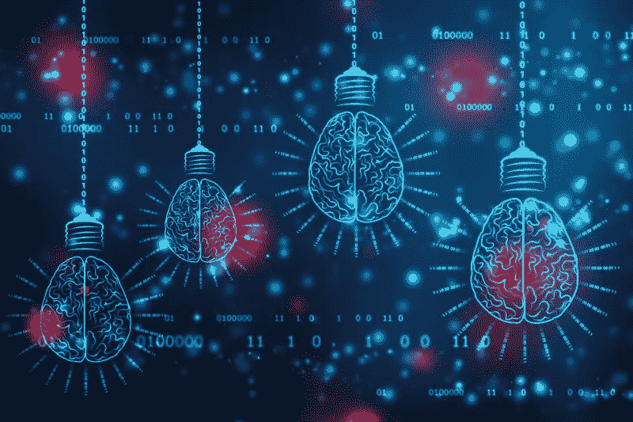
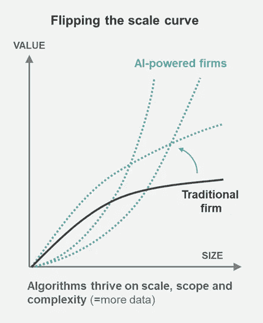
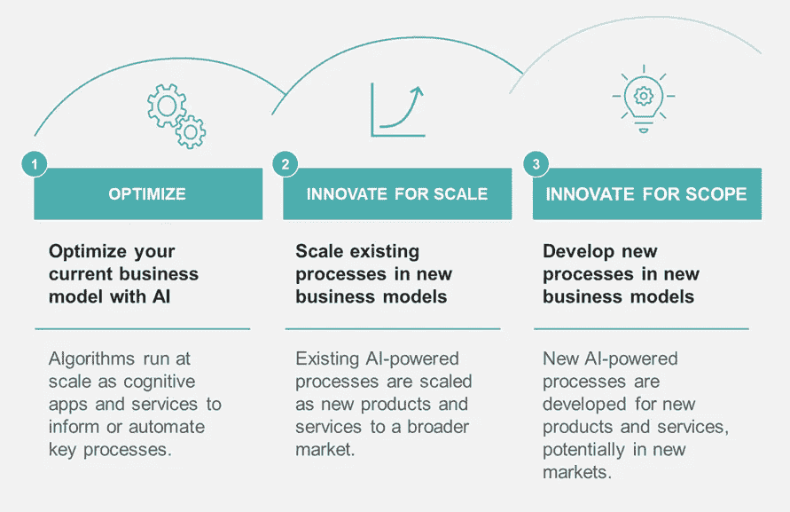

# 人工智能的真正承诺是创新，而不是优化

> 原文：<https://towardsdatascience.com/the-real-promise-of-ai-is-innovation-not-optimization-cf306c565aa2?source=collection_archive---------33----------------------->

## 人工智能从战术到战略的应用

132826092 |黑板 373 |梦想时间

让我马上开始:许多现有的组织冒着错过人工智能的*战略*机会的风险——而是专注于*战术*优化计划。

像人工智能这样的通用技术有可能改变公司运营和创造价值的方式，并在此过程中颠覆整个行业。然而，历史证明，新技术在新范式下蓬勃发展。这意味着它们的直接应用往往与它们长期带来的真正潜力相去甚远。对人工智能来说，好消息是这些范式已经出现——它们只是分布不均。

使用人工智能来获得短期收益和长期战略价值并不简单，需要很强的领导技能:将愿景与实验相结合，并以优化和战略为目标。

这篇文章解释了如何在人工智能转型中灌输一个战略指南针。

## 人工智能改变游戏的本质:打破生产力限制

算法决策，在狭义人工智能自动化或支持关键流程的意义上，使公司能够突破 100 年来既定公司固有的生产力限制。

劳动的专业化创造了组织的筒仓。这些孤岛造成了专业知识、信息流和数据的界限。规模和范围的不断扩大限制了人类“可管理”的范围，也限制了学习。结果是传统组织遭受收益递减。超过一点，越大越好。

对于人工智能来说，这实际上是相反的:算法几乎可以无限扩展，并随着规模的增加而改善(即更多的数据和反馈循环)。

可扩展性和学习翻转了企业的传统规模曲线。来源:作者。

这种基本动力创造了一种新的企业，由于规模、范围和学习能力的增强，生产率发生了阶跃变化。当然，数字化是先导。但人工智能创造了一个全新的维度，使认知任务可以扩展，同时在学习循环中改善它们——而不是缩小规模。其含义不仅是大规模认知任务的自动化，而是利用人工智能创造新的规模水平。

书写在墙上。阿里巴巴的金融服务部门蚂蚁金服提供的服务比现任的美国银行(Bank of America)更广泛。然而，蚂蚁金服的运营效率高出 200 多倍，以每个客户的员工数量来衡量。

因此，对于现有组织来说，百万美元的问题是:如何利用这种破坏性力量的力量？

## 创新需要视觉和实验的奇特组合

人工智能是一种通用技术，具有不确定的未来——目前还不完全清楚具体公司和行业的颠覆会如何发展。这使得经理们很难就如何用人工智能塑造他们的业务制定清晰的愿景和战略。开始是有意义的，并在进行中学习。观望的方法只会推迟不可避免的转变。

然而，对于管理者来说，一个难以忽视的事实是，偏向行动是必要的，但不能保证长期成功。我们有历史为证。

当电动机在 19 世纪被发明时，主要用途是取代蒸汽机作为工厂的主要能源。花了几十年的时间来重新配置制造工厂和重新设计机器，以利用当地应用的机械动力的优势。

最近的一个例子是电子商务的出现。当互联网到来时，许多破产的零售商最初是第一批搬到网上的。他们认为在线只是另一个分销渠道。成功的电子商务玩家意识到，互联网提供的不仅仅是无限的(数字)货架空间:简单的实验(A/B 测试)，消除用户购买体验中的摩擦，建立客户关系和经常性收入等。但最重要的是:互联网在单一类别中创造了赢家通吃的动态，而不是基于实体存在的垄断市场。

总之，采用新技术进行商业创新需要远见和实验。对于人工智能来说，这意味着仅仅启动一个改造项目和确定几个用例是不够的。在一个新技术(人工智能)将成为商品的世界里，最具创造力和最敏捷的公司将继续寻找新的价值创造方式，并从长远来看蓬勃发展。

商业模式创新的新时代已经到来:利用人工智能打破传统的行业界限，并在优化旧的基础上建立新的收入。

> *让人工智能扩展你的业务，而不是让你的业务扩展人工智能。*

## **优化创新**

人工智能驱动的创新发生在三个层面，这些层面通常在本质上风险越来越大，但也可能更有回报。

人工智能驱动的创新的三个视野。来源:作者。

*   **第一个前景**是部署和扩展人工智能，以提高流程的有效性和效率，这些流程可以由算法支持或完全自动化。例如优化定价或应用预测性维护。在这个阶段，公司通常专注于将算法投入生产、实施和扩展。这有效地优化了当前的商业模式。
*   **第二个视界**是让 AI 规模化业务，而不是让业务规模化 AI。人工任务的自动化消除了规模化的主要障碍。最具价值的创造过程，当被人工智能自动化时，可以成为新商业模式的核心能力。例如，考虑一下自动执行贷款承销流程的银行。一旦人类被排除在循环之外，这就为新的数字借贷平台创造了机会，而不受规模或市场边界的限制(例如，地理位置)。
*   **第三个地平线**由全新类型的活动组成，提供新产品或服务，潜在地面向新的客户和市场。考虑拥有消费模式数据的能源公司，这些数据可用于提供个性化的能源管理或设备维护。

现任组织中绝大多数的人工智能活动发生在地平线 1 ( *来源:我自己的经验*)。毫无疑问，许多价值仍有待发掘。并且需要许多迭代学习循环来找出最有价值的人机合作形式。然而，有一个潜在的问题。实际上是四个。

首先，人工智能计划可能最终成为战术上的收获，从某种意义上说，它与任何其他业务优化计划没有什么不同。AI-wash 可以掩盖这一事实，并使其在一段时间内看起来具有战略意义。如果没有合适的商业模式来创建可防御的护城河(当然包括专利)，任何技术都无法独自创造战略优势。

第二个，一旦球在人工智能上滚动，一系列的倡议可能会出现。然而，将人工智能解决方案投入生产和实施是一个巨大的挑战。零散的努力可能会导致一无所获。

**第三个**，战术特征与分裂相结合，降低了最有希望的领域取得成果所需的远见和营养。在大多数情况下，MVP 会让你获得 20%的潜力。剩下的 80%需要持续的承诺和专注来实现。

**第四个**，虽然 horizons 2 和 horizons 3 可能需要超越传统业务的更大胆举措，但它们代表着指数级的收益和威胁。后者是因为随着规模边界的缩小，价值链可能会从根本上重新配置。其他人可能会抢先一步。

**由此产生的现状是，自下而上的计划没有发挥自上而下的潜力。**

## 人工智能改变领导者:迎接挑战

人工智能变革领导者的卑微任务是创建一种愿景和转型方法，既能提供短期价值，又能为战略计划创造垫脚石。定期提高你的优势，并校准你的人工智能优先事项。我的建议是:

1.  确保短期目标正确(地平线 1)。关注最大的机会，并推动组织在这些机会上扩大规模。这包括瞄准可以利用相同数据和模型的相邻机会。这将缩小自上而下的价值池和自下而上的结果之间的差距，并为转型创造动力。
2.  在关注执行和影响的同时，通过定义 horizon 1 计划如何推动竞争优势的愿景，继续向上转移。这有助于给组织灌输一种比策略更重要的目标感。例如，人工智能驱动的药物发现是制药公司的核心，而对最终产品的预测定价是有价值的，但更具战术性。你的愿景也为继续发展创造了一个理由，让最初的 20%达到潜在的 100%。
3.  有了 horizon 1 对执行和愿景的控制，就可以在 horizon 2 和 horizon 3 上并行开发想法和潜在的第一步。你的 horizon 1 计划实际上可能是垫脚石，就像人工智能贷款审批的例子一样。它要求你从公司经营的更广阔的网络(客户、供应商、最终客户等)的角度来考虑问题。)来确定贵公司的独特数据可以在哪些方面增加价值。

这不是一件容易的事，但幸运总是垂青有准备的人。

> “你不能把点点滴滴串联起来向前看；你只能回头看才能把它们联系起来。所以你必须相信这些点在你的未来会以某种方式连接起来。你必须相信某些东西——你的勇气、命运、生活、因果报应等等。这种方法从未让我失望，它让我的生活变得完全不同。”史蒂夫·乔布斯