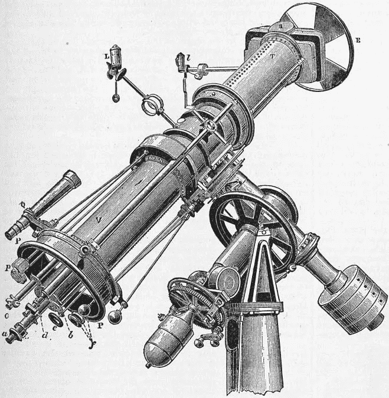
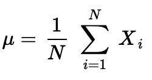
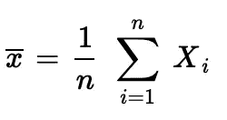
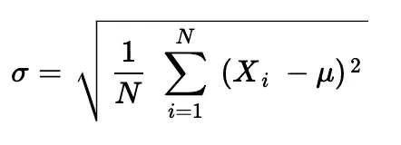
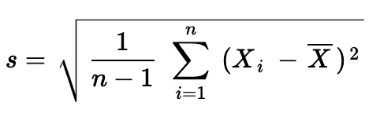
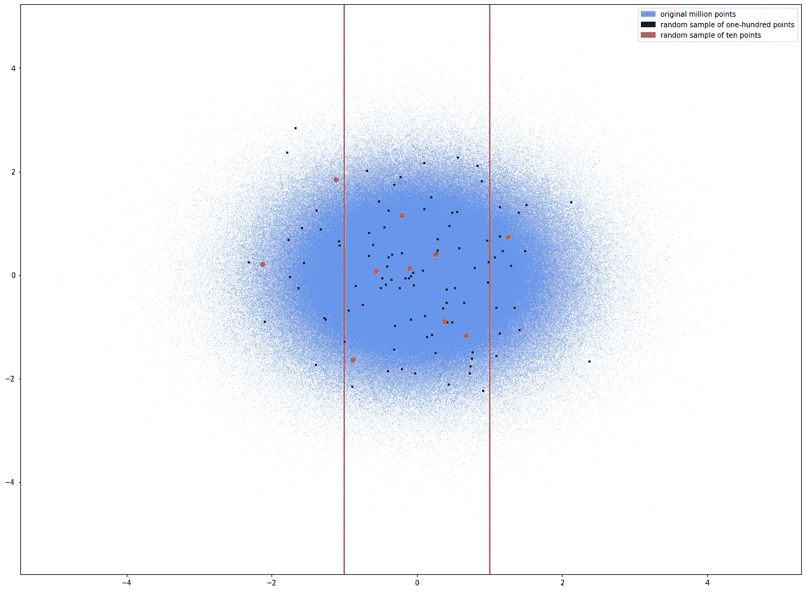
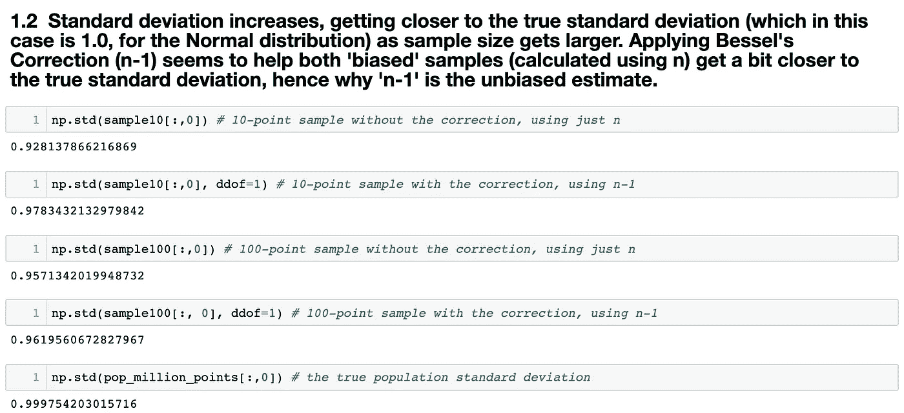
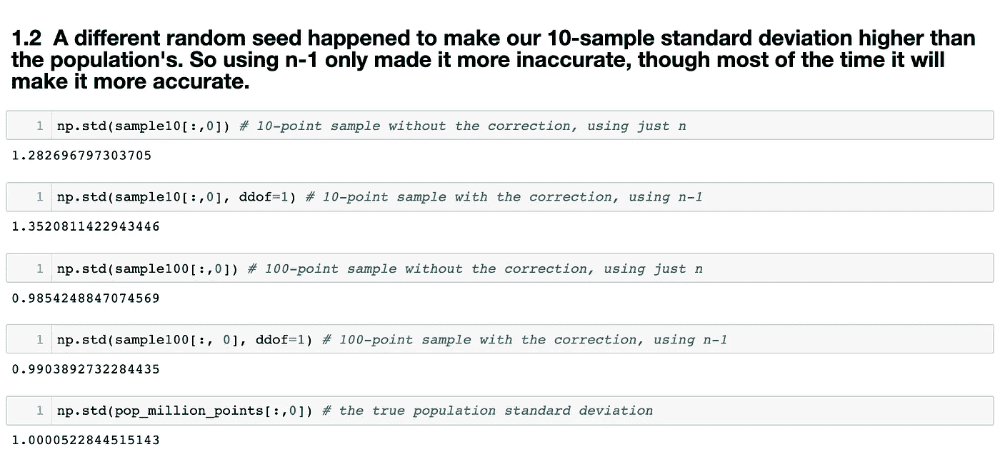

# 贝塞尔修正背后的推理:n-1

> 原文：<https://towardsdatascience.com/the-reasoning-behind-bessels-correction-n-1-eeea25ec9bc9?source=collection_archive---------10----------------------->

## 以及为什么它不总是一个修正

标准差似乎是一个足够简单的概念。它是数据离差的度量，是平均值与其数据点之间的总差值的根，除以数据点的数量… *减去 1 以校正偏差*。

我认为，对于任何学习者来说，这是最简单和最令人抓狂的概念，这篇文章的目的是为贝塞尔的修正，或 n-1，提供一个清晰和直观的解释。

测量恒星视差的日射仪，由弗雷德里克·威廉·贝塞尔首先实现，[公共领域](https://en.wikipedia.org/wiki/Heliometer)

首先，回想一下人口平均数的公式:

人口平均数公式

样本意味着什么？

样本均值公式

除了小写的 n，它们看起来是一样的。在每种情况下，你只需将每个 xᵢ相加，然后除以有多少个 x。如果我们处理的是整个总体，我们会用 N，而不是 N，来表示总体中的总点数。

> 现在，什么是标准差σ(称为 sigma)？

如果一个总体包含 N 个点，那么标准偏差就是*方差*的平方根，即每个数据点和总体平均值的平方差之和，或 *μ* :

人口标准差公式

但是，如果样本标准差 s 有 *n* 个数据点，样本均值为 x-bar，又会如何呢？

样本标准偏差公式

唉，可怕的 n-1 出现了。为什么？不应该是同一个公式吗？这实际上是相同的人口平均和样本平均公式！

简短的回答是:**这非常复杂*，*以至于大多数教师在解释 n-1 时都说，如果不这样做，样本标准差将是“有偏估计量”。**

# 什么是偏见，为什么会有偏见？

维基百科的解释[可以在这里找到](https://en.wikipedia.org/wiki/Bessel%27s_correction#Source_of_bias)。

没什么帮助。

要真正理解 n-1，就像任何其他解释贝塞尔修正的简短尝试一样，需要在你的头脑中一次记住很多。我也不是在说证据。我说的是真正理解样本和总体之间的差异。

什么是样本？

样本始终是总体*的*子集*，它旨在代表*(子集可以与原始集大小相同，在不替换的情况下对整个总体进行抽样)。这是一个巨大的飞跃。一旦采集了样本，就有**假定的、假设的参数和分布嵌入到样本表示中**。

*统计*这个词指的是关于**样本**的一些信息(如平均值或中值)，它对应于关于**人口**(同样，如平均值或中值)的一些类似信息，称为*参数。*“统计”领域如此命名，而不是“参数化”，以传达这种从较小到较大的*推理的态度，*并且这种飞跃，同样，具有许多内置的假设。例如，如果关于样本总体的先验假设被实际量化，这导致[贝叶斯统计](https://en.wikipedia.org/wiki/Bayesian_inference)。如果不是，这将导致[频率主义](https://en.wikipedia.org/wiki/Frequentist_probability)，两者都超出了本文的范围，但仍然是在贝塞尔的修正背景下需要考虑的重要角度。(事实上，在贝叶斯推断中没有使用贝塞尔的修正，因为关于总体参数的先验概率旨在以不同的方式预先处理偏差。方差和标准差用普通旧 *n* 计算。

但是我们不要失去焦点。既然我们已经陈述了样本和总体之间重要的基本区别，让我们考虑一下抽样的含义。为了简单起见，我将在下面的例子中使用正态分布，以及[这个 Jupyter 笔记本](https://github.com/bphall/stats_vis/blob/master/bessel_proof.ipynb)，它包含一百万个模拟的正态分布数据点，用于可视化关于样本的直觉。我强烈建议您亲自体验一下，或者简单地使用`from sklearn.datasets import make_gaussian_quantiles`亲自体验一下采样的真实情况。

这是一百万个随机生成的正态分布点的图像。我们称之为我们的人口:

就一百万积分

为了进一步简化，我们将只考虑均值、方差、标准差等。，基于 x 值。(也就是说，对于这些可视化，我可以只使用一条数字线，但是使用 y 轴可以更有效地显示 x 轴上的分布)。

这是一个人口，所以 N = 1，000，000。正态分布，所以均值是 0.0，标准差是 1.0。

我随机抽取了两个样本，第一个只有 10 分，第二个 100 分:

黑色的 100 点样本，橙色的 10 点样本，红线是平均值的一个标准差

现在，让我们看看这两个样本，有无贝塞尔校正，以及它们的标准差(分别为有偏和无偏)。第一个样本只有 10 分，第二个样本是 100 分。

修正似乎有所帮助！

仔细看看上面的图片。贝塞尔的修正似乎确实有所帮助。这是有道理的:非常*通常*样本标准差会比总体标准差*低*，尤其是在样本很小的情况下，因为不具有代表性的点(“有偏差”的点，即远离平均值的点)会对方差的计算产生更大的影响。因为每个数据点和样本平均值之间的*差异*被平方，如果使用总体平均值，可能的差异范围将小于真实范围。此外，[取平方根是一个凹函数，因此在估计中引入了“向下偏差”](https://en.wikipedia.org/wiki/Bessel%27s_correction#Caveats)。

另一种思考方式是这样的:你的样本越大，你就越有机会遇到更多的人口代表点，即接近平均值的点。因此，您获得样本平均值的机会较小，这会导致差异过小，从而导致方差过小，并且您会得到低于标准偏差的值。

平均而言，正态分布总体的样本将产生一个方差，该方差平均 向下偏移 n-1 倍*。(顺便说一句，我相信样本偏差本身的分布是由学生的 t 分布描述的，由 *n* 决定)。因此，通过将平方根方差除以 n-1，我们使分母变小，从而使结果变大，并导致所谓的“无偏”估计。*

这里要强调的重点是，贝塞尔的校正，或者除以 n-1，实际上并不总是有帮助的！因为潜在的样本方差本身是 t 分布的，你会不知不觉地遇到 n-1 超过真实总体标准差的情况。碰巧的是，n-1 是我们在大多数情况下纠正偏差的最佳工具。

为了证明这一点，检查同一个 Jupyter 笔记本，我只是改变了随机种子，直到我发现一些样本的标准偏差已经接近总体标准偏差，并且 n-1 **增加了更多偏差**:

在这种情况下，贝塞尔的修正实际上伤害了我们！

因此，贝塞尔的修正并不总是修正。之所以这样称呼，是因为大多数时候，在抽样时，我们**不知道总体参数**。我们不知道真正的均值或方差或标准差。因此，我们依赖于*的事实，因为我们知道坏运气的比率(下冲，或向下偏差)，我们可以通过该比率的倒数来抵消坏运气:n-1。*

但是如果你运气好呢？就像上面的细胞一样，这种情况有时也会发生。您的样本偶尔会产生正确的标准偏差，甚至超出标准偏差，具有讽刺意味的是，在这种情况下，n-1 会增加偏差。

然而，这是我们在无知状态下纠正偏见的最佳工具。从上帝的角度来看，不需要偏差校正，因为参数是已知的。

最终，这从根本上归结为理解样本和总体之间的关键差异，以及为什么贝叶斯推理是解决经典问题的一种如此不同的方法，其中关于参数的*猜测是通过先验概率*提前做出的，从而消除了贝塞尔校正的需要。

我将在以后的文章中重点介绍贝叶斯统计。感谢阅读！