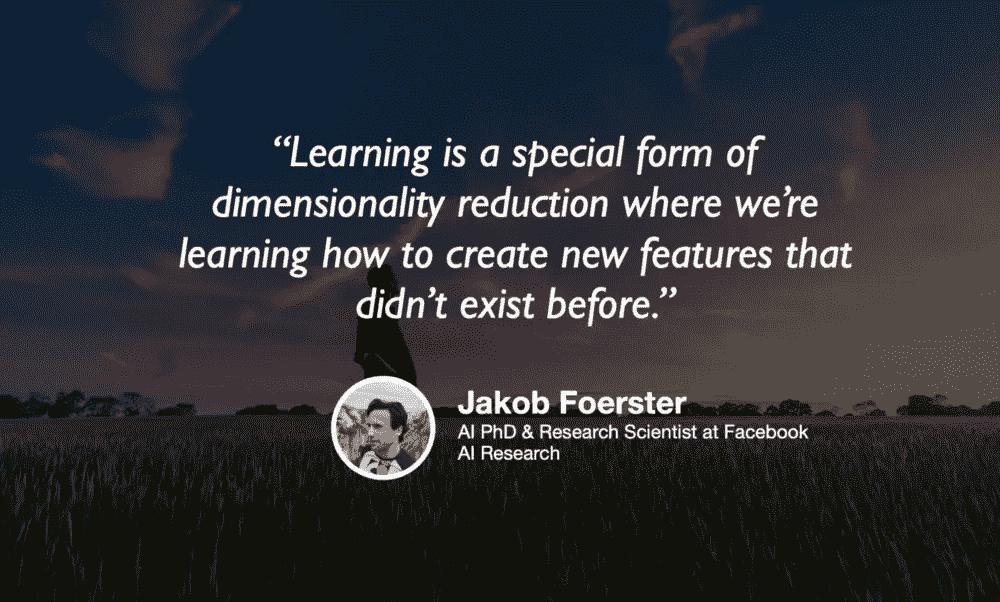

# 地震、疾病和股票市场之间的关系

> 原文：<https://towardsdatascience.com/the-relationship-between-earthquakes-disease-and-the-stock-market-20701a3a2dd0?source=collection_archive---------71----------------------->

疾控中心在 Unsplash 上的照片

## 股票市场、地震和疾病之间有什么联系？

由[阿格尼·库马尔](https://medium.com/u/465ede362700?source=post_page-----20701a3a2dd0--------------------------------) — 12 分钟阅读

尽管医学进步带来了救命的护理，但患者仍然面临着被来自医院和在医院里游荡的疾病感染的风险。这种情况是由入院时不存在但后来发展的传染性病原体引起的，称为医疗保健相关感染(HAIs)。

## [从第一原理推导卷积](/deriving-convolution-from-first-principles-4ff124888028)

由迈克尔·布朗斯坦 — 9 分钟读完

在我的本科学习期间，我在以色列理工学院学习电子工程，我总是对卷积这样一个重要的概念突然出现感到震惊。这个看似武断的定义像眼里的一粒沙子一样扰乱了信号处理世界原本美好的画面。

照片由 Hitesh Choudhary 在 Unsplash 上拍摄

## [没有编码的逐步花卉分类](/step-by-step-flower-classification-without-coding-c652a7f73251)

弗朗西斯科·帕尔马——7 分钟阅读

很少获得新技术和缺乏专家是远未解决的问题。然而，对于传统的专业类别、学术研究人员和主题专家，有大量的数据分析用例。

照片由 chuttersnap 在 Unsplash 上拍摄

## [数据科学的 5 个 Spark 最佳实践](/5-spark-best-practices-61587a35ac15)

由[锡安巴达什](https://medium.com/u/4e1c626fbff1?source=post_page-----20701a3a2dd0--------------------------------) — 6 分钟阅读

虽然我们都在谈论大数据，但在你的职业生涯中，它通常需要一些时间，直到你遇到它。对我在 Wix.com 的人来说，这比我想象的要快，超过 1.6 亿的用户产生了大量数据——随之而来的是对扩展我们数据处理的需求。

背景图片由 Benjamin Davies 提供— Unsplash

## [多智能体强化学习和人工智能的未来](/multi-agent-reinforcement-learning-and-the-future-of-ai-524fc1b5e25)

杰里米·哈里斯和雅各布·福斯特——50 分钟🎧

强化学习最近受到了很多关注，这在很大程度上要归功于 AlphaGo 和 AlphaZero 等系统，这些系统以引人注目的方式凸显了它的巨大潜力。虽然我们开发的 RL 系统已经完成了一些令人印象深刻的壮举，但它们是以一种相当幼稚的方式完成的。