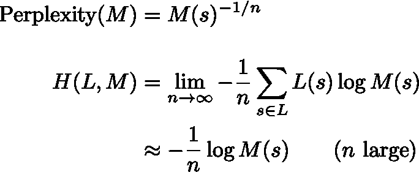

# 自然语言处理中的困惑与熵的关系

> 原文：<https://towardsdatascience.com/the-relationship-between-perplexity-and-entropy-in-nlp-f81888775ccc?source=collection_archive---------12----------------------->

艾萨克·奎萨达在 [Unsplash](https://unsplash.com/t/wallpapers?utm_source=unsplash&utm_medium=referral&utm_content=creditCopyText) 上的照片

## 使用信息论理解 NLP 度量

在评估语言模型时，困惑是一个常用的度量标准。例如，scikit-learn 实现的[潜在狄利克雷分配](https://scikit-learn.org/stable/modules/generated/sklearn.decomposition.LatentDirichletAllocation.html?highlight=perplexity)(一种主题建模算法)包含了作为内置度量的困惑。

在这篇文章中，我将定义困惑，然后讨论熵，两者之间的关系，以及它如何在自然语言处理应用中自然出现。

# 语境

在许多自然语言任务中，一个非常普遍的情况是，你有一门语言 *L* 并且想要为这门语言建立一个模型 *M* 。“语言”可以是一种特定的体裁/语料库，如“英语维基百科”、“尼日利亚推特”或“莎士比亚”，或者(至少在概念上)只是一种通用的，如“法语”

具体来说，我们所说的语言是指生成文本的过程。为了清楚起见，我们将考虑这样一种情况，我们正在对句子建模，文本由以句尾“单词”结尾的序列单词组成但是你可以用“token”代替“word”，用“document”代替“sentence”来概括任何上下文。

什么是“过程”？出于我们的目的，我们可以把一个过程想象成概率分布的集合。给定由一个句子中的一系列先前单词组成的历史 *h* ，语言 L 是下一个单词是 *w:* 的概率

语言是概率分布的集合

例如，我愿意打赌，如果 L 是“英国人”:

1.  l(狗|敏捷的棕色狐狸跳过懒惰的棕色)≈ 1
2.  L(ipsum | Lorem) ≈ 1
3.  l(翅膀|水牛水牛水牛水牛水牛)≈ 0

类似地，给定一个完整的句子 *s* ，我们可以评估 L( *s* )这个句子出现的概率。如果我们包括一个特殊的句子开头“单词”wₒ，并让第 n 个“单词”是句尾“单词”，我们得到

语言 *L* 给出一个句子 *s* 的概率

然而，在产品中省略第一个术语是很常见的，或者有时使用更长的起始上下文。

获得(比如说)美式英语口语的完美复制品是非常容易的。只要在街上拦住任何一个以英语为母语的人。当然，我们通常对教计算机模型感兴趣(因此，机器学习)。因此，我们将让 *M* 成为我们在计算机上成功构建的任何语言模型。

这种设置具有语言 *L* 和模型 *M* 非常通用，在各种自然语言任务中发挥作用:语音到文本、自动更正、自动完成、机器翻译——不胜枚举。自动完成是最明显的例子:给定某人到目前为止键入的单词，通过选择最有可能完成的单词来猜测他们接下来可能键入什么。

# 困惑

给定一个语言模型 M，我们可以使用一个保持 dev(验证)集来计算一个句子的复杂度。句子上的困惑 *s* 定义为:

语言模型 M 的困惑

你会从第二行注意到，这是乘积分母中各项的*几何平均值*的倒数。由于每个单词的概率(取决于历史)都被计算过一次，我们可以将此解释为每个单词的*度量。这意味着，在其他条件相同的情况下，困惑不受句子长度的影响。*

一般来说，我们希望我们的概率高，这意味着困惑低。如果所有的概率都是 1，那么困惑度将是 1，模型将完美地预测文本。相反，对于较差的语言模型，困惑度会更高。

很难为困惑提供一个基准，因为像大多数自然语言任务一样，这个标准高度依赖于词汇量。给定一个语料库，较小的词汇量意味着其他单词将全部被替换为一个<oov>(词汇外)标记，从而立即提高在其上训练的任何语言模型的表面质量</oov>

以下是一些基准测试:

1.  **最先进的。**对于 [WikiText-103](https://arxiv.org/pdf/1609.07843.pdf) ，一个大约 28，000 篇高质量维基百科文章和大量(0.4% OOV 率)词汇的精选，一个语言模型的[最先进的](https://arxiv.org/abs/1909.08053)困惑度(截至本文撰写时)是 **10.8** 。
2.  最坏的情况。在任何数据集上，基线模型只是以相等的概率随机猜测词汇表中的一个单词。在这种情况下，困惑只是词汇表的大小:WikiText-103 为 **267，735** ，但是 WikiText-2 要小得多( **33，278** )。一般来说，30，000 对于一个语言模型的词汇量来说是相当合理的。
3.  最好的情况。我在上面说过“最好的”可能的困惑是 1。但是如果那是真的，那么在一种语言中就只能有一个可能的句子，这是很无聊的。最近一篇探索文本生成的论文使用了 OpenAI 的[GPT-2](https://d4mucfpksywv.cloudfront.net/better-language-models/language_models_are_unsupervised_multitask_learners.pdf)(WikiText-103 上有困惑的 22.1 大版本)。在他们选择的数据集上(WebText，GPT-2 就是在上面训练的)，他们发现了 **12.4** 的困惑。但是，重要的是，他们发现，虽然他们的模型能够以低得多的复杂度生成文本(1.5！)，生成的文本不是重复就是不连贯。离人类的困惑越近越好！

这最后一点非常重要。语言本身确定了一个困惑的下限。我们将在下面看到这一点。但是这指出了 NLP 中度量的一个普遍特征:一个容易评估的度量，比如困惑，不一定是模型真实性能的最佳预测者。困惑有利于开发(验证)，但不一定有利于评估。评价的黄金标准仍然是人的评价。

# 熵

熵在物理学中是一个模糊的概念，但在信息论中却非常简单。假设你有一个过程(就像一门生成单词的语言)。在这个过程的每一步，发生的事情(事件)都有可能会发生。**惊奇**的量是–log(*p*)，其中对数取任意你想要的底数(相当于换单位)。低概率事件具有高度的惊奇性。肯定会发生的事件( *p* =1)没有意外。不可能的事件( *p* =0)有无限的惊奇。

熵是由 *i* 索引的所有可能事件中意外事件的期望值；

概率分布的熵

所以，熵是当某件事发生时的平均惊奇程度。

根据克劳德·香农的[信源编码定理](https://en.wikipedia.org/wiki/Shannon%27s_source_coding_theorem)，以 2 为基数的熵也是存储所发生信息的最佳位数。例如，如果我告诉你，一条 280 个字符的全长推文每个字符的熵为 1 位，这意味着，根据数学定律，无论 Twitter 做什么，他们的数据库中总要有 280 位(35 字节)的存储空间。(当然，在实践中，他们必须拥有更多)。

在我们的语言模型的上下文中，我们必须做一个调整。假设我们对长度为 *n* 的句子 *s* (事件序列)感兴趣，我们将每个单词(事件)的熵率定义为:

其中总和是所有句子的长度 *n* ，L(s)是句子的概率。最后一个技术点:我们要定义语言 L(或者语言模型 M)的熵，而不考虑句子长度 *n* 。所以最后我们定义了

语言(模型)熵的最终定义

## 香农-麦克米兰-布雷曼定理

在不痛不痒的假设下，熵会进一步简化。本质的观点是，如果我们取一个足够长的文本串，无论如何每个句子出现的概率都是成比例的。所以没有必要总结可能的句子。我们得到:

用香农-麦克米兰-布雷曼定理简化熵

这告诉我们，我们可以只取一个大的(n 是大的)文本，而不是试图从不同的文本中采样。

## 交叉熵

假设我们错误地认为我们的语言模型 M 是正确的。然后我们在没有意识到的情况下观察实际语言 L 生成的文本。交叉熵 H(L，M)就是我们测量的熵

我们的语言模型 M 的交叉熵

其中第二行再次应用了香农-麦克米兰-布雷曼定理。

至关重要的是，这告诉我们，我们可以通过测量随机句子样本(第一行)或足够大的文本块(第二行)的 log M(s)来估计交叉熵 H(L，M)。

## 交叉熵受语言真实熵的限制

交叉熵有一个很好的性质，即 **H(L)** ≤ **H(L，M)** 。在证明中省略极限和归一化 1/n:

在第三行，第一项只是交叉熵(记住极限和 1/n 项是隐式的)。第二项是 Kullback-Leibler 背离(或 KL 背离)。根据[吉布斯不等式](https://en.wikipedia.org/wiki/Gibbs%27_inequality)，KL 散度是非负的，并且只有当模型 L 和 M 相同时才为 0。KL-divergence 有点像距离度量(告诉你 L 和 M 有多不同)。⁴ ⃞

# 困惑与熵的关系

概括一下:

1.  根据 Shannon-McMillan-Breiman 定理，在 L 生成的足够长( *n* 大)的开发/验证/测试数据集上评估 M 的熵近似于交叉熵 H(L，M)。我们只是通过取一个足够大的评估集来近似极限。
2.  此外，这种交叉熵受到生成数据的语言的真实熵的限制

足够大数据集交叉熵的困惑定义和简化

现在剩下要做的就是展示两者之间的关系。假设我们以 e 为底取对数:

困惑与熵的关系

如果我们以 2 为底取对数，用 2 为底，以此类推。

所以，总结一下:

1.  我们为生成数据的真实语言 l 建立一个语言模型 M。
2.  我们评估 M(相对于 L)的困惑度，或者等价地，交叉熵。
3.  M 的困惑被实际语言 L 的困惑所限制(同样，交叉熵)。

困惑度量了我们模型中“随机性”的数量。如果困惑度是 3(每个单词)，那么这意味着模型有 1/3 的机会猜出文本中的下一个单词。因此，它有时被称为*平均分支因子*。

# 结论

我想给你们留下一个有趣的记录。书面英语文本的真实熵是多少，这是一个悬而未决的问题(抛开其他格式，如“推特”或“口语”以及其他语言，如“俄语”。)

通过不等式 H(L) ≤ H(L，M)，一种获得困惑度或熵的上界的方法是创建一个语言模型，我们在上面看到了一些困惑。

在这种情况下，我们通常对每个角色的熵*(同样每个角色的困惑)感兴趣。当使用以 2 为底的对数测量时，这就变成了每字符位数(BPC)。*

*克劳德·香农(在计算机出现之前)估计，书面英语的熵在每个字符 0.6 到 1.3 比特之间。上面提到的 OpenAI 的 GPT-2 在(另一个)维基百科数据集上实现了每个字符 1 比特。*

*请记住，在书面英语中，每个单词大约有 5 个字符，这相当于大约 5 位，或 2⁵=32.的困惑请注意，这远远高于作为最新性能指标评测讨论的复杂性！怎么回事？记住不要在词汇或数据集之间比较困惑:单词长度可能不一样。*

*如果你想了解更多关于信息论的内容，请看我之前的文章[了解逻辑回归系数](/understanding-logistic-regression-coefficients-7a719ebebd35)。*

# *参考*

*除了上面联系/提到的那些*

*   *[语音和语言处理](https://web.stanford.edu/~jurafsky/slp3/)(茹拉夫斯基和马丁)*
*   *再举一个例子，[理解语言模型的度量](https://thegradient.pub/understanding-evaluation-metrics-for-language-models/) (Chip Huyen，The Gradient)*

*[1]通常使用[光束搜索](https://en.wikipedia.org/wiki/Beam_search)进行估计。*

*[2]或任何给定上下文的一个可能的延续。因此，每个可能的起始单词只有一个可能的句子，或者，在论文的上下文中，给定前 40 个单词，一篇文章只有一个可能的结尾。这将违反格莱斯的准则，一套关于语言的通用规则。特别是，如果文章的其余部分是由开头决定的，为什么还要写呢？一般来说，自然语言避免低复杂度(熵)的话语，因为它们是不必要的。*

*[3]假设该过程是平稳的和遍历的。事实上，这些假设不适用于自然语言。如果这困扰着你，你可以把这个定理看作是一个非常合理的近似。*

*[4]它不是距离度量，因为它不是对称的 D(p||q)！= D(q||p)。然而，在[统计流形](https://en.wikipedia.org/wiki/Statistical_manifold)上解释，其围绕 D(p||p)的二阶泰勒展开给出了[费希尔信息度量](https://en.wikipedia.org/wiki/Fisher_information_metric)，这是唯一的(根据陈佐夫定理，直到一个标量常数)适用于统计流形的黎曼度量。参见[信息几何方法](https://bookstore.ams.org/mmono-191/)了解有限维情况下的更多参考。*