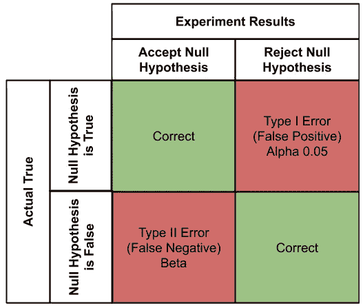
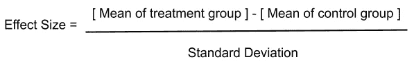
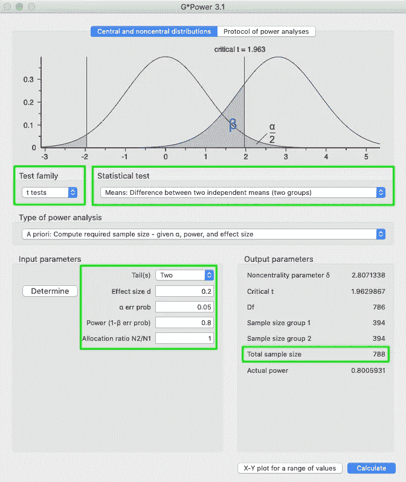
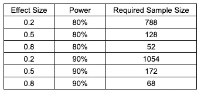

# 显著性、功效、样本量和效应量的关系

> 原文：<https://towardsdatascience.com/the-relationship-between-significance-power-sample-size-effect-size-899fcf95a76d?source=collection_archive---------3----------------------->

## 显著的成果只是开始。

亚历山大·Cvetanovic 在 [Unsplash](https://unsplash.com?utm_source=medium&utm_medium=referral) 上的照片

祝贺你，你的实验取得了显著的成果！你可以确定(嗯，95%确定)自变量影响了因变量。我想你剩下要做的就是写下你的讨论，并把你的结果提交给学术期刊。对吗……?

获得显著的成果本身就是一个巨大的成就，但它并不能说明你的成果背后的全部故事。我想借此机会讨论统计意义、样本大小、统计功效和效应大小，所有这些都对我们如何解释我们的结果有巨大的影响。

# 显著性(p = 0.05)

首先，让我们讨论统计意义，因为它是推断统计学的基石。我们将在真实实验的背景下讨论显著性，因为它是最相关和最容易理解的。真实验是用来检验一个或多个变量之间因果关系的特定假设。具体来说，我们假设一个或多个变量(即自变量)产生另一个变量的变化(即因变量)。变化是我们推断的因果关系。 ***如果你想了解更多关于各种研究设计类型的信息，请访问我的文章(*** [***链接***](https://medium.com/@kamilmysiak/research-design-statistics-tests-17cbba5d3aed?source=friends_link&sk=f80892b8c1bf92a621781bcd9913fe77) ***)。***

例如，我们想测试一个假设，即权威的教学风格会使学生获得更高的考试分数。为了准确地测试这个假设，我们随机选择了两组学生，他们被随机安排到两个教室中的一个。一个教室是威权老师教的，一个是权威老师教的。整个学期，我们收集所有教室的考试成绩。在年底，我们将所有的分数进行平均，得出每个教室的总平均分数。让我们假设权威课堂的平均测试分数是 80%，权威课堂是 88%。看起来你的假设是正确的，与权威老师教的学生相比，权威老师教的学生在考试中平均得分高 8%。然而，如果我们把这个实验进行 100 次，每次都用不同的学生群体，你认为我们会得到相似的结果吗？教学风格对学生考试成绩的这种影响是偶然发生的还是潜在的(即不可测)变量？最后但同样重要的是，8%是否被认为“足够高”，与 80%有所不同？

**无效假设:**假设组间无显著差异的假设。在我们的教学风格示例中，零假设将预测基于教学风格的学生测试分数之间没有差异。

**替代或研究假设**:我们预测权威教学风格的原始假设将产生最高的学生平均考试分数。

## 现在我们已经做好了准备，让我们来定义什么是 p 值，以及它对您的结果有什么意义。

*p 值(也称为 Alpha)是我们的零假设为真的概率。*获得显著结果仅仅意味着通过您的统计测试获得的 p 值等于或小于您的 alpha，在大多数情况下是 0.05。

> p 值 0.05 是许多研究领域中使用的常用标准。

显著的 p 值(即小于 0.05)表示零假设正确的可能性小于 5%。如果是这种情况，我们拒绝零假设，接受我们的替代假设，并确定学生测试分数彼此显著不同。注意，我们并没有说不同的教学风格导致了学生考试成绩的显著差异。p 值只告诉我们组与组之间是否不同，我们需要进行推断性的跳跃假设教学风格影响了组与组之间的不同。

观察显著 p 值的另一种方式是考虑这样的概率，如果我们运行这个实验 100 次，我们可以预期至少 5 次学生测试分数彼此非常相似。

如果我们将 alpha 设置为 0.01，我们需要得到的 p 值等于或小于 0.01(即。1%)才能认为我们的结果有意义。当然，这将强加一个更严格的标准，如果发现显著，我们将得出结论，零假设是正确的概率小于 1%。

# 统计能力

你的研究中的样本大小或参与者数量对你的结果是否有意义有着巨大的影响。各组之间的实际差异越大(即学生测试分数)样本越小，我们就需要找到显著的差异(即 p ≤ 0.05)。理论上，在足够大的样本量下，with 可以在大多数实验中发现显著差异。然而，极大的样本量需要昂贵的研究，并且极难获得。

**I 型错误(α)** 或假阳性，得出分组的概率显著不同，而实际上它们不是。我们愿意承认有 5%的可能性错误地拒绝了零假设。

**第二类错误*(*【β】**)或假阴性，是当事实上各组不同时，得出各组没有显著差异的概率。我们可以通过确保我们的统计测试具有适当的功效来降低犯第二类错误的概率。

**功效**定义为 1 —第二类错误的概率 *(* β)。换句话说，它是当差异实际存在时检测到组间差异的概率(即正确拒绝零假设的概率)。因此，当我们增加统计检验的能力时，我们就增加了它检测显著的(即 p ≤ 0.05)组间差异。

> 人们普遍认为我们应该以 0.8 或更大的功率为目标。

那么我们将有 80%的机会找到统计上的显著差异。也就是说，我们仍然有 20%的机会无法检测出两组之间的实际显著差异。

# 效果大小

如果你记得我们的教学风格的例子，我们发现两组教师之间的显著差异。威权课堂测试平均得分 80%，权威课堂 88%。效应大小试图回答这样一个问题:“尽管这些差异在统计学上是显著的，但它们足够大到有意义吗？”。

效应大小提出了“最小重要差异”的概念，即在某一点上，显著差异(即 p≤ 0.05)非常小，在现实世界中没有任何益处。因此，效应大小试图确定权威型和独裁型教师之间学生考试成绩 8%的增长是否足够大，足以被认为是重要的。*请记住，我们所说的小并不是指小的 p 值。*

观察效应大小的另一种方法是定量测量静脉注射对静脉注射的影响程度。高效果大小表示非常重要的结果，因为对 IV 的操作会对 DV 产生很大的影响。

> 效应大小通常表示为 Cohen 的 d。Cohen 描述了小效应= 0.2，中等效应大小= 0.5，大效应大小= 0.8

较小的 p 值(0.05 及以下)并不表明有大的或重要的影响，高的 p 值(0.05 以上)也不意味着不重要和/或小的影响。给定足够大的样本量，即使非常小的效应量也能产生显著的 p 值(0.05 及以下)。换句话说，统计显著性探究了我们的结果是偶然的概率，而效应大小解释了我们结果的重要性。

# 将所有这些放在一起(功耗分析)

> 我们可以计算实验所需的最小样本量，以达到特定的统计功效和分析效果。这种分析应该在实际进行实验之前进行。

功率分析是在研究的设计阶段进行的一个关键步骤。通过这种方式，你将很好地了解每个实验组(包括对照组)所需的参与者数量，以发现显著差异*(如果有一个差异的话)*。

G*Power 是一个伟大的开源程序，用于根据您的功率和效果大小参数快速计算所需的样本大小。

 [## 杜塞尔多夫大学:gpower

### G*Power 是一个计算统计功效分析的工具，适用于许多不同的 t 检验、f 检验、χ2 检验、z 检验和一些…

www.psychologie.hhu.de](https://www.psychologie.hhu.de/arbeitsgruppen/allgemeine-psychologie-und-arbeitspsychologie/gpower.html) 

# g *功率

1.  选择适合您分析的**“测试系列”**

*   我们会选择 t 检验

2.选择您用于分析的**“统计测试”**

*   我们将使用平均值:两个独立平均值之间的差异(两组)

3.选择**“功率分析类型”**

*   我们将选择“先验”来确定您希望达到的功率和效果大小所需的样本。

4.选择**尾部**的数量

*   如果您只想确定一个方向上各组之间的显著差异，请使用一个尾部。通常，我们选择双尾检验。
*   我们将选择一个双尾检验

5.选择所需的效果尺寸或“**效果尺寸 d”**

*   我们将讨论一系列的效果尺寸

6.选择**“αerro prob”**或α或当各组之间存在实际差异时不拒绝零假设的概率。

*   我们将使用 0.05

7.选择您希望达到的**功率**。

*   我们将选择 0.8 或 80%的功率和 0.9 或 90%的功率

选择**“N2/N1 分配比例”**

*   如果您预计每组(治疗组和对照组)的参与者人数相同，则选择 1。如果一组中的人数是另一组的两倍，则选择 2。

阿尔法= 0.05

一般来说，大效应需要较小的样本量，因为它们对于分析来说是“显而易见”的。随着效应尺寸的减小，我们需要更大的样本尺寸，因为更小的效应尺寸更难找到。这对我们有利，因为效果越大，我们的结果就越重要，我们需要招募的参与者就越少。

> 最后但同样重要的是，这些是每个参与者组所需的样本量。例如，在一个具有 4 个组/水平的 IV 和一个 DV 的实验中，您希望找到一个具有 80%功效的大效应大小(0.8+)，您将需要每组 52 个参与者或总共 208 个参与者的样本大小。