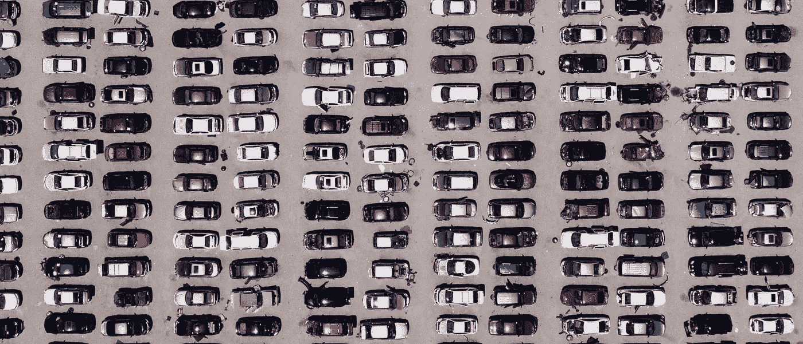
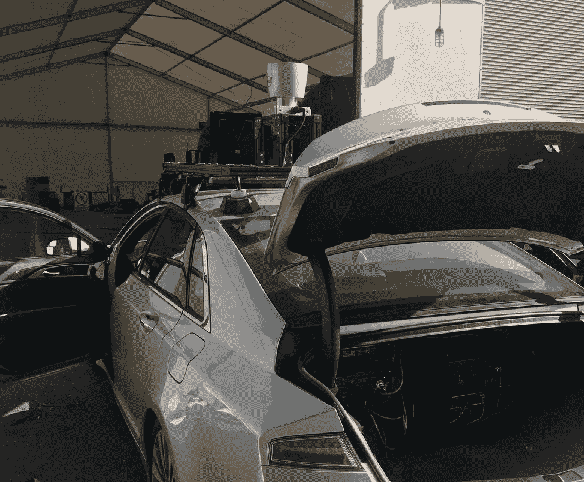
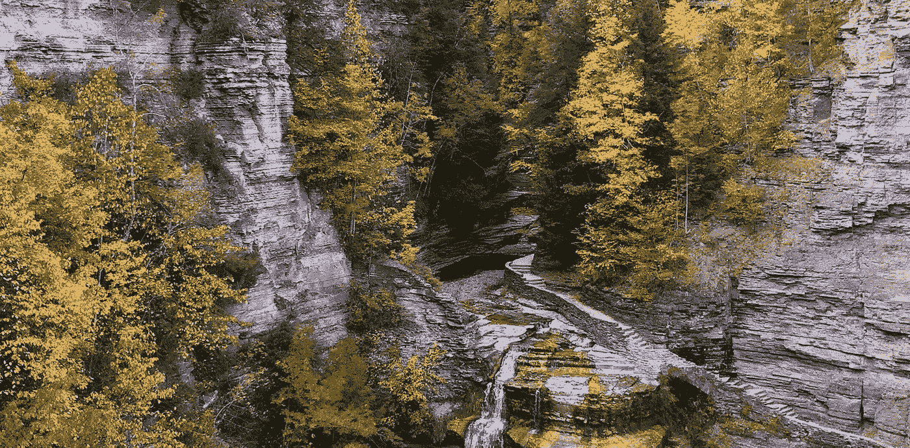

# 开启自动驾驶汽车的意想不到的最后一步:人类监督

> 原文：<https://towardsdatascience.com/the-remote-control-phase-of-self-driving-cars-f3bbe5ee3e60?source=collection_archive---------58----------------------->

## 偶尔出现的远程人类控制车辆的自动驾驶的中间阶段将具有难以置信的市场价值。

来自[佩克斯](https://www.pexels.com/photo/aerial-view-of-parking-lot-2402235/?utm_content=attributionCopyText&utm_medium=referral&utm_source=pexels)的[凯利·莱西](https://www.pexels.com/@kelly-lacy-1179532?utm_content=attributionCopyText&utm_medium=referral&utm_source=pexels)的照片

T 目前驾驶经济学最大的成本是驾驶员的时间**。这对个人和组织来说都是一种成本——司机只有有限的时间(在一辆车上)，每次支付一个人导致拼车应用程序出现一些令人印象深刻的损失([来源](https://www.reuters.com/article/us-uber-profitability/true-price-of-an-uber-ride-in-question-as-investors-assess-firms-value-idUSKCN1B3103)和[来源](https://www.reuters.com/article/us-uber-profitability/true-price-of-an-uber-ride-in-question-as-investors-assess-firms-value-idUSKCN1B3103))。为了保持市场价值，在一些城市，优步的乘坐费用高达半价([优步费用工具](https://www.ridester.com/uber-rates-cost/)和[优步三藩市费用](https://www.sfchronicle.com/business/networth/article/For-a-driver-s-pay-what-s-fair-in-an-Uber-13830931.php))。**

**移动公司发出信号，取消司机是盈利的一条途径，但是对于许多汽车很少司机的中间阶段怎么办？**

**这篇文章向您展示了:**

1.  **遥控汽车的技术既接近又直观。**
2.  **自动驾驶汽车将很快出现在特定的环境中，以及经济上的影响。**

****

**我做了一些自动驾驶汽车的研究。**

# **自动驾驶汽车简史**

> **无线电控制的汽车于 1925 年首次展示，仅仅 5 年后，在迈尔斯·j·布鲁尔 1930 年的书《天堂与钢铁》中，科幻小说预言了完全的自主。**

**来自罗宾·r·墨菲的《科幻小说中的自动驾驶汽车》，2020 年。《天堂与钢铁》预言天堂岛上的每一个移动系统都是完全自主的——甚至没有方向盘。这延伸到汽车以外，这意味着起重机是自主的，建筑是无人操作的。全自动驾驶系统将触及的不仅仅是自动驾驶汽车。**

**自动驾驶汽车是我们关注的案例研究，因为这是我们花费大部分时间的事情([2018 年仅在美国就有超过 2.7 亿辆注册车辆](https://en.wikipedia.org/wiki/Passenger_vehicles_in_the_United_States#Total_number_of_vehicles))。自动驾驶汽车与工程交叉的故事始于 2004 年 [DARPA 大挑战](https://en.wikipedia.org/wiki/DARPA_Grand_Challenge_(2004))。穿过沙漠的 150 英里长的路线。**

**2004 年，0 辆汽车跑了 10 英里。**

**2005 年，一对夫妇完成了这门课程。下面的视频向你展示了当时的自动驾驶汽车与现在有多么不同。**这是在挑战自治的极限。****

**现在，自动驾驶汽车是一个更加明确的研发领域。这不是一篇关于自动驾驶汽车在技术水平上处于什么位置的文章。政府甚至有网站来定义这一点。**

** [## 安全自动化车辆

### 汽车技术的持续发展旨在提供更大的安全优势和自动驾驶…

www.nhtsa.gov](https://www.nhtsa.gov/technology-innovation/automated-vehicles-safety) 

这是一篇关注一个问题的补丁的文章。

**问题—极限情况**:无人驾驶汽车不擅长处理不可预见的环境，如建筑、倒下的树木、道路损坏等。

**解决方案——远程控制**:召唤一个人来计算如何绕过这个罕见的障碍物。

为什么会这样:有了足够多的传感器和计算机，我们可以让自动驾驶汽车变得非常安全。当他们对某事不确定时，他们走得很慢。当他们从未见过的东西，他们会停下来。

不过，一辆停下来的车并没有多大用处。这时，我们让人类监督者打电话进来，查看视频，并绕过挑战。*每个人都希望他们的特斯拉是完全自动驾驶的，但我们需要一些方法来获得汽车没有看到或可能永远不会看到的 0.0001%英里的数据。*

# 自主汽车的遥操作

将会有供优步司机使用的办公楼(或者他们会被外包给印度)。在这里，车手们将会收到迷你驾驶挑战。这些小挑战对电脑来说很难，但对人类来说却微不足道。比如:*有一个人拿着慢行标志*，这条路现在是单行道，或者:路上有一个垃圾桶*。操作员需要在障碍物周围指定 3 个航路点。*

*在一个测试车队中，比方说一辆车有 10%的几率会卡在停车标志或未知的障碍物上。这意味着理想情况下，一个人可以覆盖 10 辆车，但安全起见，还是说 5 辆车吧。这是让优步烧钱的驱动成本的 1/5。*

*这个因素非常好。考虑一轮只有 1%未知车辆的测试版自动驾驶汽车。现在 1 个司机控制 50 辆车。这种扩展只会随着时间的推移而改进。它导致成本的大幅降低。*** 

*****这将是无人驾驶汽车的一次范式转变**。我们拥有的技术已经非常接近这一点——*这只是取决于你能接受的中断程度。*让一个系统接管我会舒服得多，这个系统就是**安全第一**，有**支持人工监督**。《连线》是我找到的唯一一份给予这款应用应有关注的出版物。这里是一些继续阅读。***

*** [## 自动驾驶汽车有一个秘密武器:远程控制

### 没有其他大公司公开其汽车偶尔对人类的依赖，但大多数公司都在悄悄地计划…

www.wired.com](https://www.wired.com/story/phantom-teleops/)  [## 遥控自动驾驶汽车的战争升温

### 即使在中午，从旧金山到圣何塞的 50 英里路程也是一件痛苦的事情。像一个蹒跚学步的孩子，湾区…

www.wired.com](https://www.wired.com/story/designated-driver-teleoperations-self-driving-cars/) 

# 谁会是第一批自动驾驶汽车？

这是对任何自动驾驶汽车文章的公开辩论。谁先做？我觉得答案是我们还没见过的人，但这要看你说的“解决自动驾驶”是什么意思了。

## 特斯拉:数据驱动的方法

通过获得足够的数据，埃隆·马斯克打赌端到端深度学习方法可以安全地控制特斯拉汽车。他还认为它会比任何竞争对手都早[(我有点怀疑)。这是一种高度特定于应用的方法，具有增加汽车价值的巨大潜力。](https://electrek.co/2019/10/24/tesla-full-self-driving-timeline/)

目前还不清楚特斯拉计划如何处理这种情况。神经网络[本质上是记忆数据](https://bair.berkeley.edu/blog/2019/08/13/memorization/)，那么它们是如何记忆没见过的数据的呢？

## Waymo:自主堆栈蓝图

许多传感器，过度设计的安全性，以及长远的眼光。Waymo 并不想与特斯拉竞争，它试图制定一个安全可靠的自动驾驶蓝图，不仅仅是自动驾驶(它正在获得一些资金支持来完成这项工作)。什么是“自治堆栈”？它是智能算法的集合:一个用于规划走哪条路，一个用于控制转向柱，一个用于控制电机功率等。Waymo 希望做到这一切，制造他们的汽车。

这是一个长期的方法。如果它适用于乘用车，那么它也适用于卡车、送货无人机、建筑管理等等。

## 小型自主创业公司:填补经济空白

其他创业公司将填补数据驱动的汽车特定方法和工程蓝图之间的空白。这里会有很多经济上可行的应用。

第一个在特定城市获得自动驾驶出租车的人:巨大。

*第一个获得安全、自主送货无人机(用于亚马逊或食品)*:巨大。

*第一个获得封闭路线自动驾驶汽车(想想机场班车)*:巨大。在有限区域内的自动驾驶汽车遇到的紧急情况要少得多，请来的人类专家可以轻松应对。 [Optimus Ride](https://www.optimusride.com/) 想把自动驾驶汽车带到小而高的交通区域。通过理解自主系统在最初几年将会有局限性——并在自主堆栈中为人类援助进行设计——他们可以更快地推出。

这种情况太多了。让人类修补角落的情况，更快地获得可行的产品。

伊萨卡是峡谷。承蒙作者好意。

灵感来自 [Lex Friedman](https://lexfridman.com/) 和 [Sertac Karaman](http://www.mit.edu/~sertac/) 的精彩对话。看这里。***