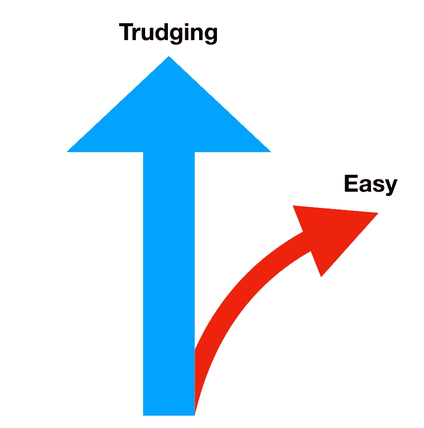
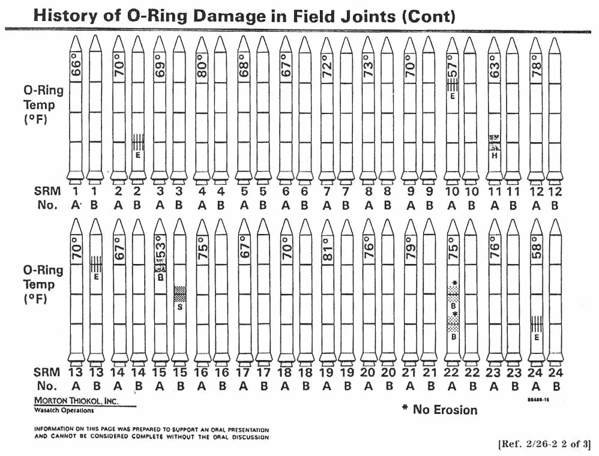

# 数据科学:学术严谨的需要

> 原文：<https://towardsdatascience.com/the-responsibility-of-an-academic-rigor-a70c0ef32309?source=collection_archive---------30----------------------->

最近，我和几个人就获得数据科学或机器学习的高级学位的重要性进行了辩论。他们的论点是学位只是一张纸，我不同意。学位不仅仅是一纸文凭，社会信任体系也是建立在认证基础上的；这种信任根植于先前导致人们死亡的错误原因中。

他们反对正式学位的理由是，通过适当的培训，任何人都可以从事数据科学。因此，他们会倡导纳米学位和训练营，以替代硕士或博士等更严格的培训。他们认为，有一种更简单、更温和的方式可以成为数据科学家。

> 成为数据科学家没有更简单、更容易的方式

我不认为有更容易、更柔和的方式来培养出优秀的数据科学家或机器学习工程师。这两个领域都需要大量的工作和时间。虽然有些人可能会说，被训练的算法可以由许多人来完成，但我的问题还是回到安全上来。最终，你会像拥有高学历的人一样信任他们的工作吗？你会相信飞机不会坠毁，汽车或手机电池不会爆炸吗？

数据科学或数据表示做得不好的一个很好的例子是一个生死攸关的问题。【https://history.nasa.gov/rogersrep/v5p896.htm 号

虽然每个人都想认为这是任何人都可以实现的，但事实并非如此。这也是为什么工科前两年的淘汰率这么高的原因。根据[的一项调查](https://ira.asee.org/wp-content/uploads/2017/07/2017-Engineering-by-the-Numbers-3.pdf)，学生申报工科第一年的淘汰率为 20%，四年和六年的毕业率分别为 35%和 54%。不仅工程更难完成，而且工程师通常需要更长的时间来完成。

工程学不是容易的课程，也不应该是。工程项目被 ABET 认可是有原因的。这和成为一名有执照的工程师需要去一所被认可的学校是一个道理。

> 你会在一座由读过大量土木工程知识并上过几堂桥梁建筑训练营课程的人设计的桥上开车吗？

工程学校被认可是有原因的，法学院、医学院、教学学校等等也是如此。他们证明你可以信任这个人，这个人可能在深度和广度上都比你知道的更多。如果没有经过认证的课程，人们可以做任何事情。那是人死的时候。

> 有人记得 Max 8 吗？

一个学位表明你已经通过了这个领域的人的测试，他们认为你应该能够胜任。这对于博士来说尤其有趣，因为在 3 到 5 年内，一个博士可能会在他们的领域内取得其他博士的资格。所以博士们稀释他们领域的可能性是巨大的。

这种现场质量稀释很容易在工业中发生。比方说，有人(没有工程或科学背景)获得了几个纳米学位，并在一些公司担任了多年的数据科学家，他们的工作不会影响安全。然后另一家公司决定聘请他们担任类似的角色，但现在他们的工作确实有可能影响人们的物质生活，比如说一辆自动驾驶汽车。一家公司给他们资质，下一家公司认定资质还可以，但没有和公众达成协议，认为这样的资质就够了。更糟糕的是，那个人可以在招聘过程中提供帮助，雇佣更多像他们一样的人，因为他们认为没有学位不应该成为任何人的障碍。现在他们的人才库被人才严重稀释，而这种人才可能是人们生存或死亡的原因。

我不是说纳米学位或新兵训练营没有他们的位置。它们当然有助于已经从事科学和工程的人掌握一些基本技能，以提高工作能力。然而，这些并不能代替实际的学位。

我知道这个领域很热门，但这并不意味着有一个简单的方法可以进入，也不应该有。工程学难是有原因的，数据科学和机器学习也是如此。如果你正在学习这两个领域中的任何一个，而不是高级学位，如果它看起来超级简单，我会小心的。这可能好得令人难以置信。我想活下去，我想对合格的人保持信任，因此，随着这个领域的成熟，我感到不仅有义务只雇用合格的人，而且有义务说出这个话题。

如果你愿意，可以在 Twitter 和 YouTube 上关注我，我会在那里发布不同机器上的浓缩咖啡照片和浓缩咖啡相关的视频。你也可以在 [LinkedIn](https://www.linkedin.com/in/robert-mckeon-aloe-01581595) 上找到我。

[我的进一步阅读](https://www.linkedin.com/pulse/my-writing-sorted-topic-robert-mckeon-aloe/):

[数据科学:基础知识](https://www.linkedin.com/pulse/data-science-essentials-robert-mckeon-aloe/)

[弃船:一家初创公司如何破产](https://medium.com/overthinking-life/abandon-ship-how-a-startup-went-under-c5ca8e5bb970)

[论文遗憾](https://medium.com/overthinking-life/dissertation-regret-7109673b7437)

[团队的一部分](https://www.linkedin.com/pulse/part-team-robert-mckeon-aloe/)

[如何面试一家公司](https://www.linkedin.com/pulse/how-interview-company-robert-mckeon-aloe/)

[离开的想法](https://www.linkedin.com/pulse/thoughts-leaving-robert-mckeon-aloe/)

[数据科学家的一天](/a-day-in-the-life-of-a-data-scientist-eb63cdd71edb)

[实验设计:数据收集](https://www.linkedin.com/pulse/design-experiment-data-collection-robert-mckeon-aloe/)