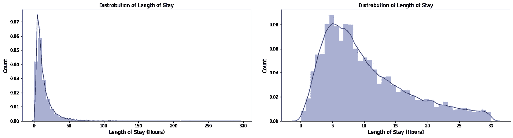

# 旋转的医院大门:用线性回归预测病人流动率

> 原文：<https://towardsdatascience.com/the-revolving-hospital-door-predicting-patient-turnover-with-linear-regression-986ceeae0fb3?source=collection_archive---------38----------------------->

## 如何使用简单线性回归模型估计住院时间

随着每年大约有 170 万人感染医疗保健相关感染(HCAIs ),卫生专业人员越来越关注如何最大限度地减少感染这些通常威胁生命且代价高昂的疾病的风险。最近的举措包括识别处于延长住院时间(LOS)高风险的患者，并创建个性化干预以减少他们在医院的时间和接触 HCAIs。

对于这个项目，我利用线性回归来预测患者入院时的住院时间，并确定导致延长住院时间的关键因素。

# 方法学

受 Daniel Cummings 关于使用机器学习来预测 LOS 的文章的启发，我利用了麻省理工学院的 MIMIC-III 开源数据库，其中包含来自波斯顿贝斯伊斯雷尔女执事医疗中心(BIDMC)的去身份信息。在数据库中，我合并了包含患者人口统计和诊断信息的表。

如下图 1a 所示，患者损失范围为 0-294 天。然而，我意识到，我的预测的准确性在不同的尺度上有不同的意义。例如，如果患者要住院 100 天，则预测的准确性不如患者仅住院 3 天重要。考虑到这一点，我决定把重点放在那些在医院最多呆 30 天的短期病人身上。图 1b 显示了 LOS 分布。

图 1a(左):原始数据集中损失分布。图 1b(右)住院 30 天或更短时间的患者的服务水平分布。由 Molly Liebeskind 创建的图像。

MIMIC 包括 2001 年至 2012 年的数据，通过多次访问跟踪患者。为了减少最近就诊后返回医院的患者的自相关误差，我在分析中仅利用了首次入院。

# EDA 和特征工程

在只有分类特征的情况下，探索数据的最佳方式是查看每个单独特征与 LOS 的关系，以识别模式。以下是我探索中的几个亮点。

**年龄:**我的第一步是创建一个包含患者年龄的新列。作为去识别过程的一部分，与给定患者相关的所有日期被随机调整若干年。然而，单个患者的年数是一致的，这意味着*出生日期*(出生日期)和*出生日期*可以用来计算患者的年龄。如图 2 所示，老年患者比年轻患者住院时间更长。

图 2:患者年龄分布及其住院时间。由 Molly Liebeskind 创建的图像。

**入院类型:**在 BIDMC，患者入院类型分为四组。*急诊*表示患者需要立即介入治疗，以应对威胁生命的情况。紧急表示需要立即护理，以解决不被视为危及生命的身体或精神状况。*选项*用于接受预先计划医疗护理的患者，而*新生儿*表示入院事件与分娩相关。下图 3 显示，需要急诊和急救护理的患者通常在医院呆的时间更长。我推测，急诊病人通常在医院里呆的时间最长，因为他们需要加强医疗护理，但他们可能比急诊病人的护理优先级低。

图 3:入院类型和住院时间的关系。由 Molly Liebeskind 创建的图像。

**ICD9 代码:**我面临的最大挑战来自 6000 多个用于指示诊断的独特 ICD9 代码。数据集文档概述了解释 ICD9 代码的方法，包括查看一般诊断的前三个数字，然后利用后两个数字来识别具体情况。从那里，ICD9 代码能够被分成 18 个更广泛的类别，这些类别是我从维基百科上搜集来的。

# 模型

使用交叉验证的线性回归模型，我能够预测给定患者的住院时间，平均绝对误差为 3.75 天。在我为测试保留的 20%的数据中，图 4 显示了实际的患者损失和预测的损失。

图 4:绘制实际和预测的医院损失。由 Molly Liebeskind 创建的图像。

从这个模型中，我能够看到哪些因素对 LOS 有最大的影响，这对于医院识别高风险患者至关重要。下面的图 5 显示了对模型贡献最大的特性。可以直接比较这些系数，以了解模型预测中每个因素的相对权重。

图 5:特征对模型预测的重要性。由 Molly Liebeskind 创建的图像。

因为我只使用了病人入院时可用的数据，所以数据集仅限于大多数分类特征，这限制了可预测性。增强该模型的一种方法是纳入入院后不久获得的信息，包括生命体征和患者病史。此外，需要进一步分析，以确定哪些特征在较短和较长的时间尺度上影响最大。由此，在使用回归预测 LOS 之前，可以使用分类模型将患者分为非过夜、短期和长期住院候选人。

参考

[https://www.ncbi.nlm.nih.gov/pmc/articles/PMC6245375/](https://www.ncbi.nlm.nih.gov/pmc/articles/PMC6245375/)

[https://www . health catalyst . com/success _ stories/reducing-length-住院时间](https://www.healthcatalyst.com/success_stories/reducing-length-of-stay-in-hospital)

[https://towards data science . com/predicting-hospital-length-at-time of stay-of-admission-55 dfe 69598](/predicting-hospital-length-of-stay-at-time-of-admission-55dfdfe69598)

[https://en.wikipedia.org/wiki/List_of_ICD-9_codes](https://en.wikipedia.org/wiki/List_of_ICD-9_codes)