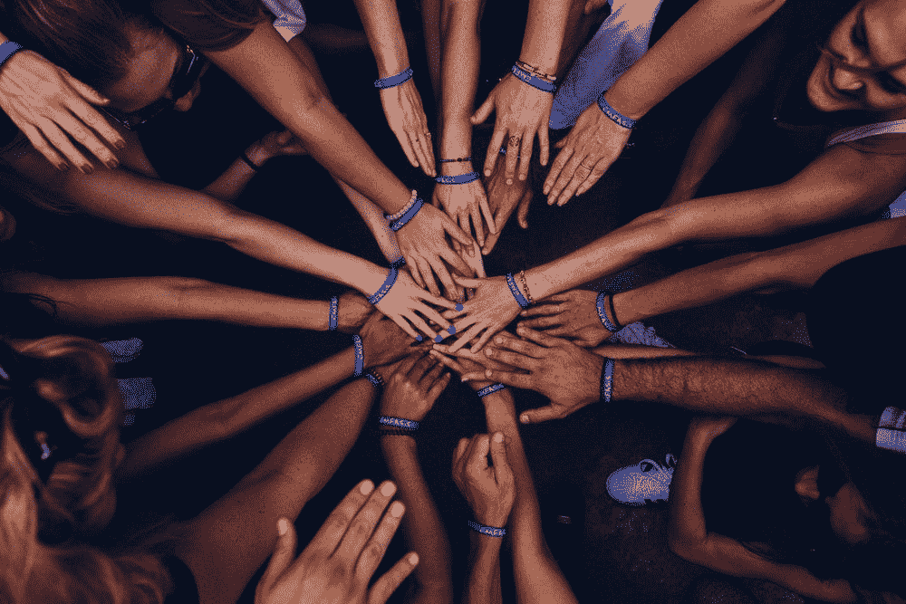
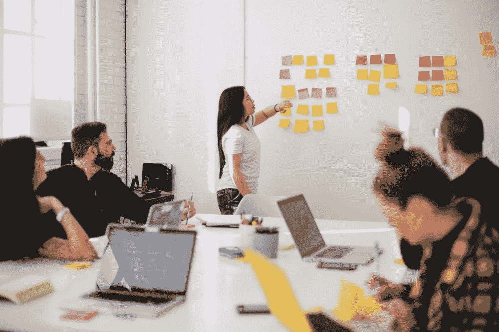
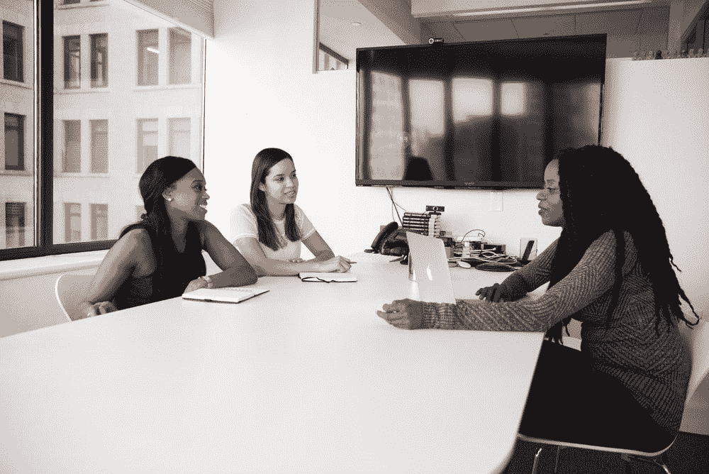
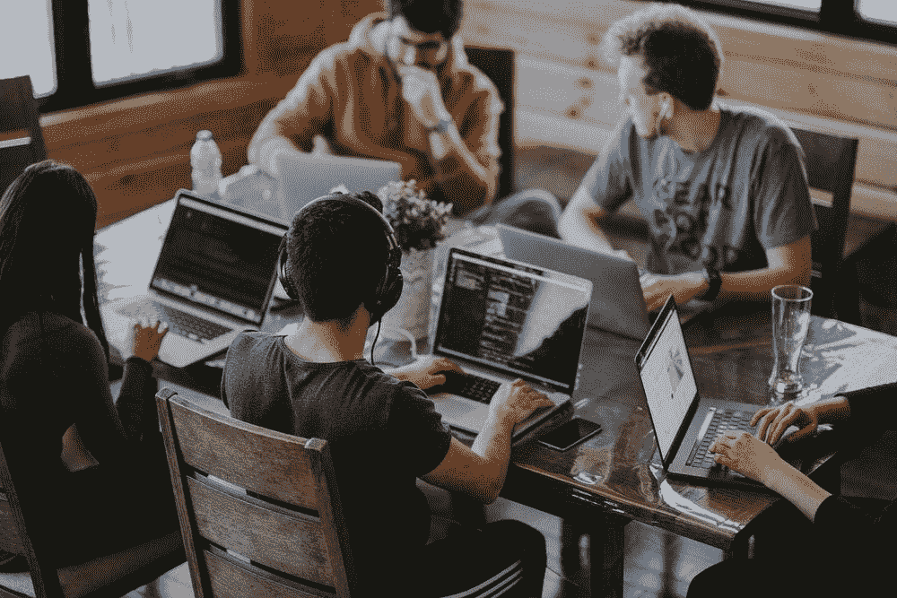

# 正确的 C 可以让你在班上名列前茅。

> 原文：<https://towardsdatascience.com/the-right-cs-can-get-you-to-the-head-of-the-class-9fd3b4a85670?source=collection_archive---------75----------------------->

## 现实世界中的 DS

## 关于协作、文化和社区，沉浸式数据科学教会了我什么

佩里·格罗内在 [Unsplash](https://unsplash.com/s/photos/working-together?utm_source=unsplash&utm_medium=referral&utm_content=creditCopyText) 上的照片

在我的职业生涯中，我有过领导团队的经历——从小型战术代理团队，到精心组织复杂的国际跨职能团队，以实现全球品牌的年度目标。

我重视从每一次经历中学习，并在持续改进的过程中发扬这些经验，以利于组织和我自己。我还认为，挑战自己，在工作场所之外学习新技能，为我们的工作关系增加更多价值，这一点很重要。

最近，我有机会通过加入一个密集的数据科学沉浸式(DSI)来做到这一点，在那里，我每天都与来自不同背景、经历和年龄的一大群人打交道，所有人都将我们的集体优势和才能集中在解决摆在我们面前的挑战上。

作为一名学生，我发现自己可以独立工作，作为团队的一员，并且在整个课程中对某些实验室和项目提供见解和领导。

我没有预料到这一点，但我很幸运在这门课程中了解到的不仅仅是数据科学。它让我对当今工作场所中协作、文化和社区的重要性有了新的认识。

照片由[优 X 创投](https://unsplash.com/@youxventures?utm_source=unsplash&utm_medium=referral&utm_content=creditCopyText)在 [Unsplash](https://unsplash.com/s/photos/working-together?utm_source=unsplash&utm_medium=referral&utm_content=creditCopyText)

## 合作

我们在商业上的合作方式已经发展了几十年，我不仅仅是在谈论技术进步如何使我们今天能够做到这一点。我说的是合作精神的改变。

仔细想想，在短短几十年里，我们已经从高度竞争的“适者生存”管理结构中走了很长一段路，在这种结构中，个人或小型内部团体为了实现共同的目标而相互竞争。

> 德勤(Deloitte)的《人力资本趋势报告》(Human Capital Trends Report)最近指出，全球 94%的公司认为“敏捷性和协作”对其组织的成功至关重要，其中 32%的公司表示，他们正在改变其组织结构，以更加“基于团队”。

我们非常幸运，今天的环境包含了真正的合作精神，而不是激烈的内部竞争。今天，我们看到了一种方法，它同时利用每个人的优势，允许更多的思想交流和更好的产品或解决方案，以及一个比几十年前的工作场所环境更具生产力和效率的流程。该 DSI 提供了倾听、学习和领导的绝佳机会:

*   当我们作为团队的一员参加黑客马拉松挑战时，我们有一天的时间来创建和提出我们最好的模型，并尝试发布当天最高的准确度分数。在最初的对话中，我们每个人都提供了自己的优势，并分享了我们认为可以做出最大贡献的地方，之后，我们每个人都创建了自己的代码部分。然后我们把它贴了出来，发给我们的其他队友去改进和补充。我们的最终代码真实地反映了每个人的最佳贡献，当我们公布最高的准确性分数时，完全出乎我们的意料。
*   在另一个项目中，在不同的团队中，很明显我们很难将我们的方法与自然语言处理解决方案联系起来。在我们的第一次工作会议之后，我决定绘制一份流程图，列出我们所有的想法，以及我认为我们试图阐明的前进道路。在我们下一次见面之前，我把它放松给小组，以便在我们重新联系之前建立联系。让所有人步调一致至关重要。一旦有了清晰的架构，所有的想法都得到了认可，紧张感消失了，我们团队的活力变得更好了。

无论是在一场友好的课堂黑客马拉松比赛中，还是在实验室工作时在课堂外分享见解，甚至是在一个松弛的通道中通过踢代码来解决深夜问题，我们都积极地相互帮助。

我们都参加了，人人为我，我为人人。我们了解到，当团队成员之间存在信任、清晰的沟通以及想法能够激发、点燃和煽起更大概念的火焰时，就出现了真正的协作。

> 谷歌最近开展了一项名为“亚里士多德项目”的计划，在该计划中，他们分析了有效的团队，并确定了对他们的成功贡献最大的品质。信任是最重要的因素，被定义为心理安全:
> 
> 在一个心理安全度高的团队里，队友觉得在队友身边冒险很安全。他们相信团队中没有人会因为承认错误、提出问题或提出新想法而为难或惩罚其他人。

由 [You X Ventures](https://unsplash.com/@youxventures?utm_source=unsplash&utm_medium=referral&utm_content=creditCopyText) 在 [Unsplash](https://unsplash.com/s/photos/working-together?utm_source=unsplash&utm_medium=referral&utm_content=creditCopyText) 上拍摄的照片

## 文化

我的 DSI 经历不仅强化了协作精神，还让我深入了解了科技公司为其团队成功培育的协作文化。

在旧的“适者生存”结构中，讨论“下一步”意味着在提出问题之前就有了所有的答案。在当今快节奏的开发世界中，参与机会中的“下一步”—庆祝项目的进展，讨论项目的下一步，并在此过程中征求其他人的改进或创新想法。

***当文化是协作的时候，公司就赢了。***

当有一个为了公司的更大利益而在团队之间分享想法和资源的环境时，他们会赢，当他们出现内部竞争时，他们会输。

例如，我们的 DSI 最重要的元素之一是我们的个人顶点项目。课程进行到一半时，我们必须向导师和同事展示三个潜在的概念，以获得反馈，并讨论我们会考虑构建哪个概念。

你最初会认为在顶点时间每个人都会疯狂地互相竞争，但是我们没有。随着思想的公开交流，我们的团队从一开始就非常相互支持，当他们看到相关的东西时，会主动提供建议和文章链接。我相信我们才华横溢的导师创造了这样的环境，我知道这种环境是基于他们自己的工作经验。

我的顶点性质要求我训练自己使用一种在我的 DSI 课程中没有探索过的工具(由于我正在抓取的一个网站的结构，我意外地不得不自学如何使用 Selenium for Python，你可以在这里[阅读更多关于它的内容](https://medium.com/@tony.bosco/crushing-retail-wine-data-with-selenium-and-python-f16a13e046a4))。经过两个星期的紧张训练和导师的指导，我找到了使用它的窍门。

大约在那个时候，我的一个同学意识到她也需要跳入 Selenium，并向我寻求指导。我很高兴能与她分享我所学到的一切，当我看到她最终的顶点项目和演示是多么令人难以置信时，我也同样激动。

我们不是唯一的，这种动力在我们的团队中循环。

这是做数据科学家的好处之一。我们利用数据来提供见解和解决问题，我们有机会使用令人难以置信的工具进行实验和工作，我们将人们聚集在一起，同时与优秀的同事合作。

克里斯蒂娜@ wocintechchat.com 在 [Unsplash](https://unsplash.com/s/photos/interview?utm_source=unsplash&utm_medium=referral&utm_content=creditCopyText) 上的照片

## 社区

在沉浸式数据科学环境中与同学一起工作是一回事，向在不同领域积极从事数据科学家工作的沉浸式数据科学校友学习是另一回事。

我们有机会花时间与五位极具才华的个人进行了小组讨论，他们加入该计划时有着不同的背景，现在已经成为数据科学家，发挥了他们的优势。

例如，一位小组成员非常擅长推动协作，并在他的组织中充当销售和数据分析师团队之间的粘合剂。另一位利用了她出色的法务会计背景、数据科学技能，以及她在一家著名的法务和诉讼咨询公司服务客户和管理团队的能力。

在所有情况下，他们帮助我们理解我们在课堂上所经历的就是他们每天所经历的。无论是在他们最初的求职过程中，还是在他们所扮演的角色中，合作文化都是一样的。

现在，除了在他们的日常生活中生活这种文化之外，他们现在回头积极地引导和欢迎我们进入他们的社区。

安妮·斯普拉特在 [Unsplash](https://unsplash.com/s/photos/collaboration?utm_source=unsplash&utm_medium=referral&utm_content=creditCopyText) 上的照片

## 结论

德勤(Deloitte)的《人力资本趋势报告》(Human Capital Trends Report)最近指出，全球 94%的公司认为“敏捷性和协作”对其组织的成功至关重要，其中 32%的公司表示，他们正在改变其组织结构，以更加“基于团队”。

毫无疑问，在我看来，任何人从像我们这样的数据科学沉浸式体验中走出来，都会在一个具有协作文化和团队结构的公司中表现出色。事实上，对于那些刚刚意识到自己也需要向这个方向转变的公司来说，它们也将是一笔巨大的财富。

协作文化存在于这个社区中，今天培育这种文化的公司，明天就会利用这种文化。

更多关于谷歌对来自*项目 Aristotle* 的高效团队的发现，点击[这里](https://rework.withgoogle.com/print/guides/5721312655835136/)。欲了解德勤最新人力资本趋势报告，请点击[此处](https://www2.deloitte.com/us/en/insights/focus/human-capital-trends.html)。