# 适合我的电动汽车:联合分析的用例

> 原文：<https://towardsdatascience.com/the-right-electric-vehicle-for-me-a-use-case-for-conjoint-analysis-d9840ca31353?source=collection_archive---------17----------------------->

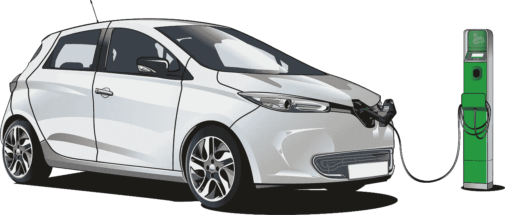

图片由来自 [Pixabay](https://pixabay.com/?utm_source=link-attribution&utm_medium=referral&utm_campaign=image&utm_content=3321668) 的 [Francis Ray](https://pixabay.com/users/Painter06-3732158/?utm_source=link-attribution&utm_medium=referral&utm_campaign=image&utm_content=3321668) 拍摄

## 了解汽车制造商如何利用联合分析在市场竞争中胜出

2020 年可能是电动汽车成为主流的一年。事实上，在 2019 年的一项研究中，39%的司机表示，他们会考虑购买电动汽车作为下一辆车。作为一个新兴市场，了解什么问题对消费者来说是重要的是至关重要的，因为这可以帮助汽车制造商不仅在电动汽车市场建立立足点，还可以享有忠诚的客户群。联合分析是一种流行的营销工具，正是为此目的而设计的。

我认为分析加州租赁的电动汽车会很有趣，因为该州拥有美国最发达的电动汽车市场。以下是 2019 年底旧金山可供租赁的车辆(来源:【https://electrek.co/best-electric-vehicle-leases/】[)。](https://electrek.co/best-electric-vehicle-leases/)

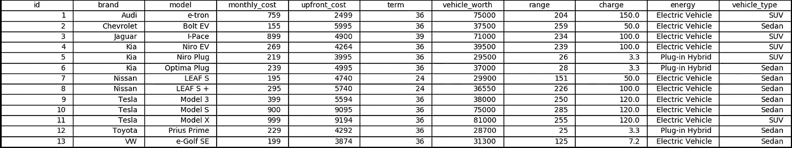

旧金山出租的电动汽车型号

租赁详情包含在字段*月成本*、*前期成本*和*期限*中。其余字段涉及电动车辆的规格(例如*范围*、*轿车*或 *SUV* )。车辆的相对受欢迎程度可以在这里找到:[https://inside EVS . com/news/343998/monthly-plug-in-EV-sales-score card/](https://insideevs.com/news/343998/monthly-plug-in-ev-sales-scorecard/)如果有令人眼花缭乱的选择，你应该购买哪一款电动汽车？

# **联合分析简介**

联合分析为回答这个问题提供了一个原则性的方法。这种分析的一个基本概念是效用。效用试图量化消费者对一件商品的特定属性的重视程度。因此，效用反映了消费者的优先事项、价值观和偏好。效用越高，消费者从产品中获得的使用就越多，因此，如果消费者是理性的，他就会购买效用最大化的产品。

但是我们如何衡量一个人的效用呢？通常，一个群体的效用是通过要求他们对一组产品进行偏好排序或从一个小集合中选择一个产品来推断的。

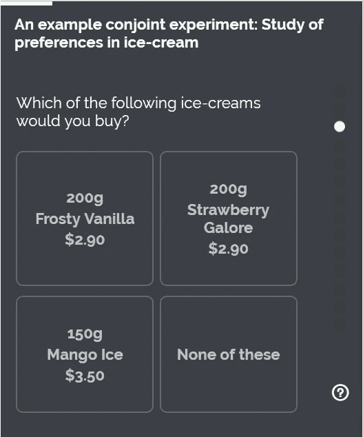

来源:维基百科

通过仔细控制展示的产品组合的顺序，并通过分析回答者的选择，人们可以估计产品的各种属性对群体的隐含效用。

下面的所有分析都是在下面链接的 Github repo 中实现的。不幸的是，没有公开的电动汽车公用事业数据集可供我进行联合分析。因此，我选择模拟一组 560 个人的效用，他们分为三代:千禧一代、X 一代和婴儿潮一代。这三个细分市场是从略微不同的分布中模拟出来的，考虑到了细分市场之间在口味/偏好上的明显差异。这是三个人每月分期付款的模拟公用设施。

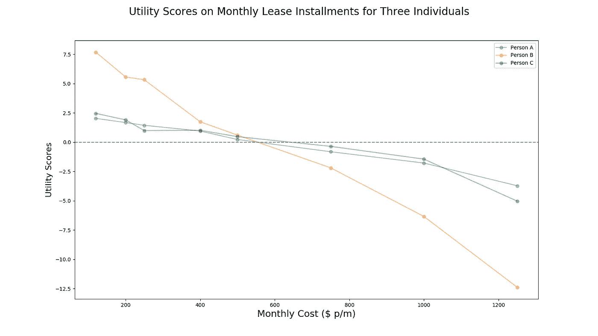

这三个人都有单调递减的效用(即他们是理性的，喜欢每月支付较少的钱)。人 B 对价格最敏感，因为她对*月成本*的效用得分范围最大。对于所有三个人，效用分数的总和将为零。这对于记录在任何属性上的效用分数都是正确的。

我们考察了同一用户对电动汽车范围的效用。

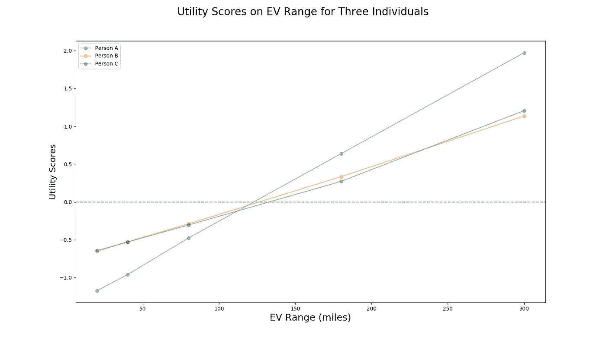

我们看到这三个人都更喜欢续航里程更长的电动汽车，其中 A 认为车辆续航里程最重要。注意，对于所有三个人来说，效用从最低 EV 范围到最高 EV 范围的增加小于他们效用分数从最可负担每月分期付款到最不可负担每月分期付款的绝对移动。因此，这三个人都优先考虑租赁的每月分期付款，而不是 EV 范围。

我们也可以测量分类变量的效用。一个流行的衡量标准是看人们从各种品牌中获得的效用。

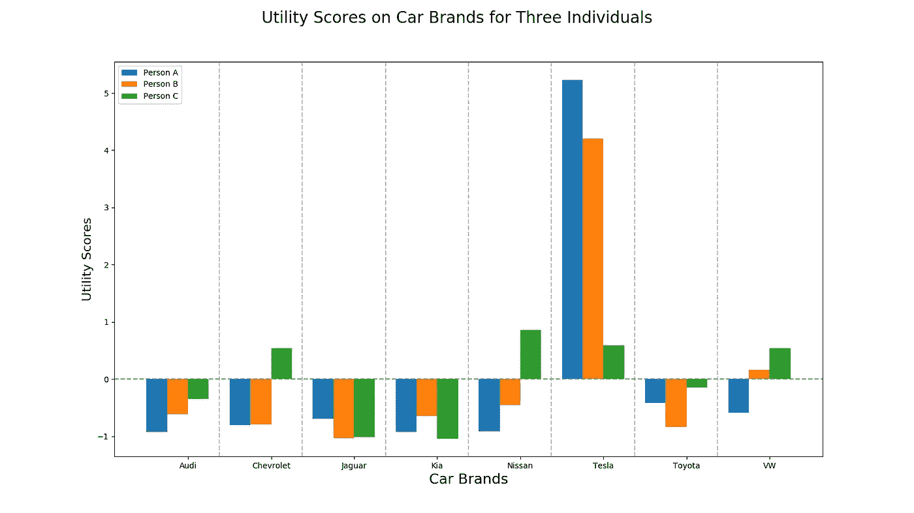

A 和 B 强烈倾向于特斯拉而不是其他品牌。C 人不太看重电动汽车的品牌，但相对于特斯拉，他不太喜欢日产。

问题是，为什么一家公司要花这么多的麻烦和费用来进行一项研究，以得出一组用户的隐含效用分数。正如我们将看到的，它们提供了一种了解市场需求的强有力的方法，并能使一家公司在竞争中胜过其对手。

# 联合研究的回报

联合研究可以提供对市场状况的多种见解，使公司能够了解市场需要什么，以及它将如何对产品供应的变化做出反应。我们在下面列出了一些可以从联合研究中获得的见解。同样，关于如何实施分析的更多细节包含在下面链接的 Github repo 中。

## 1.预测电动汽车车型的市场份额

也许联合研究最明显的用例是，它使人们能够预测各种模型产品的相对市场份额。根据受访者的效用得分，我们预计他们会选择效用最高的电动汽车车型，因此，通过记录拥有效用最高的特定车型的受访者数量，我们可以预测该车型在更广泛市场中的受欢迎程度。下表显示了基于模拟公用事业数据的电动汽车租赁的相对受欢迎程度。

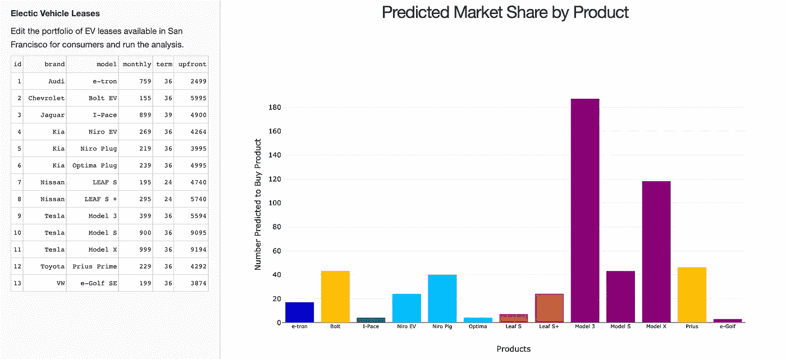

电动汽车租赁的预测受欢迎程度

同一品牌的所有型号都有相同的颜色条。我们看到，特斯拉是最受欢迎的品牌，约 60%的受访者选择了它。

上述计算假设客户将总是购买给他们带来最高效用的产品。更实际的是，考虑到第 *k* 个模型的效用，联合分析通常假设选择第 *i* 个模型的概率是:

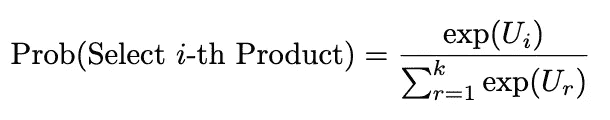

将效用分数映射到购买概率

对一个产品效用高，对其他所有东西效用低的产品，会有很大概率被挑中。

## 2.对所选模型的吸引力

公司对客户的忠诚度非常感兴趣——他们的客户是喜欢他们的产品，并且相信市场上没有其他产品可以与之媲美，还是他们只是微弱地喜欢公司的产品而不是市场上的其他产品？后一种情况将表现为，例如，奥迪客户对奥迪 e-tron 的效用最高，但竞争车型(例如，特斯拉 Model X)对该客户的效用几乎一样高。

下面的热图显示了每种车型对客户的吸引力。对角线元素反映了与市场上的其他产品相比，客户对其选择的偏好程度。特斯拉，Model X 客户对他们的选择特别满意。非对角线值显示了其他电动汽车对各种电动汽车客户的相对吸引力。例如，如果交易变得更好(例如，更便宜的价格、附加产品)，一些大众、e-tron 客户可能会被说服转向特斯拉、Model X。

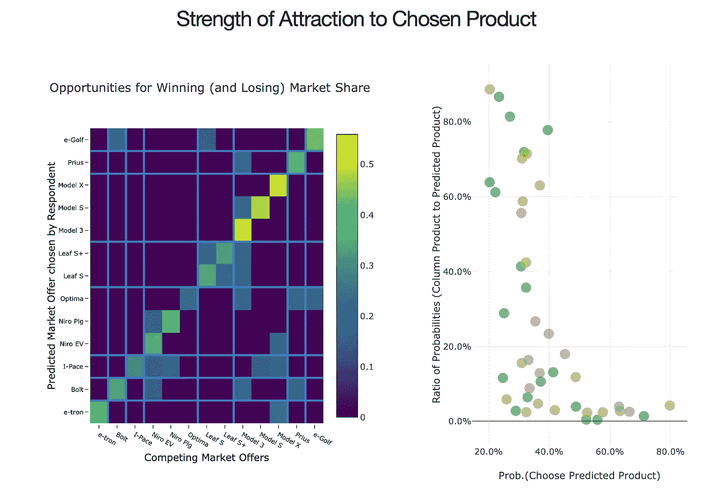

热图中的每个非对角线单元格都有相应的散点图。散点图针对 EV 模型的一组预测客户，由所选单元的 y 坐标给出。单元格的 x 坐标将相应 EV 模型的效用与首选 EV 模型进行比较(在 y 坐标中)。这种比较是在散点图的 y 轴上进行的，散点图比较每辆车被购买的概率比率。客户根据他们所属的细分市场进行颜色编码(千禧一代是绿色，X 一代是金色，婴儿潮一代是灰色)。我们可以看到，千禧一代和 X 世代的客户更容易被说服转向 Model X。

## 3.顾客对品牌的忠诚度

我们可以收集所有预计会购买某个特定品牌的人，并绘制出他们购买属于该品牌的型号的概率。他们预测品牌的概率越高，对品牌的忠诚度越高。

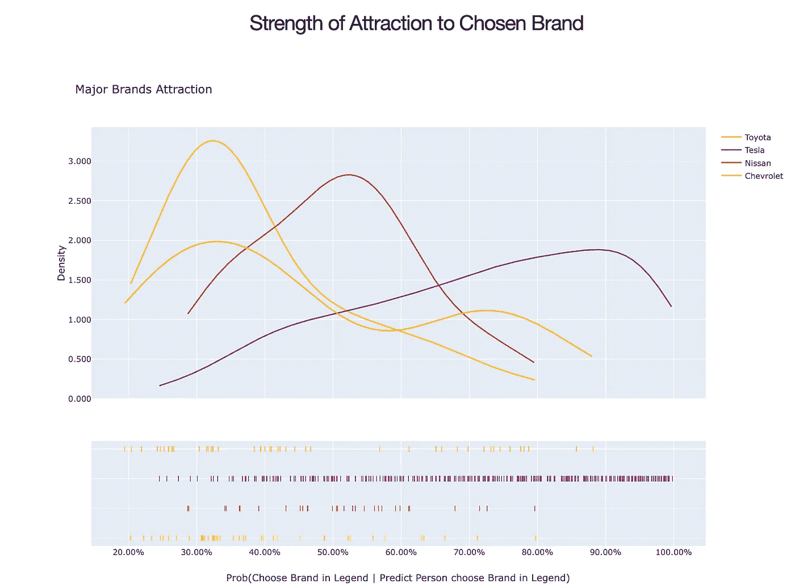

我们看到，预计购买特斯拉电动汽车的人最有可能购买，而日产的预计客户最有可能购买日产电动汽车。

## 4.寻找公司最激烈的竞争对手

对于每个电动汽车品牌，我们可以关注预测购买其汽车的受访者，并通过绘制他们预测购买其他品牌的概率，我们可以看到他们认为自己预测的首选品牌与其他七个品牌相比有多有吸引力。

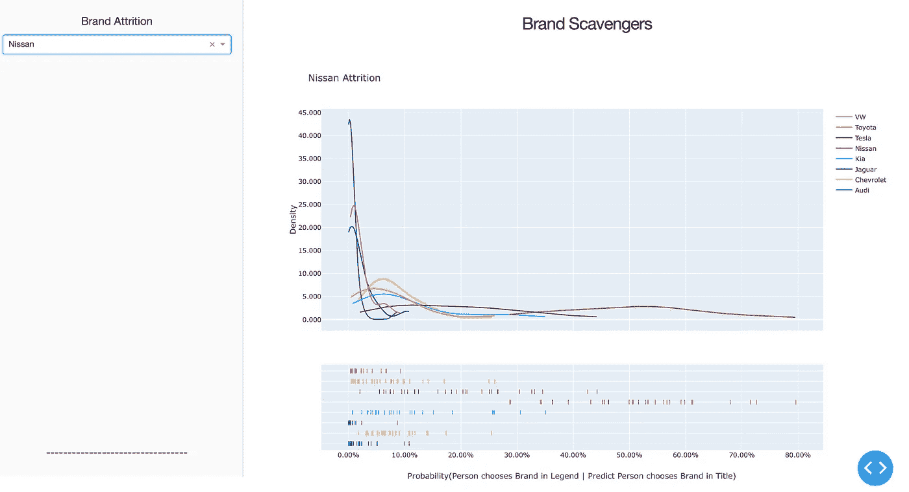

这里我们重点关注预测的日产客户。因此，日产的概率分布(根据定义)是最右边的。在日产之后最靠右的品牌分布是日产最大的威胁。我们看到，日产品牌最容易被特斯拉和起亚抢走客户，因为这些分布在日产分布之后最靠右。

## 5.模型设计对关键财务指标的影响

竞争市场中的公司通常在产品开发上投入大量资金，因为这使他们能够定期更新产品。联合分析使人们能够看到不同的租赁结构(或新的电动汽车模型)对公司财务状况的影响。假设特斯拉希望看到 Model 3 和 Model S 每月增加 100 美元的月供以及 Model X 每月增加 200 美元的月供对其财务状况的影响。

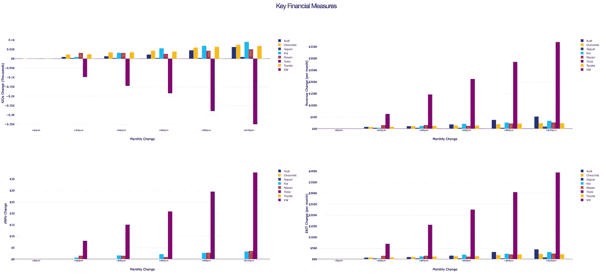

左上角的面板显示了对客户数量的影响。正如预期的那样，增加每月分期付款会导致特斯拉失去客户，而起亚受益最大。然而，右上图(月收入)显示，剩余客户支付的更高分期付款足以弥补这一不足。底部面板显示了对每个客户平均月收入以及 EBIT 的影响。

我们也可以选择检查当共同改变两个属性时，对这些相同的财务措施的影响；例如，每月分期付款和前期费用。

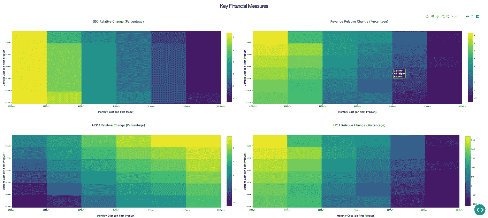

## 6.客户档案与模型产品的关系

最后，我们可以看到一组特定的产品将对公司客户的人口统计特征产生什么影响。通过了解他们的产品吸引哪些客户，公司可以更好地进行营销活动。

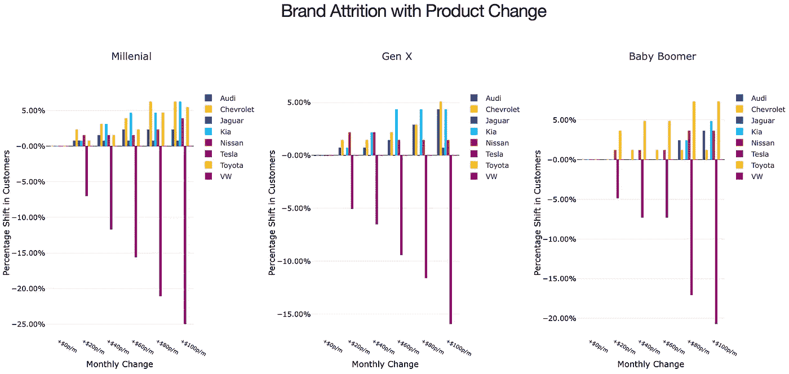

我们看到千禧一代对价格最敏感，25%的千禧一代特斯拉客户因每月分期付款增加 100 美元而流失。注意不同的行为:例如，失去的婴儿潮一代客户大多转向丰田，而没有失去的 X 一代客户转向丰田。

我们可以更清楚地了解在任何选择的价位上各个细分市场的情况。例如，在+100 美元/分点，对分段的影响如下:

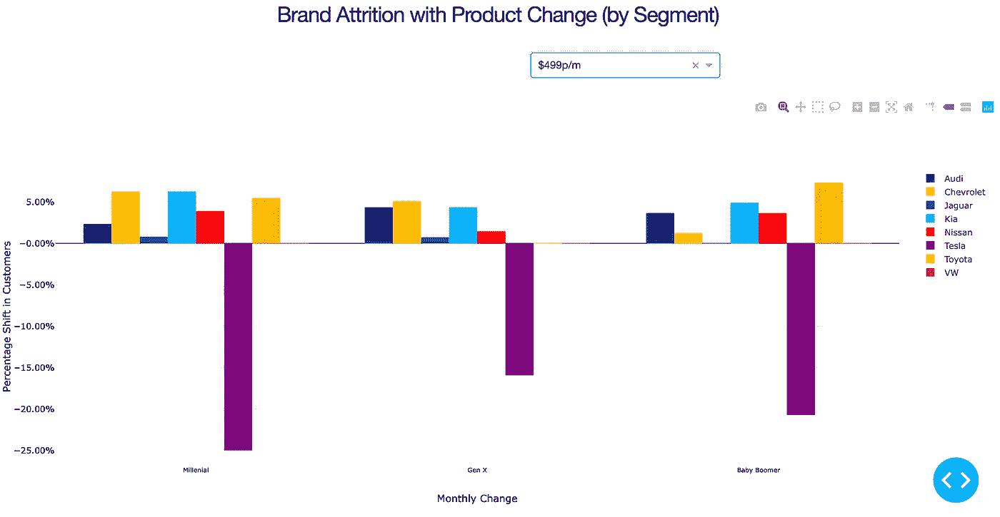

# 结论

联合分析是理解市场需求和欲望的有力工具。它可以帮助公司更好地满足客户的需求，并在市场竞争中胜出。

# 链接

联合分析 Github:[https://github.com/Melvin-Var/ConjointElectricVehicles](https://github.com/Melvin-Var/ConjointElectricVehicles)

Youtube 演示:【https://youtu.be/JucZrr-W6CY 

感谢您花时间阅读这篇文章！如果您喜欢这篇文章，您可能会喜欢我写的其他一些媒体文章:

*   了解如何在 AWS 上部署仪表板(如上面 Github repo 中的仪表板):[如何使用 Docker 在 AWS 上部署仪表板应用](/how-to-use-docker-to-deploy-a-dashboard-app-on-aws-8df5fb322708)
*   了解深度学习的优势和局限性:[不，深度学习是不够的](https://medium.com/atlassiandata/nope-deep-learning-is-not-enough-13b150dab936)

