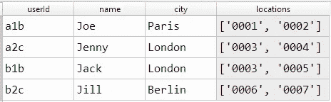
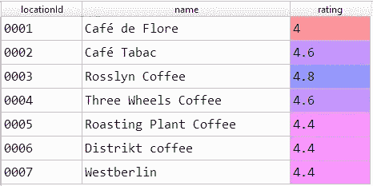
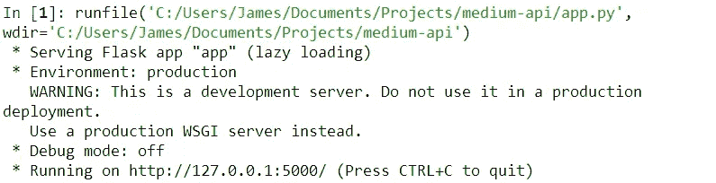
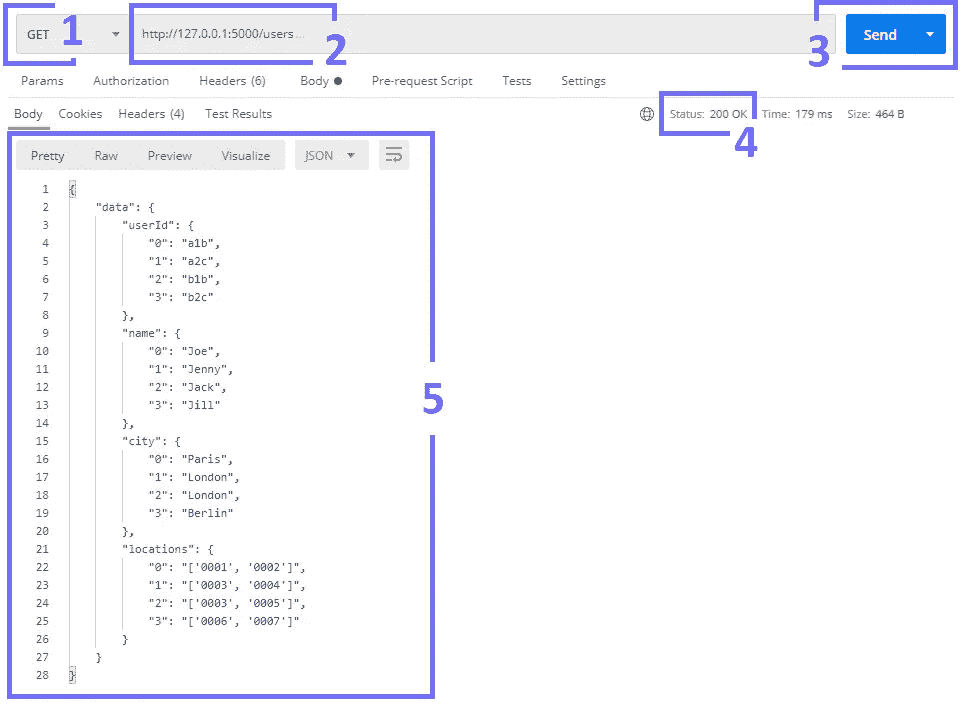
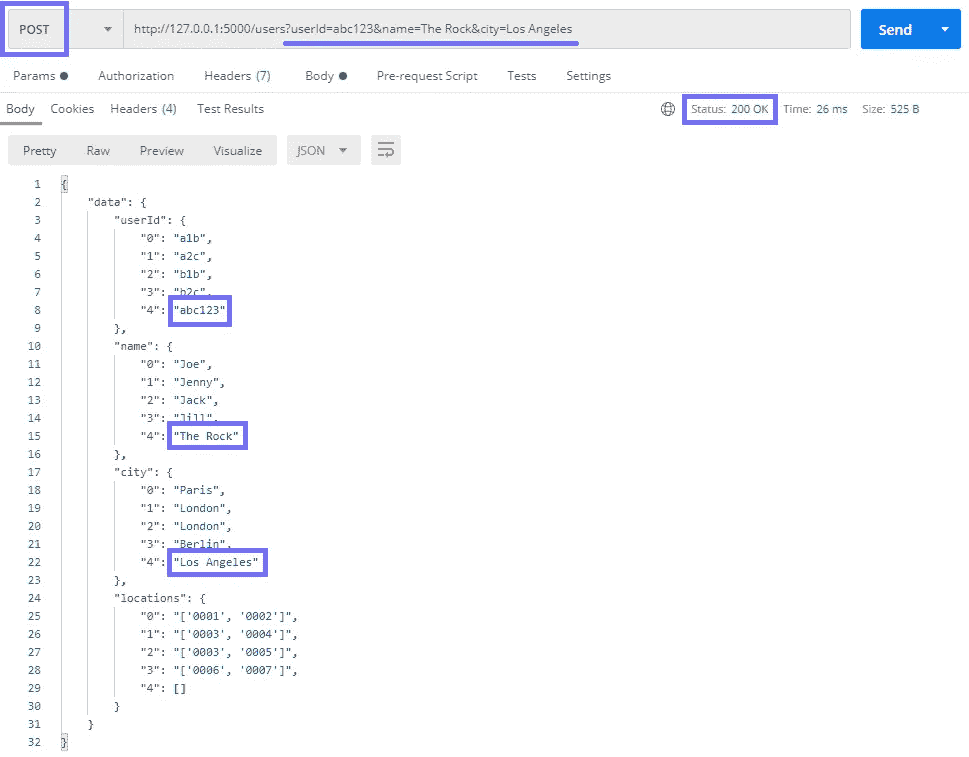
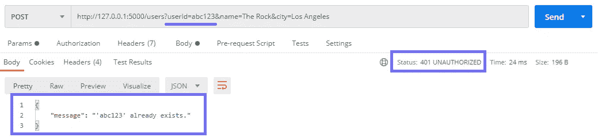
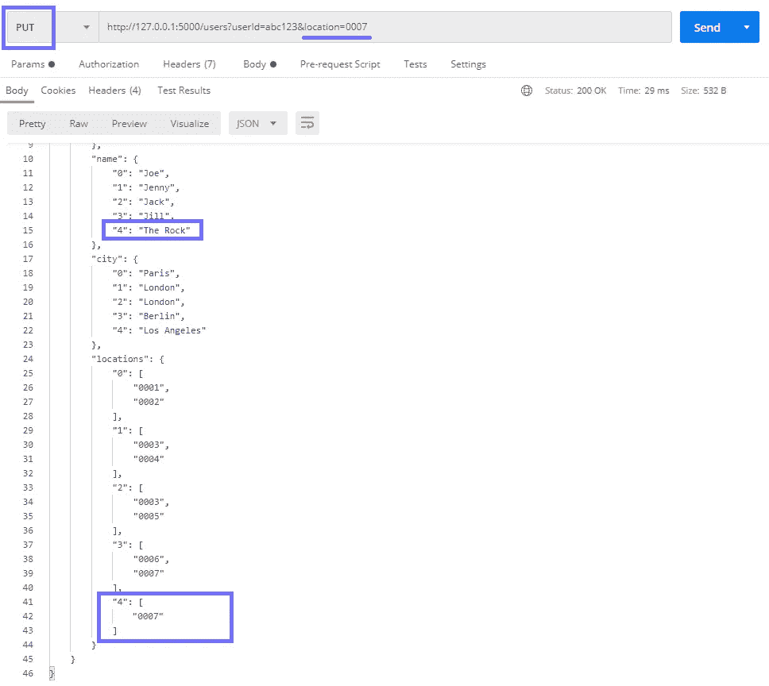
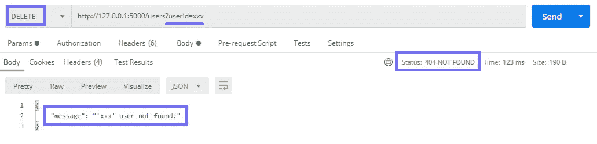

# 用 Python 构建 API 的正确方法

> 原文：<https://towardsdatascience.com/the-right-way-to-build-an-api-with-python-cd08ab285f8f?source=collection_archive---------0----------------------->

## 关于 Flask 中的 API 开发，您需要了解的所有内容


[斯蒂夫·约翰森](https://unsplash.com/@steve_j?utm_source=medium&utm_medium=referral)在 [Unsplash](https://unsplash.com?utm_source=medium&utm_medium=referral) 上拍照

我们如何建立一种从一个软件实例到另一个软件实例的通信方式？这听起来很简单，而且——说实话——确实如此。

我们只需要一个 API。

API(应用编程接口)是一个简单的接口，它定义了请求的类型(需求/问题等)。)能做的，怎么做的，怎么加工的。

Flask API 视频演练——涵盖了本文中的所有内容！

在我们的例子中，我们将构建一个 API，它允许我们向不同的端点发送一系列 GET/POST/PUT/PATCH/DELETE 请求(稍后将详细介绍)，并返回或修改连接到我们的 API 的数据。

我们将使用 Flask 框架来创建我们的 API 和 Postman 来测试它。简而言之，我们将涵盖:

```
**> Setup**
  - Our Toy Data
  - Initialize a Flask API
  - Endpoints
  - Running a Local Server
**> Writing Our API**
  - GET
  - POST
  - 401 Unauthorized
  - PUT
  - DELETE
  - Users Class (summary)
**> That's It!**
```

# 设置

我们的 API 将包含两个端点，`users`和`locations`。前者将允许访问我们的注册用户的详细资料，而后者将包括咖啡馆的位置列表。

这里假设的用例是一个数百万的咖啡馆书签应用程序，用户打开应用程序，将他们最喜欢的咖啡馆加入书签——像谷歌地图，但没有用。

## 我们的玩具数据

为了简单起见，我们将这些数据存储在两个本地 CSV 文件中。实际上，您可能想看看 MongoDB 或 Google Firebase 之类的东西。

我们的 CSV 文件如下所示:



[users.csv](https://drive.google.com/file/d/12-nW-R6TEPbUzSVF8zsQtOm992TdZOqj/view?usp=sharing) 中的用户数据。图片作者。



[locations.csv](https://drive.google.com/file/d/1ERGeiKZLNuD9K-MHd7a0Colqj_DqiMww/view?usp=sharing) 中的位置映射。图片作者。

你可以在这里下载[users . CSV](https://drive.google.com/file/d/12-nW-R6TEPbUzSVF8zsQtOm992TdZOqj/view?usp=sharing)，在这里下载[locations . CSV](https://drive.google.com/file/d/1ERGeiKZLNuD9K-MHd7a0Colqj_DqiMww/view?usp=sharing)。

## 初始化烧瓶 API

现在，对于我们的 Python 脚本，我们需要导入模块并初始化我们的 API，如下所示:

```
from flask import Flask
from flask_restful import Resource, Api, reqparse
import pandas as pd
import astapp = Flask(__name__)
api = Api(app)
```

## 端点

正如我们已经提到的，我们的 API 将有两个端点，`users`和`locations`。

这样做的结果是——如果我们的 API 位于`www.api.com`,那么与`Users`类的通信将在`www.api.com**/users**`提供，而`Locations`将在`[www.api.com**/locations**](http://www.api.com/locations.)` [提供。](http://www.api.com/locations.)

为了创建一个端点，我们定义了一个 Python 类(可以使用任何名称)并用`api.add_resource`将它连接到我们想要的端点，就像这样:

*   Flask 需要知道这个类是我们 API 的一个端点，所以我们用类定义传入`Resource`。
*   在类内部，我们包含了我们的 HTTP 方法(GET、POST、DELETE 等。).
*   最后，我们使用`api.add_resource`将我们的`Users`类与`/users`端点链接起来。

因为我们想要**两个**端点，所以我们复制逻辑:

## 运行本地服务器

最后，当我们写出我们的 API 时，我们需要测试它！

要做到这一点，我们需要托管我们的 API，我们可以通过在脚本末尾添加`app.run`来本地完成，如下所示:

```
if __name__ == '__main__':
    app.run()  # run our Flask app
```

现在，当我们运行我们的脚本时，我们应该看到类似这样的内容:



本地主机服务器的初始化。图片作者。

一旦我们的服务器设置好了，我们就可以在使用 Postman 构建 API 时对其进行测试，如果您以前没有使用过它的话，因为它是 API 测试的事实标准。别担心——使用起来非常简单——从[这里](https://www.postman.com/downloads/)下载 Postman。

在继续之前，你可以在这里找到我们将要构建的[的完整脚本。如果您不确定代码片段应该放在哪里，请查看那里！](https://gist.github.com/jamescalam/0b309d275999f9df26fa063602753f73)

# 编写 API 方法

在每个类中，我们保留了 HTTP 方法 GET、POST 和 DELETE。

为了创建一个 GET 方法，我们使用`def get(self)`。POST 和 DELETE 遵循相同的模式。

## 得到

GET 方法是最简单的。我们返回所有存储在`users.csv`中的数据，这些数据被包装在一个字典中，就像这样:

然后，我们可以运行脚本来初始化我们的 API，打开 Postman 并向我们的本地主机地址(通常是`[http://127.0.0.1:5000](http://127.0.0.1:5000))`)发送 GET 请求——这是我们的 API *入口点*。



如何向我们的 API 发送 GET 请求。图片作者。

要在 Postman 中向我们的 API 发送 GET 请求，我们:

1.  从下拉列表中选择获取
2.  键入我们的 API 实例+ `/users`(端点*)的入口点*
3.  *点击**发送***
4.  *检查我们的 API 返回的状态代码(我们应该看到`200 OK`)*
5.  *查看我们的 API 的响应，是 JSON *(像字典)*格式的`users.csv`*

## *邮政*

*POST 方法允许我们向数据中添加记录。在这种情况下，我们将采用`usedId`、`name`和`city`的参数。*

*这些参数作为 URL 参数传递给我们的 API 端点，如下所示:*

```
*[http://127.0.0.1:5000/users**?userId=abc123&name=The**](http://127.0.0.1:5000/users?userId=abc123&name=The) **Rock&city=Los Angeles***
```

*我们可以指定所需的参数，然后使用`reqparse`解析提供的值，如下所示:*

*让我们分解一下解析器代码:*

*   *我们用`.RequestParser()`初始化我们的解析器。*
*   *用`.add_argument([arg_name], required)`添加我们的参数——注意`required=True`意味着参数在请求中是必需的。或者，我们可以用`required=False`添加可选参数。*
*   *使用`.parse_args()`将我们的参数及其值解析到一个 Python 字典中。*

*然后，我们可以访问传递给每个参数的值，就像我们通常在字典中访问键值对一样。*

*让我们将这些放在一起，为我们的 CSV 增加价值:*

*如果它开始看起来有点混乱，我们所做的就是:*

*   *从 URL 参数`args`创建一行新数据`new_data`*
*   *将其附加到预先存在的`data`*
*   *保存新合并的数据*
*   *并且，返回`data`和一个`200 OK`状态码。*

**

*我们通过向我们的/用户端点发送包含 **userId** 、 **name** 和 **city** 参数的 **POST** 请求来创建一个新用户。图片作者。*

*我们现在可以发送一个 **POST** 请求来创建一个新用户，很简单！*

## *401 未经授权*

*我们的代码处理 **POST** 请求，允许我们向`users.csv`写入新数据——但是如果那个用户已经存在了呢？*

*为此，我们需要添加一个检查。如果`userId`已经存在，我们返回一个`401 Unauthorized`代码给用户。*

**

*如果我们尝试用用户 id“ABC 123”再次发布，我们将返回以下 401 未授权状态代码和消息。图片作者。*

*回到 Postman，我们可以通过尝试添加同一个用户两次来测试我们的 API 是否正常工作——这一次，Rock 收到了一个`401 Unauthorized`响应。*

## *放*

*如果我们想给一个用户添加一个咖啡馆呢？我们不能使用 **POST** ，因为这会返回一个`401 Unauthorized`代码——相反，我们使用 **PUT** 。*

*与 **POST** 类似，我们需要在提供的`userId`不存在的情况下增加 if-else 逻辑。*

*除了对代码做了一些小的调整，我们的 **PUT** 方法与 **POST** 几乎相同。*

**

*这里我们使用 **PUT** 方法将 ID 为 0007 的咖啡馆添加到 Rock 的书签位置。图片作者。*

*回到 Postman，我们需要的输入参数已经改变。现在，我们只需要`userId`和一个`location`来添加到用户书签`locations`中。*

## *删除*

*我们也可以用 **DELETE** 方法删除记录。*

*这个方法非常简单，我们需要指定一个`userId`来移除，并在不存在`userId`的情况下添加一些 if-else 逻辑。*

*因此，如果`Jill`认为我们的应用程序毫无用处，想要离开，我们会发送一个包含她的`userId`的**删除**请求。*

**

*发送针对**用户 id‘B2C’**的**删除**请求，从我们的用户数据中删除 Jill 的记录。图片作者。*

*我们可以在 Postman 中测试这一点，不出所料，我们返回的数据没有 Jill 的记录。如果我们尝试删除一个不存在的用户会怎么样？*

**

*如果我们**删除**一个不存在的**用户标识**，我们将收到一个 **404 未找到**状态代码和一条解释用户标识不存在的消息。图片作者。*

*我们再次收到我们的`404 Not Found`和一条简短的消息，说明没有找到`userId`。*

## *用户类别*

*这是组成`Users`类的所有部分，通过我们的`/users`端点访问。你可以在这里找到[的完整脚本](https://gist.github.com/jamescalam/0b309d275999f9df26fa063602753f73)。*

*之后还需要把`Locations`类拼起来。这个类应该允许我们获取、发布、修补(更新)和删除位置。*

*每个位置都有一个唯一的 ID——当用户将一个位置加入书签时，这个唯一的 ID 会被添加到他们的带有`PUT /users`的`locations`列表中。*

*这个的代码和我们在`Users`类中写的没有太大的不同，所以我们不会重复。然而，你可以在`Users`级[旁边找到它。](https://gist.github.com/jamescalam/0b309d275999f9df26fa063602753f73)*

# *就是这样！*

*就这么简单。用 Flask 和 Python 建立一个 API 非常简单。*

*我们现在有了一个易于使用的标准化方法来在不同的接口之间进行通信。*

*我们已经讨论了所有最常见的请求方法——GET、POST、PUT 和 DELETE——以及一些 HTTP 状态代码——200、401 和 404。*

*最后，我们已经学会了如何在本地托管我们的 API，并使用 Postman 测试它——允许我们快速诊断问题，并确保我们的 API 按预期运行。*

*总而言之，API 开发对于开发人员、数据科学家以及你能想象到的几乎任何其他技术倾向的角色来说都是一项至关重要的技能。*

*如果你想要更多，我在 [YouTube 这里](https://www.youtube.com/channel/UCv83tO5cePwHMt1952IVVHw)发布编程教程。或者，如果您有任何问题或改进的想法，请在 [Twitter](https://twitter.com/jamescalam) 或下面的评论中告诉我。*

*我希望你喜欢这篇文章，感谢你的阅读！*

## *[🤖《变形金刚》课程 NLP 的 70%折扣](https://bit.ly/nlp-transformers)*

*想在 API 开发中采取下一步措施并与世界分享您的成果吗？点击此处了解谷歌云平台的 API 部署:*

*[](/how-to-deploy-a-flask-api-8d54dd8d8b8a) [## 如何部署 Flask API

### 将您的 API 部署到 Google 云平台

towardsdatascience.com](/how-to-deploy-a-flask-api-8d54dd8d8b8a)*