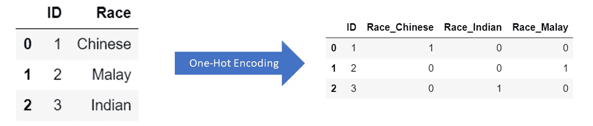
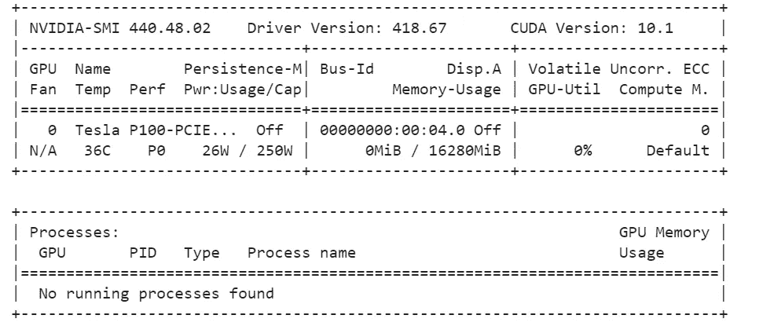

# 将深度学习用于表格数据|实体嵌入的正确方法

> 原文：<https://towardsdatascience.com/the-right-way-to-use-deep-learning-for-tabular-data-entity-embedding-b5c4aaf1423a?source=collection_archive---------11----------------------->

## 从业者已经将自然语言处理(NLP)中使用的网络嵌入到表格数据中。


米卡·鲍梅斯特在 [Unsplash](https://unsplash.com?utm_source=medium&utm_medium=referral) 上的照片

最近，我参加了一个深度学习课程，在这个课程中，我被分配了一个利用深度学习技术的项目。当我在职业生涯的前 6 个月从事结构化数据工作时，我立即想到了对表格数据使用深度学习或神经网络。

在表格数据中使用深度学习并不是一个新想法。人们对这些数据使用全连接神经网络已经有很长时间了，但是它也有一些缺点；

1.  神经网络需要大量数据
2.  与更流行的机器学习算法(例如随机森林、梯度推进树)相比，模型性能的增益微不足道
3.  缺乏可解释性

因此，对表格数据使用深度学习从未真正起步。这是真的，直到从业者将自然语言处理(NLP)中使用的嵌入网络的想法转移到表格数据。

这就是它的工作原理。

传统上,“性别”或“种族”等分类变量使用一键编码进行处理，变量中的每个实体都有一个唯一的列来跟踪实体的存在。



独热编码的例子

这种方法虽然将数据转换成适合机器学习算法的格式，但它假定实体之间是独立的，并产生稀疏矩阵。

另一方面，实体嵌入使用向量来表示每个实体，而不是二进制值。这有几个优点:

1.  消除计算效率低的稀疏矩阵问题
2.  生成显示每个实体之间关系的向量(获得额外的见解，而不是将它们视为独立的)

因此，我决定做一个使用表格的项目来演示实体嵌入的使用。我使用的数据集是来自 Kaggle 的 IEEE-CIS 欺诈检测数据，您可以在这里找到。

下面是一步一步的代码(包括我在 Colab 工作时的 Google Colab 特定代码)。

首先，要检查 colab 中分配给您的 GPU，您可以运行以下代码。

```
!nvidia-smi
```



在我的谷歌硬盘旁边，

```
from google.colab import drivedrive.mount('/content/drive')
```

从 Kaggle 下载数据集，为此您需要 Kaggle API 令牌。如果你需要任何帮助从 Kaggle 下载数据集，[这个](https://www.kaggle.com/general/51898)可能会有帮助。

```
!mkdir /root/.kaggle!echo '{"username":"USERNAME","key":"KEY"}' > /root/.kaggle/kaggle.json!chmod 600 /root/.kaggle/kaggle.json!kaggle competitions download -c ieee-fraud-detection# unzip all files!unzip train_transaction.csv.zip
!unzip test_transaction.csv.zip
```

然后，将 csv 文件读入熊猫数据帧

```
train = pd.read_csv("train_transaction.csv")
test = pd.read_csv("test_transaction.csv")
```

由于这是一个欺诈检测数据集，拥有不平衡的数据并不奇怪。

```
train["isFraud"].mean() #  0.03499000914417313
```

由于数据探索和特征工程不是这篇文章的目的，我将使用最小特征来预测欺诈标签。为了确保您可以复制我的代码，下面是我的处理步骤。

```
# generate time of daytrain["Time of Day"] = np.floor(train["TransactionDT"]/3600/183)
test["Time of Day"] = np.floor(test["TransactionDT"]/3600/183)# drop columnstrain.drop("TransactionDT",axis=1,inplace=True)
test.drop("TransactionDT",axis=1,inplace=True)# define continuous and categorical variablescont_vars = ["TransactionAmt"]
cat_vars = ["ProductCD","addr1","addr2","P_emaildomain","R_emaildomain","Time of Day"] + [col for col in train.columns if "card" in col]# set training and testing setx_train = train[cont_vars + cat_vars].copy()
y_train = train["isFraud"].copy()
x_test = train[cont_vars + cat_vars].copy()
y_test = train["isFraud"].copy()# process cont_vars
# scale valuesfrom sklearn.preprocessing import StandardScaler
scaler = StandardScaler()
x_train["TransactionAmt"] = scaler.fit_transform(x_train["TransactionAmt"].values.reshape(-1,1))
x_test["TransactionAmt"] = scaler.transform(x_test["TransactionAmt"].values.reshape(-1,1))# reduce cardinality of categorical variablesidx_list = x_train["card1"].value_counts()[x_train["card1"].value_counts()<=100].index.tolist()
x_train.loc[x_train["card1"].isin(idx_list),"card1"] = "Others"
x_test.loc[x_test["card1"].isin(idx_list),"card1"] = "Others"# fill missingx_train[cat_vars] = x_train[cat_vars].fillna("Missing")
x_test[cat_vars] = x_test[cat_vars].fillna("Missing")for cat, index in categories.items():test[cat] = pd.Categorical(test[cat],categories=categories[cat],ordered=True)
```

处理步骤完成后，现在我们可以将分类变量转换成整数。

```
# convert to numerical value for modellingdef categorify(df, cat_vars):categories = {}for cat in cat_vars:
df[cat] = df[cat].astype("category").cat.as_ordered()
categories[cat] = df[cat].cat.categoriesreturn categories def apply_test(test,categories):for cat, index in categories.items():
test[cat] = pd.Categorical(test[cat],categories=categories[cat],ordered=True)# convert to integers
categories = categorify(x_train,cat_vars)
apply_test(x_test,categories)for cat in cat_vars:
x_train[cat] = x_train[cat].cat.codes+1
x_test[cat] = x_test[cat].cat.codes+1
```

由于高度不平衡的数据集，我不得不使用一种称为合成少数过采样技术(SMOTE)的技术人工生成更多的欺诈数据。文档可以在这里找到[。](https://imbalanced-learn.readthedocs.io/en/stable/generated/imblearn.over_sampling.SMOTE.html)

```
from imblearn.over_sampling import SMOTEsm = SMOTE(random_state=0)x_sm, y_train = sm.fit_resample(x_train, y_train)
x_train = pd.DataFrame(x_sm,columns=x_train.columns)
```

最后，我们可以对数据进行建模。这个实体嵌入的实现采用了杰瑞米·霍华德的“[程序员机器学习入门](http://course18.fast.ai/ml)课程的思想和最佳实践。因此，杰里米通过他的研究和经验选择了许多技术细节，如嵌入大小和隐藏层。无论如何，如果你没有看过这个课程，我强烈建议你参加这个课程，听听杰里米的机器学习方法。它也是完全免费的。

```
# get embedding size for each categorical variabledef get_emb_sz(cat_col,categories_dict):
num_classes = len(categories_dict[cat_col])
return int(min(600,round(1.6*num_classes**0.56)))
```

现在来定义神经网络。网络的结构是连续变量与每个分类变量的嵌入层的简单连接。

```
# define the neural networksfrom tensorflow.keras.layers import Input, Embedding, Dense, Reshape, Concatenate, Dropout, BatchNormalizationfrom tensorflow.keras import Modeldef combined_network(cat_vars,categories_dict,cont_vars, layers):inputs = []
embeddings = []
emb_dict ={}# create embedding layer for each categorical variablesfor i in range(len(cat_vars)):
emb_dict[cat_vars[i]] = Input(shape=(1,))
emb_sz = get_emb_sz(cat_vars[i],categories_dict)
vocab = len(categories_dict[cat_vars[i]]) +1
embedding = Embedding(vocab,emb_sz,input_length=1)(emb_dict[cat_vars[i]])
embedding = Reshape(target_shape=(emb_sz,))(embedding)
inputs.append(emb_dict[cat_vars[i]])
embeddings.append(embedding)# concat continuous variables with embedded variablescont_input = Input(shape=(len(cont_vars),))
embedding = BatchNormalization()(cont_input)
inputs.append(cont_input)
embeddings.append(embedding)x = Concatenate()(embeddings)# add user-defined fully-connected layers separated with batchnorm and dropout layersfor i in range(len(layers)):if i ==0:
x = Dense(layers[i],activation="relu")(x)
else:
x = BatchNormalization()(x)
x = Dropout(0.5)(x)
x = Dense(layers[i],activation="relu")(x)output = Dense(1,activation="sigmoid")(x)
model = Model(inputs,output)return model
```

现在初始化模型。

```
layers = [200,100]model = combined_network(cat_vars,categories,cont_vars, layers)opt = tf.keras.optimizers.Adam(0.0001)model.compile(optimizer=opt,loss='binary_crossentropy',metrics=["accuracy"])
```

处理神经网络的输入。

```
# process x_train input to fit modelinput_list = []for i in cat_vars:
input_list.append(x_train[i].values)
input_list.append(x_train[cont_vars].values)# modify x_test input to fit modeltest_list = []
for i in cat_vars:
test_list.append(x_test[i].values)
test_list.append(x_test[cont_vars].values)
```

训练模特~

```
model.fit(input_list,y_train,epochs=10)
```

做出预测

```
y_pred = model.predict(test_list)# choose a optimal threshold
y_pred = y_pred>0.1
```

最后，竞赛使用 ROC-AUC 对排行榜进行排名。因此，我们计算我们的 ROC-AUC，看看我们如何与他人相比。

```
roc = metrics.roc_auc_score(y_test,y_pred)
roc
  0.8787572838641191
```

对于一个只使用部分功能的模型来说，这还不错。

这就是了。使用实体嵌入进行 Kaggle 表格数据竞赛。希望你喜欢它。