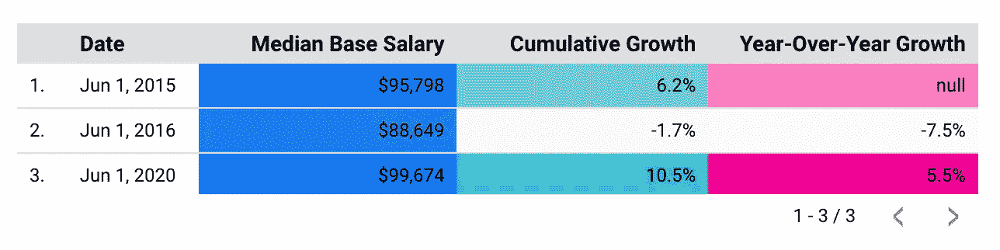

# 数据科学薪水的涨跌和再涨

> 原文：<https://towardsdatascience.com/the-rise-and-fall-and-rise-again-of-data-science-salaries-8350d872ba9d?source=collection_archive---------37----------------------->

## 意见

## 2015-2020 年数据科学薪资有怎样的变化，是什么原因造成的？


艾萨克·史密斯在[Unsplash](https://unsplash.com/s/photos/graph?utm_source=unsplash&utm_medium=referral&utm_content=creditCopyText)【1】上拍摄的照片。

# 目录

1.  介绍
2.  薪资和增长
3.  摘要
4.  参考

# 介绍

根据 Glassdoor 的就业市场报告[2]，在过去的五年里，美国数据科学的工资累计增长率在 12%之间波动。在这五年间，有几个月出现了大幅增加和减少。在本文中，我将概述这五年中特定月份和年份的关键指标，包括基本工资中位数、累计增长和同比增长。有些类似的职业，如软件工程，在同一时期也出现了稳步上升，所以注意数据科学工资的波动是很重要的。

我将推测为什么在每一个重要的时期，随着其相应的基本工资中位数的增加或减少。发生这些变化的原因有很多，观察数据科学工资(总计超过 10，000 美元)在月份和年份之间的差异很有意思。如果你想了解更多类似职位的工资信息，如数据分析师和软件工程师，你可以通过点击本文末尾的链接来参考相同的 Glassdoor 就业市场报告。

# 薪资和增长

我将在下面讨论数据科学薪资的涨跌和回升的关键指标。

## 升高

【2015 年 6 月

五年期的首次上涨是在 2015 年 6 月。本月的平均基本工资为**95，798 美元**，累计增长 **6.2%** 。这种增长可能有几个原因。虽然没有记录，但我可以推测是什么导致了累积工资增长的这种变化。

我认为，增长的峰值来自于公司意识到数据科学这一职业是多么强大和受欢迎。一旦公司雇佣越来越多的数据科学家，不仅对申请人来说，对雇主来说都变得更有竞争力。我在考虑，在这种情况下，2015 年，数据科学已经非常成熟，申请人在要求更高的工资时会更有信心，而公司在看到或听到这个职位在商业上取得的广泛成功后，会将更多预算分配给数据科学职业。

在某些情况下，您可能会争辩说，一名数据科学家可以通过 Python 等编程语言来执行通用流程自动化中两名分析师的功能，那么为什么不多付一个人一点钱，而不是从长远来看让两个人让您的企业付出更多成本呢？当然，所有的公司在某些方面都是不同的，他们各自的角色也是不同的，所以这可能是有益的，也可能是有害的。此外，数据分析师有时可能有相当不同的任务、流程和影响。

同样，这是第一次上升的指标:

```
*Rise of June 2015*median base salary: **$95,798**cumulative growth: **6.2%**
```

## 秋天

【2016 年 6 月

一旦公司雇佣了他们的第一个数据科学家，他们就会寻求雇佣更多的人。

> 也许这种趋势意味着他们已经有了一名高级数据科学家，下一个合理的选择是寻找一名初级数据科学家，可以用更低的工资收购。

2016 年 6 月的下降幅度相当大，基本工资中位数降至**88，649 美元**，累计增长 **-1.7%** ，同比增长 **-7.5%** 。是的，最后两个数据是阴性的。虽然我不确定工资大幅下降的原因，但我知道未来的日子会更好。作为一名数据科学家，我会创建一个数据集来隔离关键的重要特征，如下所示:

*   位置
*   人口统计学的
*   初级和高级角色的分布
*   数据科学和机器学习职位的拆分
*   薪资范围扩大
*   负面新闻
*   员工评估
*   预算削减
*   预算分配
*   报告工资时的错误
*   时事
*   通货膨胀
*   等等。

正如你所看到的，有几种不同的方式来剖析这种工资的下降。幸运的是，下跌没有持续很长时间，一个巨大的上涨将超过最初的上涨。以下是再次强调的指标:

```
*Fall of June 2016*median base salary: **$88,649**cumulative growth: **-1.7%**year-over-year growth: **-7.5%**
```

## 死而复生

【2020 年 6 月

过了几年才再次看到这种上升，最近一次发生在 2020 年 6 月。也许是在新冠肺炎，随着员工要求在家工作，或者被要求在家工作，技术角色变得更受关注。面向客户的角色可能会减少，因为许多新职位需要在家里通过视频会议平台单独完成。近 100，000 美元，本月数据科学家的基本工资中位数为**99，674 美元**，累计增长 **10.5%** ，同比增长 **5.5%** 。对于数据科学家来说，这种再次上升当然是个好消息。如果你还没有注意到，重要的是要注意到所有这些关键日期都在各自年份的 6 月份，也许这只是一个巧合，但知道为什么会出现这种趋势和模式会很有趣。

汇总信息在这里再次上升:

```
*Rise Again of June 2020*median base salary: **$99,674**cumulative growth: **10.5%**year-over-year growth: **5.5%**
```

# 摘要



作者 Google Data Studio 截图[3]。

为了便于查看，上图总结了关键日期及其各自的基本工资中位数、累计增长和同比增长指标。这个图表是在 Google Data Studio 中制作的，涵盖了本文中讨论的关键时间点。如果您想查看更多月份和年份的更详细的时间序列图，不仅包括数据科学统计数据，还包括其他技术位置统计数据，请访问下面参考资料部分中的 Glassdoor 链接。

至于数据科学薪酬的未来，随着疫情的出现，很难预测，曾经稳定的公司现在本身就不稳定。或许，随着越来越多的科技公司表现更好，数据科学的薪酬将会上升，或者随着越来越多的公司总体上出现下滑，薪酬将会下降。此外，数据科学职位可能很快会根据职位的具体要求提供或多或少的薪酬。例如，2025 年，数据科学家的基本工资中位数可能会降至 95，000 美元，而机器学习工程师的基本工资中位数可能会升至 105，000 美元。这种变化可能会导致公司需要更多地依赖模型的部署，减少面对面的互动。

在这篇文章中，我们讨论了数据科学工资的上涨、下跌和再次上涨。在过去的五年里，工资增长的这些变化有几个原因。请在下面随意评论为什么你认为这个工资中位数变化如此频繁。请记住，这种高度变化的趋势对于软件工程、系统工程和 web 开发人员等技术领域的类似职位来说是不一样的。

我希望你觉得我的文章有用而且有趣。谢谢你看我的文章！

# 参考

[1]照片由[艾萨克·史密斯](https://unsplash.com/@isaacmsmith?utm_source=unsplash&utm_medium=referral&utm_content=creditCopyText)在[Unsplash](https://unsplash.com/s/photos/graph?utm_source=unsplash&utm_medium=referral&utm_content=creditCopyText)(2018)上拍摄

[2]格拉斯门公司，[就业市场报告](https://www.glassdoor.com/research/job-market-report/)，(2008-2020 年)

[3] M.Przybyla，谷歌数据工作室截图，(2020)