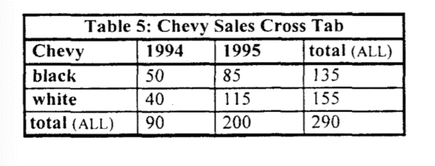
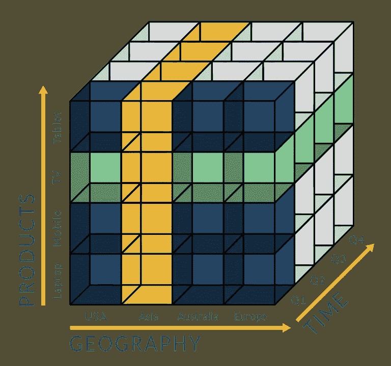
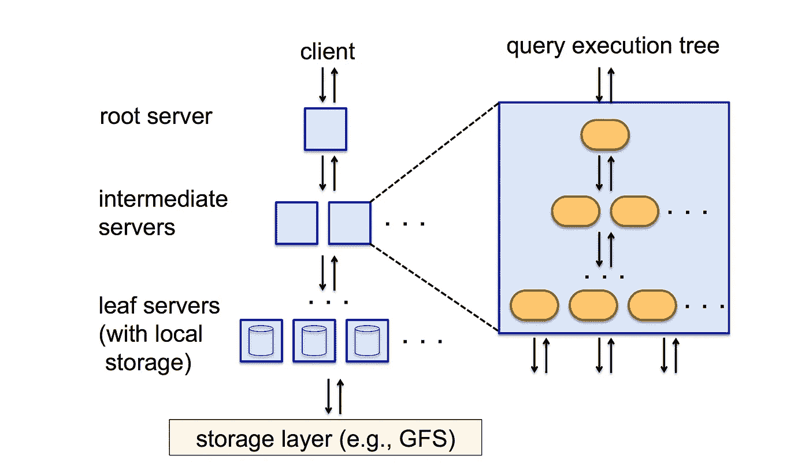
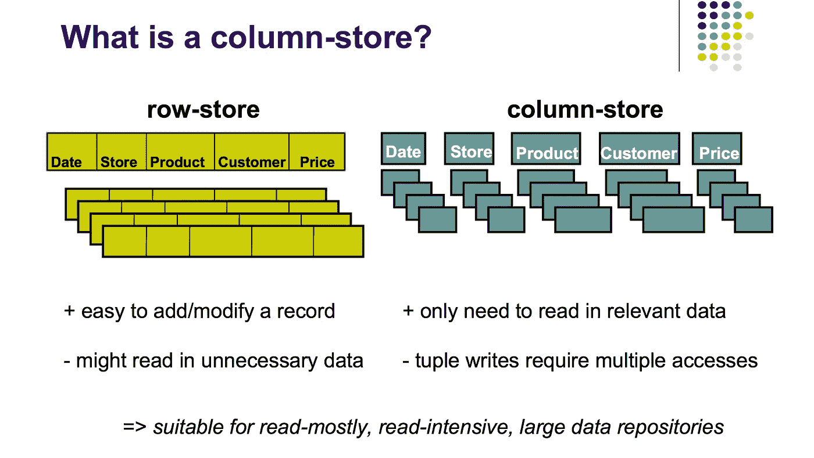

# OLAP 立方体的兴衰

> 原文：<https://towardsdatascience.com/the-rise-and-fall-of-the-olap-cube-10033b58f3a7?source=collection_archive---------24----------------------->

## 列数据库成本结构的变化如何影响从过去预先构建 OLAP 立方体到直接在数据库中运行 OLAP 工作负载的转变。


*照片由* [*克里斯蒂安·弗雷南*](https://unsplash.com/@christianfregnan) *来自 Unsplash*

*更新:对复杂的分析前景感到困惑？查看我们的书:* [*《分析设置指南》*](https://www.holistics.io/books/setup-analytics/?utm_source=medium&utm_campaign=olap) *。*

过去十年中，数据分析领域最大的转变之一是*从构建“数据立方体”或“OLAP 立方体”转向直接在列数据库上运行 OLAP*工作负载。*

(*OLAP 指的是在线分析处理，但我们一会儿会深入了解这意味着什么)。

OLAP 魔方的衰落是一个巨大的变化，尤其是如果你在过去三十年里一直从事数据分析工作。

这是一个巨大的变化，尤其是如果你在过去三十年里一直从事数据分析工作。在过去 50 年的商业智能中占主导地位的 OLAP 立方体正在消失，这可能对你来说很奇怪。您可能有理由怀疑这种向列数据库的转变。有哪些权衡？有哪些成本？这步棋真的有所有新厂商说的那么好吗？当然，在你的后脑勺有个声音在问:这是不是又一个会消失的时尚，就像之前的 NoSQL 运动一样？它会持续下去吗？

> OLAP 魔方的衰落是一个巨大的变化，尤其是如果你在过去三十年里已经在数据分析领域建立了自己的职业生涯。

这篇文章试图成为一个关于 OLAP 立方体的历史和发展的详尽的资源，以及当前远离它的转变。我们将从术语的定义(OLAP 与 OLTP)开始，涵盖 OLAP 立方体的出现，然后探索列数据仓库作为 OLAP 工作负载的替代方法的出现。

这篇文章是为新手写的。如果你是一个更有经验的数据分析人员，请随意跳过前几节，以便在这篇文章的结尾找到有趣的部分。让我们开始吧。

# OLAP 到底是什么？

在线分析处理(或 OLAP)是一个用来描述某一类数据库应用程序的时髦术语。这个术语是由数据库传奇人物 Edgar F. Codd 在 1993 年的一篇名为*向用户分析师提供 OLAP:一项 IT 任务*的论文[中发明的。](https://www.semanticscholar.org/paper/Providing-OLAP-to-User-Analysts%3A-An-IT-Mandate-Salley-Codd/a0bd1491a54a4de428c5eef9b836ef6ee2915fe7)

Codd 创造这个术语并不是没有争议的。在他发表论文的一年前，Arbor Software 发布了一款名为 Essbase 的软件产品，而且——惊喜，惊喜！— Codd 的论文定义的属性恰好完全符合 Essbase 的特性集*。*

*《计算机世界》杂志很快发现，为了更好地销售自己的产品，阿伯已经付钱给 Codd，让他“发明”OLAP 作为一种新的数据库应用。Codd 因为他的利益冲突而被点名，并被迫撤回他的论文…但似乎没有太大的影响:今天，Codd 仍然被认为是“关系数据库之父”，OLAP 从那以后一直作为一个类别存在。*

*那么 OLAP 的 T3 是什么样的 T2 呢你可能会问。解释这一点的最简单方法是描述两种类型的业务应用程序用法。假设你经营一家汽车经销商。您需要执行两种数据库支持的操作:*

1.  ***你需要使用数据库作为某些业务流程的一部分。**例如，您的销售人员向客户销售最新的本田思域，您需要在业务应用程序中记录该交易。您这样做是出于操作原因:您需要一种跟踪交易的方法，您需要一种在汽车贷款或保险最终获得批准时联系客户的方法，并且您需要它来计算月底销售人员的销售奖金。*
2.  *你使用数据库作为分析的一部分。你需要定期核对数据，以了解你的整体业务情况。在其 1993 年的论文中，Codd 称这种活动为“决策-支持”。这些问题包括“过去 3 个月伦敦售出了多少辆本田思域？”以及“谁是最高效的销售人员？”以及“轿车和 SUV 总体销量更好吗？”这些是你在月末或季度末问的问题，用来指导你近期的商业计划。*

*数据库使用的第一类被称为“在线事务处理”，或“OLTP”。数据库使用的第二类被称为“在线分析处理”，或“OLAP”。*

*或者，我喜欢这样想:*

*   *OLTP:使用数据库来运行您的业务*
*   *OLAP:利用数据库了解你的业务*

*为什么我们要区别对待这两类人？事实证明，这两种使用类型具有非常不同的数据访问模式。*

*使用 OLTP，您可以运行类似“记录一笔销售交易:2020 年 1 月 1 日伦敦分公司简·多伊的一辆本田思域”的操作。*

*有了 OLAP，你的查询会变得非常复杂:“给我过去 6 个月绿色本田 Civics 在英国的总销量”或“告诉我无名氏上个月卖了多少辆车”，以及“告诉我本田汽车这个季度与上个季度相比表现如何”？与前者的查询相比，后者的查询聚合了更多元素的数据。*

*在我们的汽车经销商的例子中，您可能能够在普通的关系数据库上运行 OLTP 和 OLAP 查询类型。但是如果你要处理大量的数据——例如，如果你要查询过去十年汽车销售的全球数据库——将你的数据从商业应用中分离出来进行分析*就变得很重要了。否则会导致严重的性能问题。**

# *OLAP 的绩效挑战*

*为了让您对我们正在讨论的各种性能困难有一个直观的认识，请想一想当您在汽车经销商处分析汽车销售时必须提出的问题。*

*   *给我过去 6 个月绿色本田 Civics 在英国的总销量*
*   *告诉我无名氏上个月卖了多少辆车*
*   *与上一季度相比，本季度我们售出了多少辆本田汽车？*

*这些查询可以减少到一些*维度*——我们想要过滤的属性。例如，您可能希望检索按以下方式聚合的数据:*

*   *日期(包括月、年和日)*
*   *汽车模型*
*   *汽车制造商*
*   *售货员*
*   *汽车颜色*
*   *交易金额*

*如果您将这些信息存储在典型的关系数据库中，您将被迫编写类似这样的内容来检索三维汇总表:*

```
***SELECT** **Model**, ALL, ALL, **SUM**(Sales)
**FROM** Sales
**WHERE** **Model** = 'Civic' 
**GROUP** **BY** **Model**
**UNION**
**SELECT** **Model**, **Month**, ALL, **SUM**(Sales)
**FROM** Sales
**WHERE** **Model** = 'Civic' 
**GROUP** **BY** **Model**, **Year**
**UNION**
**SELECT** **Model**, **Year**, Salesperson, **SUM**(Sales)
**FROM** Sales
**WHERE** **Model** = 'Civic' 
**GROUP** **BY** **Model**, **Year**, Salesperson;*
```

*一个三维卷需要 3 个这样的联合。这是可概括的:结果是 N 维上的聚合需要 N 个这样的联合。*

*你可能认为这已经很糟糕了，但这还不是最糟糕的例子。比方说，你想做一个交叉制表，或者 Excel power 用户所说的“数据透视表”。交叉制表的示例如下:*

**

*照片取自[本文](https://ieeexplore.ieee.org/document/492099)*

*交叉制表需要更复杂的联合和`GROUP BY`子句的组合。例如，六维交叉制表需要 64 个不同的`GROUP BY`操作符的 64 路联合来构建底层表示。在大多数关系数据库中，这会导致 64 次数据扫描、64 次排序或散列，以及非常长的等待时间。*

*商业智能从业者很早就意识到，对大型 OLAP 工作负载使用 SQL 数据库不是一个好主意。更糟糕的是，在过去，计算机并不是特别强大:例如，在 1995 年，1GB 的内存价格为 32，300 美元——对于我们今天认为理所当然的内存量来说，这是一个疯狂的价格！这意味着绝大多数业务用户不得不使用相对较小的内存来运行 BI 工作负载。因此，早期的 BI 实践者确定了一个通用的方法:从关系数据库中只获取你需要的数据，然后将它放入一个有效的内存数据结构中进行操作。*

# *OLAP 魔方的崛起*

*进入 OLAP 立方体，也称为数据立方体。*

*OLAP 魔方源于计算机编程中的一个简单想法*

*OLAP 魔方源于编程中的一个简单想法:获取数据并将其放入所谓的“二维数组”中，也就是一个列表的列表。这里的自然进展是，您想要分析的维度越多，您使用的嵌套数组就越多:三维数组是列表的列表的列表，四维数组是列表的列表的列表，等等。因为嵌套数组存在于所有主要的编程语言中，所以将数据加载到这种数据结构中的想法对于早期 BI 系统的设计者来说是显而易见的。*

*但是，如果您想要对远远大于计算机可用内存的数据集进行分析，该怎么办呢？早期的 BI 系统决定做下一件合乎逻辑的事情:它们聚集然后缓存嵌套数组中的数据子集——偶尔将嵌套数组的部分持久存储到磁盘。今天，“OLAP 立方体”特指这些数据结构远远超过主机主内存大小的环境，例如数万亿字节的数据集和图像数据的时间序列。*

**

*OLAP 魔方的影响是深远的——并且改变了商业智能的实践直到今天。首先，几乎所有的分析都是在这样的立方体中进行的。这反过来意味着，每当需要新的报告或新的分析时，通常都必须创建新的多维数据集。*

*假设您想要运行一个按省份划分的汽车销售报告。如果您当前可用的多维数据集不包含省份信息，您必须要求数据工程师为您创建一个新的 OLAP 多维数据集，或者要求她修改现有的多维数据集以包含此类省份数据。*

*OLAP 立方体的使用也意味着数据团队必须管理复杂的管道来将数据从 SQL 数据库转换到这些立方体中。如果您正在处理大量的数据，这样的转换任务可能需要很长时间才能完成，因此一个常见的做法是在分析师开始工作之前运行所有的 ETL(提取-转换-加载)管道。这样，分析师就不需要等待他们的立方体加载最新的数据——他们可以让计算机在晚上处理数据，并在早上立即开始工作。当然，随着公司全球化，并在多个时区开设办事处，要求访问相同的分析系统，这种方法变得越来越有问题。(当你的夜晚是另一个办公室的早晨时，你如何在“夜晚”运行你的管道？)*

*以这种方式使用 OLAP 多维数据集还意味着 SQL 数据库和数据仓库必须以更容易创建多维数据集的方式进行组织。例如，如果你在过去的二十年里成为了一名数据分析师，那么你很有可能受过神秘艺术的训练，比如金博尔维度建模、T2、蒙氏实体关系建模、T4 数据仓库建模。这些花哨的名称只是组织数据仓库中的数据以满足企业分析需求的简单方法。*

*Kimball，Inmon 和他们的同事观察到，特定的访问模式发生在每个企业。他们还观察到，考虑到数据团队为报告创建新的多维数据集所花费的时间，草率的数据组织方法是一个糟糕的想法。最终，这些早期的实践者开发了可重复的方法，将业务报告需求转化为数据仓库设计——这种设计将使团队更容易以他们的 OLAP 立方体所需的格式提取他们所需的数据。*

*这些限制在过去四十年的大部分时间里塑造了数据团队的形式和功能。重要的是要理解，非常真实的技术限制导致了 OLAP 立方体的产生，而 OLAP 立方体的需求导致了我们今天认为理所当然的数据团队实践的出现。例如，我们:*

*   *维护复杂的 ETL 管道，以便对我们的数据建模。*
*   *雇佣一个庞大的数据工程师团队来维护这些复杂的管道。*
*   *根据 Kimball 或 Inmon 或 Data Vault 框架对数据进行建模，以便更容易地将数据提取和加载到多维数据集中。(即使我们已经脱离了多维数据集，我们仍然保持这些做法，以便将数据*加载到*分析和可视化工具中——不管它们是否建立在多维数据集之上。)*
*   *让大型数据工程师团队也维护第二组管道(从建模数据仓库到立方体)。*

*然而今天，导致创建数据立方体的许多约束已经有所松动。电脑更快。内存便宜。云起作用了。数据从业者开始意识到 OLAP 立方体自身也存在一些问题。*

# *枯萎 OLAP 魔方*

*让我们暂时假设我们生活在一个内存廉价、计算能力唾手可得的世界。让我们假设在这个世界中，SQL 数据库足够强大，可以同时支持 OLTP 和 OLAP。这个世界会是什么样子？*

> *当您可以简单地在现有的 SQL 数据库中编写查询时，为什么还要花费额外的步骤来构建和生成新的多维数据集呢？*

*首先，我们可能会停止使用 OLAP 立方体。这是显而易见的:当您可以简单地在现有的 SQL 数据库中编写查询时，为什么要费心去经历构建和生成新的多维数据集的额外步骤呢？如果您需要报告的数据可以盲目地从您的 OLTP 数据库复制到您的 OLAP 数据库，为什么还要费心维护一个复杂的管道呢？除了 SQL 之外，为什么还要费心培训您的分析师呢？*

*这听起来像是一件小事，但事实并非如此:我们已经从分析师那里听到了许多可怕的故事，他们不得不依赖数据工程师来构建多维数据集，并为每个新的报告需求建立管道。如果在这种情况下你是一名分析师，你会觉得无力在截止日期前完成任务。你的商业用户会阻止你；你会阻止你的数据工程师；您的数据工程师很可能正在努力应对数据基础架构的复杂性。这对谁都不好。最好完全避免复杂性。*

*第二，如果我们生活在另一个世界，那里计算成本低廉，内存充足……那么，我们将放弃严肃的数据建模工作。*

*这听起来很荒谬，除非你从基本原则的角度去思考。我们根据 Kimball 或 Inmon 等严格的框架对数据进行建模，因为我们必须定期为我们的分析构建 OLAP 立方体。从历史上看，这意味着一个严肃的模式设计时期。这也意味着，随着业务需求和数据源的变化，为了在我们的仓库中维护这种设计，我们需要做大量的繁忙工作。*

*但是如果您不再使用 OLAP 立方体进行分析，那么您就不再需要定期从数据仓库中提取数据。如果您不再需要定期从数据仓库中提取数据，那么就没有理由将您的数据仓库模式视为珍贵的东西。毕竟，如果您可以通过在您的数据仓库中创建新的“模型化”表或物化视图来“模型化”数据，那么当您需要它时，为什么还要做这些忙碌的工作呢？这种方法具有传统数据建模的所有功能优势，而没有设计和维护 Kimball 风格模式时的仪式或复杂性。*

*让我们讨论一个具体的例子:假设你认为你的模式是错误的。你是做什么的？在我们的另一个世界中，这个问题很容易解决:您可以简单地转储表格(或丢弃视图)并创建新的表格。由于您的报告工具直接连接到您的分析数据库，这导致了很少的中断:您不必重写一套复杂的管道或改变创建多维数据集的方式——因为您*首先没有任何多维数据集要创建。**

# *一种新的范式出现了*

*好消息是这个平行宇宙不是平行宇宙。这就是我们今天生活的世界。*

*我们是怎么到这里的？据我所知，在过去的二十年里有三个突破——其中两个很容易理解。我们将首先处理这两个问题，然后详细探讨第三个问题。*

*第一个突破是摩尔定律的一个简单结果:计算和内存已经成为真正的商品，而且现在都便宜得离谱，并且很容易通过云获得。今天，任何持有有效信用卡的人都可以去 [AWS](https://aws.amazon.com/) 或[谷歌云](https://cloud.google.com/)，几分钟内就有一个任意强大的服务器为他们运转起来。这一事实也适用于基于云的数据仓库——公司能够以几乎为零的固定成本存储和分析庞大的数据集。*

*第二个突破是，大多数现代的基于云的数据仓库都有所谓的*大规模并行处理* (MPP)架构。MPP 数据库开发背后的核心观点实际上非常容易理解:如果您将查询分布在数百台甚至数千台机器上，您将不会受到单台计算机的计算能力和内存的限制，而是可以从根本上提高查询的性能。然后，这些机器将处理它们的查询部分，并将结果向上传递，以便聚合成最终结果。所有这些工作的结果是您获得了荒谬的性能改进:例如，Google 的 BigQuery 能够在没有索引的情况下对 3 . 14 亿行执行完整的正则表达式匹配，并在 10 秒内返回结果( [source](https://cloud.google.com/files/BigQueryTechnicalWP.pdf) )。*

**

*摘自[“深入了解谷歌大查询”](https://cloud.google.com/files/BigQueryTechnicalWP.pdf)*

*说“啊，MPP 数据库是一个东西”很容易，但是至少有 40 年的工作才使它成为今天的现实。例如，在 1985 年，数据库传奇人物迈克尔·斯通布雷克发表了一篇名为 [*无共享的案例*](https://citeseerx.ist.psu.edu/viewdoc/download?doi=10.1.1.58.5370&rep=rep1&type=pdf) 的论文——认为 MPP 数据仓库的最佳架构是处理器之间不共享任何东西的架构。几位研究者反驳了这一观点，用 [*无事生非*](https://dl.acm.org/doi/10.1145/234889.234892) 于 1996 年发表；我的观点不是说斯通布莱克是对的，他的批评者是错的；要指出的是，在开始时，即使是像“分布式数据仓库是否应该让它的计算机共享内存或存储？”是一个需要调查的公开问题。(如果你好奇的话:这个问题的答案是“基本上没有”)。*

*第三个突破是柱状数据仓库的发展和普及。这个概念上的突破实际上是三个中更重要的，它解释了为什么 OLAP 工作负载可以从多维数据集转移回数据库。如果我们想了解商业智能的未来，我们应该理解这是为什么。*

*典型的关系数据库以行的形式存储数据。例如，交易的单个行将包含字段`date`、`customer`、`price`、`product_sku`等等。但是，列式数据库将这些字段分别存储在不同的列中。如下图所示(摘自 Harizopoulos、Abadi 和 Boncz 的 2009 年[演讲):](http://www.cs.umd.edu/~abadi/talks/Column_Store_Tutorial_VLDB09.pdf)*

**

*摘自 Harizopoulos、Abadi 和 Boncz 于 2009 年发表的演讲*

*虽然 OLAP 多维数据集要求您将感兴趣的维度的子集加载到多维数据集中，但是列数据库允许您以同样好的性能水平执行类似的 OLAP 类型的工作负载，而不需要提取和构建新的多维数据集。换句话说，这是一个非常适合 OLAP 工作负载的 SQL 数据库。*

*列数据库是如何实现如此高的性能的？事实证明，将数据存储在列中有三个主要好处:*

1.  ***列型数据库具有更高的读取效率。**如果您正在运行一个类似“给我过去 5 年所有交易的平均价格”的查询，一个关系数据库将不得不加载前 5 年的所有行，即使它只是想聚集价格字段；列式数据库只需检查一列——价格列。这意味着列数据库只需筛选总数据集大小的一部分。*
2.  ***列数据库也比基于行的关系数据库压缩得更好。**事实证明，当你将相似的数据存储在一起时，你可以比存储完全不同的信息更好地压缩数据。(在信息论中，这就是所谓的“低熵”)。提醒一下，列数据库存储数据的*列*——意味着具有相同类型和相似值的值。与行数据相比，这要容易压缩得多，即使在读取值时会以一些计算(某些操作中的解压缩)为代价。但总的来说，这种压缩意味着当您运行聚合查询时，可以将更多的数据加载到内存中，从而导致更快的整体查询。*
3.  *最后一个好处是，列数据库中的压缩和密集打包释放了空间，这些空间可用于对列中的数据进行排序和索引。换句话说，**列数据库具有更高的排序和索引效率**，这更多是因为强压缩带来了一些剩余空间。事实上，这也是互利的:研究列数据库的研究人员指出，排序的数据比未排序的数据压缩得更好，因为排序降低了熵。*

*所有这些属性的最终结果是，列数据库为您提供了类似 OLAP 立方体的性能，而没有显式设计(和构建)的痛苦！)立方体。这意味着您可以在您的数据仓库中执行*您需要的一切，并跳过多维数据集维护带来的繁重工作。**

*但是，如果有一个缺点，那就是列数据库中的更新性能非常糟糕(为了更新一个“行”，您必须访问每一列)；因此，许多现代列数据库限制了您在存储数据后更新数据的能力。例如，BigQuery 根本不允许您更新数据——您只能将新数据写入仓库，而不能编辑旧数据。(更新:最初的 Dremel 论文解释说 BigQuery 有一个仅追加的结构；从 2016 年起不再如此)。*

# *结论*

*所有这些发展的结果是什么？我之前在撰写《另一个世界》时所做的两个预测正在慢慢成为现实:较小的公司不太可能考虑面向数据立方体的工具或工作负载，严格的维度建模随着时间的推移已经变得不那么重要。更重要的是，亚马逊、Airbnb、优步和谷歌等精通技术的公司已经完全拒绝了数据立方体范式；这些事件和更多的事件告诉我，我们将看到这两种趋势在未来十年蔓延到企业中。*

*然而，我们才刚刚开始这种变化。未来可能就在眼前，但分布不均。这是意料之中的:MPP 列数据库只出现了十年左右(BigQuery 于 2010 年推出，Redshift 于 2012 年推出)，我们只看到利用这种新范式的工具(如 Looker、dbt 和 Holistics)在前十年中期出现。一切都还为时过早——在大型企业抛弃他们遗留的、受立方体影响的系统并转向新系统之前，我们还有很长的路要走。*

*如果您是 BI 服务提供商，您可能会对这些趋势感兴趣，但让我们稍微关注一下这些趋势对您职业生涯的影响。如果你是一名数据专业人士，而 OLAP 立方体正在衰落，这对你意味着什么？*

*在我看来，你必须滑向冰球所在的地方:*

*   *主 SQL 大多数 MPP 列数据库已经将 SQL 作为事实上的查询标准。(更多关于这个[这里](https://www.holistics.io/blog/the-rise-of-sql-based-data-modeling-and-dataops/))。*
*   *对那些深陷 OLAP 魔方工作流程的公司持怀疑态度。(在这里学习如何做这个)。*
*   *让自己熟悉列数据库时代的建模技术(Chartio 可能是我见过的第一家有这方面指南的公司；阅读此处的…但要明白这相对较新，最佳实践可能仍在变化。*
*   *尽可能使用 ELT(相对于 ETL)；这是新范式的[结果。](https://www.holistics.io/blog/etl-vs-elt-how-elt-is-changing-the-bi-landscape/)*
*   *研究 Kimball、Inmon 和 data vault 方法，但着眼于在新范式中的应用。了解他们每种方法的局限性。*

*我开始这篇文章时，重点关注 OLAP 魔方，以此来理解商业智能历史上的一项核心技术。但事实证明，立方体的发明对我们在这个行业中看到的几乎所有东西都有影响。注意它的衰落:如果你没有从这件作品中学到什么，就让它这样吧:OLAP 魔方的兴衰对你的职业生涯比你最初想象的更重要。*

****跟进:*** *我们已经发布了一个跟进帖子，标题为:* [*OLAP！= OLAP 魔方*](https://www.holistics.io/blog/olap-is-not-olap-cube/) *。**

# *来源*

1.  *[*https://en.wikipedia.org/wiki/Data_cube*](https://en.wikipedia.org/wiki/Data_cube)*
2.  **金博尔、罗斯、* [*数据仓库工具包*](https://www.amazon.com/Data-Warehouse-Toolkit-Complete-Dimensional/dp/0471200247)*
3.  *[*大数据和 Hadoop 时代的维度建模和金博尔数据集市*](https://sonra.io/2017/05/15/dimensional-modeling-and-kimball-data-marts-in-the-age-of-big-data-and-hadoop/)*
4.  *[*数据立方体:概括分组依据、交叉表和小计的关系聚集运算符*](https://ieeexplore.ieee.org/document/492099) *(Gray，Bosworth，Lyaman，Pirahesh，1997)**
5.  **Cuzzocrea A .(2010)*[*OLAP 数据立方体压缩技术:十年历史*](https://link.springer.com/chapter/10.1007/978-3-642-17569-5_74) *。参加人:Kim T，Lee Y，Kang BH。，lzak d .(eds)未来一代信息技术。FGIT 2010。计算机科学讲义，第 6485 卷。施普林格、柏林、海德堡**
6.  *[*OLAP:过去现在未来？*](https://sonra.io/2017/05/15/dimensional-modeling-and-kimball-data-marts-in-the-age-of-big-data-and-hadoop/)*
7.  *[*一事无成*](https://citeseerx.ist.psu.edu/viewdoc/download?doi=10.1.1.58.5370&rep=rep1&type=pdf) *，*，[，*无事生非*，](https://dl.acm.org/doi/10.1145/234889.234892)，*(诺曼、祖雷克、塔尼西)**
8.  **关于 big query:The*[*dremmel paper*](https://static.googleusercontent.com/media/research.google.com/en//pubs/archive/36632.pdf)*[*big query 中计算与存储的分离*](https://cloud.google.com/blog/products/gcp/separation-of-storage-and-compute-in-bigquery)*[*big query 下的*](https://cloud.google.com/blog/products/gcp/bigquery-under-the-hood)*[*一个内幕请看 BigQuery*](https://cloud.google.com/files/BigQueryTechnicalWP.pdf) *白皮书。*****
9.  **[*并行数据库系统:未来的高性能数据库处理*](http://pages.cs.wisc.edu/~dewitt/includes/paralleldb/cacm.pdf) *(德威特&格雷，1992)***
10.  **[](http://www.cs.umd.edu/~abadi/talks/Column_Store_Tutorial_VLDB09.pdf)**(Harizopoulos，Abadi and Boncz，2009)****