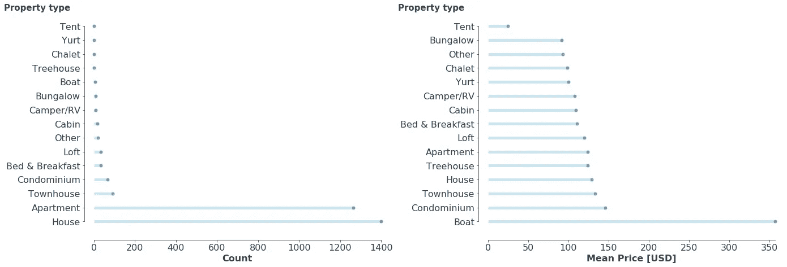
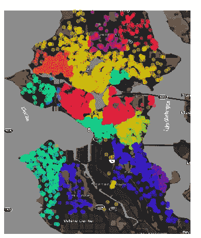
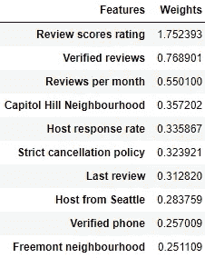
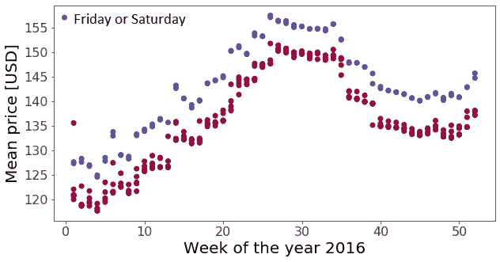

# Airbnb 在西雅图的崛起:数据科学方法

> 原文：<https://towardsdatascience.com/the-rise-of-airbnb-in-seattle-a-data-science-approach-974eda461106?source=collection_archive---------32----------------------->

图片来自 wikipedia.org

Airbnb 是世界上大多数主要城市中最常用的找住处的方法之一。它极大地改变了寻找短期甚至长期住宿的传统方式。

西雅图是美国的主要城市之一，因此也是 Airbnb 用户的热门地点之一。仅在 2016 年，西雅图就完成了近**百万份预订**。

在这篇文章中，我将对西雅图的 [Airbnb 数据集进行深入分析。该分析仅通过 Python 3 执行，用于执行该分析的代码可以在](http://insideairbnb.com/get-the-data.html) [my Github](https://github.com/hnbezz/Portfolio) 中找到。通过分析数据，我想回答四个不同的问题:

*   Airbnb 在西雅图的这些年是如何增长的？
*   与超级主持人最相关的特征是什么？
*   主持人如何在不花钱的情况下增加自己成为超级主持人的几率？
*   一年中什么时候去西雅图最便宜？

# **描述性分析**

本次分析使用了两个数据集:

*   列表-西雅图可用列表的详细描述，从 2008 年开始。该表包含 3818 个列表和 98 个特征，包括连续特征(如价格、纬度、经度等。)，离散的(比如主机响应时间，床位数，卫生间数等。)和分类的(例如，如果主机是“超级主机”，邻居，这是主机验证，等等。).
*   日历—提供列表 ID、日期(如果列表在该特定日期被预订)以及预订价格的表格。该数据集包括近 100 万个不同的预订。

下表显示了经过一些小的预处理后的列表数据的快速描述。

从 2008 年开始在西雅图可用的列表的描述性分析。

数据显示最低价格为 22 美元，最高价格为 1000 美元。还有一个离谱的**5000 美金的保证金。**此外，我们看到，平均而言，主机响应率相当高(平均值为 95%)。审查分数等级通常也很高，但是，最低值是 40(满分为 100)。有趣的是,**有 0(零！！)卫生间。**当然，这可能是由于来自主机的错误条目。

有几种不同类型的财产，从船和阁楼到帐篷(！).以下是不同房产数量的大致情况，以及每种房产的平均价格。有趣的是，普通的*树屋* *比阁楼*还要大。！).此外，绝大多数(约 90%)房源要么是房子，要么是公寓。

# **Airbnb 在西雅图暴涨**

下面我制作了一张 GIF 图，展示了从 2008 年到 2015 年 Airbnb 房源数量的增长。很明显，大部分房源都在西雅图的中心区域。

现在用颜色区分各个街区，我们可以看到一些街区的房源非常密集，而另一些则很稀疏。这可能是由于几个不同的原因，例如它是否靠近市中心、生活成本、可居住的地方(例如工业区没有**列表)。**

# 与超级主持人最相关的特征是什么？

为了评估对成为超级主机的因子分解影响最大的特征，进行了两种类型的数据分析:使用 Tensorflow 库的深度神经网络和使用 scikit-learn 库的逻辑回归。长话短说，通过将数据应用于神经网络，我能够以大约 80%的准确度建模、验证和测试模型，而通过简单的逻辑回归，我能够达到大约 78%的准确度。

有许多因素会影响这种相对较低的准确性，但肯定的是，列表的小数据集(预处理后不到 3000 个列表)不允许更好的准确性。尽管如此，该模型确实给了我们一个对影响超级主机选择的主要特征的良好估计，这些特征可以在下表中看到。

从表中可以清楚地看出，最重要的特征是 1)评审分数评级；2)经核实的审查和 3)每月审查。所有这些都是基于用户的，意味着用户(列表的客人)、列表(即房屋、公寓、阁楼等)和主人之间的交互。这些都是相当明显的，但是，重要的是要了解他们的重量差异。例如，有经过验证的评论比经过验证的电话号码重要两倍。

此外，如果最近的审查是最近完成的，这也是一个加分。如果主持人住在西雅图，这也增加了超级主持人的价值。令人惊讶的是，如果主持人有严格的取消政策，这也被视为会导致成为超级主持人的事情。

## 现在问题来了:主持人如何在不花钱的情况下增加自己成为超级主持人的几率？

从前面描述的逻辑回归中，我可以得出一些关于增加成为超级主持人的概率而不需要额外花钱的结论:

*   尽可能快地回答客人的问题:结果显示主人回答客人的问题越快越好。
*   不要对潜在顾客的问题置之不理。
*   有严格的取消政策。
*   如果可能的话，试着列出你所在城市的房产。
*   进行尽可能多的验证，比如你的电话、电子邮件、身份等。经 Airbnb 核实。
*   尽你所能描述你的财产。

# 一年中什么时候去西雅图最便宜？

我使用之前描述的日历数据集来分析一年中去西雅图旅游最便宜的时间段。下图总结了数据，显示了每天的平均价格与一年中一周的函数关系。

从 1 月 1 日开始是第 0 周，很明显，冬天是一年中在 Airbnb 住宿花费最少的时候。但是，也很冷。:(

另一点是，周末全年都比较贵，与工作日的平均差价约为每天 7 美元。

# 结论

Airbnb 在西雅图的市场增长迅猛。这里显示的分析显示了西雅图上市的一些趋势。此外，它还描绘了一些技巧，以增加成为超级主持人的机会，而不花任何钱。我以一些一年中游览西雅图的最佳时间的评论结束了这篇文章。

*我目前正在寻求更换运营商，试图进入数据科学市场。请随时查看我在 https://www.linkedin.com/in/henrique-neves-bez-50a64157/ T2 的 LinkedIn。*

## 承认

*我要感谢* [*Simone Centellegher，他在他的 Github*](https://scentellegher.github.io/visualization/2018/10/10/beautiful-bar-plots-matplotlib.html) *上提供了一种绘制条形图的美丽方式，我通常觉得这很枯燥。链接将于 2020 年 1 月 27 日开通。*