# 机器学习的数学路线图

> 原文：<https://towardsdatascience.com/the-roadmap-of-mathematics-for-deep-learning-357b3db8569b?source=collection_archive---------0----------------------->

除非另有说明，图片由作者提供

## 从头开始理解神经网络的内部运作

了解机器学习算法背后的数学是一种超能力。如果您曾经为现实生活中的问题构建过模型，您可能会体验到，如果您想要超越基线性能，熟悉细节会大有帮助。当你想突破艺术的极限时，尤其如此。

然而，这些知识大部分都隐藏在层层高等数学的背后。理解像随机梯度下降这样的方法似乎很困难，因为它是建立在多变量微积分和概率论之上的。

不过，有了适当的基础，大多数想法都可以被视为相当自然。如果你是一个初学者，不一定受过高等数学的正规教育，为自己创建一个课程是很难的。在这篇文章中，我的目标是提出一个路线图，带你从绝对零度到深入理解神经网络如何工作。

为了简单起见，我们的目标不是涵盖所有内容。相反，我们将专注于获得我们的方向。这样，如果需要的话，你将能够毫无困难地学习其他主题。

与其一口气读完，我建议你把这篇文章作为学习的参考点。深入介绍一个概念，然后检查路线图，继续前进。我坚信这是最好的学习方式:我给你指路，但你必须走下去。

# 基本面

大多数机器学习建立在三个支柱之上:**线性代数**、**微积分**和**概率论**。因为最后一个建立在前两个的基础上，所以我们应该从它们开始。微积分和线性代数可以独立学习，就像标准课程中通常的情况一样。

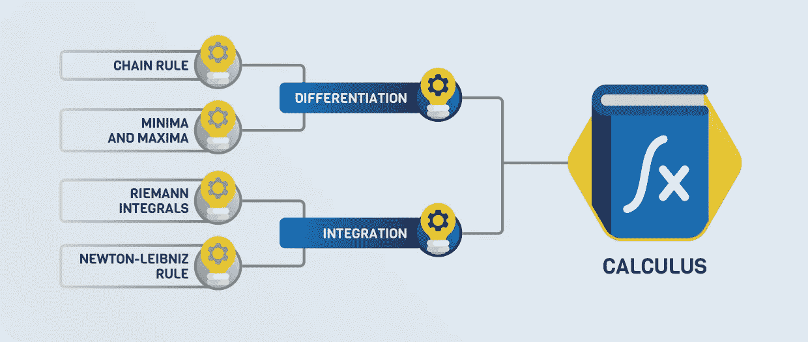

# 结石

微积分是研究函数的*微分*和*积分*的学问。本质上，神经网络是一个可微函数，所以微积分将是训练神经网络的基本工具，正如我们将看到的。

为了熟悉这些概念，你应该把事情简单化，第一次学习单个变量的函数。根据定义，函数的导数由下式定义

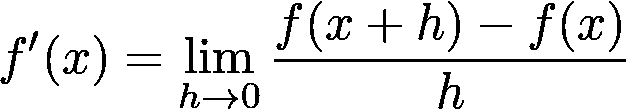

其中给定的 *h* 的比值是点 *(x，f(x))* 和 *(x+h，f(x+h))* 之间的直线斜率。

在极限情况下，这基本上是点 *x* 处切线的斜率。下图说明了这个概念。

可视化函数的导数

微分可以用来优化函数:导数在局部极大值或极小值处为零。(然而，在另一个方向上却不是这样；在 *0* 处见 *f(x) = x* 。)导数为零的点称为*临界点*。临界点是最小值还是最大值可以通过查看*二阶导数*来决定:

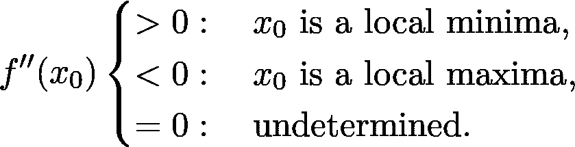

关于差异化有几个基本规则，但可能最重要的是所谓的*链式规则*:

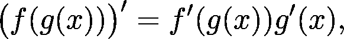

这告诉我们如何计算复合函数的导数。

积分通常被称为微分的逆运算。这是真的，因为

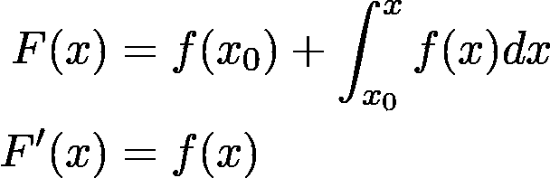

这适用于任何可积函数 *f(x)* 。函数的积分也可以认为是曲线下的带符号面积。举个例子，

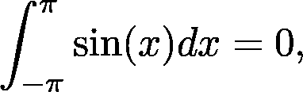

因为当函数为负时，那里的面积也有一个负号。

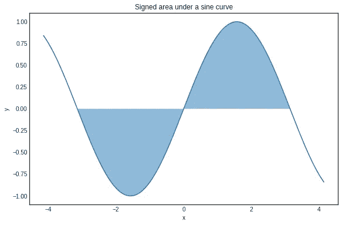

-π和π之间正弦曲线下的有符号面积

积分本身在理解期望值的概念中起作用。例如，像熵和 Kullback-Leibler 散度这样的量是用积分来定义的。

## **深造**

我会推荐麻省理工学院的[单变量微积分课程。(总的来说，麻省理工学院的在线课程总是很好的学习资源。)如果你更多的是一个书的人，有很多教材可供选择。之前提到的课程附带的 Gilbert Strang 的微积分书也是一个很好的资源，完全免费。](https://www.youtube.com/playlist?list=PL590CCC2BC5AF3BC1)

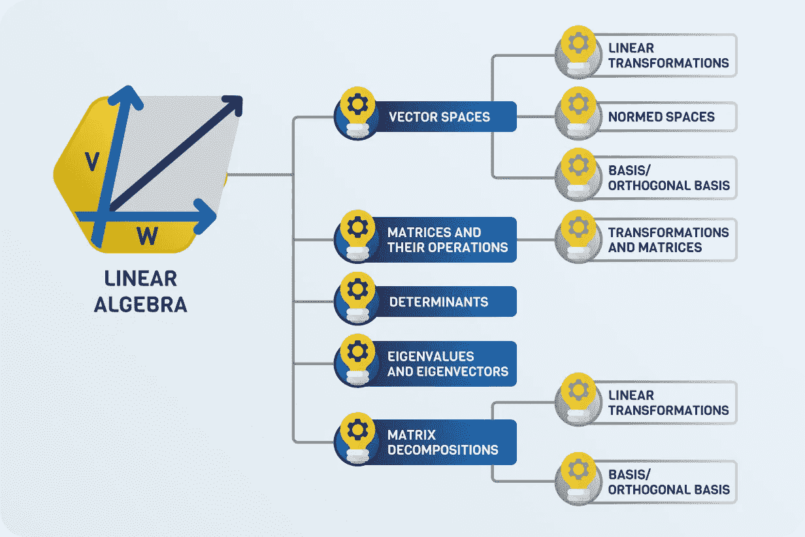

# 线性代数

正如我提到的，神经网络本质上是使用微积分工具训练的函数。然而，它们是用类似矩阵乘法的线性代数概念来描述的。

线性代数是一个庞大的学科，有许多机器学习的基本方面，所以这将是一个重要的部分。

## 向量空间

为了更好地理解线性代数，我建议从向量空间开始。我们最好先讨论一个特例。你可以把平面上的每个点想象成一个元组

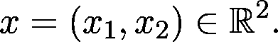

这些基本上是从零指向 *(x₁，x₂)* 的向量。您可以将这些向量相加，并与标量相乘:

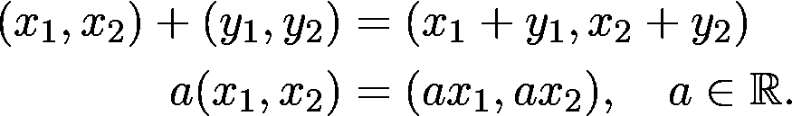

这是向量空间的原型模型。一般来说，一组向量 *V* 是实数上的向量空间，如果你可以将向量加在一起并将向量与实数相乘，则以下性质成立:

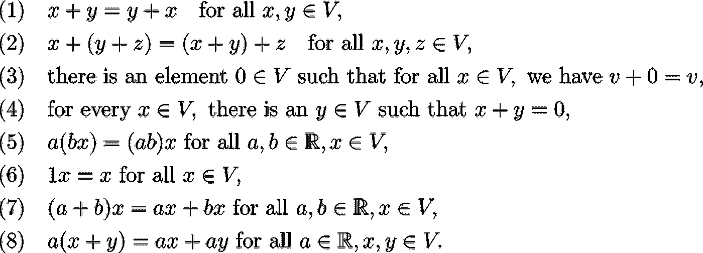

不要慌！我知道这看起来很可怕(至少在我还是数学专业的大一学生时是这样)，但事实并非如此。这些只是保证了向量可以像你期望的那样相加和缩放。当考虑向量空间时，如果你把它们想象成

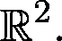

## **赋范空间**

如果你觉得你对向量空间有很好的理解，下一步应该是理解如何测量向量的大小。默认情况下，向量空间本身没有为此提供工具。在飞机上你会怎么做？你可能已经知道，在那里，我们有

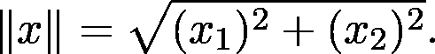

这是一个*规范*的特例。一般来说，如果存在函数，向量空间 *V* 就是赋范的

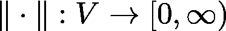

叫做 norm

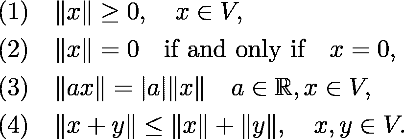

这可能有点吓人，但这是一个简单而重要的概念。有很多规范，但最重要的是 p-norm 家族

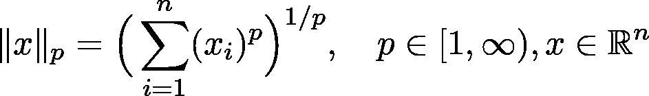

(用 *p = 2* 我们得到上面提到的特例)和*上确界范数*

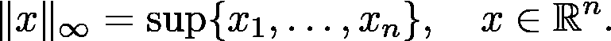

有时，像对于 *p = 2* ，范数来自所谓的*内积*，这是一个双线性函数

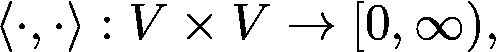

到这样的程度

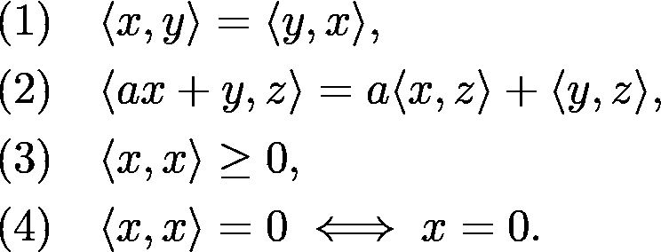

有内积的向量空间叫做*内积空间*。一个例子是经典的欧几里得乘积

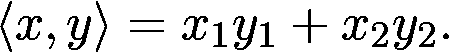

每一个内积都可以通过

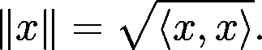

当两个向量的内积为零时，我们说这两个向量彼此正交。(尽量在飞机上拿出一些具体的例子，更深入的理解概念。)

## **基和正交/标准正交基**

虽然向量空间是无限的(在我们的例子中)，但你可以找到一个有限的向量集，它可以用来表示空间中的所有向量。例如，在飞机上，我们有

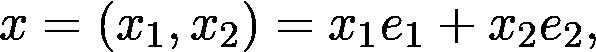

在哪里

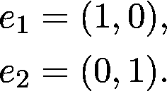

这是基和标准正交基的特例。

一般来说，*基*是向量的最小集合

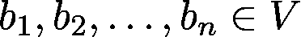

使得它们的线性组合跨越向量空间:

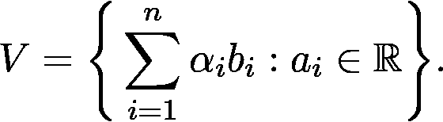

任何向量空间都有一个基。(它可能不是一个有限集，但我们现在不应该关心这个。)毫无疑问，当谈到线性空间时，基大大简化了事情。

当一个基中的向量相互正交时，我们称之为*正交基*。如果一个正交基的每个基向量的范数是 1，我们说它是*正交的*。

## 线性变换

与向量空间相关的关键对象之一是*线性变换*。如果你以前见过神经网络，你会知道基本的构建模块之一是形式的层

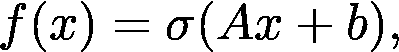

其中 *A* 是矩阵*，b* 和 *x* 是向量， *σ* 是 sigmoid 函数。(或者任何激活功能，真的。)嗯，部分 *Ax* 是线性变换。一般来说，该功能

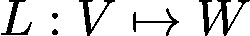

是向量空间 *V* 和 *W* 之间的线性变换

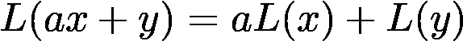

适用于所有的 *x，y* 中的 *V* ，以及所有的 *a* 实数。

举一个具体的例子，在平面上绕原点的旋转是线性变换。

毫无疑问，关于线性变换最重要的事实是，它们可以用矩阵来表示，这一点你会在接下来的学习中看到。

## **矩阵及其运算**

如果线性变换是清楚的，你可以转向矩阵的研究。(线性代数课程往往从矩阵开始，但我会推荐这样做，原因稍后解释。)

矩阵最重要的运算是矩阵乘积。一般来说，如果 *A* 和 *B* 是由下式定义的矩阵

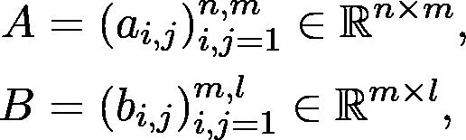

那么他们的产品可以通过

这似乎很难理解，但实际上很简单。请看下图，演示了如何计算乘积的第 2 行第 1 列中的元素。

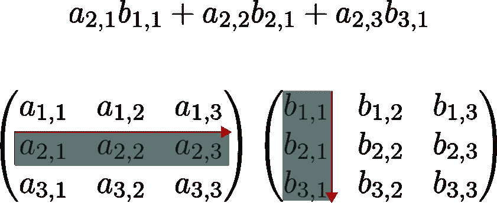

矩阵乘法之所以这样定义，是因为矩阵表示向量空间之间的线性变换。矩阵乘法是线性变换的合成。

如果你想了解更多这方面的内容，这里有一篇很棒的文章《走向数据科学》,详细解释了一些事情。

 [## 为什么线性代数教的这么差？

### 线性代数是机器学习的基石之一。这比你想象的更直观

towardsdatascience.com](/why-is-linear-algebra-taught-so-badly-5c215710ca2c) 

## 决定因素

在我看来，行列式无疑是线性代数中最难掌握的概念之一。根据你的学习资源，它通常由递归定义或者通过所有排列迭代的和来定义。如果没有丰富的数学经验，他们中没有一个是好对付的。

要理解这个概念，请观看下面的视频。相信我，这是魔法。

综上所述，矩阵的行列式描述了一个物体的体积在对应的线性变换下是如何缩放的。如果变换改变了方向，行列式的符号是负的。

你最终需要理解如何计算行列式，但我现在不担心这个。

## 特征值、特征向量和矩阵分解

标准的第一线性代数课程通常以特征值/特征向量和一些特殊的矩阵分解如奇异值分解结束。

假设我们有一个矩阵*一个*。数字 *λ* 是 *A* 的特征值，如果有一个向量 *x* (称为特征向量)使得

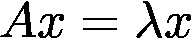

保持。换句话说，由 *A* 表示的线性变换是由 *λ* 对矢量 *x* 的缩放。这个概念在线性代数中起着重要的作用。(实际上在广泛使用线性代数的每个领域都是如此。)

至此，您已经准备好熟悉一些矩阵分解。如果你想一想，从计算的角度来看，什么类型的矩阵是最好的？对角矩阵！如果一个线性变换有一个对角矩阵，计算它在任意向量上的值是很简单的。

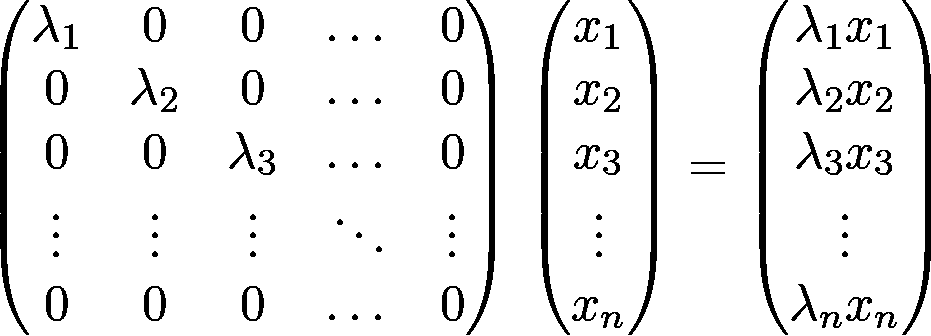

大多数特殊形式旨在将矩阵 *A* 分解成矩阵的乘积，其中最好至少有一个是对角矩阵。奇异值分解，简称 SVD，是最著名的一种分解，它指出存在特殊矩阵 *U* 、 *V、*和对角矩阵*σ*，使得

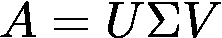

保持。( *U* 和 *V* 是所谓的*酉矩阵*，这里我不做定义，知道它是一个特殊的矩阵族就够了。)

SVD 也用于执行主成分分析，这是最简单也是最著名的降维方法之一。

## **深造**

线性代数可以用许多方法来教。我在这里概述的道路是受谢尔登·埃克斯勒的教科书《线性代数做对了》的启发。对于在线讲座，我推荐麻省理工学院开放式课程中的[线性代数课程，](https://www.youtube.com/playlist?list=PL49CF3715CB9EF31D)这是一个很好的资源。

如果一门课程可能太多，有很好的文章，例如，下面的。

 [## 人工智能的数学:线性代数和如何更好地理解它

### 它是如何工作的，在哪里使用，如何更快地学习它。

towardsdatascience.com](/mathematics-for-ai-linear-algebra-and-how-to-understand-it-better-63b430999069) 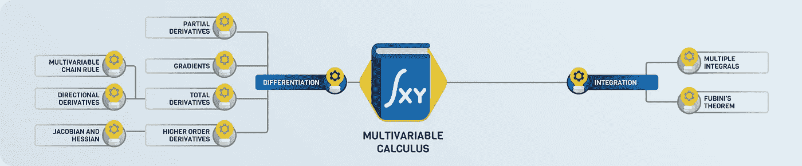

# 多元微积分

这是线性代数和微积分结合的部分，为训练神经网络的主要工具奠定了基础:梯度下降。从数学上讲，神经网络只是多个变量的函数。(虽然，变量的数量可以以百万计。)

类似于单变量微积分，这里的两个主要话题是微分和积分。假设我们有一个函数

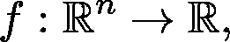

将向量映射到实数。在二维中(即对于 *n = 2* )，你可以把它的情节想象成一个曲面。(由于人类看不到高于三个维度的东西，所以很难想象具有两个以上实变量的函数。)

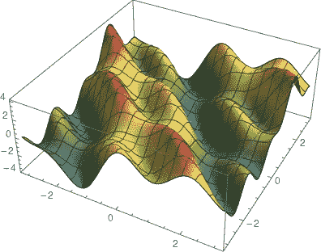

二元函数图。

## 多变量微分

在单变量中，导数是切线的斜率。你如何定义这里的切线？曲面上的一个点有几条切线，而不只是一条。但是有两条特殊的切线:一条平行于 *x-z* 平面，另一条平行于 *y-z* 平面。它们的斜率由*偏导数*决定，定义如下

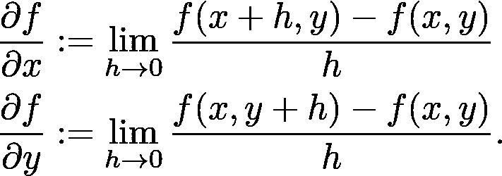

也就是说，你对除了一个变量之外的所有变量求导。(形式定义对于≥ 3 个变量是相同的，只是符号更复杂。)

这些特殊方向的切线横跨*切面*。

切面。

## 梯度

还有另一个特殊的方向:梯度，它是由定义的向量

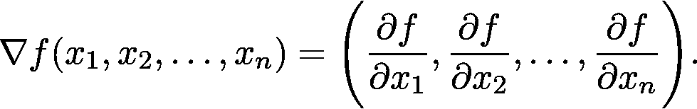

梯度永远指向涨幅最大的方向！因此，如果你在这个方向上迈出一小步，你的提升将是你可以选择的所有其他方向中最大的。这就是*梯度下降*的基本思想，这是一种最大化函数的算法。其步骤如下。

1.  计算你目前所在的点 *x₀* 的坡度。
2.  向坡度方向迈一小步，到达点 *x₁* 。(步长称为*学习率*。)
3.  回到步骤 1。并且重复该过程直到收敛。

当然，这个基本算法有几个缺陷，这些年来对它进行了几次改进。现代基于梯度下降的优化器采用了许多技巧，如自适应步长、动量和其他方法，我们在这里不打算详述。

在实践中计算梯度是困难的。功能通常由其他功能的组合来描述，例如我们熟悉的线性层

其中 *A* 为矩阵， *b* 和 *x* 为向量， *σ* 为 sigmoid 函数。(当然，可以有其他激活，但是为了简单起见，我们将坚持这样做。)你会怎么计算这个梯度？在这一点上，甚至不清楚如何定义像这样的向量-向量函数的梯度，所以我们来讨论一下！一项功能

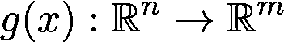

总是可以写成向量标量函数，比如

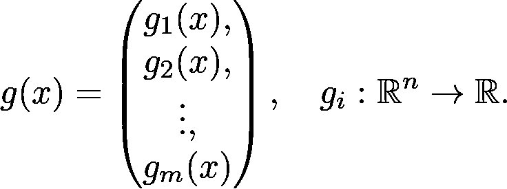

*g* 的梯度由矩阵定义，其第 *k* 行是第 *k* 个分量的梯度。也就是说，

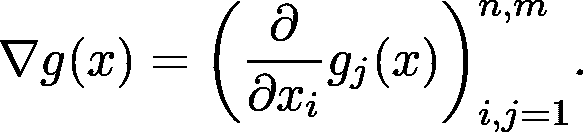

这个矩阵叫做 g 的*全导数。*

在我们的例子中

事情变得有点复杂，因为它由两个功能组成:

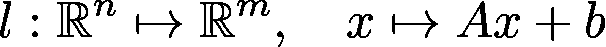

和

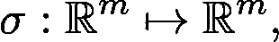

通过应用单变量 sigmoid 分量来定义。函数 *l* 可以进一步分解为从 n 维向量空间映射到实数空间的 *m* 个函数:

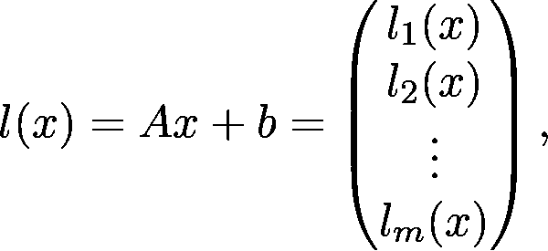

在哪里

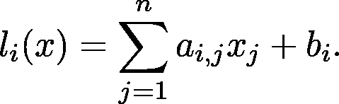

如果你计算总导数，你会看到

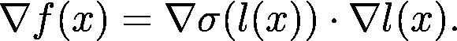

这就是多元函数的*链式法则的全部一般性。没有它，就没有简单的方法来计算神经网络的梯度，神经网络最终是许多函数的组合。*

## 高阶导数

类似于单变量的情况，梯度和导数在确定空间中的给定点是局部最小值还是最大值方面起作用。(或者都不是。)提供一个具体的例子，训练神经网络等价于最小化参数训练数据的损失函数。这完全是为了找到达到最小值的最佳参数配置 *w* :

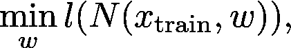

在哪里

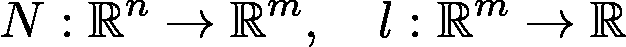

分别是神经网络和损失函数。

对于一般的可微向量标量函数，比如说 *n 个*变量，有 *n 个*二阶导数，形成*海森矩阵*

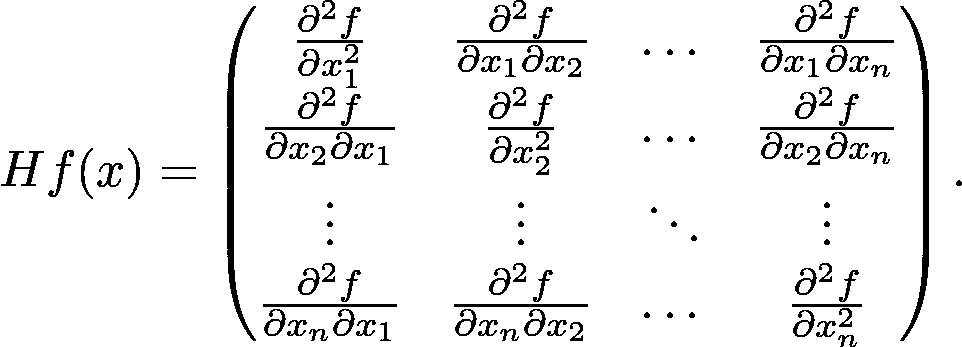

在多变量中，黑森行列式的作用是二阶导数。同样，它可以用来判断一个临界点(即所有导数都为零的地方)是最小值、最大值还是仅仅是一个鞍点。

## 继续教育

关于多变量微积分有很多很棒的在线课程。我有两个具体建议:

*   [可汗学院关于多变量微积分的](https://www.youtube.com/playlist?list=PLSQl0a2vh4HC5feHa6Rc5c0wbRTx56nF7)，
*   [麻省理工学院多元微积分](https://www.youtube.com/playlist?list=PL4C4C8A7D06566F38)。

现在我们准备学习最后一门课程:概率论！

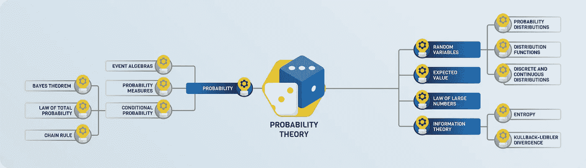

# 概率论

概率论是对概率的精确数学研究，是所有科学领域的基础。

抛开确切的定义，让我们思考一下*概率*代表什么。比方说，我掷一枚硬币，有 50%的机会(或 0.5%的可能性)是正面。重复实验 10 次后，我得到了多少个头？

如果你回答了 5，那你就错了。正面为 0.5 的概率并不能保证每一秒都是正面。相反，这意味着如果你重复实验 *n 次*其中 *n* 是一个*非常大的数*，人头数将非常接近 *n/2* 。

为了更好地理解概率，我推荐下面这篇我不久前写的文章，它提供了一个简洁但数学上正确的概念。

 [## 概率的数学基础

### 测度论导论

towardsdatascience.com](/the-mathematical-foundations-of-probability-beb8d8426651) 

除了基础知识，还有一些高级的东西你需要了解，首先也是最重要的，*期望值*和*熵*。

## 预期值

假设你和你的朋友一起玩游戏。你掷一个经典的六面骰子，如果结果是 1 或 2，你就赢了 300 美元。否则，你会损失 200 英镑。如果你玩这个游戏的时间足够长，你每回合的平均收入是多少？你应该玩这个游戏吗？

嗯，你以 1/3 的概率赢了 100 块，以 2/3 的概率输了 200 块。也就是说，如果 X 是编码掷骰子结果的随机变量，那么

这是期望值，也就是长期来看，你每一轮得到的平均金额。既然这个是负的，那你就亏了，所以千万不要玩这个游戏。

一般来说，期望值由下式定义

对于离散随机变量和

对于实值连续随机变量。

在机器学习中，用于训练神经网络的*损失函数是以某种方式*的期望值*。*

## 大数定律

人们常常错误地将某些现象归结于大数定律。例如，正处于连败中的赌徒认为他们应该很快会赢，因为 T4 大数定律。这是完全错误的。让我们看看这到底是什么！

假如

是代表相同实验的独立重复的随机变量。(比如说，掷骰子或掷硬币。)

本质上，大数定律表明

这是长期结果的平均值，等于期望值。

一种解释是，如果一个随机事件重复了足够多的次数，个别结果可能并不重要。所以，如果你在一个赌场里玩一个期望值为负的游戏(他们都是这样)，偶尔赢一次也没关系。大数法则暗示你*会赔钱*。

为了领先一点，LLN 将是随机梯度下降的关键。

## 信息论

让我们玩一个游戏。我想到了一个 1 到 1024 之间的数字，你要猜。你可以提问，但你的目标是用尽可能少的问题。你需要多少？

如果你聪明的话，你会用你的问题来表演二分搜索法。首先你可能会问:*数字是在 1 到 512 之间吗？*这样，你就把搜索空间缩小了一半。使用这个策略，你可以在

问题。

但是如果我在选号的时候没有用均匀分布呢？例如，我可以使用泊松分布。

泊松分布的概率质量函数。来源:[维基百科](https://en.wikipedia.org/wiki/Poisson_distribution)

这里，您可能需要更少的问题，因为您知道分布倾向于集中在特定的点上。(这取决于参数。)

在极端情况下，当分布集中在一个数字上时，你需要*个零*题才能猜对。通常，问题的数量取决于分布所携带的信息。均匀分布包含的信息量最少，而奇异分布则是纯信息。

*熵*是对此进行量化的一种方式。它的定义是

对于离散随机变量和

对于连续的，实值的。(对数的底数通常是 2、 *e* ，或者 10，但这其实并不重要。)

如果你以前使用过分类模型，你可能会遇到*交叉熵*损失，定义如下

其中 P 是基本事实(集中于单个类别的分布)，而 hatted 版本代表类别预测。这衡量了预测与事实相比有多少“信息”。当预测匹配时，交叉熵损失为零。

另一个常用的量是 Kullback-Leibler 散度，定义如下

其中 *P* 和 *Q* 是两个概率分布。这实质上是交叉熵减去熵，可以认为是量化了两种分布的不同程度。例如，当训练生成性对抗网络时，这是有用的。最小化 Kullback-Leibler 散度保证了两个分布是相似的。

## 继续教育

在这里，我给你推荐两本书:

*   [Christopher Bishop 的《模式识别与机器学习》](https://www.springer.com/gp/book/9780387310732)，
*   Trevor Hastie、Robert Tibshirani 和 Jerome Friedman 的《统计学习的要素》[。](https://web.stanford.edu/~hastie/ElemStatLearn/)

这是两本基础教材，它们教给你的远不止概率论。他们都超越了基础，但相应的章节提供了一个很好的介绍。

# 超越数学基础

至此，我们回顾了理解神经网络所必需的数学。现在，你已经准备好了有趣的部分:机器学习！

要真正理解神经网络是如何工作的，还得学习一些最优化和数理统计。这些主题建立在我们设定的基础之上。我不会详细介绍，因为这超出了本文的范围，但是我已经准备了一个学习路线图来指导您。

如果你想了解更多关于这些话题的内容，可以看看我下面的一些文章！

 [## 机器学习的统计基础

### 超越函数拟合的视角

towardsdatascience.com](/the-statistical-foundations-of-machine-learning-973c356a95f)  [## 如何在 NumPy 中构建 DIY 深度学习框架

### 通过从头开始构建神经网络来理解神经网络的细节

towardsdatascience.com](/how-to-build-a-diy-deep-learning-framework-in-numpy-59b5b618f9b7)  [## 深度学习的数学优化

### 关于如何最小化具有数百万个变量的函数的简要指南

towardsdatascience.com](/the-mathematics-of-optimization-for-deep-learning-11af2b1fda30) 

[***如果你喜欢把机器学习概念拆开，理解是什么让它们运转，我们有很多共同点。看看我的博客，我经常在那里发表这样的技术文章！***](https://www.tivadardanka.com/blog)