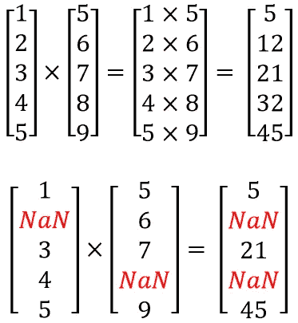
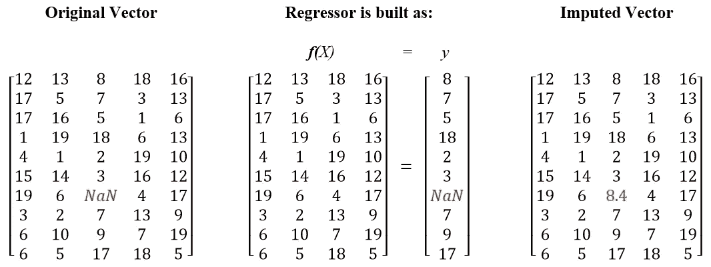
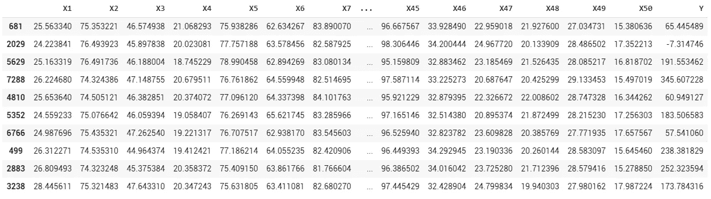
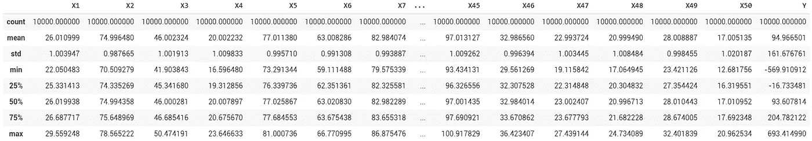
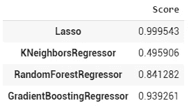
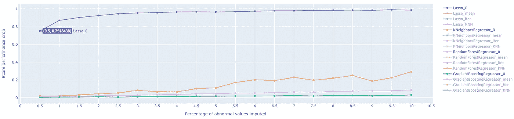
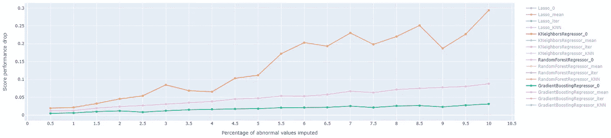
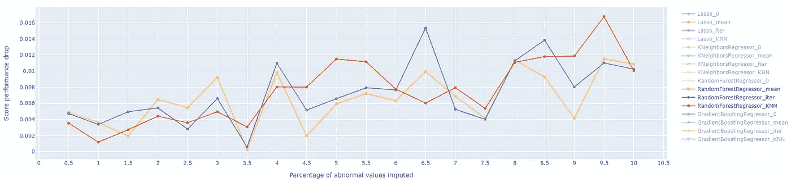
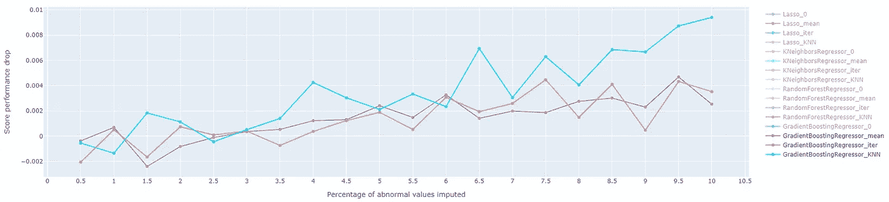

# 机器学习算法对缺失值或异常值的鲁棒性

> 原文：<https://towardsdatascience.com/the-robustness-of-machine-learning-algorithms-against-missing-or-abnormal-values-ec3222379905?source=collection_archive---------53----------------------->

## 让我们来探索经典机器学习算法在面对异常数据时的表现，以及标准插补方法提供的好处。

Gabriel Crismariu 在 [Unsplash](https://unsplash.com?utm_source=medium&utm_medium=referral) 上拍摄的照片

> 缺少值，这是每个数据科学家第一次探索数据集时的诅咒！

是的，现实生活通常与教程相去甚远，在教程中，每一列都是干净的，充满了格式正确的值，有良好的文档记录，离群值很明显，相互关系触手可及。

缺失值:NaN，null，empty，" "，凡是你能想到的！从两个角度来看，它们确实是建模过程中的一个关键问题:

*   **从纯数学的角度来看**，大多数算法依赖于线性代数，向量或矩阵中的一个缺失值会使整个计算过程崩溃。
    让我们用一个简单的向量乘法来想象这种效果:

线性代数…有或没有缺失值

*   **从建模的角度来看**，缺失的值代表现实的一部分，它是不可访问的、隐藏的。想象一下，作为一名调查人员，得到经过消毒的文件:你知道你不是什么都知道！

来源:维基百科(模糊缩小)

至少，你什么都不知道…

# 在工业上看起来怎么样？

从我的经验来看，诀窍是坏了的传感器不会把 NaNs 送回给你；那太容易被发现了！更有可能的是，您将获得零、有偏差的或随机的值。很棒不是吗！？

有一段时间，我担心在我处理的数据中加入异常值。当你探索 5000 万行 x 300 个特征时，这比在下面的图片中找到长颈鹿或豹子要困难得多:

[艺术狼提供——消失行动:自然中的伪装](https://artwolfe.photoshelter.com/gallery/Vanishing-Act-Camouflage-in-Nature/G0000Ma6W.F7OKto/)

[艺术狼提供——消失行动:自然中的伪装](https://artwolfe.photoshelter.com/gallery/Vanishing-Act-Camouflage-in-Nature/G0000Ma6W.F7OKto/)

在某个时候，我决定进行自己的测试，并评估我得到的异常值的比率(总是小于 1%，大多数低于 0.5%)，最重要的是，这种现象如何影响我正在使用的算法的性能。

该测试背后的原理非常简单，与通常的过程相反:

> 正常情况下，一个理智的数据科学家会试图估算缺失或异常值，以提高其模型的准确性；我选择了反过来做！

**首先，我会根据一个完美的数据集来评估经典机器学习算法*的性能。而且，我会逐步增加引入训练集的异常值的比率，以测量准确性的变化。**

(* Lasso、KNeighbors、随机森林和梯度增强树回归变量)

并且，当我处于“基准模式”时，我决定反转(再次！)的过程，并比较标准插补技术带来的好处:

*   **简单估算器**:缺失值将由一个常量值填充，该常量值是预先确定的或从特征的统计数据(平均值、中值、众数)中得出。
    *注意:如果你对数据集的正态性没有信心，并且可能存在一些重要的异常值，我建议使用中位数而不是平均值，因为平均值对异常值不太敏感(见下面的例子)。*

*   **迭代估算器**:每个要素都将被视为数据集中所有其他要素的函数。然后回归器将根据所有其他特征来确定缺失值。这依赖于变量之间全局一致性的假设。

*   **KNNImputer** :该插补算法基于 k 近邻法来识别数据集中的不同聚类，并在需要时使用聚类的特征来插补缺失值。

 [## 6.4.缺失值的插补-sci kit-学习 0.23.1 文件

### 由于各种原因，许多真实世界的数据集包含缺失值，通常编码为空白、NaNs 或其他…

scikit-learn.org](https://scikit-learn.org/stable/modules/impute.html) 

# 渴望了解更多信息？让我们开始吧！

像往常一样，我们将从创建一个虚拟的“工业”数据集开始。传感器、探头、实验室测量值通常不以 0 为中心，因此我们将增加它们的值以符合现实情况:在下面的示例中，范围在 10 和 100 之间:

数据帧样本

数据框架的基本统计

我们随机定义训练集和测试集，并记录算法在测试集中的初始性能。

我们可以清楚地看到算法之间的初始性能差异

一旦定义了计算方法，我们将并行运行插补方法，以获得最佳的比较结果。每个循环如下:

*   我们将原始的 **X_train** 数据帧复制到 **X_train_NaN** 中，为其估算一个定义的 NaN 比率
*   我们首先将所有 NaN 替换为 0，并创建最坏的情况
*   我们用这个 **X_train_NaN** 数据集训练每个模型，并根据原始的 **X_test** 测量其性能。这将提供异常值对算法的影响
*   最后，我们用标准插补技术(平均值、迭代或 KNN 方法)替换所有的 nan，并再次检查回归变量的性能。

一张 GIF 抵得上千言万语:-)

当整个过程结束后，我们可以比较每个模型的性能:

*   使用初始和清洁的 **X_train** 套件进行训练
*   用越来越多的**0**进行训练
*   接受过**标准插补技术**的培训

下图显示了初始性能和以 0 的递增比率训练的模型之间的差异:

我们可以立即看到，一旦引入第一个异常值，Lasso 的性能就完全崩溃了:0，5%导致性能下降 75%。这是由于其模型的线性结构(=方程)。

如果我们排除 Lasso 回归器，我们可以注意到系综树方法(随机森林和梯度推进)非常稳健，并且优于 KN 回归器:

# 我们现在可以关注三种插补方法的性能。

当引入 10%的异常值时，随机预测的性能下降了 8.8%。简单的、迭代的和 KNN 估算法使其在相同的 NaNs 比率下回到 1%以下:

当涉及到梯度推进回归变量时，KNN 估算器获得“最低”性能，在性能下降中回到 1%。

引入 10%的 NaNs 后，均值和迭代估算值带来了接近 0.3%的性能，这确实非常好！

像往常一样，这只是评估异常值对机器学习算法的影响的一种方式，不同的用例和假设可能会有很大的不同。

 [## 皮埃尔-路易·贝斯康德关于媒介的文章

### 数据科学、机器学习和创新

pl-bescond.medium.com](https://pl-bescond.medium.com/pierre-louis-besconds-articles-on-medium-f6632a6895ad)