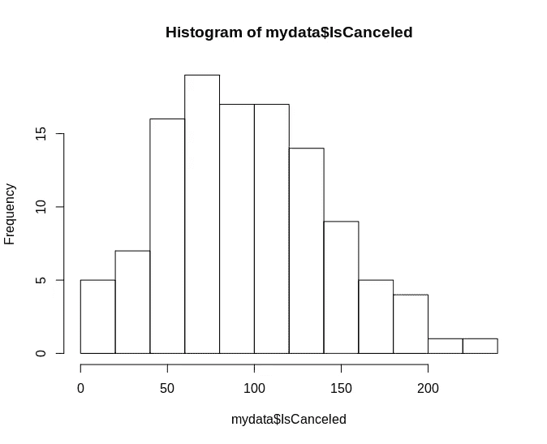
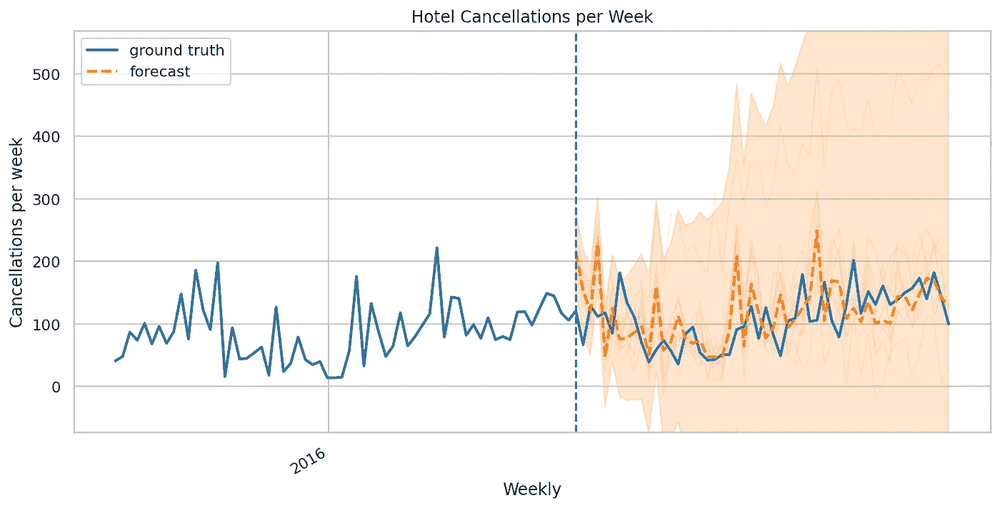

# 贝叶斯统计在后 COVID 世界中的作用

> 原文：<https://towardsdatascience.com/the-role-of-bayesian-statistics-in-a-post-covid-world-5904352d8f9a?source=collection_archive---------24----------------------->

## 新冠肺炎告诉我们，基于过去数据的预测会很快过时。

来源:照片由来自 [Unsplash](https://unsplash.com/photos/5FHv5nS7yGg) 的 [Katie Moum](https://unsplash.com/@katiemoum) 拍摄

贝叶斯统计的一个核心概念是**后验分布**。简单来说，这种分布结合了一个人在直接观察到一组数据之前对该组数据的先验信念(先验分布)和未来观察到一组特定数据的概率(似然函数)。

这是后验分布的样子:

来源:图片由作者创建

传统的**正态分布**(均值=中位数=众数)完全依赖于过去的数据。

因此，数据分布的突然变化意味着先前的预测不再适用。

我们举个例子。

来源:RStudio —基于 Antonio、Almeida 和 Nunes (2016 年)研究的数据集

这是一家葡萄牙酒店的**周取消预订数量**的分布图(COVID 之前)。我们可以看到取消事件的数量每周都在变化，并且大致接近正态分布。

然而，由于新冠肺炎疫情酒店，该酒店每周取消预订的数量要高得多，上述分布现在与该酒店的任何预测无关。

# 不确定性在预测中的作用

作为贝叶斯统计应用的一个例子，下面是一个基于后验分布的酒店取消预测。使用张量流概率库实现预测。

来源:张量流概率

在这里，我们可以看到预测(橙色线)仍然或多或少地符合实际每周取消的范围。

然而，考虑到在新冠肺炎之前运行该模型将会表明，基于预测的整体**范围**——酒店可能会看到超过 500 个取消——远高于之前的取消范围。

在这方面，这样的预测可以提醒酒店经理潜在的极端情况，并引发以下问题:

> “在什么情况下，我的酒店每周会有超过 500 次的取消预订，我该如何防范？”

# “一刀切”的预测信息不多

贝叶斯方法在金融领域也越来越受欢迎，甚至在新冠肺炎之前。

通过预测来预测资产价格的一个大问题是，这种价格天生就受制于一个反馈循环。

它不像预测天气或其他人们不能直接影响时间序列的量。

例如，让我们假设您希望建立一个 LSTM 模型来预测特定股票的价格。你生成一个预测价格误差小于 5%的模型。

现在，假设每个人都开始使用 LSTM 来预测股票价格。在这种情况下，该模型现在没有预测能力，因为价格会立即调整，因此使用该模型没有任何优势。

因此，风险分析在金融中发挥着重要作用，即使用统计方法来预测特定价格的预测范围，而不是对价格的预期走向做出“一刀切”的断言。

贝叶斯推理可以允许基于**先验信念**和**更新数据**的更加混合的预测。

例如，如果一位分析师假设未来三个月市场将出现低迷的概率为**20%**——基于过去的数据和概率假设，这将如何影响价格？

如果根据新的信息，例如新冠肺炎导致经济产出下滑，这个概率被更新为 **70%** 会怎么样？这对预测有什么影响？

在这方面，贝叶斯推断可用于在新数据可用时更新概率假设，从而产生更明智的预测，而不是完全基于过去的数据，并且不考虑基于未来条件变化的不确定性的作用。

# 限制

尽管如此，贝叶斯统计并不一定是万无一失的。

与传统的统计方法不同，贝叶斯推断主要依赖主观意见来生成预测。

例如，一个人可能认为未来三个月股市下跌的概率为 30%。然而，另一个人可以查看相同的可用证据，并得出 50%的可能性。

此外，贝叶斯推理不一定告诉我们如何选择先验分布。

回到股票市场的例子——先验分布是基于过去一年的数据吗？过去五年？

在这方面，如果选择了不正确的时间周期，研究人员可能会无意中对预测结果产生负面影响。也就是说，减轻这种风险的一种可能的方法是通过回测，即给定一段时间的过去数据和一个指定的概率，该模型在这种情况下如何预测未来数据？

# 结论

从商业的角度来看，新冠肺炎的意思是，企业基于先前数据做出的许多预测已经变得多余。

另一方面，包含不确定性的预测可能会更好地为企业未来的正确行动提供信息。

贝叶斯统计有其自身的局限性，而且绝非万无一失。然而，我预计，随着我们开始意识到仅仅基于过去数据的预测可能非常“偶然”，这一统计分支将变得更加流行。

*免责声明:本文是在“原样”的基础上编写的，没有任何担保。本文旨在提供数据科学概念的概述，不应以任何方式解释为专业建议。*

# 参考

*   [布兰登·罗尔:贝叶斯推理如何工作](https://e2eml.school/how_bayesian_inference_works.html)
*   [SAS:贝叶斯分析程序介绍](http://documentation.sas.com/?docsetId=statug&docsetTarget=statug_introbayes_sect015.htm&docsetVersion=14.3&locale=en)
*   [禅宗投资者:贝叶斯推理和股市预测](https://www.zeninvestor.org/bayesian-inference-and-stock-market-predictions/)