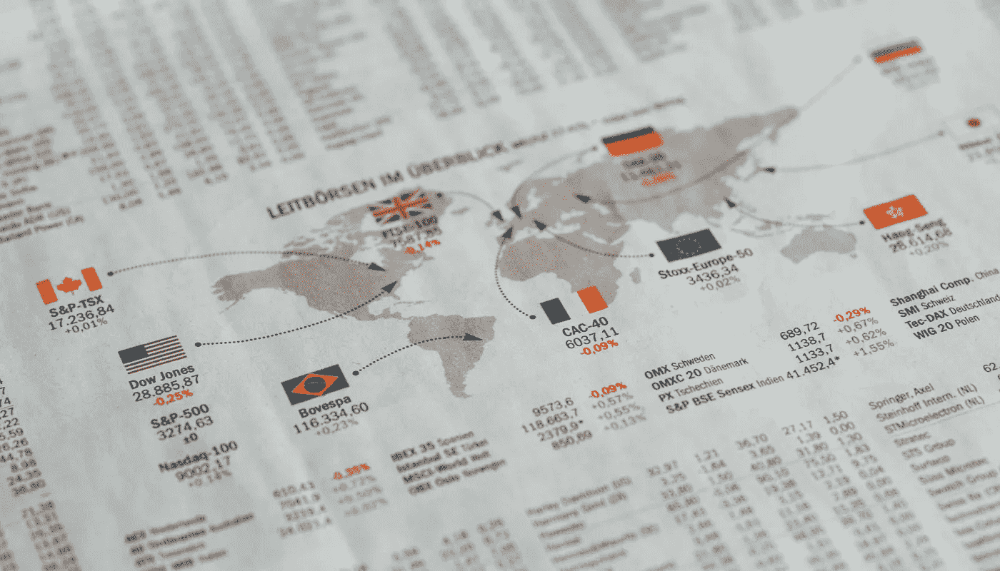

# 统计在工业中的作用

> 原文：<https://towardsdatascience.com/the-role-of-statistics-in-the-industry-d360f3056e4b?source=collection_archive---------37----------------------->

## 数据科学和机器学习

## 有一些统计学的术语和一些关于统计学学科的观点，以及一些与相关领域的联系



照片由来自 [Pexels](https://www.pexels.com/photo/arrows-in-a-white-paper-3671146/?utm_content=attributionCopyText&utm_medium=referral&utm_source=pexels) 的 [Markus Spiske](https://www.pexels.com/@markusspiske?utm_content=attributionCopyText&utm_medium=referral&utm_source=pexels) 拍摄

统计无处不在，大多数行业都是依靠统计和统计思维来支撑业务的。对掌握统计学的兴趣也要求成为一名成功的数据科学家。你需要证明你对这个学科领域的热衷。

**什么是统计？**

它是一门包含从数据中学习的所有特征的学科。作为一种方法论，我们谈论的是允许我们处理数据和理解数据的手段和方法。统计学家采用并开发数据分析方法，并不断探索以了解它们的特性。

> 这些工具何时能提供洞察力？
> 他们什么时候可能会误导人？

所有不同学术领域的研究人员，许多行业的工作者，正在实施和实现统计方法，他们正在为进行数据分析提供新的方法和技术。首先需要一个简明的术语，这是统计学和统计学领域的区别。

我们每天都会遇到来自数据收集的数字或图形报告。例如，所有学生期末考试的平均分数，一些国家就业和失业工人的比例，或者一天中股票价格的波动。这些是统计数据。

然而，统计领域是一个侧重于研究方法的学术学科。作为统计学家，最重要的方面是开发新的统计工具，从数据中计算统计数据，并与专家合作，以适当的方式解释这些结果。

> 毫无疑问，统计学是一个不断发展和壮大的领域。此外，它提供了挑战和机遇。

在数据科学中，大量的统计方法正处于不断的研究中，以了解如何正确地使用它。许多新的应用领域是可用的，这些领域导致开发创新的分析方法的必要性。例如，如何测量数据的想法，以及可用的新类型的方法导致需要分析的新类型的数据。因此，我们经常依赖这些计算方面的进步，不仅使我们能够进行数据分析，而且能够对收集的大量数据进行更复杂的分析。

统计学是一门重要的学科，尤其是对于数据科学家来说，统计学领域有许多流派。它包含了来自理论、实践和相关领域的全新理念。

```
**Numerous viewpoints on the field of statistics are:*** The ability of summarizing data
* The idea of uncertainty
* The idea of decisions
* The idea of variation
* The art of forecasting
* The approach of measurement
* The principle of data collection
```

## 汇总数据的能力

数据可能是可怕的，因为理解这些数据是有条件的，这通常包括减少和总结。数据简化的主要目标是使数据集对人类观察者来说是可理解的。统计学家有不同的技术来汇总数据，这是实现数据有意义的目标所必需的。因此，统计学家在使用适当的、精确的和有效的方法来总结数据方面训练有素。

## 不确定性的概念

数据可能会误导人。开发统计字段的主要目的是获得评估数据的结构和框架。一般来说，来自数据的见解不是 100%准确的，但荒谬的是，我们有一种方法来量化报道的发现与事实有多远。一些评估报告返回时会有误差。这一误差幅度让我们了解到在公开发表的和真实的民意之间可能存在的差异。

## 决策的概念

理解数据是至关重要的，这导致需要能够对我们发现的东西进行处理。在统计的某些领域，决策的想法是任何统计分析的最终目标。在个人和职业的旅程中，我们面对困难做出决定。我们必须比较不同方法的成本和收益。

例如，如果一个人发现自己患某种特定类型癌症的风险可能高于平均水平，他们是否应该接受预防性治疗？统计数据有助于决策过程。

## 变异的概念

当我们总结数据时，通常，我们的主要焦点是典型的或中心的价值。这意味着我们必须高度重视从统计学的角度理解数据的变化。例如，如果你知道平均每个月美国人有大约 8000 美元的信用卡账单，你就很清楚信用卡债务分布的中心价值。如果你被提供了大约 10%以上，这个百分点给你更多关于信用卡债务可变性的信息。

## 预测的艺术

统计学的基本职责是预测。你不能绝对肯定地知道未来。不过，如果你有效地使用了可用的数据，它有时会做出相当准确的预测，如天气预测、股票市场价格预测和洪水风险预测。此外，试图计算新产品在市场上销售的未来需求或预测选举的结果。

## 测量方法

假设您正在收集大量数据。有些变量是可以测量的，有些可以以相当高的精度测量。一个人的年龄或身高，以及一些更具挑战性的变量。例如，血压每分钟都在变化，所以要确定下来有点困难。此外，还有情绪、个性和政治意识形态等更难定义和量化的概念。在确定概念和评估各种方法的质量时，统计在构建和评估衡量这些困难的有用方法方面发挥着重要作用。

## 数据收集的原则

最后，统计是原则性数据收集的基础。有时候，收集数据既费钱又痛苦。资源限制了可以获得多少数据，这意味着如果我们的数据太少，发现就不会最大化。然而，统计为管理这种权衡提供了一个极好的方法。您可以在了解并允许这些资源限制的情况下获得更多数据。


杰瑞米·泽罗在 [Unsplash](https://unsplash.com?utm_source=medium&utm_medium=referral) 上的照片

追溯到古代，文明一直在收集收成和人口数量的数据。现在，随机性和变化可以更精确地定义。现代统计学发展于 19 世纪，源于遗传学、计量经济学和统计理论在 20 世纪的发展，在科学和工业中有许多新的应用领域。例如，有能力用计算机做数据分析的出现。接下来，大数据、海量数据、数据科学、机器学习的兴起。

**统计学确实与其相关领域有许多交集。**

计算机科学为我们提供了处理数据的算法、结构和操作数据的编程语言。在数学中，我们得到了更简洁地展示这些统计概念的语言和图形，以及评估和解释这些分析方法的性质的工具。

数学的一个分支是概率论，它是统计学基础的一个重要部分，允许我们揭示随机性和不确定性的概念。

然后是数据科学，它为我们提供了数据库管理和机器学习，这些基础设施能够进行数据分析。

## 结论

统计学已经从一个小的领域发展成为研究和工业中的一个重要的联盟。众多不同的应用包括计算机视觉、自动驾驶汽车、面部识别、在线搜索推荐系统和在线购物。

在卫生领域，我们有预测和分析、精准医疗、欺诈检测、环境和基础设施风险评估、职业培训方面的社会和政府服务，以及行为治疗。统计和统计思维帮助我们理解我们周围的数据和信息。

## 关于作者

Wie Kiang 是一名研究员，负责收集、组织和分析意见和数据，以解决问题、探索问题和预测趋势。

他几乎在机器学习和深度学习的每个领域工作。他正在一系列领域进行实验和研究，包括卷积神经网络、自然语言处理和递归神经网络。