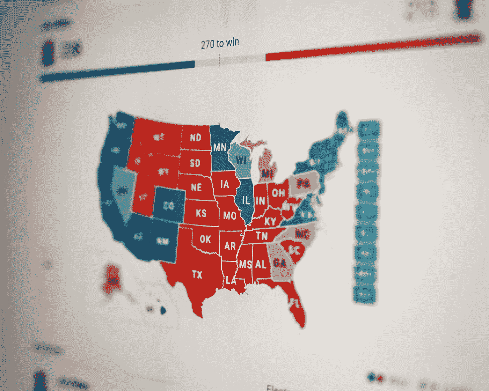
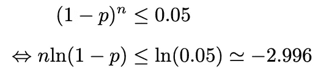
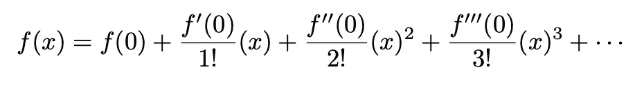
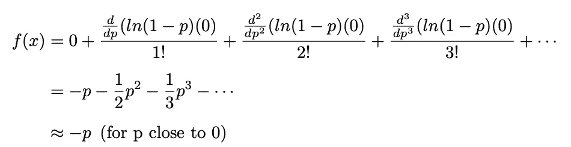
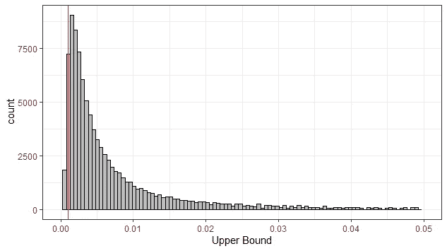

# 规则三:计算尚未发生的事件的概率

> 原文：<https://towardsdatascience.com/the-rule-of-three-calculating-the-probability-of-events-that-have-not-yet-occurred-106144dc2c39?source=collection_archive---------21----------------------->

## [实践教程](https://towardsdatascience.com/tagged/hands-on-tutorials)

## 我们有多大把握让加州、纽约等蓝色州。下次选举不要变红？

前总统巴拉克·奥巴马的第二次就职演说(2013 年)。由 [Dyana Wing So](https://unsplash.com/@dyanawingso?utm_source=unsplash&utm_medium=referral&utm_content=creditCopyText) 在 [Unsplash](https://unsplash.com/s/photos/democrat?utm_source=unsplash&utm_medium=referral&utm_content=creditCopyText) 上拍摄

作者注:我正在尝试一种更短的文章形式，旨在介绍有趣的统计事实和经验法则。让我知道你如何喜欢他们。如需更深入的分析:

*   [贝叶斯统计如何说服我去健身房？](/how-bayesian-statistics-convinced-me-to-hit-the-gym-fa737b0a7ac)
*   [利用数据驱动的体育博彩策略赚大钱](/making-big-bucks-with-a-data-driven-sports-betting-strategy-6c21a6869171)
*   [寻找上帝的贝叶斯探索](/a-bayesian-quest-to-find-god-b30934972473)

又是一个选举周期，又是一次我们对总体结果感到困惑的时候。任何一方都没有井喷。选举是一场扣人心弦的比赛。民主党人和共和党人在几次竞选中都取得了意想不到的进展。

面对每个选举周期不断上升的不确定性，我的一个朋友欢呼道:

> 我们可以确定的一件事是，加州从来没有，也永远不会变红。

首先，这在历史上是不正确的——加州在 1992 年大选前一直支持红色。我的朋友必须将他的观察限定为“他观察的[自 1992 年以来的]选举”，或者如果他将地点改为哥伦比亚特区。然而，如果他知道即使在这次选举中，加利福尼亚州 1000 万张选票中有三分之一投给了特朗普总统，他对自己的预测仍会不太有信心。仅仅因为我们[表面上]观察到一个地方是一个民主堡垒，并不意味着它在未来不会变红，反之亦然。

[粘土堤](https://unsplash.com/@claybanks?utm_source=unsplash&utm_medium=referral&utm_content=creditCopyText)在 [Unsplash](https://unsplash.com/s/photos/vote?utm_source=unsplash&utm_medium=referral&utm_content=creditCopyText) 上拍照

我朋友所做的预测是一种非常常见的心理归纳，我们每天都在练习。就像飞机不应该坠毁一样，智齿拔除不应该造成神经损伤，卫冕英超冠军也不应该因为一支在英国足球第五梯队打滚的球队而沮丧。然而，在现实中，这些事情确实发生了。仅仅因为我在过去的 10 年里没有骑摩托车遇到任何事故，并不意味着事故的风险为零。

问题是: ***我们能否量化尚未发生的事情的概率？*** 理想情况下，我们会想给罕见事件分配一个概率，但是这些事件的分子是 0，我们无能为力。在这些情况下，量化风险大小的一个简便方法叫做三个的**法则:**

> *如果某一事件在有 n 名受试者的样本中没有发生，则从 0 到 3 的区间****/n****为总体中发生率的 95%置信区间。*

这里需要注意的一点是，观察的样本越小，置信区间越宽，这意味着小样本的置信区间上限大于大样本的置信区间上限。但是，如果说在一个小的系列中，不良事件发生的真实概率更大，那就错了。

# **它是如何工作的？**

这个规则的证明很简单，用 *X* 表示事件的数量，用 *p* 表示我们观察到一个不良事件的概率( *p* 接近于 0)，我们要找到给出 Pr( *X* = 0) ≤ 0.05 的 *n* 观察的二项分布的参数 *p* 的值。

因此，我们需要求解 *p* ，这样:

然后我们可以通过使用 Maclaurin 级数来近似实体 ln(1- *p* ，它是函数 *f(x)* 在 *a =* 0 处的泰勒展开式的求值

将此应用于 ln(1- *p* ，我们得到:

这样，我们就有了 *-np* ≤ -2.996 或者 *p* ≤ 3/ *n* 。

**快速模拟:**

虽然数学很简单明了，但为了证明它确实有效，我们可以尝试运行一个简单的模拟:

*   想象一下我们在生产线上测试缺陷。假设我们知道缺陷概率是 *p* = 0.001
*   我们一个接一个地测试每一个下线的产品，直到我们遇到一个缺陷(测试号 *n+1* )。
*   然后，我们制作一个由 0 和 3/n 限定的置信区间**，并记下它。我们检查置信区间是否包含缺陷 p = 0.001 的真实概率。**
*   我们重复这个过程很多次，例如 100，000 次迭代

这是一段 R 代码:

正如你所看到的，从长远来看，大约 95%的区间**【0，3/*n***这样的区间应该包含真正的潜在缺陷概率。

模拟的直方图。红线显示了故障的真实概率(p=0.001)。我们看到红线右侧的面积总计为 95%，这意味着在 95%的情况下，我们在这个过程中获得的置信度包含了真正的潜在缺陷概率。

**回到原问题:**

所以让我们回到最初的问题:让我们忘记 1992 年之前的所有选举。由于我们没有观察到加州在过去 8 次选举中投票支持红色，使用三的规则，我们可以推断出加州走向红色的 95%置信区间在 0 和 3/8 = 37.5%之间。对于哥伦比亚特区，它将是[0，3/15= 20%]。

需要说明的是，这是一个有趣的例子，为了让它起作用，我必须在这里做一些全面的假设，可能没有一个是正确的。

*   (1)我们假设每个选举结果都是相互独立的。这在很大程度上是不真实的，因为我们知道一个选举结果至少可以影响地区地图或者激发下一次选举的投票率，等等。
*   (2)有一个潜在的、固定的州投票给红色的概率，这可能是不真实的*，因为我们知道，该州的人口统计、经济前景和人民情绪在很大程度上影响着政党归属和结果如何产生，并一直在变化。*
*   *(3)对于加州，我们忽略 1992 年之前的所有选举。如果我们包括以前的数据，在这种罕见的事件确实发生过的地方[但它并不罕见，因为加利福尼亚在 1990 年以前被认为是一个红色的州]，三的规则就不应该被使用[然而华盛顿没有这个问题]*

***一个实际的用例:***

*那么三法则实际上是用来做什么的呢？非常受欢迎的使用案例是在许可前临床试验中，不良事件发生率非常低，例如疫苗开发项目。通常，10，000 名受试者范围内的样本量可被认为足以确定新疫苗的保护效力，但不足以检测更罕见的事件或并发症。*

*如果在涉及 10，000 人的许可前临床项目中没有观察到任何特定类型的事件，则可以估计该事件发生率的上限为 3/10，000。实际的并发症发生率，即发生频率低于疫苗靶向疾病的发生率，只能通过一些可靠的上市后监测系统来检测。*

*因此，下次你的牙医说他从未失败过一个手术时，你知道该怎么做:问他服务过多少病人，用三法则找到他失败率的置信区间，看看你对上限有多满意。*

*你可以在[我的 Github 页面](https://github.com/tuangauss/DataScienceProjects/blob/master/R/RuleOfThree.R)找到这篇文章的代码。*

# *参考资料:*

*【1】[为什么加州是一个蓝色的州？](https://www.nytimes.com/2020/11/06/us/california-blue-state-democrat.html)*

*[2] [今年的投票措施如何显示加州日益扩大的政治分歧](https://www.latimes.com/projects/2020-california-election-proposition-analysis/)*