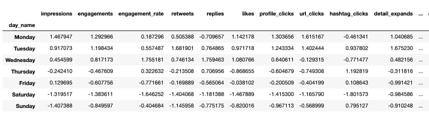
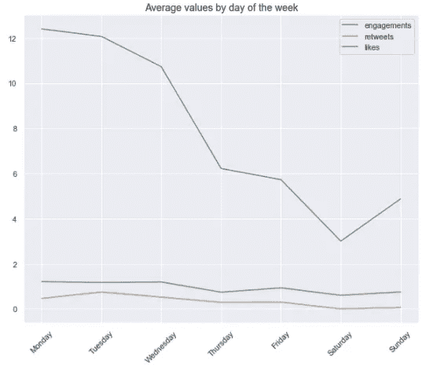
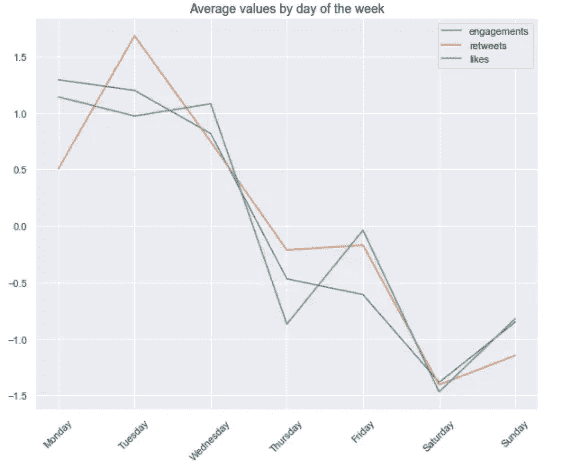
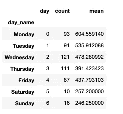
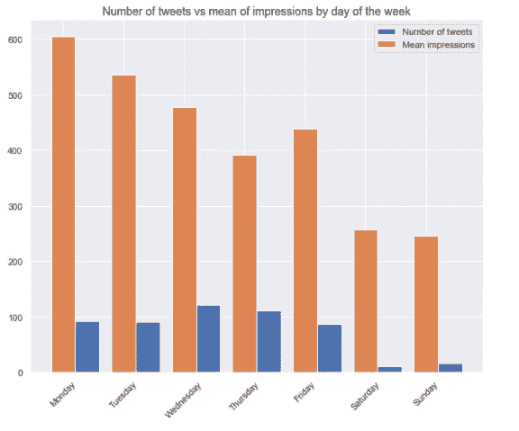
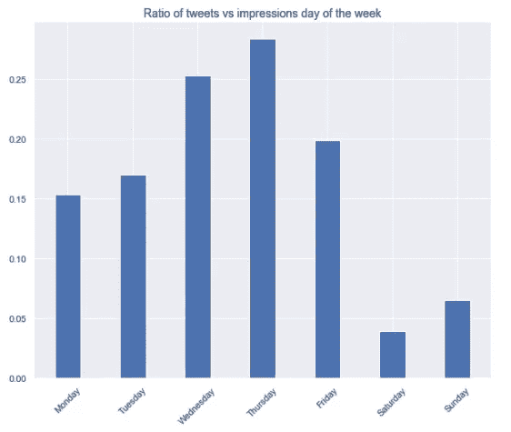
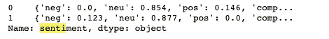
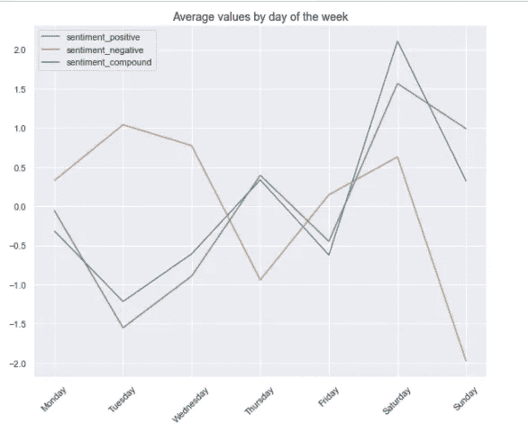
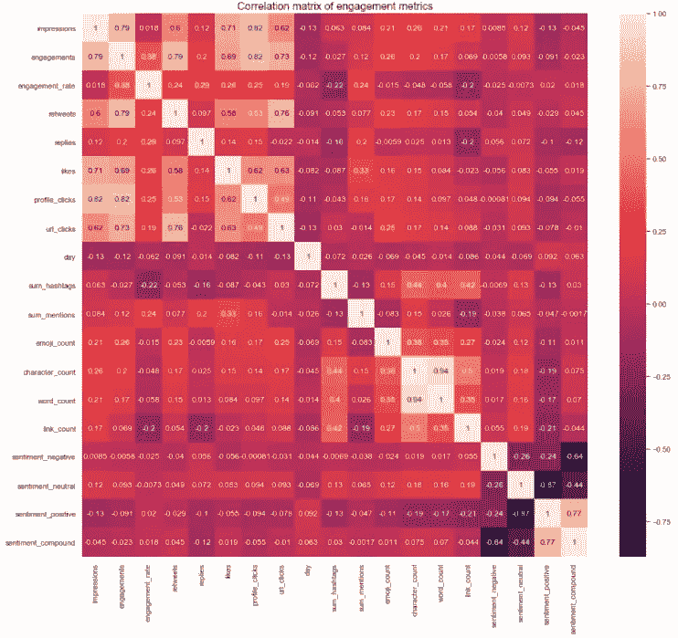
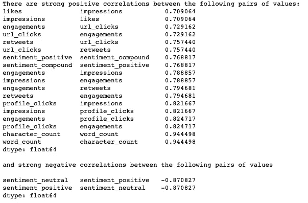

# 😭Twitter 上最悲伤的一天:公司推文中的情绪分析和参与趋势

> 原文：<https://towardsdatascience.com/the-saddest-day-on-twitter-sentiment-analysis-engagement-trends-in-companys-tweets-1b2f4f2789e1?source=collection_archive---------48----------------------->

## 6 个月内 tweets 中参与度指标和情绪值的每周趋势的数据分析和可视化。


马科斯·保罗·普拉多在 Unsplash 上拍摄的照片

如果发了一条推文，但没有人在旁边检查分析，它会产生影响吗？好吧，这是一个*相当松散的*关于一棵树在树林中倒下的问题的释义。🌳但是，你知道我在说什么。

我用[果酱](https://medium.com/u/1d75936a2cf7?source=post_page-----1b2f4f2789e1--------------------------------)(推特[制作果酱](https://twitter.com/makingjam))发微博已经一年多了。现在是时候详细了解一下在文案写作和交流中可以从这种练习中获得什么样的见解了。除了[提及、标签](/how-i-created-a-monster-function-to-discover-our-brands-twitter-best-friend-556f2c90dbb4)、[表情符号](https://medium.com/swlh/%EF%B8%8Fdoes-emoji-use-correlate-with-twitter-engagement-388775467be)和[文本](https://medium.com/@krzem_m/how-repetitive-are-you-using-python-to-reveal-word-patterns-in-tweets-7c6107bb72b)之外，我有兴趣看看**我们的推文如何根据一周中的某一天表现**。

> 因为如果每个人都在吃没有电话的早午餐，为什么还要在周日发微博呢？🤷‍♀️

# 日期时间的时间

这是我们开始之前数据框的前几行。


40 个不同有用程度的专栏…

我们有 **529 行和 40 列**，但是在分析的初始阶段，我们删除了其中的一些(你可以在[这个笔记本](https://github.com/Laodamia/Data-Portfolio/blob/master/Twitter-data/JAM-Tweets.ipynb)中看到完整的数据分析)。

第一步是处理我们最喜欢的变量*日期时间*！还有人把 *strftime* 和 *strptime* 弄混了吗？🙋‍♀️，这就像混淆了左边和右边，也许我们永远无法治愈自己。

我们将把该列拆分成**日期**和**小时**并提取一周中某一天的名称。

这使我们能够按天对数据进行分组，并提取一周中每一天的平均值。

请注意我是如何巧妙的按照*日名*(人类友好的名字)分组，但是按照*日*排序，这是一个数字表示。如果你按 *day_name* 排序，你会得到按字母顺序排序的日子，这没有帮助。☝️

输出:



这已经足够让我们**绘制值**了。我们可以创建一个很好的函数，让我们画出选择的变量。💁‍♀️

当然，我们必须有点**小心我们在同一个图表上绘制的那些**。不同的值有不同的比例，例如，比较印象与参与度，如果 y 轴拉长，图表最终可能不会提供太多信息。

让我们策划一下*的东西，*比如说约会、转发和喜欢。

```
plot_means_by_weekday(‘engagements’, ‘retweets’, variable_3=’likes’)
```

输出:



> 这是什么？周末大跳水！🤔

为了更好地了解趋势，我们可以将这些值归一化。

现在，让我们再画一次。

```
plot_means_by_weekday(week_mean_norm_df, 'engagements', 'retweets', variable_3='likes')
```

输出:



仍在下降。但是，现在很清楚，所有的价值都遵循相同的趋势。

大幅下跌可能部分是由于周末的数据非常少，因为我们周末根本不发推特，假设人们不怎么发推特。

# 🎺令人印象深刻的星期一？

让我们来了解一下平均每日印象。通过使用聚合函数，我们可以很容易地获得印象的平均值和特定工作日发送的所有 tweets 的计数。

“week_impressions”数据框如下所示:



我们可以画出来。

输出:



如果我们只看平均印象，似乎周一、周二和周三是发推特的最佳时间。但是，让这个图表不清楚的是，每天发送的推文数量不同，印象的平均值也不同。让*更清晰的是*计算并绘制每条推文的*发送数量*与*接收数量*的**比率**。

输出:



现在我们清楚地看到，在一周的中间，推文与印象的比率确实是最高的。

# 😠变得多愁善感&看看消极是什么样子

我们可以对这些推文做的一件事就是计算文本情感。要做到这一点，我们可以使用 VADER (Valence Aware 词典和情感推理机)，这是一个专门设计来分析社交媒体上表达的情感的**词典**和情感分析工具。

下载 vader 词典后，我们将*情感强度分析器*应用于文本栏。它将返回一个包含四个值的字典。

注意:你会注意到情感栏已经出现在上面的一个 gists 中。说到这个数据分析项目的年表，这一步👆(计算情绪，)完成的比较早。

输出:



不用说，转向柱需要清理一下。🧹:首先让我们看看我们总共有多少正面、负面和中性的推文。

输出:

```
{‘positive’: 380, ‘negative’: 69, ‘neutral’: 80}
```

**69 条负面推特？！我以为我是一个嬉皮士式的推特精灵。我们一会儿会检查它们。**

首先让我们创建四个单独的列，每种情感值用一个数字表示。这对后面的计算会有帮助。

现在，我们可以过滤负面推文。让我们选出消极得分最高的人来**看看根据 VADER** 所说的“消极”是什么样子。

输出是负面得分最高的两条推文的文本:

#1

`👌 Be your product's worst critic, said @susanavlopes from @onfido at #JAMLondon 2019.`

`What's the latest criticism you've given to your #product? [https://t.co/SxJbmrtQQu](https://t.co/SxJbmrtQQu)`

#2

`Connect with #product designers from Barcelona! 🇪🇸🎨`

`How?`

`Follow this list (Come on, who doesn't like a good list! ) 👉 [https://t.co/gy2bZjyXmy](https://t.co/gy2bZjyXmy)`

`Anyone missing? Tweet at us so we can add them! #pmot #design #prodmgmt`

我的假设是，否定、负面最高级以及“批评”或“失踪”等词的存在导致情绪分析器将推文归类为负面。

哪几天是正面和负面推文的来源？

```
The top value of positive sentiment was observed on Saturday (2.108), and top value of negative sentiment on Tuesday (1.04).The lowest value of positive sentiment was observed on Tuesday (-1.217), and the lowest value of negative sentiment on Sunday (-1.976).
```

为了更清楚起见，让我们使用我们之前编写的函数来绘制它:

输出:

```
*#plot sentiment for week day*
plot_means_by_weekday(week_mean_norm_df,'sentiment_positive', 'sentiment_negative', 'sentiment_compound')
```



> *显然*，周二需要一些欢呼！😐

它有最低的积极情绪值和最高的消极情绪值。可能是来自我们常青图书馆的相同的“负面”推文在同一天被持续发送。

那个周末是愉快的，这可能是以下几个因素的组合:整个周末很少发推文，如果有的话，也往往比较轻松——不那么“聪明”，也不那么事务性。

# 🤔相关性:我们能违反数学定律吗？

任何敬业度指标和变量是否相互关联？检查的方法只有一个。计算相关性。

对这些值的标准解释是:0.7 表示强正相关，0.5 表示中等相关，0.3 表示弱正相关(加上一个负号，表示负相关)。

我们可以绘制相关值，尽管如此多的值可能会使*更少*而不是更清晰。不过，它会成为一个漂亮的浴室瓷砖图案。🤷‍♀️

```
*#plot correlations*
fig, ax = plt.subplots(figsize=(15,15)) 
_ = sns.heatmap(corr, annot = True, ax=ax)plt.title("Correlation matrix of engagement metrics", fontsize=16)
plt.show()
```

输出:



前面要点的打印结果更容易理解:



您可以将这些结果解读为:

*   展示越多，参与越多，参与越多，个人资料点击越多。
*   喜欢越多印象越多，印象越多喜欢越多，等等。

这些结果并不令人惊讶。让我感到惊讶的是，如果字数与字符数呈负相关，这将违反数学定律。

# 🤠下一步！

我将从 Twitter Analytics 收集更多的数据，也许最终样本量会大到足以获得有统计学意义的结果。

如果我有更多的耐心，我会尝试创建更大的自举样本。只是因为(我觉得？)我可以，因为它增加了样本量，有助于获得更有意义结果，而不需要等待更多的数据。

Twitter 数据分析的更多帖子:

*   [🙋‍♀️Does 表情符号的使用与推特互动相关吗？](https://medium.com/swlh/%EF%B8%8Fdoes-emoji-use-correlate-with-twitter-engagement-388775467be)
*   [😅你有多重复？使用 Python 揭示推文中的单词模式](https://medium.com/@krzem_m/how-repetitive-are-you-using-python-to-reveal-word-patterns-in-tweets-7c6107bb72b)。
*   [统治一切的标签👉公司推文分析](/how-i-created-a-monster-function-to-discover-our-brands-twitter-best-friend-556f2c90dbb4)