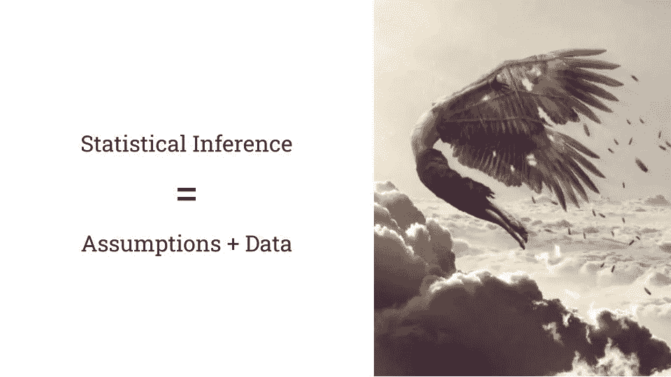

# 数据科学中最悲伤的等式

> 原文：<https://towardsdatascience.com/the-saddest-equation-in-data-science-e60e7819b63f?source=collection_archive---------7----------------------->

## 为什么统计永远不会给你真相

下面是文章的音频版本，由作者为你朗读。

准备一盒纸巾！我将要投下一个关于[统计学](http://bit.ly/quaesita_statistics)和[数据科学](http://bit.ly/quaesita_datasci)的真相炸弹，它会让你热泪盈眶。

模因模板:[来源](https://knowyourmeme.com/memes/crying-cat)。

推断=数据+假设。换句话说，统计数字不会给你真相。

# 常见的神话

以下是一些标准的误解:

*   “如果我找到正确的方程式，我就能知道未知的东西。”
*   “如果我足够努力地计算数据，我就能减少不确定性。”
*   *“统计可以把数据转化为真理！”*

它们听起来像童话，不是吗？那是因为他们是！

# 痛苦的事实

世界上没有让你无中生有的魔法，所以现在就放弃那个希望吧。统计学不是这样的。从统计学家[那里得知。(作为奖励，这篇文章可能会让你避免浪费十年的时间去研究统计的黑魔法来追逐那个难以实现的梦想。)](http://bit.ly/quaesita_vocab)

不幸的是，有很多骗子可能会试图说服你。他们会对你施一个典型的欺负动作，“你不明白我用什么等式来打你，所以在我的优势面前低头，照我说的做！”

抵制那些装腔作势的人。

图片:[来源](https://www.pickpik.com/peacock-green-feathers-nice-tail-male-57931)。

# 别摔着地，伊卡洛斯！

把统计推断([统计](http://bit.ly/quaesita_statistics))想象成从我们知道的(我们的[样本数据](http://bit.ly/quaesita_vocab))到我们不知道的(我们的[人口参数](http://bit.ly/quaesita_vocab))的类似伊卡洛斯的跳跃。

> 在统计学中，你知道的并不是你希望知道的。

也许你想要明天的事实，但你只有过去能通知你。(记不住未来的时候好烦是吧？)也许你想知道你所有的潜在用户对你的产品有什么看法，但是你只能问一百个用户。然后你要处理[的不确定性](http://bit.ly/quaesita_uncertainty)！

# 这不是魔法，这是假设

你怎么可能从你知道的跳到你不知道的？你需要一座桥来跨越这个鸿沟…而这座桥就是 ***假设*** 。这让我想起了所有数据科学中最痛苦的等式:数据+假设=预测。

> 数据+假设=预测

(如果你喜欢，可以随意用“*推断*”或“*预测*”来替换单词“*预测*”——它们在这里都是同一个东西:对你无法确定的事情的陈述。)

假设在你知道什么和不知道什么之间架起了一座桥梁。图片:[来源](https://en.wikipedia.org/wiki/File:View_into_chasm_known_as_Huntsman_Leap_-_geograph.org.uk_-_2154831.jpg)。

# 什么是假设？

如果我们知道 [*所有*事实](http://bit.ly/quaesita_popwrong)(并且我们*知道*我们的事实实际上是真实的事实)，我们就不需要假设(或统计学家)。假设是你用来弥合你所知道的和你希望你知道的之间差距的丑陋补丁。当你忽略事实时，你必须使用这些技巧来进行数学运算。

> 假设是丑陋的创可贴，你贴在信息缺失的地方。

我应该说得更直截了当吗？假设不是事实，它是你编造的一派胡言，因为你的知识中有很多漏洞。如果你习惯于用你的[过度自信区间](http://bit.ly/quaesita_needles)来欺负别人，花点时间提醒自己，把任何基于假设的事情称为*真理*是牵强的。最好开始把整件事当成个人[决策工具](http://bit.ly/quaesita_di)不完美但聊胜于无(具体情况)。

> 统计是你在一个不确定的世界中尽力而为的尝试。

总是有假设的。

# 假设是决策的一部分

给我看一个“无假设”的现实世界决策，我会快速说出一大堆你自己都没有意识到的隐含假设。

**举例:***当你读报纸时，你是否假设所有的事实都被核实了？当你制定 2020 年的计划时，你是否认为不会有全球性的疫情？如果您分析了数据，您是否认为信息是准确无误地捕获的？你认为你的随机数发生器是随机的吗？(他们通常不是。)当您选择网上购物时，您是否假设会从您的银行账户中提取正确的金额？你上次吃的零食呢，你认为它不会毒死你吗？当你服药的时候，你是否*知道*任何关于它的长期安全性和有效性的事情…或者你是假设的？*

> 不管你喜不喜欢，假设是决策的一部分。

不管你喜不喜欢，假设总是决策的一部分。对真实世界[数据](http://bit.ly/quaesita_hist)的适当探索应该包含大量写下的假设，其中[数据科学家](http://bit.ly/quaesita_roles)坦白他们不得不走的弯路。

即使你选择避开统计数据，你也可能在用假设来指导你的行动。为了安全起见，跟踪你的决策所基于的假设是至关重要的。

# 统计“魔法”是如何发生的

统计学领域为你提供了一整套工具，使你的假设形式化，并结合证据做出合理的决策。(点击这里观看我的 8 分钟统计简介[。)](http://bit.ly/quaesita_statistics)

> 期待一个包含不确定性和概率的分析成为真理的来源是荒谬的。

是的，这就是统计“魔法”是如何发生的。*你*选择你愿意接受的假设，然后你将它们与数据结合起来，在这个邪恶组合的基础上采取合理的行动。这就是所有的统计数据。

伊卡洛斯插图:[来源](https://iagtm.pressbooks.com/chapter/story-daedalus-and-icarus/)。

这就是为什么包含不确定性和概率的分析永远不会成为真理的来源。没有秘密的黑暗艺术可以为你做到这一点。

> 两个人可以从相同的数据中得出完全不同的有效结论！只需要使用不同的假设。

这也是为什么两个人可以从相同的数据中得出完全不同的有效结论！只需要使用不同的假设。统计学给了你一个更深思熟虑地做决定的工具，但是没有唯一正确的方法来使用它。这是一个*个人*决策工具。

一项研究的好坏取决于你对它做出的假设(T2)。

# 科学呢？

当一个科学家用统计学得出结论的时候意味着什么？简单地说，他们已经形成了一个观点，并决定与世界分享。这不是一件坏事——科学家的工作就是不情愿地形成观点，这让我对*假设*这些观点值得一听感觉更好。

> 勉强形成观点是科学家的工作。

我非常喜欢听取那些比我更有专业知识和信息的人的建议，但是我从来不会让自己把他们的观点和事实混淆。但是，尽管许多科学家精通概率工作，我也见过其他科学家制造足够多的统计混乱，足以持续好几辈子。观点不能(也不应该)说服那些不愿意做出*假设*的人，那些观点是从证据和*相互*的混合中得出的——合意的未经检验的假设。

*如果你想听更多我对科学和科学家的思考，请阅读* [*这篇*](http://bit.ly/quaesita_scientists) *。*

# 概括起来

最好把统计学看作是在不确定的情况下改变你想法的科学。这是一个帮助你在缺乏信息时做出深思熟虑的决定的框架…并且没有唯一正确的方法来使用它。

不，它没有给你你需要的事实；它给了你所需要的去应对没有这些事实摆在第一位。整个目的是帮助你在一个不确定的世界中做到最好。

要做到这一点，你必须开始做假设。

# 感谢阅读！人工智能课程怎么样？

如果你在这里玩得开心，并且你正在寻找一个为初学者和专家设计的有趣的应用人工智能课程，这里有一个我为你制作的娱乐课程:

在这里欣赏整个课程播放列表:[bit.ly/machinefriend](http://bit.ly/machinefriend)

# 喜欢作者？与凯西·科兹尔科夫联系

让我们做朋友吧！你可以在 [Twitter](https://twitter.com/quaesita) 、 [YouTube](https://www.youtube.com/channel/UCbOX--VOebPe-MMRkatFRxw) 、 [Substack](http://decision.substack.com) 和 [LinkedIn](https://www.linkedin.com/in/kozyrkov/) 上找到我。有兴趣让我在你的活动上发言吗？使用[表格](http://bit.ly/makecassietalk)联系。

# 接下来

在后续的文章中，我会写假设从何而来，如何挑选“好的”假设，以及测试一个假设意味着什么。如果这些话题让你感兴趣，你的[转发](https://twitter.com/quaesita/status/1276581994244251649)是我最喜欢的写作动机。

与此同时，本文中的大部分链接会带你去我的其他思考。不能选择？尝试以下方法之一:

 [## 永远不要从假设开始

### 谎言，该死的谎言，还有 STAT101

towardsdatascience.com](/hypothesis-testing-decoded-for-movers-and-shakers-bfc2bc34da41)  [## 分析和统计有什么区别？

### 理解两种完全不同职业的价值

towardsdatascience.com](/whats-the-difference-between-analytics-and-statistics-cd35d457e17)  [## 可解释的人工智能不会交付。原因如下。

### 可解释性并不是信任的最佳基础

medium.com](https://medium.com/hackernoon/explainable-ai-wont-deliver-here-s-why-6738f54216be)