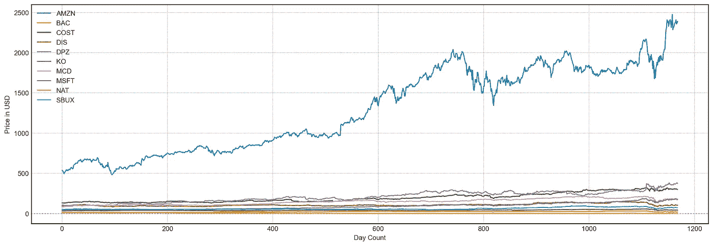
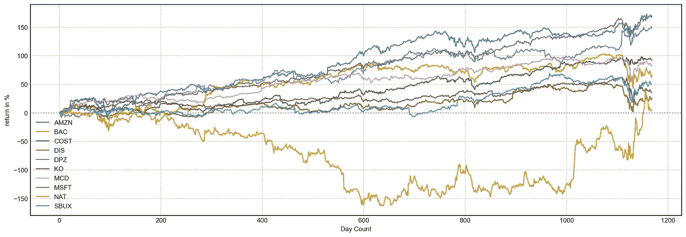
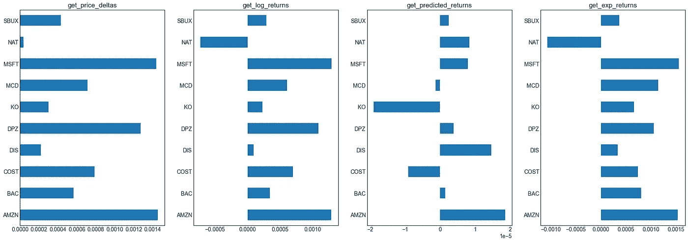
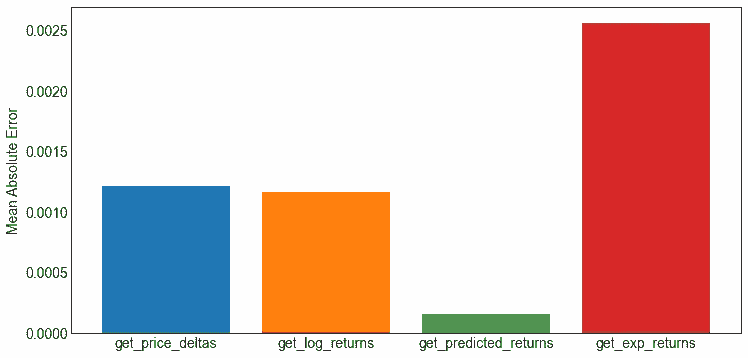
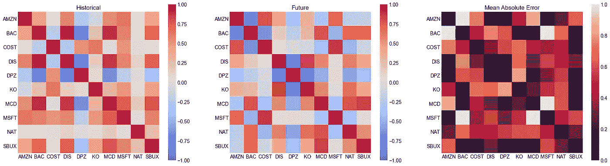
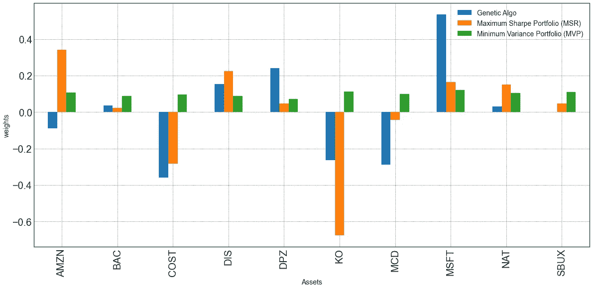
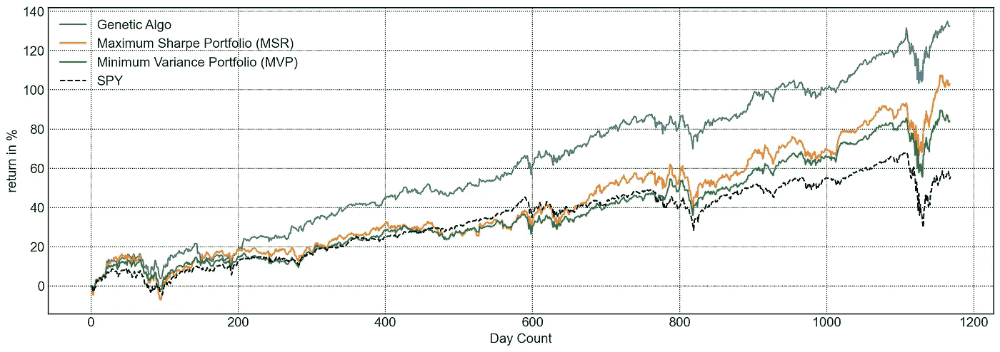
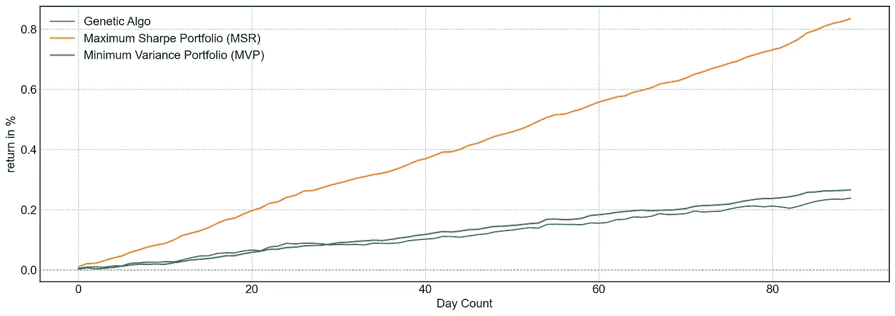
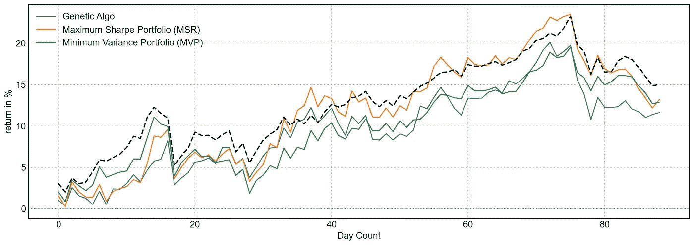

# 投资组合优化的科学

> 原文：<https://towardsdatascience.com/the-science-of-portfolio-optimization-186607d30416?source=collection_archive---------21----------------------->

## 如何使用数据科学来{重新}分配投资

尼古拉斯·卡佩罗在 [Unsplash](https://unsplash.com/s/photos/stock-market?utm_source=unsplash&utm_medium=referral&utm_content=creditCopyText) 上拍摄的照片

***来自《走向数据科学》编辑的提示:*** *虽然我们允许独立作者根据我们的* [*规则和指导方针*](/questions-96667b06af5) *发表文章，但我们并不认可每个作者的贡献。你不应该在没有寻求专业建议的情况下依赖一个作者的作品。详见我们的* [*读者术语*](/readers-terms-b5d780a700a4) *。*

不久前，我在为我的博士论文寻找灵感时观看了两门优秀的课程，即[金融理论 I](https://ocw.mit.edu/courses/sloan-school-of-management/15-401-finance-theory-i-fall-2008/) 和[数学中的金融应用主题](https://ocw.mit.edu/courses/mathematics/18-s096-topics-in-mathematics-with-applications-in-finance-fall-2013/)，这两门课程都可以在麻省理工学院的开放课件上免费获得。这些课程帮助我思考时间序列数据中的*【变化】*(我博士的课题)意味着什么。我想确定我已经学完了那两门课程的内容。因此，我决定实现一些产品，包括定价估算器、算法交易器和我将在这篇文章中提出的想法:投资组合优化器。

# 序文

这一切都始于优化交易机器人的想法。更具体地说，我在寻找能够检测时间序列变化并对不同类型的加密货币市场做出反应的机器人。我想到了创建一个 bot 投资组合的想法，它将研究市场的变化，并分配一个合适的 bot。

在研究交易机器人和实现我自己的想法时，我发现有人在为股票市场实现类似的软件。在后来的交谈中，我发现这个人碰巧和我学了完全一样的课程。当然，这两个课程都提出了这个想法来定量评估更好的资产组合。注意，类似的软件确实存在，比如 [PyPortfolioOpt](https://github.com/robertmartin8/PyPortfolioOpt) 。我的想法建立在最初发布的 [Eiten](https://github.com/tradytics/eiten) 之上，这是一个早期的开源项目。以下是我对投资组合优化的看法。

***注意，本帖不构成理财建议。如果你想投资，请咨询专业人士。最重要的是，做你自己的研究。***

# 投资组合选择与投资组合优化

首先，选择一组资产进行投资并不等同于对其进行优化。当选择一组资产时，人们在选择他们信任的公司的同时寻求分散投资。在优化方面，人们分析其选择的投资组合，管理投资于每项资产的金额。例如，一个人可以将 5%、30%和 0%投资于三种不同的资产。这是一个试图将风险最小化和/或回报最大化的资源分配问题。

我根据其他人之前选择的股票和我自己的判断选择了一些资产，我将用它们来举例说明我的管道。这些股票是:微软(Microsoft)、亚马逊(Amazon)、北欧美洲油轮(Nordic American Tanker)、美国银行(Bank of America Corp)、达美乐比萨(Domino's Pizza)、迪士尼(Disney)、可口可乐(Coca-Cola)、可口可乐(KO)、好市多(COST)和星巴克(Starbucks)。让我们从我选择的价格图表开始看。

一段时间内选定资产的价格。

随着时间的推移，这些股票似乎表现不错。然而，看价格并不能让我清楚地知道我能赚多少钱。我真正想知道的是，在研究期间，这些资产的回报率是多少。为了找到答案，我计算了每只股票在一段时间内的回报率。我在下图中展示了这个计算。

每项资产的累积百分比回报。

如果我只看价格，我会说亚马逊似乎比其他投资做得更好。当我分析回报时，我能更好地理解 MSFT 和 DPZ 紧随其后。

# 预测未来价格

我们希望我们的资产在未来表现良好。挑战是:我们不知道未来是什么样子，所以我们需要估计。我们首先将数据分成两组:历史数据和未来数据。请注意，因为我们没有应用机器学习算法，所以我们没有分成训练、验证和测试。

为了估计未来的回报，我们可以使用几种方法，如[样本回报](https://www.investopedia.com/articles/basics/10/guide-to-calculating-roi.asp)、 [CAPM](https://www.investopedia.com/terms/c/capm.asp) 等等。不同的方法会给我们每种资产不同的价格估值。使用估值器，我们可以分析每项资产的估计回报。例如，在下图中，我们可以探究四种不同的方法是如何估算所选资产的过去收益的。

给定我们的评估者，每个选定资产的估计回报

请注意，当我们使用基于百分比收益(又名 get_price_deltas)的估算器时，我们对所有资产的估值都是正值。使用更复杂的方法，如对数标度估计量(又名 get_log_returns)，我们可以捕捉到 NAT 在此期间显示的负回报。然后，我们可以将历史数据中的估值与未来数据中的估值进行比较，并计算回报，这样我们就可以评估每种方法，并选择一种方法来计算投资组合权重。我们计算了过去和未来之间的误差，并显示在下图中。

估计方法的平均绝对误差

在上面的分析中，最佳估计量是指数加权估计量(又名 get_predicted_returns)。其过去和未来数据之间的平均绝对误差(MAE)小于 0.1%。因此，我们将选择这个估计量来预测我们的投资组合权重。

# 协方差

有了回报，我们现在可以估计所选资产的相关性。我们将使用协方差计算来检查哪些资产具有相似的回报。这将使我们能够分散投资，确保我们投资的资产在其他资产表现不佳时能够增长。

再说一遍，市场是动态的，事情*一直在变*。过去相关的资产将来可能不相关！我们需要找到一个能很好地概括未来数据的协方差矩阵，所以我们比较了几种协方差计算方法。我们在下面展示了一个例子，但是我们支持 OAS [1]，Ledoit-Wolf [2]这样的方法。我们还支持基于随机矩阵理论的协方差矩阵清理方法。我不会在这方面赘述，你可以阅读斯科特·罗马的博客文章或者埃德尔曼和饶的精彩课堂笔记。

使用 NumPy 协方差函数计算的协方差矩阵

有了协方差矩阵和权重，我们现在可以应用策略来生成投资组合。策略向目标函数优化。例如，我们可以针对[夏普比率](https://www.investopedia.com/terms/s/sharperatio.asp)进行优化，我们希望在风险和回报之间找到平衡。使用回报和协方差矩阵，该策略将输出每项资产的权重。这些权重可以是正的也可以是负的。正权重意味着策略建议多头，而负权重意味着策略建议空头。多头头寸意味着资产被买入，我们预计回报将是正的(价格将随着时间的推移而上涨)。同样，空头头寸意味着资产被出售，我们预计回报将是负的(价格将随着时间的推移而下降)。你可以在这里阅读更多关于多头和空头头寸[。](https://www.investopedia.com/ask/answers/100314/whats-difference-between-long-and-short-position-market.asp)

投资组合中每项资产的每种应用策略的权重

在上图中，我们可以看到每个策略赋予每个资产的权重。然后，我们可以通过计算投入资金与权重的比率，使用这些权重来输出投资组合。

# 测试我们的投资组合

现在最大的问题是，如果我们使用给定策略的输出进行投资，我们的投资组合表现会有多好？我们可以通过将我们学到的策略运用到数据中来做到这一点。做机器学习的人(像我一样)，可能会对此感到畏缩，但没什么好害怕的，我们有部分数据集。请将此视为验证测试。

随着时间的推移，建议投资组合的回报

在上图中，我们可以看到所有提议的投资组合都击败了 S&P500(间谍)基准。众所周知，遗传算法的回报是基准的两倍多。

# 但我们的投资组合未来会有好的表现吗？

我们将通过两种不同的评估来回答这个问题。首先，我们将对未来价格进行蒙特卡洛模拟。简而言之，这是一种随机方法，我们使用过去的价格来寻找分布，并随机生成未来的价格。

蒙特卡洛试验中生成的投资组合的性能

我们看到，如果价格遵循蒙特卡洛价格，计算出的投资组合继续表现良好。特别是，最大的夏普投资组合(MSR)预测三个月后将超过 0.8%。

我们还留出了 90 天的数据来测试投资组合是否真的可以推广。给定投资组合权重，我们得到以下表现。

生成的投资组合在未来数据中的表现

我们可以看到，生成的投资组合表现接近基准，短期内表现稍差。MSR 的投资组合有时表现优于基准，但也存在差异。我们可以从最后的分析中学到一些东西:*多元化很重要*。该基准只有来自不同行业的大约 500 家不同公司，而拟议的投资组合只有 10 家。这使得投资组合更容易受到某个行业或某项资产特定变化的影响。选择好的股票甚至比优化更重要！

# 结论

投资组合优化是一项艰巨的任务，应该谨慎从事。一方面，一些渠道报告称，T2 的大多数基金经理无法跑赢基准，比如标准普尔 500 指数。另一方面，像 Renaissance 这样的基金多年来一直跑赢基准。

最后，投资组合构建甚至比投资组合优化更重要！优化很难，但如果我们试图优化表现不佳的股票，那就更难了。记得做你自己的研究，明智地选择资产，并在下面留下你的掌声。如果你喜欢你所读的内容，不要忘记关注我以获取更多未来的内容。

# 外部链接

这篇文章中使用的软件是开源的，可以在我的 [GitHub](https://github.com/silvavn/eiten) 中公开获得。欢迎随时在 [LinkedIn](https://www.linkedin.com/in/nascimentovictor/) 上联系我！对我好奇？这里是我的网站。[看看我关于股票价格预测的最新文章](https://medium.com/analytics-vidhya/the-science-of-future-price-prediction-5a488334f2c7)。

# 参考

[1]陈 Y，威塞尔 A，灵族，英雄敖。MMSE 协方差估计的收缩算法。 *IEEE 信号处理汇刊*。2010 年 6 月 14 日；58(10):5016–29.

[2] Ledoit O，Wolf M .高维协方差矩阵的条件良好的估计量。*多变量分析杂志*。2004 年 2 月 1 日；88(2):365–411.

[3]埃德尔曼 A，饶 NR。随机矩阵理论。*数字行动*。2005 年 5 月 1 日；14:233.

[4]穆尼 CZ。蒙特卡洛模拟。Sage 出版物；1997 年 4 月 7 日。