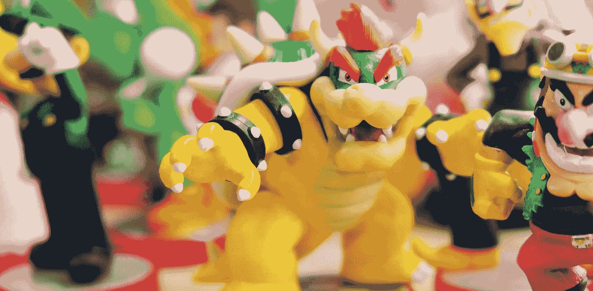
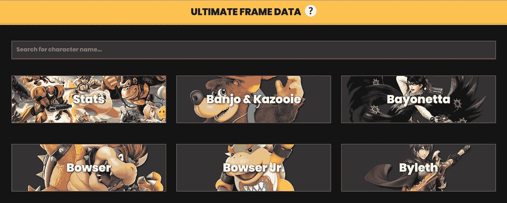
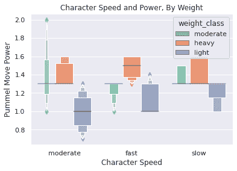
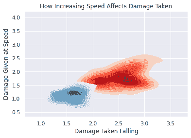
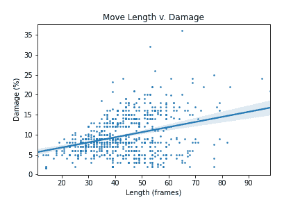
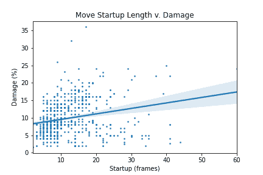
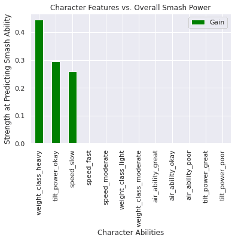

# 超级成功的科学

> 原文：<https://towardsdatascience.com/the-science-to-super-smash-success-272cad62b03d?source=collection_archive---------48----------------------->

图片来自 Unsplash.com(免费)

## 每次都使用 Python 准确预测如何赢得超级粉碎兄弟终极版。

*使用 Ryland Leupold 完成分析。在 GitHub 上找到代码* [***这里***](https://github.com/aditimahabal/summer-2020/blob/master/smash_bros.ipynb) ***。***

# 介绍

如果你正在读这篇文章，你可能听说过，玩过，或者看过别人玩超级粉碎兄弟。你也可能在游戏中表现很好，还可以，或者很差(像我一样)。**下面的 Python 建模和分析使用了《超级粉碎兄弟终极版》中 73 个可玩角色的角色战斗统计数据，以精确地最大化任何人的获胜机会。**觉得不可能打败游戏？继续读。所有的结论和最大化胜利的建议都列在底部。

## 背景

超级粉碎兄弟终极版是一款由任天堂创建的交叉格斗视频游戏，有超过 70 名来自不同任天堂特许经营的可玩战士。这款游戏非常受欢迎，人们在网上花费数小时创建自己的等级和排名，亲自决定“最佳”超级粉碎角色。

为了进行更定量的分析，关于每个可玩角色的战斗统计数据是从[ultimateframedata.com](https://ultimateframedata.com/)中抓取的，它提供了每个角色的地面、空中、特殊和其他攻击的信息，以及每次攻击的 fps 启动速度(点击攻击启动的控制器后多长时间，以每秒帧数为单位)。

# 分析

一个关键的主要发现是**较轻的角色使用与他们较重的对手**相同的击打动作**在所有的战斗速度下造成较少的伤害**。不管速度如何，只有重的角色才有稳定的击打伤害，这表明他们总是更强大。

另一个关键发现是，任何**自降速度的减缓都会导致受到的伤害**大大降低。增加移动速度只会对对手造成**少量的伤害增加**，这意味着**移动更慢，协同攻击**比跑更好。

也有几个权衡的时间，每一步采取完全执行对手。**需要更长时间完成的移动往往有更高的伤害，但会迫使角色在原地停留更长时间**；当执行更长的移动时，风险与回报类型的思考。下面举例说明了这种权衡。

# 建模

为了测试更重的角色总体上更慢但更强大的普遍发现，我们可以分析角色属性如何最好地分类粉碎-移动能力；**换句话说，什么样的角色整体扣球能力更高/更强？**

使用重量、力量和速度属性将每个角色分类为强或弱类别，我们使用**决策树分类器**(简单条件预测器)、**梯度推进分类器**(最小化总体误差)和**逻辑回归**(关系/预测器的强度)。这三个测试可以全面确认或拒绝我们的发现。

三个模型中的每一个都证实了 **73%的准确率**在预测角色的粉碎力。每个模型都表明重的体重、中等的倾斜力量和慢的速度是性格力量的最强预测因素。这个**证实了一个理论，即更重、更慢的角色是最强大的。**

# 结果和建议

我们可以明确地得出结论，当选择一个粉碎的终极角色时会有权衡，如果这个角色发挥了它的长处，胜利是有保证的。让我们重温一下我们关于较重的角色最强大的结论。单纯选择较重的角色并不能保证胜利。还必须考虑以下因素:

1.  重的角色施加更多的伤害，但是速度更慢，更容易被击中。
2.  专注**预测对手动作**用高伤害招式惩罚。
3.  持续时间长的招式会造成很大的伤害，但是只有在你确信它们会击中的情况下才使用**，否则你就会成为活靶子。**
4.  最重的人物是**布瑟和大金刚。**

但这并不意味着只有更重的角色才能确保胜利！我们的速度分析告诉我们，较轻的角色应该按照以下相邻的规则来玩:

1.  较轻的角色造成的伤害**较少**，但是**更快也更难击中。**
2.  重点**利用速度躲避对手**并利用难以惩罚的快速移动。
3.  **仅在必要时运行，**并尝试**缓慢下降**以获得更少的损伤/更多的整体给定。
4.  最轻的角色是**桃公主和吹牛老爹孔。**

相信了吗？自己试试这些建议，或者在你自己的超级粉碎兄弟技巧下面发表评论——看看数据是否支持你所说的。