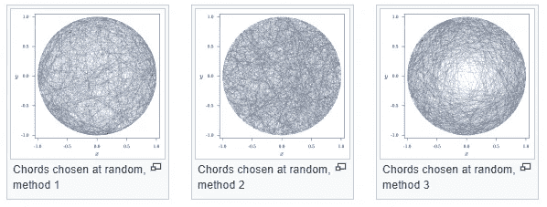

# 人工智能系统中分析可变性的灾难

> 原文：<https://towardsdatascience.com/the-scourge-of-analytical-variability-in-ai-systems-fc6e1ec8daae?source=collection_archive---------65----------------------->

## 走向艾的生产力高原

## 为什么工作流和管道的标准化对于构建高效可靠的人工智能系统至关重要？

在 [Unsplash](https://unsplash.com?utm_source=medium&utm_medium=referral) 上由 [Franck V.](https://unsplash.com/@franckinjapan?utm_source=medium&utm_medium=referral) 拍摄的照片

概率论的经典解释中有一个著名的悖论叫做 [**贝特朗悖论**](https://en.wikipedia.org/wiki/Bertrand_paradox_(probability)) 。伯特兰把一个非常简单的问题表述如下。

> 在一个圆内接一个等边三角形，然后确定随机选择一条弦使其尺寸大于三角形边长的概率。

感谢:罗伯特·皮什([维基百科](https://en.wikipedia.org/wiki/Bertrand_paradox_(probability)) ) [CC BY-SA 3.0](http://creativecommons.org/licenses/by-sa/3.0/)

他给了*三个* **有效的**论据来解决这个问题，但每一个都产生了不同的结果。如果感兴趣，可以查看维基百科上关于这三个论点的文章。这个悖论的解决源于这样一个事实，即每一个有效的论点似乎都在解决同一个问题，但本质上它们是在解决不同的数学问题。

我将在这篇文章的背景下重新审视这个悖论，但在此之前，需要强调我们目前构建人工智能系统的方式中的一些问题。

在 ICT 行业，工程师越来越多地转向构建人工智能系统，通过解决现有问题和提高流程效率来为客户增加价值。随着深度学习看似成功的应用，专家们确信人工智能的冬天终于结束了。

但是，在建立人工智能系统时，我们至少要处理三个主要问题(各种专家也报道过)。

## 构建黑盒模型

ML 工程师在不同的抽象层工作。对于打算将其与整个系统集成的工程师来说，底层机器学习算法往往是一个黑匣子。一般来说，一个特定模型的使用伴随着许多很少被验证的假设。

ML 工程师倾向于使用大量开源包。一般来说，在 *python* 环境的情况下，一个特定的包带有一系列的依赖性。如果达到了预期的结果，那就好，否则就要尝试另一个具有大量依赖项的包。不需要投资去理解为什么某件事行得通，或者为什么行不通。这些软件包没有标准，而且通常没有对这些模型进行严格的测试和评估。这种黑箱方法不利于确保人工智能系统的可靠性。此外，当正确性本身受到质疑时，效率被迫退居二线。

但问题不仅仅是工程师应该遵循的最佳实践。深度学习模型目前在工作中并不透明，它们的底层特征对研究人员来说仍然是一个谜。事实上，实证结果与现有的统计学和最优化理论相矛盾。事实上，据称深度学习研究人员的行为就像[中世纪炼金术士](https://www.sciencemag.org/news/2018/05/ai-researchers-allege-machine-learning-alchemy)试图创造类似于他们试图制造黄金的魔法。

这种缺乏理解也是造成另一个问题的部分原因，这就是缺乏再现性。

## 缺乏再现性

人们期望一个知名研究者发表的算法在被其他人独立正确地重新实现时会产生相同的结果(无论是人还是[机器](https://www.ibm.com/blogs/research/2018/02/deep-learning-models/))。

由于糟糕的学术实践，部分原因是围绕人工智能的炒作，许多研究人员在开发算法时走捷径。例如，最近有研究表明，许多有望超过现有最先进水平的深度学习模型要么[未能](https://www.sciencemag.org/news/2020/05/eye-catching-advances-some-ai-fields-are-not-real)令人信服地做到这一点，要么通过应用简单的启发式算法，传统的 ML 算法可以在指定的数据集上做同样的事情。另一个渎职的例子是只报告算法多次运行的最佳结果，而不披露差结果的细节。

除了缺乏对深度学习模型的理解，如上所述，研究人员未能解释他们的算法中可以归因于结果改善的部分。这使得另一个研究者很难分析为什么在重新执行时结果会不同。

## 隐藏的技术债务

当构建人工智能系统时，机器学习组件是微不足道的，而围绕它的“管道”消耗了大部分精力。来自 Google 的 Scully 等人在 2015 年展示了他们的[工作](https://papers.nips.cc/paper/5656-hidden-technical-debt-in-machine-learning-systems.pdf),强调了构建 ML 系统的风险因素，由于未声明的数据依赖、纠缠、软件反模式等因素，这可能导致未来的高维护成本。

例如，考虑这样一个场景，其中为了特定目的以日志的形式提取数据。另一组在此基础上构建一个 ML 系统(或多个相互依赖的系统),假设数据将保持其一致性。在某个时间点，如果数据捕获方法或数据本身的性质被更改为适合原始目的，这将导致相关系统层级中的级联故障。

## 人工智能系统中的分析可变性是什么？

在此背景下，让我们以 ML 系统中的*分析可变性*的形式来讨论这些问题的主要表现。作为一个动机，首先让我们讨论一下[最近在神经成像领域的工作](https://www.nature.com/articles/s41586-020-2314-9)，其中**70 个**独立团队的任务是使用相同的数据集测试相同的假设集。团队可以灵活使用自己的分析工作流程和管道。最后，由于方法不同，各小组得出的结论有很大差异。这就想起了前面解释过的著名的*伯特兰悖论*。

这个悖论类似于一个典型的机器学习工程师试图建立一个系统来解决特定的现实世界问题的场景。类似于 Bertrand 给出的三个完全有效的论点，一个用*英语*给出的问题，但给出的解决方案结果是对应于三个完全不同的数学问题；ML 工程师有责任开发完全不同版本的系统，试图解决相同的问题，但本质上产生不同的结果。

当数据科学家或工程师分析、设计和实施 ML 系统时，上述三个*问题以各种方式出现时，这种情况经常发生。*

随着人工智能走向生产力的高原，我们预计它将超越脸书、谷歌、推特等互联网公司。并在医疗保健、医药、教育、交通等领域发挥更积极的作用。

考虑卫生部门中的任意场景，其中新疫苗已经成功开发，并且需要推荐系统来识别在第一阶段必须开始接种疫苗的人群。这项活动是最重要的，其风险远远高于推荐系统，推荐系统推荐电影供消遣。如果给三个数据科学家这个任务，他们会提出三个不同的系统，产生非常不同的输出。*这样的 AI 系统可靠吗*？*决策者为什么要相信这一点？*

此外，如果同一个数据科学家再次应用相同的流程，是否能保证他会得到相同的解决方案？不出意料，答案是*不！—* 如上所述，ML 系统面临着大量的再现性问题。

人工智能系统中的这种*分析可变性*极其危险，因为它直接控制着人们的生活。

照片由 [NeONBRAND](https://unsplash.com/@neonbrand?utm_source=medium&utm_medium=referral) 在 [Unsplash](https://unsplash.com?utm_source=medium&utm_medium=referral) 上拍摄

## **潜在步骤**

毫无疑问的事实是，最终，人工智能将达到其生产力的高原。但为了在最短的时间内达到这一目标，同时建立决策者的信心，人工智能从业者应对人工智能系统中分析可变性的灾难至关重要。

以下是实现这一目标的三种可能方法。

1.  为开发 AI 系统的管道和工作流制定标准。确保作为构建模块的机器学习 API 配备有严格的使用指南。
2.  在使用复杂的算法之前，数据科学家或 ML 工程师必须使用传统的 ML 算法或简单的试探法来开发基线。随着时间的推移，这些基线必须在行业中标准化。
3.  软件测试人员和他们现有的范例对于‘测试’人工智能系统不是特别有用。应该开发更复杂的对抗性人工智能系统来做到这一点。本质上，它相当于由一组其他人工智能系统测试人工智能系统。这种方法值得单独写一篇文章。

随着我们转向人工智能在警察、医学、农业、安全等领域更负责任的应用。我们必须确保我们构建的人工智能系统是可靠和高效的。