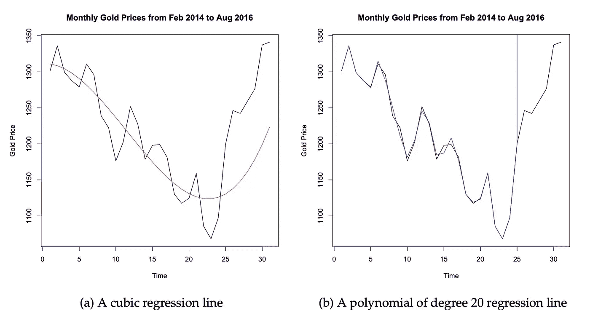
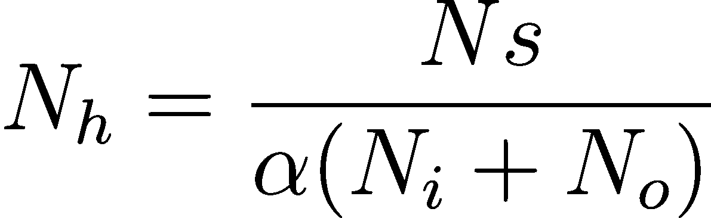

# 秘密神经网络公式

> 原文：<https://towardsdatascience.com/the-secret-neural-network-formula-70b41f0da767?source=collection_archive---------42----------------------->

## 如何在不过度拟合的情况下制作复杂的神经网络！

照片来自[创业股票照片](https://startupstockphotos.com/)。

# 介绍

为深度学习模型选择正确的架构可以极大地改变所取得的结果。使用太少的神经元会导致模型无法发现数据中的复杂关系，而使用太多的神经元会导致过度拟合效应。

对于表格数据，通常认为不需要很多层，一两层就足够了。为了帮助理解为什么这就足够了，看看[通用逼近定理](https://en.wikipedia.org/wiki/Universal_approximation_theorem)，它(用简单的术语)证明了一个只有一层和有限数量神经元的神经网络可以逼近任何连续函数。

> **然而，你如何为神经网络挑选神经元的数量呢？**

# 确定神经元的数量

目标是找到正确数量的神经元，以防止过度拟合和欠拟合，当然，这不是防止过度拟合和欠拟合的全部解决方案，但它有助于减少这种情况的发生。

在机器和深度学习中，模型的自由度是可以*学习*的参数数量。增加模型的自由度可以让模型更灵活地适应更复杂的函数，但是过多的自由度会让模型过度适应数据。

这可以从下图中看出:

拟合前 25 个数据点并用于预测最后 5 个数据点的两条线性回归线。

> 这意味着减少过度拟合的一种方法是限制模型中的自由度。

我在研究这个问题时发现的一个公式是:

*N_h* 为神经元数量， *N_s* 为训练样本数量， *N_i* 为输入神经元数量， *N_o* 为输出神经元数量，*α*为待选超参数。

数据集中的自由度是 *N_s(N_i + N_o)* ，目的是将模型中自由参数的数量限制在数据自由度的一小部分。如果你的数据是一个很好的代表，这应该允许模型很好地概括，太多的参数，这意味着模型可以*过度适应*训练集。

*Alpha* 表示与您的模型相比，您的数据多了多少自由度。有了 *alpha = 2* ，你的数据中的自由度将是你的模型中的两倍。建议使用*2–10*的 *alpha* 值，您可以循环查找最佳的 *alpha* 值。

帮助我直观理解公式的一个方法是让 *beta* = *1/alpha* (保持 alpha 在 2 到 10 之间)，然后增加 *beta* 表示复杂度增加。一个更加**非线性**的问题将需要一个**更大的**贝塔。

> 主要规则是保持 *alpha ≥ 1* ，因为这意味着模型自由度永远不会大于数据集中的自由度。

# 例子

这个例子是一个 Jupyter 笔记本，比较了杰夫·希顿在选择一层中的神经元数量时给出的建议。我选择这个建议是因为新手很可能会听从杰夫·希顿的建议，因为他在这个领域很重要。

这丝毫没有偏离杰夫·希顿的建议，而是试图展示如何使用这篇博客文章中提供的公式选择神经元的数量，数据科学家可以在不过度拟合的情况下创建更复杂的神经网络。创建更复杂的神经网络可以带来更好的结果。

杰夫·希顿的建议是:

> 1.隐藏神经元的数量应该在输入层的大小和输出层的大小之间。
> 
> 2.隐藏神经元的数量应该是输入层大小的 2/3，加上输出层的大小。
> 
> 3.隐藏神经元的数量应该小于输入层大小的两倍。

# 参考

[1]**stack exchange**[https://stats . stack exchange . com/questions/181/how-to-choose-the-number-of-hidden-layers-and-nodes-in-a-前馈神经网络](https://stats.stackexchange.com/questions/181/how-to-choose-the-number-of-hidden-layers-and-nodes-in-a-feedforward-neural-netw)中的公式参考

[2]杰夫·希顿的。*隐藏层数。* **希顿研究。**[https://www . Heaton research . com/2017/06/01/hidden-layers . html](https://www.heatonresearch.com/2017/06/01/hidden-layers.html)

[3]杰瑞米·霍华德和西尔万·古格。 *fastai:深度学习的分层 API*。 **arXiv** 。arXiv:2002.04688[https://arxiv.org/abs/2002.04688](https://arxiv.org/abs/2002.04688)。2020.