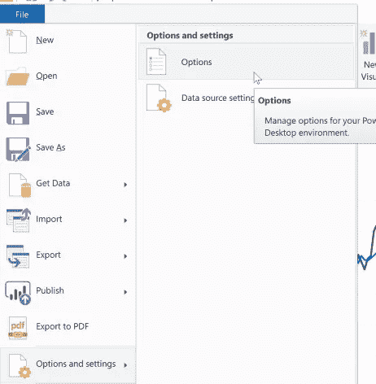
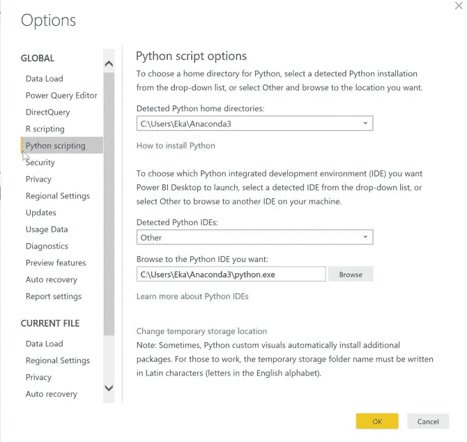
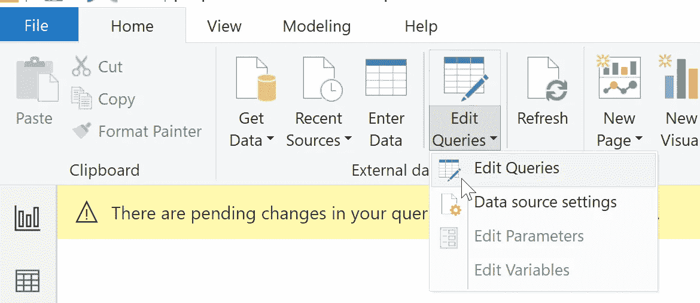
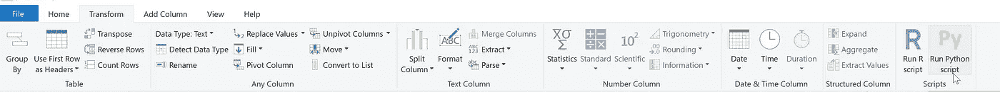
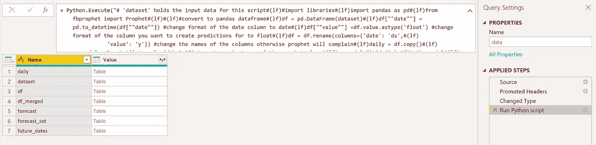
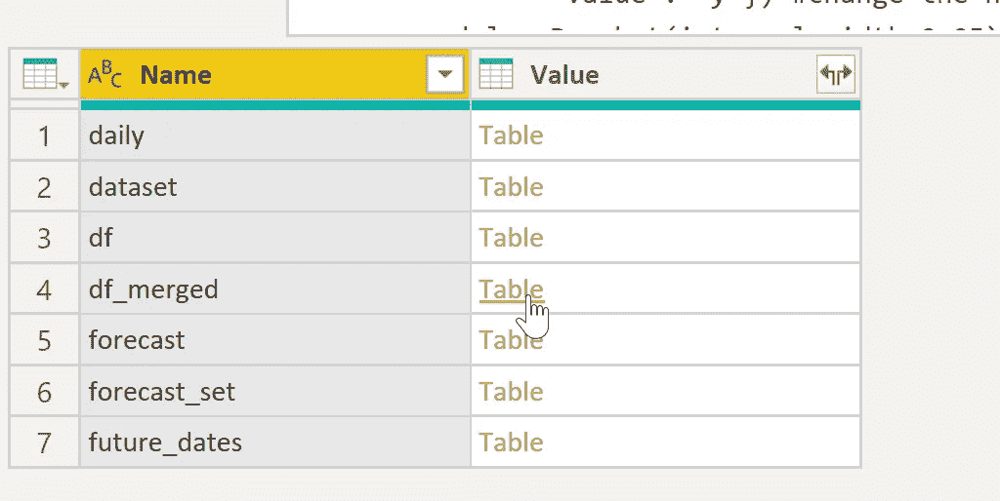
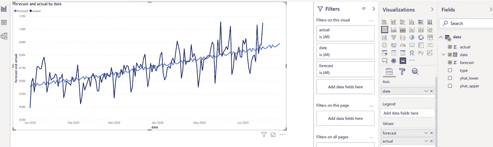
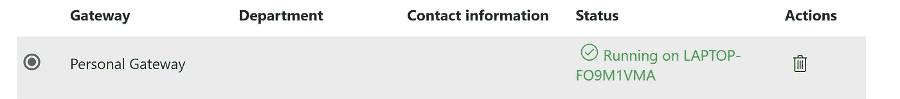

# 现代神谕的秘方

> 原文：<https://towardsdatascience.com/the-secret-recipe-for-modern-oracles-2ab69b09465c?source=collection_archive---------66----------------------->


来源:[约翰·科利尔/公共领域](https://commons.wikimedia.org/wiki/File:John_Collier_-_Priestess_of_Delphi.jpg)

在古希腊，人们相信任何重要的决定都是由神来指导的，因此，人们认为神是通过神谕来说话的——来自拉丁语动词‘orare’(说话)。先知被咨询关于农作物的产量，健康问题，财政财富，等等。现代的甲骨文离开了希腊，改变了服装，并缩小了一个人的重点，以预测公司的收入，客户流失，和公司的销售。有许多预测技术和方法，现代的甲骨文可以用来做到这一点，从德尔菲技术到脚本编写，时间序列预测，但在这篇文章中，我想谈谈时间序列预测与先知。

Prophet 是脸书发布的开源 R 和 Python 库，基于可分解的(趋势+季节性+假期)模型——在这里阅读更多[。](http://facebook.github.io/prophet/.)我在库中最喜欢的是，您可以对周期性事件(如季节性事件)和不规则事件(如节假日)进行建模。想知道如何以互动的形式自动获得你的预测吗？力量 BI 来拯救你。

# 什么？

Python 库、Power BI Desktop & Power BI Pro(云)、csv/a 数据库连接和个人网关。

# 怎么会？

*第一步。*起初，我以为我会带着我的 Python 库离开，但是经过几个小时与'`unable-to-import-required-dependencies:numpy`'、'`unable-to-import-required-dependencies:matplotlib`'、'`please-install-mkl-service-package`'等的斗争之后。我认输了，安装了康达(此处阅读安装指南[)。我第二次举起白旗是在安装 Anaconda 之后，我既没有在“默认路径”上安装 Anaconda，也没有将 Anaconda 的 python 设置为默认的 python 命令…嗯，起泡沫，冲洗，重复。](https://docs.conda.io/projects/conda/en/latest/user-guide/install/index.html)

*第二步。*如果你选择了“只有我”——我就是这么做的，默认情况下，Anaconda 会被安装在`C:\Users\{YourUserName}\Anaconda3`文件夹中。如果你不确定，在任务栏的搜索框中输入 cmd 然后点击“Enter”打开常规的命令提示符(适用于 Windows 用户)，然后输入`where python`获得 Python 路径。就我而言，我得到了`C:\Users\Eka\Anaconda3\python.exe`。太好了。

*第三步。*打开你的 Power BI 桌面> > *文件> >选项和设置* > > *选项*，添加你的 Anaconda 路径和 Python 可执行文件的路径。如果你已经创建了一个虚拟环境，请看这里的文章。



更改目录



更改目录 _2

*第四步*。*通过添加您的数据源获取数据*。在我的。 [pbix](https://github.com/eponkratova/articles/blob/master/powerbi_prophet/prophet.pbix) ，我已经连接到了一个 csv 文件——当前的解决方案也在数据库连接上进行了测试——它具有“日期”、“值”和“类型”列(参见此处的文件)。

*第五步*。转到*主页> >编辑查询*进入超级查询编辑器。



运行 Python 脚本

*第六步*。将日期列改为“文本”是很重要的，否则，您将得到“microsoft.ole.db.date”错误—是的，在我的例子中，这是一个很大的改动。

在查询编辑器中，点击*转换>运行 Python 脚本*。



运行 Python 脚本 _2

*步骤 7。*在脚本编辑器窗口中添加你的代码。我最初的错误是我没有改变‘value’列的类型，所以当我得到新的 float 实际记录时，脚本失败了。下面的脚本很基本，只是为了演示这一点，对于更高级的选项，请参考库文档[这里](https://facebook.github.io/prophet/docs/quick_start.html)。

```
# 'dataset' holds the input data for this script
#import libraries
import pandas as pd
from fbprophet import Prophet#convert to pandas dataframe
df = pd.DataFrame(dataset)
df["date"] = pd.to_datetime(df["date"]) #change format of the date column to date
df["value"] = df.value.astype('float') #change format of the column you want to create predictions for to float
df = df.rename(columns={'date': 'ds',
                        'value': 'y'}) #change the names of the columns otherwise prophet will complain
daily = df.copy()
my_model = Prophet(interval_width=0.95) #create an instance of the prophet class
my_model.fit(daily) #fit the model
future_dates = my_model.make_future_dataframe(periods=12, freq='d') #create empty future dataframe 
forecast = my_model.predict(future_dates) #create predictions
forecast_set = forecast[['ds', 'yhat', 'yhat_lower', 'yhat_upper']] #select only certain fields
df_merged = pd.merge(forecast_set, df, how='left') #merge original dataframe with the predictions
df_merged.columns = ['date','forecast','yhat_lower','yhat_upper','actual', 'type'] #re-name the columns
```

*第 8 步*。如果你成功地完成了“起泡、冲洗、重复”的循环，你应该能看到几个表格被创建。点击**表格**中与“df_merged”相对的超链接，加载与您的实际数据框合并的预测数据框。然后，*关闭&应用*加载到您的 Power BI 桌面。



加载结果



加载结果 _2

*步骤九。*根据您的要求创建视觉效果，*将工作簿发布到*Power BI cloud。



创造视觉效果

*第十步*。例如，从[这里](https://www.microsoft.com/en-us/download/details.aspx?id=55768)下载并安装个人网关。请记住，您需要个人网关，因为互联网上评论说，您只能通过个人网关运行 Python 脚本。登录到您的 Power BI cloud，确保网关启动并运行。



验证网关

*第十一步。*为该网关添加数据源，并安排仪表板刷新。说完，我结束了我的循环。

作为一个预言未来的先知，感觉如何？

附言:我没有测试过的:声明“运行超过 30 分钟的 Python 脚本会自动超时。”；如何将每日数据汇总到每周/每月。

非常感谢为这篇文章提供灵感的 Sanjo。