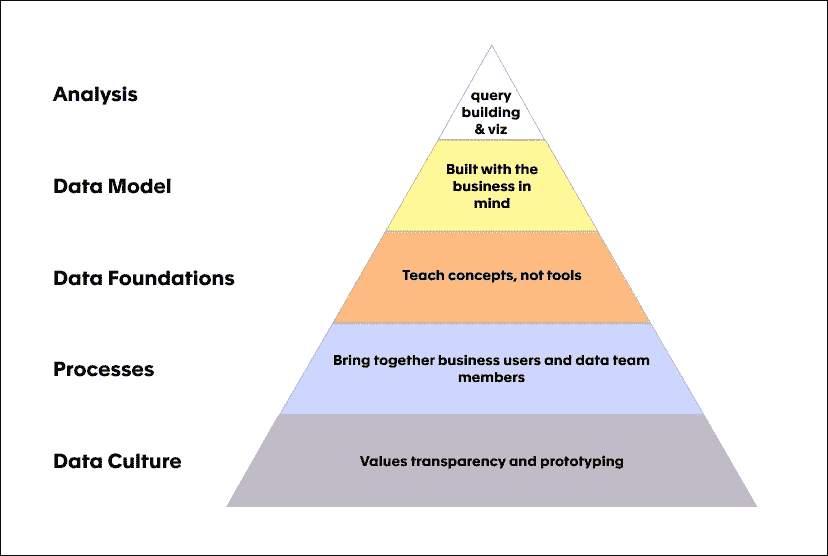
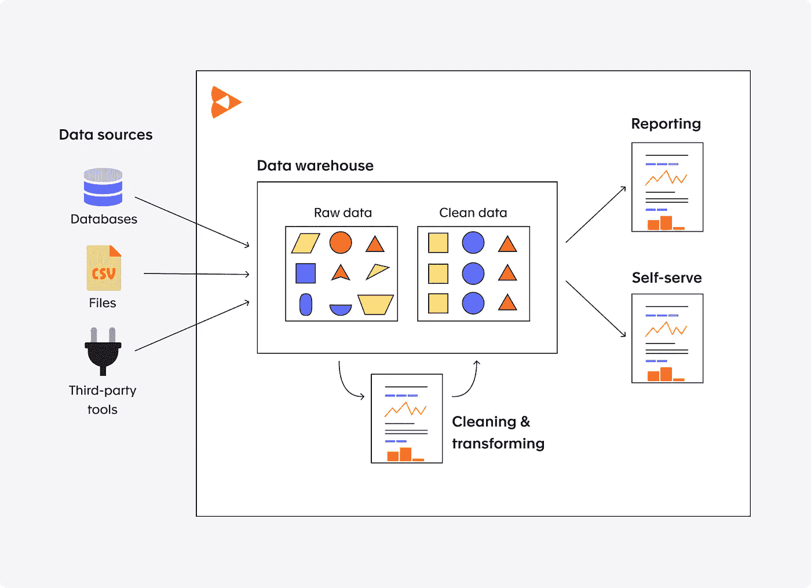

# 自助神话

> 原文：<https://towardsdatascience.com/the-self-service-myth-b3d8fad3b3ae?source=collection_archive---------32----------------------->

## *以及数据民主的需求层次*

由[克里斯·利维拉尼](https://unsplash.com/@chrisliverani?utm_source=unsplash&utm_medium=referral&utm_content=creditCopyText)在 [Unsplash](https://unsplash.com/s/photos/data?utm_source=unsplash&utm_medium=referral&utm_content=creditCopyText) 上拍摄

## TL；速度三角形定位法(dead reckoning)

建立数据民主很困难，但并非不可能。没有工具可以修复文化之类的东西或为您创建流程，但是任何工具与您业务的这些部分的集成程度都可以决定您的数据民主是成为新的现实，还是只是一个失败的实验。

数据有区分观点和偏好的诀窍，但有一样东西我们似乎都想要:数据民主。无论你是分析师、首席执行官还是企业用户，将“数据的力量”带给人们的想法都非常吸引人。

然而很少有公司能达到这个目标。就像他们的政治表亲一样，数据民主几乎不可能正确。

那么，为什么数据民主会失败呢？你如何避免同样的错误？

在过去的 10 年里，我一直在大型和小型公司的数据团队中工作，并参与了许多数据民主化计划。在过去的几年里，我有幸与数百家公司讨论过这个话题。

在梳理这些经历时，我震惊地发现，这些公司中有多少曾经充满热情并决心让他们的团队能够使用数据，但最终却满足于更少的东西。事实上，他们中的许多人都有如此痛苦的经历，以至于他们最终转向了完全相反的方向:一个高度控制的数据环境，用户只能从少数报告中获得数据，甚至很少有人被允许进行自己的分析。

对于这些公司中的大多数来说，许多失误导致他们放弃了数据民主愿景，但第一个*失误却惊人地一致。他们采用了市场上众多自助分析选项中的一个，并假设仅*一项*就能实现他们的愿景。*

剧透:没有。

# 我为你做了笔交易！

> **自助服务分析**是商业智能(BI)的一种形式，支持并鼓励业务线专业人员在名义上的 IT 支持下自行执行查询并生成报告—高德纳[1]

过去十年见证了自助式分析工具的爆炸式增长。这些工具承诺了一种非常简单的数据分析体验，以至于你公司的任何人都可以像专家一样分析数据。没有编程语言。没有包裹。没问题。听起来相当完美…

难怪公司会将这些工具作为数据民主之旅的第一步。但在我的研究中，我发现投资自助服务解决方案的公司很难真正实现用数据赋予员工权力的目标。那么，这到底是哪里出了问题？

## 陡峭的学习曲线

在大多数自助工具中，简单的事情很容易，但中等难度的事情却非常痛苦。

这意味着一旦所有的基本分析都完成了，就很难再继续深入挖掘寻找答案了。用户可能会看到销售额呈下降趋势，但他们可能无法找出*为什么*。

## 你的数据一团糟。

这当然让我们看到了你的数据！通常，获得自助服务工具的公司还没有投资让他们的数据*对典型的商业用户可用*。所以最初的几个月(几年？)仍然需要分析师创建大量定制视图，并回答关于他们应该使用哪个版本的“user_id”的相同问题。

## 你跳过了最基本的。

人们很容易认为，当被问到时，我们都会记得我们在高中学到的东西，但事实并非如此。如果你已经 10 多年没有考虑过均值和中值之间的区别，你可能不习惯在给老板的报告中选择哪一个。对于大多数商业用户来说，知道*做什么比*如何做*更具挑战性。*

## 你的文化和流程不支持。

在这一点上，您的业务用户感到非常害怕，完全没有权力，即使他们知道他们应该像过时一样分析数据。最糟糕的情况是没有人提到他们的挫折，但他们经常这样做，但这不是人们想听到的。毕竟，他们刚刚在一个本应使分析变得简单的工具上投入了大量资金，而且很可能被一份合同锁定，所以这并不是什么好消息。

有了后知之明，我们可以考虑事情可能会有什么不同…

# 在你毁掉自己之前，先检查一下自己

自助服务工具专注于简化用户查询和可视化数据的方式，很大程度上忽略了其他一切。需要说明的是，他们中的大多数在这一部分做得相当好。这并不能解决你的大部分问题。

在投资任何工具之前，考虑实现数据民主所涉及的其他因素是很重要的。通过我们的研究，我们已经确定了一个数据民主需求层次结构，它对这些要素进行了优先排序，并为您提供了一种更现实的方法来评估您的选项。

在我们的研究中，我们排除了数据科学和人工智能领域，因为它们产生了自己的挑战，并专注于如何使业务用户能够使用数据做出他们需要的决策。虽然这些层中的每一层都有自己的一篇文章(敬请关注)，但下面有对每一层的简要介绍:

## 文化👐

> 原型和透明 FTW

为了使这种转变成功，文化需要能够容忍一些失败。特别是你的团队和领导，应该准备好重复这个过程，在报告中看到“坏”的数字，尝试不起作用的过程，等等。成长从来都不容易，但如果每个人都认同最终目标，那就值得了。

建议:改变文化是出了名的困难，与其说是一门科学，不如说是一门艺术，但是这篇文章[*【HBR】*](https://hbr.org/2020/02/10-steps-to-creating-a-data-driven-culture)*有一些实用的技巧。*

## 处理🗺️

> 早点开始；翻新很难

过程是任何文化的支架。在这里，你要弄清楚如何让用户觉得他们的声音被听到了，让他们觉得把数字弄对没有学习过程重要。其中的关键部分是找到将数据团队与业务整合的方法，而不是使用自助服务工具来进一步分离它们。

*建议:定期* [*KPI 评审*](https://count.co/n/CVIPVUvJ5Jf) *与业务&数据团队*

## 数据基础🔤

> 教概念，不教工具。

这个阶段开始将短暂的文化与具体的数据联系起来。它包括回顾 KPI 的含义，*和*对数据更基本的理解。您不需要教每个人 SQL，甚至什么是关系数据库，但只要让他们能够舒服地询问他们负责的指标，并得到他们需要的答案就足够了。

建议:我在下面写了一些想法。尝试根据您公司的数据和指标对其进行定制。

 [## 为什么您的数据素养培训不起作用

### 以及如何修复它

medium.com](https://medium.com/count/why-your-data-literacy-training-isnt-working-158122b43181) 

## 数据模型🥇

> 以业务为中心构建

是的，您需要为您的业务用户构建简化的视图。是的，你需要广泛地记录它们。但更重要的是，他们需要了解这些领域如何与他们现有的世界联系起来。这意味着你需要和他们坐下来，帮助他们弄清楚如何建造他们想看的东西。在几次这样的会议之后，你会开始找到一些可以为他们服务的静态视图..直到他们的问题变得更加复杂，他们需要更多。顺便说一下，那是一个*好的*标志。

*建议:利用数据字典，向任何需要的人公开你的数据模型*

## 数据分析📊

> 让用户能够使用数据做出决策

最后，你如何从这些数据中提取一些你现在理解并有信心使用的意义？一旦解决了以上所有问题，你会惊讶地发现这一步是多么简单。这里的例子很多，所以要确保有足够多的好例子，用户可以复制并开始试验。关键是用户必须能够理解他们得到的报告，识别问题，*和*能够使用数据找到解决方案。专注于帮助用户利用数据做决策，而不仅仅是拿出数字。

*建议:从他们已经熟悉的关键绩效指标开始，与他们一起理解数据是如何呈现的，以及他们如何挖掘这些数据以了解更多。*

# 展望未来

希望现在已经很清楚了，没有什么灵丹妙药可以让你的公司瞬间变成一个高效的数据民主国家。然而，工具确实发挥了巨大的作用。选择正确的方法与让你的文化和流程正确同样重要。

## 堆叠在堆叠在堆叠上

对于公司来说，为流程的每个部分选择由不同工具组成的数据堆栈是很常见的:收集数据、转换数据、存储数据、分析数据和元数据。这种方法成本高、耗时，并且需要大量开销来管理单独的工具。如果你能管理它，你越能利用单一的工具，你的数据民主就越好。更少的工具意味着端到端的流程更容易遵循——黑箱更少，事情更透明。随着您的成长，您可能需要扩展到更专业的工具，但是如果可以的话，简单的堆栈也有好处。

如果你想建立一个数据民主，上面解释的层次结构提供了一个很好的基准来评估你的选择。

**快速环顾四周**

随着新工具的不断涌现，这个领域正在快速变化。也就是说，有几组玩家是一致的:

*   仅 SQL 查询构建器:市场上最常见的工具，这些工具仅触及金字塔的最顶层。我不鼓励您从这里开始，但是如果您觉得您已经完成了金字塔的其余部分，并且您的团队已经很擅长 SQL，那么它们可能会起作用。
*   **基于模型的方法:**这些工具在层次结构上更进一步，它们允许数据定义和一些数据建模功能，因此您可以使更多的 ETL 过程对业务透明。
*   **一体机:**提供端到端功能的工具甚至更少，这意味着您可以在一个地方存储、建模、记录和可视化。特别是小团队，可以从快速采用一体化工具而不是长时间使用几个独立的工具中获益。

在过去的几年里，我一直是开发这种工具的团队的一员。您可以在此了解我们的更多信息:

 [## Count -一体化数据平台。

### 组合、组织和可视化数据的最快方式。Count 是您和您的……

count.co](https://count.co/how-is-count-different?utm_medium=blog&utm_source=Medium&utm_campaign=cm&utm_content=selfservice) 

# 包装它

总之，建立一个数据民主很困难，但并非不可能。没有任何工具可以修复文化之类的东西或为您创建流程，但任何工具与您业务的这些部分的集成程度都可以决定是将[数据]的力量带给人们，还是我们都希望避免的数据锁定噩梦。

*从头开始建立数据团队？我们有这方面的时事通讯。报名* [*这里*](http://eepurl.com/gUU1sT) *！*

# 参考

[1] [Gartner 词汇表:自助服务分析(2020)](https://www.gartner.com/en/information-technology/glossary/self-service-analytics) ，Gartner.com