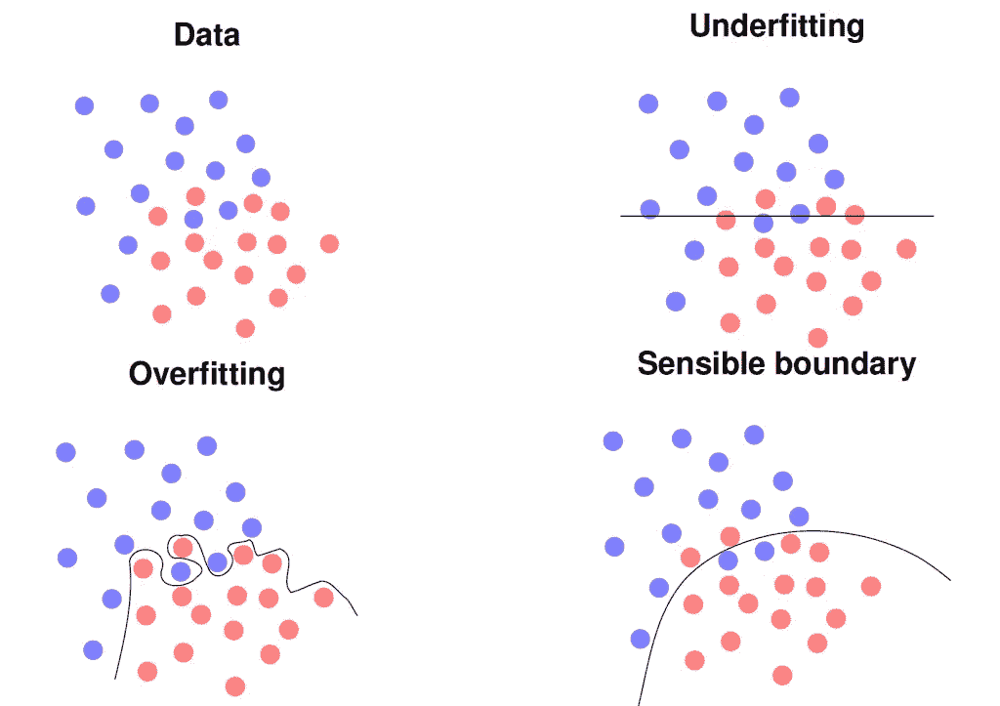
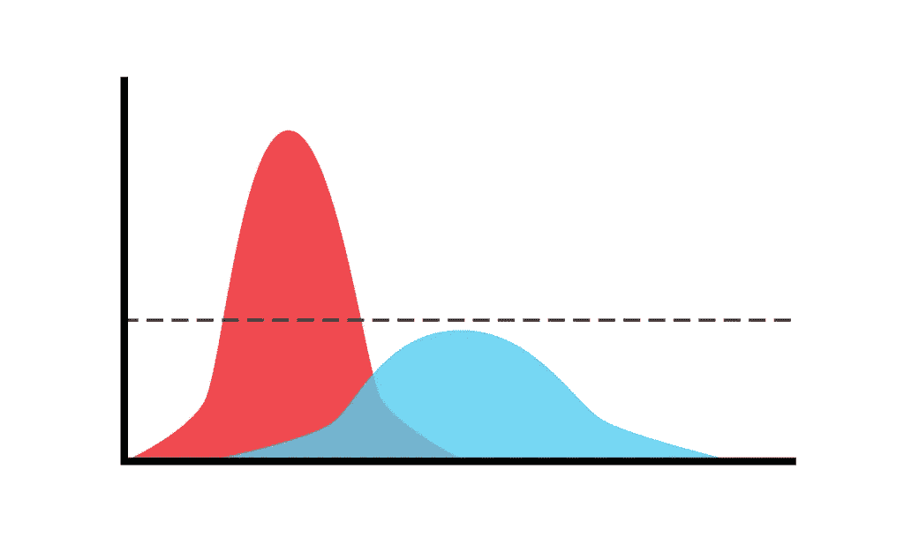

# 机器学习的七宗罪

> 原文：<https://towardsdatascience.com/the-seven-sins-of-machine-learning-54dbf63fd71d?source=collection_archive---------26----------------------->

## 打破你的机器学习实验可信度的七个常见错误

不要屈服于机器学习的七宗罪！Maruxa Lomoljo Koren 从 [Pexels](https://www.pexels.com/photo/red-neon-light-signage-3887574/?utm_content=attributionCopyText&utm_medium=referral&utm_source=pexels) 拍摄的照片。

机器学习是一个伟大的工具，它正在彻底改变我们的世界。在许多伟大的应用中，机器，特别是深度学习，已经显示出比传统方法优越的多。从用于图像分类的[Alex-Net](https://papers.nips.cc/paper/4824-imagenet-classification-with-deep-convolutional-neural-networks.pdf)到用于图像分割的[U-Net](https://lmb.informatik.uni-freiburg.de/people/ronneber/u-net/)，我们看到了计算机视觉和医学图像处理的巨大成功。尽管如此，我每天都看到机器学习方法失败。在许多这样的情况下，人们会陷入机器学习的七宗罪之一。

虽然所有这些问题都很严重，并会导致错误的结论，但有些问题比其他问题更严重，甚至机器学习专家也可能在对自己的工作感到兴奋时犯下这样的错误。这些错误中的许多很难发现，即使对于其他专家来说也是如此，因为你需要详细查看代码和实验设置，以便能够找出它们。特别是，如果你的结果好得令人难以置信，你可以用这篇博客文章作为检查清单，以避免对你的工作得出错误的结论。只有当你绝对确定你没有陷入这些谬论的时候，你才应该向同事或公众报告你的结果。

# 原罪 1:滥用数据和模型

过度拟合会产生完美解释训练数据的模型，但通常不会推广到新的观察结果。下图 [CC BY 4.0](https://creativecommons.org/licenses/by/4.0/) 来自[深](https://www.youtube.com/watch?v=p-_Stl0t3kU&list=PLpOGQvPCDQzvgpD3S0vTy7bJe2pf_yJFj)学[学](https://www.youtube.com/watch?v=A7g-zDwZerM&list=PLpOGQvPCDQzvgpD3S0vTy7bJe2pf_yJFj&index=17)讲[。](https://www.youtube.com/watch?v=p-_Stl0t3kU&list=PLpOGQvPCDQzvgpD3S0vTy7bJe2pf_yJFj)

这个罪是深度学习初学者经常犯的。在最常见的情况下，实验设计是有缺陷的，例如，训练数据被用作测试数据。使用简单的分类器，如最近邻，这立即导致对大多数问题的 100%识别率。在更复杂和更深入的模型中，它可能不是 100%，而是 98–99%的准确性。因此，如果你在第一次拍摄中获得如此高的识别率，你应该**始终** **仔细检查**你的实验装置**。但是，如果您使用新数据，您的模型将完全失效，您甚至可能产生比随机猜测更差的结果，即比 1/K 更低的准确性，其中 K 是类的数量，例如在两类问题中低于 50%。同样，您也可以通过增加参数的数量来轻松地使您的模型过拟合，以便它完全记住训练数据集。另一种变体是使用不能代表您的应用程序的太小的训练集。所有这些模型都可能会在新数据上出现问题，即在实际应用场景中使用时。**

# 罪恶之二:不公平的比较

不要在比较中有失公允。您可能会得到想要的结果，但是这些结果可能无法在其他数据上重现。图片由 [Elias Sch 提供。](https://pixabay.com/de/users/EliasSch-3372715/?utm_source=link-attribution&utm_medium=referral&utm_campaign=image&utm_content=2284723)来自 [Pixabay](https://pixabay.com/de/?utm_source=link-attribution&utm_medium=referral&utm_campaign=image&utm_content=2284723) 。

即使是机器学习方面的专家，也可能陷入这种罪恶。如果你想证明你的新方法比最先进的方法更好，这是典型的承诺。特别是研究论文经常屈服于这一点，以说服评论者他们的方法的优越性。在最简单的情况下，您从某个公共存储库中下载一个模型，并在没有微调或适当的超参数搜索的情况下使用该模型，该模型是针对手头的问题开发的，您调整了所有参数以获得测试数据的最佳性能。文学作品中有许多这种罪恶的例子。最近的一个例子是 Isensee 等人在他们的 [not-new-net 论文](https://arxiv.org/abs/1809.10486)中披露的，他们在论文中证明了最初的 U-net 在 10 个不同的问题上几乎优于 2015 年以来对该方法提出的所有改进。因此，您应该**始终对最先进的模型执行与您应用于新提出的方法相同的参数调整。**

# 原罪 3:微不足道的改进

显著性测试确保你不是在报告沧海一粟。图片来自[皮查拜](https://pixabay.com/de/?utm_source=link-attribution&utm_medium=referral&utm_campaign=image&utm_content=2135788)的[费利克斯米特迈尔](https://pixabay.com/de/users/FelixMittermeier-4397258/?utm_source=link-attribution&utm_medium=referral&utm_campaign=image&utm_content=2135788)。

在做了所有的实验后，你终于找到了一个比最先进的模型产生更好结果的模型。然而，即使在这一点上，你还没有完成。机器学习的一切都是不精确的。此外，由于学习过程的概率性，你的实验会受到许多随机因素的影响。为了考虑这种随机性，您需要执行统计测试。这通常是通过使用不同的随机种子多次运行您的实验来执行的。这样，您可以报告所有实验的平均性能和标准偏差。使用显著性检验，比如 t 检验，您现在可以确定观察到的改进仅仅与机会相关的概率。这个概率应该至少低于 5%或 1%,才能认为你的结果是有意义的。为了做到这一点，你不必是一个专家统计学家。甚至有在线工具来计算它们，例如用于[识别率比较](http://peaks.informatik.uni-erlangen.de/cgi-bin/significance.cgi)或[相关性比较](http://peaks.informatik.uni-erlangen.de/cgi-bin/usignificance.cgi)。如果您运行重复实验，请确保您还应用了 [Bonferroni 校正](https://en.wikipedia.org/wiki/Bonferroni_correction)，即您将所需的显著性水平除以相同数据的重复实验次数。关于统计测试的更多细节，你应该[查看我们深度学习讲座](https://www.youtube.com/watch?v=OthNFRJbRnc&list=PLpOGQvPCDQzvgpD3S0vTy7bJe2pf_yJFj&index=25)的这个视频。当然，显著性测试是第一步，更好的是提供更精细的统计数字，如置信区间。

# 原罪 4:混杂因素和不良数据

尺寸缩放后，用两个不同的麦克风录制了 51 个扬声器。每个点代表一个记录。该数据变化的主要因素是麦克风的差异。下图 [CC BY 4.0](https://creativecommons.org/licenses/by/4.0/) 来自[深](https://www.youtube.com/watch?v=p-_Stl0t3kU&list=PLpOGQvPCDQzvgpD3S0vTy7bJe2pf_yJFj) [学](https://www.youtube.com/watch?v=p-_Stl0t3kU&list=PLpOGQvPCDQzvgpD3S0vTy7bJe2pf_yJFj&index=1) [讲座。](https://www.youtube.com/watch?v=p-_Stl0t3kU&list=PLpOGQvPCDQzvgpD3S0vTy7bJe2pf_yJFj)

数据质量是机器学习的最大陷阱之一。它可能会引发严重的偏见，甚至导致种族歧视。然而，问题不在于训练算法，而在于数据本身。作为一个例子，我们展示了使用两个不同麦克风的 [51 个说话者的降维记录。因为，我们记录了相同的说话者，如果给定适当的特征提取，他们实际上应该被投射到相同的点上。然而，我们可以观察到相同的记录形成两个独立的簇。事实上，一个麦克风直接位于说话者的嘴部，另一个麦克风位于大约 2.5 米远的记录现场的摄像机上。通过使用来自两个不同供应商的两个麦克风，或者在医学成像环境中通过使用两个不同的扫描仪，已经可以产生类似的效果。如果您现在在扫描仪 A 上记录了所有病理患者，在扫描仪 B 上记录了所有对照受试者，您的机器学习方法可能会学习区分扫描仪，而不是实际的病理。你会对实验结果非常满意，产生了接近完美的识别率。然而，你的模型在实践中会完全失败。因此，请**避免混杂因素和不良数据！**](http://www.jprr.org/index.php/jprr/article/view/112)

# 原罪 5:不恰当的标签

每个训练实例一个标签通常不足以理解问题的复杂性。如果向多名评核人展示(蓝色分布)，有些情况可能会产生许多不同的标签，而其他情况下所有评核人会产生相同的标签(红色曲线)。来自 [Pixabay](https://pixabay.com/de/?utm_source=link-attribution&utm_medium=referral&utm_campaign=image&utm_content=5029714) 的[马克塔·马乔瓦](https://pixabay.com/de/users/MAKY_OREL-436253/?utm_source=link-attribution&utm_medium=referral&utm_campaign=image&utm_content=5029714)的图片。

普罗泰戈拉已经知道:“万物的尺度是人。”这也适用于许多分类问题的标签或基本事实。我们训练机器学习模型来反映人为的类别。在很多问题中，我们在定义类的时候就认为类是明确的。当我们查看数据时，我们发现它经常包含模糊的情况，例如，在 [ImageNet 挑战](http://www.image-net.org/challenges/LSVRC/)中，一个图像显示两个对象，而不是一个。如果我们去研究复杂的现象，比如情绪识别，那就更加困难了。在这里，我们意识到在[中，许多现实生活中的观察情绪甚至不能被人类清楚地评估](https://www5.informatik.uni-erlangen.de/Forschung/Publikationen/2009/Steidl09-ACO.pdf)。为了得到正确的标签，我们需要询问多个评分者并获得标签分布。我们在上图中对此进行了描述:红色曲线显示了清晰案例的尖峰分布，即所谓的原型。蓝色曲线显示了模糊案例的广泛分布。在这里，不仅是机器，还有人类评分员都可能以相互矛盾的解释而告终。如果你只用一个评定者来创造你的基本事实，你甚至不会意识到这个问题，这个问题通常会引起关于标签噪音以及如何有效处理标签噪音的讨论。如果您可以访问真实的标签分布(当然，这是很昂贵的)，您甚至可以证明[您可以通过删除不明确的情况](http://www5.informatik.uni-erlangen.de/Forschung/Publikationen/2005/Batliner05-TOT.pdf)来显著提高您的系统性能，例如我们在表演情感与现实生活情感的情感识别中看到的。然而，在您的实际应用中，情况可能并非如此，因为您从未见过不明确的情况。因此，你应该**选择多个评定者，而不是一个人**。

# 原罪 6:交叉验证混乱

不要使用相同的数据来选择您也用于评估的模型和特征。图片来自[的](https://pixabay.com/de/?utm_source=link-attribution&utm_medium=referral&utm_campaign=image&utm_content=2865934)。

这几乎与第一项罪相同，但它是伪装的，我甚至在几乎提交的博士论文中看到过这种情况。所以即使是专家也可能上当。典型的设置是，在第一步中，您有一个模型、架构或特性选择。因为您只有几个数据样本，所以您决定使用交叉验证来评估每一步。因此，您将数据分成 N 个折叠，选择 N-1 个折叠的特征/模型，并在第 N 个折叠上进行评估。重复 N 次后，计算平均性能并选择性能最好的特性。现在，你已经知道什么是最好的特性，你可以继续使用交叉验证为你的机器学习模型选择最好的参数。

这似乎是正确的，对不对？不要！它是有缺陷的，因为你已经在第一步中看到了所有的测试数据，并对所有的观察值进行了平均。因此，来自所有数据的信息被传递到下一步，您甚至可以从完全随机的数据中获得极好的结果。为了避免这种情况，[您需要遵循一个嵌套过程](https://stats.stackexchange.com/questions/223740/nested-cross-validation-and-feature-selection-when-to-perform-the-feature-selec)，它将第一步嵌套在第二个交叉验证循环中。当然，这是非常昂贵的，并产生了大量的实验运行。请注意，只是由于您正在对相同的数据进行大量的实验，在这种情况下，您也可能只是由于偶然的机会而产生一个好的结果。同样，统计测试和 Bonferroni 校正也是强制性的(参见 Sin #3)。我通常会尝试**避免大的交叉验证实验，并尝试获得更多的数据**，这样你就可以进行训练/验证/测试分割。

# 原罪 7:过度解读结果

让别人来庆祝你的工作，不要自己去做。照片由 [Rakicevic Nenad](https://www.pexels.com/@rakicevic-nenad-233369?utm_content=attributionCopyText&utm_medium=referral&utm_source=pexels) 从 [Pexels](https://www.pexels.com/photo/man-with-fireworks-769525/?utm_content=attributionCopyText&utm_medium=referral&utm_source=pexels) 拍摄。

除了之前所有的罪，我认为我们在机器学习中经常犯的最大的罪，现在在当前的炒作阶段，是我们过度解释和夸大了我们自己的结果。当然，每个人都对机器学习创造的成功解决方案感到高兴，你完全有权利为它们感到骄傲。然而，你应该**避免根据看不见的数据或状态来推断你的结果已经解决了一个问题**，因为你已经用相同的方法解决了两个不同的问题。

此外，由于我们在《原罪 5》中所做的观察，声称超人的表现引起了怀疑。你如何超越你的标签的来源？当然，你可以在疲劳和注意力集中方面打败一个人，但在人造课上胜过人类？你要小心这种说法。

**每一个主张都应该以事实为依据**。你可以**假设**你的方法**在讨论中的普遍适用性，清楚地表明你的推测**，但是要真正声称这一点，你必须提供实验或理论证据。现在，很难让你的方法得到你认为它应得的知名度，陈述大的主张当然有助于推广你的方法。尽管如此，我建议留在地面上，坚持证据。否则，我们可能很快就会迎来下一个人工智能冬天，以及前几年已经存在的对人工智能的普遍怀疑。让我们在当前的周期中避免这种情况，并坚持我们真正能够证明要实现的目标。

当然，你们大多数人已经知道这些陷阱。然而，你可能想时不时地看看机器学习的七宗罪，只是为了确保你仍然在地上，没有上当:

**原罪#1:数据和模型滥用——分割训练和测试，检查过度拟合！
原罪之二:不公平的比较——同时调整基线模型！
原罪 3:无关紧要的改进——进行显著性测试！
原罪 4:混杂因素和不良数据——检查您的数据&采集！
原罪 5:不恰当的标签——使用多个评分者！罪恶 6:交叉验证混乱——避免过多的交叉验证！
罪过 7:过度解读结果——坚持证据！**

如果你喜欢这篇文章，你可以在这里找到[更多文章，在这里](https://medium.com/@akmaier)找到更多关于机器学习的教育材料[，或者看看我的](https://lme.tf.fau.de/teaching/free-deep-learning-resources/)[深度](https://www.youtube.com/watch?v=p-_Stl0t3kU&list=PLpOGQvPCDQzvgpD3S0vTy7bJe2pf_yJFj) [学习](https://www.youtube.com/watch?v=p-_Stl0t3kU&list=PLpOGQvPCDQzvgpD3S0vTy7bJe2pf_yJFj&index=1) [讲座](https://www.youtube.com/watch?v=p-_Stl0t3kU&list=PLpOGQvPCDQzvgpD3S0vTy7bJe2pf_yJFj)。如果你想在未来了解更多的文章、视频和研究，我也会很感激你在 YouTube、Twitter、脸书、LinkedIn 上的鼓掌或关注。本文以 [Creative Commons 4.0 归属许可](https://creativecommons.org/licenses/by/4.0/deed.de)发布，如果引用，可以转载和修改。