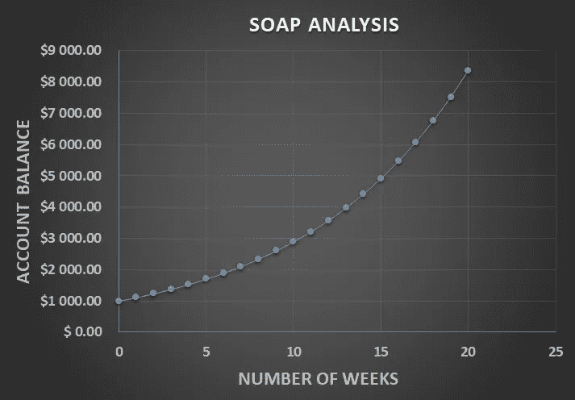
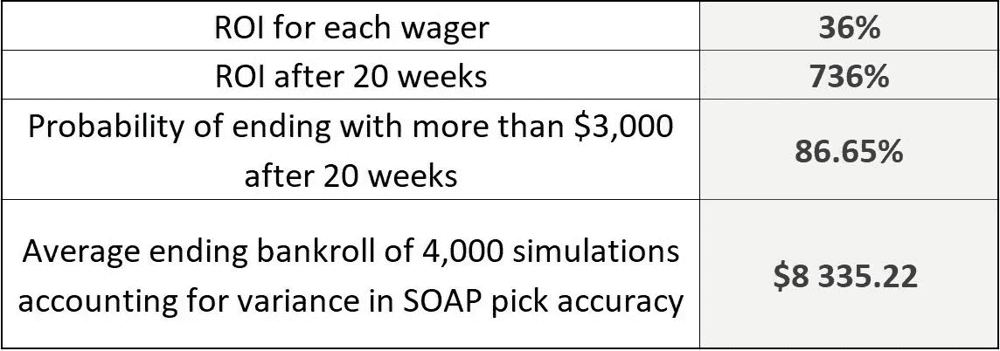

# 可疑或不太可疑的情报世界

> 原文：<https://towardsdatascience.com/the-shady-or-not-so-shady-world-of-tipsters-bd39e370718f?source=collection_archive---------41----------------------->

## 这篇文章从一个潜在投资者的角度出发，深入探讨了情报贩子和体育博彩行业的世界

Lionello DelPiccolo 在 [Unsplash](https://unsplash.com/photos/2r-Py5lANNU) 上拍摄的照片

如果从正确的角度来看，体育博彩行业可能会提供一个未被发现的投资机会，而不仅仅是一个赌徒的平台？根据个人经验以及统计和数学模型，我试图回答一些紧迫的问题，例如:

1.  追踪一个举报人的账户能获得令人满意的**投资回报率**吗？
2.  投资线人账户有什么风险？

# 三个主要人物

赌客:通常是对体育赛事的结果下金钱赌注的人

收受赌注者:收受赌注者是以约定的赔率接受和支付体育和其他赛事赌注的组织或个人。

**告密者:**告密者是指定期在互联网网站或专门的博彩场所提供有关体育赛事可能结果的信息的人。

线人帮助赌客识别体育博彩市场的隐藏价值。如果一个市场有“价值”意味着什么？当市场的[隐含赔率](https://help.smarkets.com/hc/en-gb/articles/214058369-How-to-calculate-implied-probability-in-betting)高于或低于情报提供者确定的市场赔率时，情报提供者认为市场具有价值。

**让我们来看一个例子:**镇上有一家新的博彩公司，他是第一个推出十字军 vs 蓝调市场的人。他们为十字军打败蓝军提供了 1.80 的赔率。那就是一个隐含概率 *1/1.80*100 = 55.5%。*情报贩子注意到这个市场，他的第一印象是这个市场提供价值。这种印象之后是对过去比赛、当前状态、首发阵容、天气预报、比赛裁判等的严格研究。在这个例子中，研究证实了情报提供者的第一印象，并表明十字军大约有 *70%* 赢得比赛，而不是 *55.5%* 。如果消息人士是对的，那么在十字军身上下注 1.80 美元肯定是有价值的。根据爆料者的说法，正确的赔率应该更接近于 *1.43* 。

最好的情报提供者通常致力于某项运动，每周花费数小时研究市场，以确定提供最大价值的市场，然后将他们的情报提供给他们的订户。投注者使用这些线人帐户试图在体育博彩行业中获得对庄家的优势。

可以把线人账户想象成新手交易员的 etoro 账户。简而言之，休闲投注者宁愿每月支付费用，以反映一个声誉良好的情报，研究哪个体育博彩市场拥有最佳价值(如果有的话)，而不是自己做艰苦的英里。同样， [etoro](https://partners.etoro.com/B13551_A93065_TClick_SMedium%20article.aspx) 允许新手交易者自动模仿领先交易者。

# 贪婪和假设的危险

这一切对我来说听起来很容易。当我涉足体育博彩时，我在 Twitter 上搜索消息灵通人士的账户。假设和我开始从体育博彩中赚钱的渴望让我确信，从长远来看，模仿拥有最多追随者的线人一定是有利可图的。令我吃惊的是，我错了。我得到了一个惨痛的教训，没有适当的尽职调查，这是一个肯定会捐钱给庄家的方式。

# 数学占了上风

如何对线人进行适当的尽职调查？很快就变得很明显，决定一个线人账户生存能力的两个主要变量是他们小费的**准确性**和**平均几率**。让我们更详细地探讨这两个概念。**小费准确性**不言自明:它是成功小费的数量(导致庄家支付的小费)除以小费者提供的小费总数。这可以显示为小数或百分比。

赔率通常以十进制赔率的形式表示，代表博彩公司在成功选号的情况下将付给投注者多少钱。

**让我们来看一个例子:**一家博彩公司可能提供 1.80 的赔率*支持蓝军击败红军。这意味着，如果一个玩家在这个市场下注 *$100* ，那么在成功选择的情况下，他们将赢得总计 *$180* (包括他们的股份)的 **ROI** 为 *80%* 。*

**平均赔率**是情报提供者提供的所有市场赔率的平均值。

**例如**，情报提供者账户可能提供以下三个市场的情报

1.  蓝军以 1.80*的赔率击败红军*
2.  蓝军 vs 红军，总积分超过 *52.50* 赔率为 *1.70*
3.  蓝军 vs 红军，蓝军以超过 *3.5* 的赔率尝试 *1.85*

这三个市场的平均赔率为 *1.78*

可以清楚地看到为什么平均选择准确率和平均几率都是至关重要的。在平均赔率为 *1.05* 的情况下，选择准确率为 *80%* 的情报贩子远不如在平均赔率为 *20.00 的情况下，选择准确率为 *30%* 的情报贩子有利可图。*

# 风险和回报——我的 7 个问题

因此，像大多数谨慎的投资者一样，我们应该在风险和回报之间寻找完美的平衡。潜在投资者可能会提出如下问题:

1.  **长期盈利能力。**如何确定情报提供者在一段特定的时间内或挑选后是否会长期获利？
2.  **精度波动。**如果情报贩子的拣货准确率从 *74%* 下降到 *65%* ，对盈利能力会有什么影响？
3.  **斗气波动。**如果市场上的平均赔率从 *1.85* 下降到 *1.75* 会发生什么？
4.  **失去条纹。情报贩子继续连败的可能性有多大？即对于一个 ***Y*** 投注样本，连续错得 ***X*** 投注金额的概率是多少？**
5.  **风险厌恶。**我应该在每个提示上下注占我账户总余额的百分比(姑且称这个百分比为***【Z】***)以及增加*Z 会如何影响我在一段特定时期或若干次挑选中的风险敞口和期望值。*
6.  ***正收益概率。**如果我的起始资金是 ***P*** 在一段特定的时间或选股后，以 ***3P*** 结尾的概率有多大？*
7.  ***负收益概率。**如果我的起始资金是 ***P*** 在一段时间或若干次挑选后，以 ***0.5P*** 结束的概率是多少？*

# *预期值*

*作为一个潜在的投资者，这些对我来说都是重要的问题。为了回答问题 1-3，我使用了一种叫做[期望值](https://www.investopedia.com/terms/e/expected-value.asp)的概率理论。简而言之，期望值(EV)是一个变量的预测值，计算方法是所有可能值的总和乘以其出现的概率。所有的计算都强烈依赖于之前讨论的两个变量，即线人的**小费准确性**和他们小费的**平均市场赔率**。*

# *足够的样本量*

*在这一点上，一个谨慎的投资者可能会想:“如果线人账户只提供了几个他们都发现了的提示，那会怎么样？这将意味着他们有一个 100%的偏斜选择准确性。这个值肯定不能作为所有未来预测的指标吧？”*

*潜在投资者再次提出了合理的担忧。为了对情报提供者的选择准确性有信心，应该确保计算中使用了足够的样本量。如上例所示，小样本量不能用于精确预测。有关确定适当样本量的更多信息，可以阅读[了解二项式分布的置信区间](https://sigmazone.com/binomial-confidence-intervals/)。根据经验，在计算情报提供者的选择准确度时，建议使用至少有 *100* 个数据点的数据集。*

# *马尔可夫的奇妙世界*

*为了回答问题 *4* ，我回复到使用[马尔可夫链](https://brilliant.org/wiki/markov-chains/)。马尔可夫链是非常强大的、随机的数学系统，在各种行业中用于对达到给定状态的概率进行建模。马尔可夫链用于经济学、遗传学、金融以及谷歌搜索引擎的排名算法。马尔可夫链不仅允许我们精确地模拟连续得到 ***X*** 数量的选号的概率，对于 ***Y*** 选号的样本是错误的？它还可以确定自动交易机器人在一个 ***Y*** 交易的样本中获得 ***X*** 错误/正确交易量的概率。*

# *全押加注*

*问题 5 的答案在于投资者的雄心。如果投资者正在寻找一个激进的投资(更高的风险和更高的回报)，那么他会希望在他的账户余额的 *10% — 20%* 范围内的某个地方下注他的账户总余额的更大部分。一个更保守的方法(风险更小，回报更少)将会看到一个投注者投注他们账户总余额的 5-10%的*。**

# *交叉检查*

*为了回答问题 *6* & *7* 我做了 *4，000 次*模拟，使用举报人账户的历史数据来确定 N*次举报/天后的最终账户余额。这些模拟是使用输入变量来完成的，这些输入变量包括情报提供者的平均提示准确性、每个下注市场的平均赔率、起始帐户余额以及每次选择下注的总帐户余额的百分比。解释了情报提供者选择准确性的差异。**

# **我的 Excel 皮革人和肥皂**

**随后，我开夜车构建了一个 excel 电子表格，它为我提供了一个工具，让我可以对情报提供者的账户进行探究。他们中的绝大多数就像被车灯照着的鹿一样束手无策。然而，这些精英却表现得像一个在聚光灯下蓬勃发展的弗拉门戈舞者。我发现的一个不太为人所知的线人账户是[一个赌注的儿子](https://twitter.com/son_of_a_punt)又名肥皂。**

1.  **SOAP 选择橄榄球联盟作为体育博彩行业的利基市场。他们为大多数大型橄榄球比赛提供提示，特别关注超级橄榄球和世界七人橄榄球系列赛。**
2.  **SOAP 对他们的数字和他们的跟踪记录是透明的。他们在推特上发布每一次选择，并保持他们选择准确性的最新记录(这可以在他们的推特账户上验证)。**
3.  **他们目前对超级橄榄球和世界七人橄榄球系列赛的选择准确率是 87/118。这是一个 73.7%的选择准确率。**
4.  **肥皂小费市场的平均赔率是 1.85。**

**以 *$1，000* 的起始资金为例，并假设总资金的 *15%* 在总共 *20* 周(每周提供 2 次提示)中的每一次下注会生成以下曲线图:**

****

**该图表示在 20 周内跟踪 SOAP 提示的投注者的账户余额(使用了期望值的概率理论)**

**当使用期望值的概率理论时，该图表明遵循 SOAP 提示的投注者在 20 周之后将有 8359 美元的期末账户余额。**

**下表包含一些值得注意的数字:**

****

**从情报分析 Excel 表中获得的 SOAP 投资见解**

**我对未来价值预测进行了两次单独的分析，以验证预测的价值。账目平衡了。在*4000 次*模拟 SOAP 特定指标后，平均期末资金为*$ 8335*，这与使用期望值概率理论时从 SOAP 分析曲线图中读取的*$ 8359*期末账户余额几乎相同。**

# **结论**

**作为一个认真的投资者，在 20 周的时间里，736%的投资回报率足以让我惊讶。几乎令人难以置信的是，目前, [SOAP](https://twitter.com/son_of_a_punt) 正在 twitter 上免费提供他们的精选。我相信，用不了多久，就会有人发现他们的服务有赚钱的潜力。**

**…还是他们将继续成为体育博彩行业的现代罗宾汉？**

***作者不是注册投资顾问或经纪人。作者表达的所有投资或金融观点均源于个人研究和经验，旨在作为教育材料。作者明确建议你在做投资决定之前先向专业人士寻求建议。***

**[作者领英](https://www.linkedin.com/in/johnny-coetzer-8ba57697/)**