# 从数据到行动的不稳固的桥梁

> 原文：<https://towardsdatascience.com/the-shaky-bridge-from-data-to-action-f494ab495bc4?source=collection_archive---------54----------------------->

## 一个现实，不同的事实，不同的观点，相反的行动

注意:在这篇文章中，我试图检验事实和数据之间的关系，以及我们的主观解释和随后的决定。随着我们越来越多地看到对似乎是同一现实的不同解释，这种对这一主题的兴趣最近有所增加。

# 我太热了——我太冷了……

如果我说“太热了”，你说“太冷了”，那些只是*的观点*，我们谁也不对！如果你改为说“现在是 70 度”，那么这就是*事实*这是无可争议的，我们可以就其含义进行更富有成效的对话。

我的一位同事过去就是这样在会议中打断激烈的辩论，并通过敦促人们关注事实和数据来重启讨论的。他的干预往往有助于在最紧张的情况下安抚情绪。在许多方面，这种说法有一种老生常谈的味道，但其中的一些东西确实吸引了我的笛卡尔思维:冰冷的事实和数据是真理的本质，主观意见让我们离真理更远。伦敦统计学会的创始章程(成立于 1834 年)也说了类似的话:*数据在任何情况下都必须优先于观点和解释。数据是客观的；观点是主观的。这个信条今天仍然指导着许多统计学家:事实上，我认为对数据的“盲目信仰”比以往任何时候都更强烈，以至于我们故意决定忽略人类专家的意见，而是依赖“数据说了什么”。*

在一个事实空前丰富的时代(“大数据”收集了一切，加速了科学进步，倍增了处理数据的计算能力……)，我们应该比以往任何一代人都更接近真相！然而，我们的时代也充满了越来越多不同的观点和信仰，不仅是对 20 世纪那样的意识形态，而且是对核心事实(有人知道假新闻吗？).在当今时代，事实和数据从未如此丰富，然而“真相”却更加难以捉摸、相对和主观。

对我来说，这是一个有趣的悖论，值得进一步研究。我在下面试图通过分析我们实际上是如何理解现实并决定什么是真什么是假来做到这一点。我用下面的图表总结了我的方法。

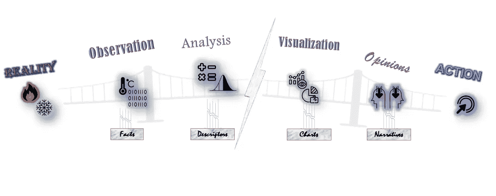

资料来源:Wissam Kahi

*   **事实**是描述通过观察过程产生的现实的原始数据，它们是我们能够得到的最接近现实的数据。这是 ***观察层***
*   **描述符**(或估计值、模型、统计摘要)允许我们总结原始数据，使其有意义(如平均值、方差、中位数、相关性等)。这是**的*分析层*的**
*   图表是我们展现真相的各种方式(使用图表、图画、图像甚至描述符本身)。这是 ***可视化图层***
*   **叙述**是我们的主观解释。叙述可以通过估计得到信息，但它们也受到许多其他外部因素的严重影响，如我们的价值观、信仰(教育、背景……)。这是 ***意见层***

最后，意见非常重要，因为它们最终会推动行动

让我们用另一个“温度”类比来说明这一点:气候变化。

**事实**是全球各地不同年份和地点的温度测量、海平面上升和人为碳排放的大量数据集。这些当然是无可争议的，但也是无法实现的(还没有人整合所有的测量数据)，而且它们的原始格式不适合人类食用(正如我在以前的博客文章中所阐述的，我们的大脑无法吸收它们)。

估计值和描述符是科学家用来建模、总结和理解数据的各种方法:全球气温和海平面的平均上升，灾难性天气事件和热浪的发生，等等。以及与人为排放的相关性

代表和可视化是代表上述内容的各种出版物、文章和图表。

由此产生的观点和信念当然会有所不同，从光谱的一端人们肯定气候变化和人类行为之间有明确的关系，到另一端声明这种说法没有足够的证据，气候变化纯粹是一种与人类活动无关的周期性现象。在现实中，科学家通常会根据概率来陈述他们的断言(例如，科学家可能会声称，在未来 50 年内，人为引起的气候变化有 70%的可能性会导致海平面上升 50 厘米，或者相反，“自然气候变化有 80%的可能性会导致海平面上升。这是由温室气体排放引起的可能性非常小，几乎可以忽略不计)，但实际上，这些问题往往会被简化为更通用、更确定、更简单的陈述(化石燃料导致海平面上升——海平面上升不是由人类引起的，我们对此无能为力)。

**行动**是作为这些意见的结果而实施的政府政策(或非政策)

这个简单的例子清楚地表明，聪明的受过教育的科学家如何从相同的事实得出不同的结论，更重要的是，政府实施非常不同的政策

那么这种“现实—事实—估计—观点—行动”的脱节发生在哪里呢？让我们分别检查每个维度

# I- Facts(观察层)

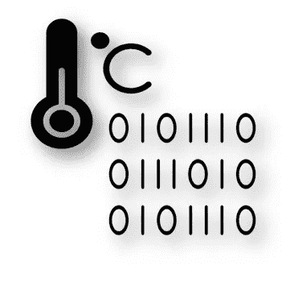

## 海岸线悖论

科学史上有一个故事一直让我着迷:Lewis Fry Richardson 是一位英国物理学家，他想验证一个有趣的理论:两个国家之间发生战争的概率取决于它们共同边界的长度！在研究数据时，他开始发现令人不安的不一致之处:比如荷兰和比利时之间的边界长度，在不同来源之间差异很大。例如，在一个源中可能是 380 公里，而在另一个源中可能是 449 公里。

理查森最终解决了这个悖论，他认识到了一个在今天看来非常直观的东西:边界或任何自然海岸线的长度取决于尺子的大小。如果你用 50 公里的尺子，用 200 公里的尺子你会得到不同的答案(见下图)

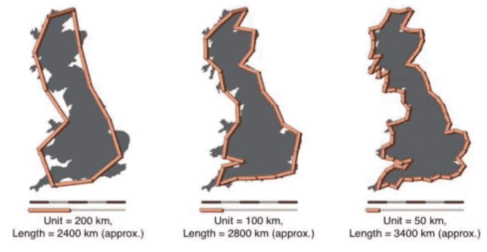

海岸线悖论图解—来源:海岸线悖论—维基百科

这一发现后来被称为“海岸线悖论”，是数学家伯努瓦·曼德尔布罗研究分形的一个重要因素。

你可能会认为这是一个微不足道的发现:当然，用更精细的尺子，我会得到更长的不规则线条。但是我感兴趣的不是 Richardson 的发现本身，而是 T2 在 1950 年制造了它！想想看，当时科学界已经在量子力学和广义相对论等领域取得了重大进展，然而没有人注意到这个很可能被古希腊人发现的微不足道的事实！

被认为是不容置疑的“事实”——西班牙和葡萄牙之间的边界长度是 987 公里，西班牙人声称是 1214 公里，葡萄牙人声称是 1214 公里——结果证明对双方都是错误的。事实上，分形理论表明，随着尺子变得更细，这个长度会发散到无穷大:从理论的角度来看，没有长度可言…

## 我们看到的和看不到的

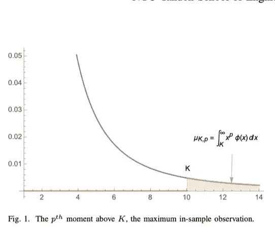

Nicholas Nassim Taleb 论文的关键图表“[你所看到的和你所没有看到的](https://twitter.com/nntaleb/status/1246389636865445888/photo/1)

我最近读到的最有趣的数学演示之一是纳西姆·塔勒布做的。简而言之，一般结论如下:如果您有 n 个形成特定分布(即，观察值的直方图)的观察值，并且 K 是您的样本中最大的观察值，则未来观察值大于 K 的概率为 1/n(对于所有幂律分布，这是一个非常通用的集合)。这个相当简单的结论却有着深远的影响:它告诉我们一些事情，比如“我们有多大可能遭遇比已有记录的 100 次更强的热浪”或者“下一次金融危机有多大可能比我们目睹的更强”。事实上，许多“专家”过度依赖现有的历史数据，这使得他们低估了隐藏在我们历史上观察到的最大模式背后的潜在“肥尾”。这再次提醒我们，我们的观察有时是自然选择向我们揭示的，但她可能保留了一些隐藏的卡片…

*PS:如果你对这个属性的简单图解感兴趣，可以看看麦克·劳勒的伟大* [*帖子*](https://mikesmathpage.wordpress.com/2020/04/05/sharing-a-neat-statistical-result-from-one-of-nassim-talebs-papers-with-kids/) *。这里的数学演示可以进入*

***结论***

*有多少其他的“真理”我们今天认为是不容置疑的，结果却被未来的发现动摇了我们的信心？当然，像上面这样的发现并不是每天都会发生，但是当考虑到事实通常是对现实的“测量”时，我们必须考虑到一些误差(即使是出于最好的意图——比如尺子有多精细引起的误差)。*

*我自己处理原始数据，从我的经验和对同事的观察中我知道，人们对原始数据的质量过于自信，这往往是因为这是你能得到的最好的数据。质疑数据来源、反复检查数据质量并为其分配适当的误差幅度是一项乏味的任务，大多数分析师都会避免，因为直接进行分析更有吸引力……就像理查森对他的战争概率理论所做的那样(这比测量边界更令人兴奋……)。*

*康德说我们从未真正体验过现实，而只是通过我们感官的面纱来感知它(他称之为*感知的面纱*)。记住数据本身是一种人造的人类构造是有好处的:它是我们感知现实的方式——也可以说是通过“面纱”。*

# ***II —描述符(分析层)***

*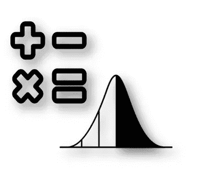*

## *永远不要跨过平均 4 英尺深的河*

*我写了一篇单独的文章，题目是“ [*从不跨过平均 4 英尺深的河——总结战争与和平*](/never-cross-a-river-4-feet-deep-on-average-d1a8d1ec345c) ”就在这个话题上。(文章强调了我们汇总数据时面临的挑战和不可避免的“信息丢失”。)的关键前提是，试图使用平均值等描述符来总结数据集有点像试图用几句话来总结“战争与和平”:这是一种高尚的努力，但在某种程度上对于向亲爱的朋友传达这部杰作的内容来说是可笑的。*

*我不会在这里展开这个主题，但下面只是文章中详细介绍的各种示例中的一个，以便让您有所体会。*

*我碰巧是一家餐饮公司的合伙人，这家公司从世界各地雇佣有才华的难民厨师。公司厨师开发了几十种来自他们烹饪传统的菜肴——虽然在我看来都很特别，但他们的菜肴对典型的美国人来说或多或少是成功的。在我们不断努力为顾客提供最佳服务的过程中，我们希望了解谁是我们最好的厨师，我们发起了一项调查，顾客可以对每位厨师的烹饪进行评分。在我们承办的每个活动中，每个厨师通常都会准备一道菜。*

*每位厨师的平均结果如下所示*

*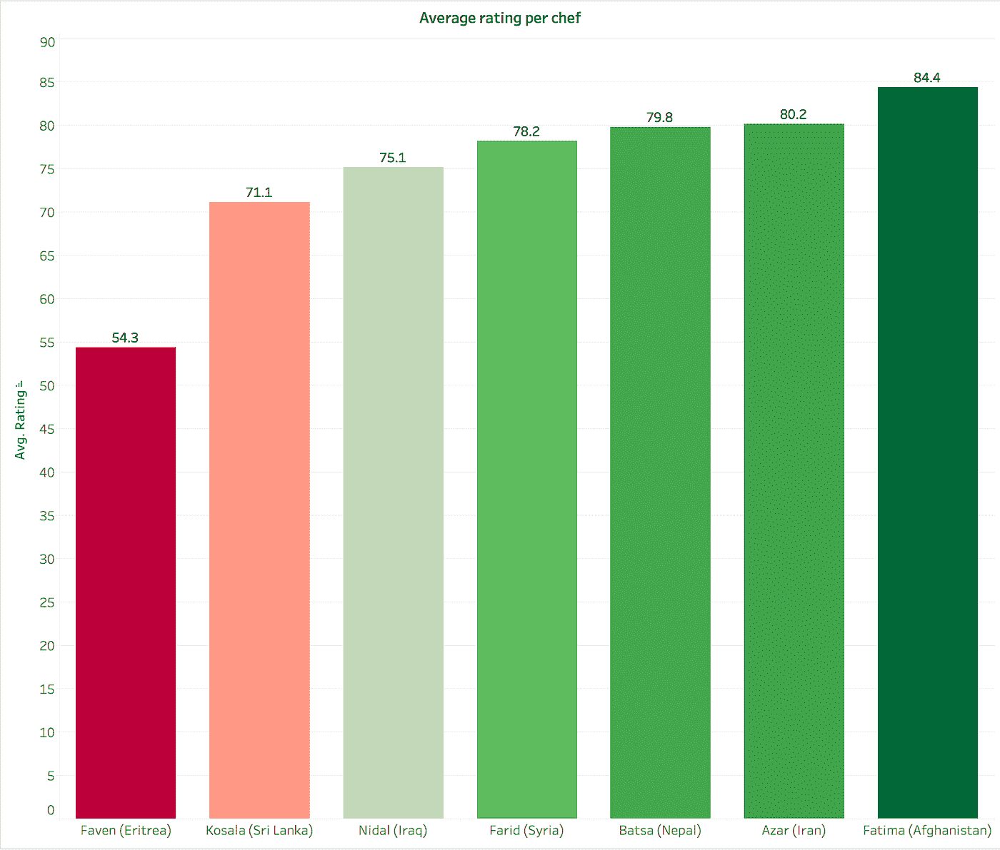*

*《Eat Offbeat》——wiss am Kahi 餐厅每位厨师的评分*

*在这个节目中，Faven 的评分比她的厨师同事低得多。我们或许应该解雇她，或者至少让她在厨房帮忙，而不是用不为人知、显然不受欢迎的味道折磨我们的顾客？*

*嗯…没那么快。事实证明，所有这些结论都是错误的，或者至少是误导性的:我们的调查确实要求每个顾客对厨师进行评价，我们知道每个厨师为每个活动准备了不同的菜肴。如果我们不只是平均厨师的结果，而是平均相应菜肴的结果，会怎么样？结果如下:*

*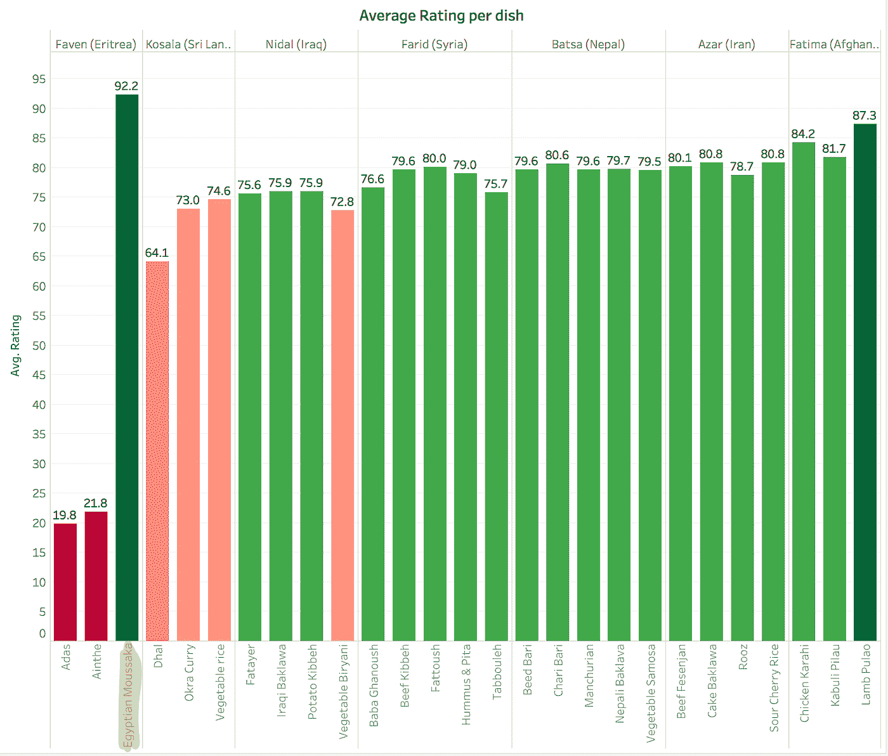*

*《吃另类》每道菜的评分——wiss am Kahi*

*我们可以清楚地看到，*最受欢迎的一道菜是埃及穆萨卡*，它是……厨师法文的创造！仅仅依靠平均每位厨师，我们就要解雇负责我们最受欢迎菜肴的人了！Faven 主厨有另外两种菜降低了她的平均水平，这些菜显然不受纽约人的欢迎，应该被淘汰。但她显然有一些天赋，我们应该鼓励她创造一些新的菜肴。*

# ***III——表示(可视化层)***

*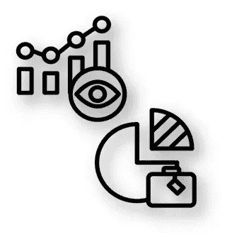*

*毕加索有一句名言可以作为这一章的最佳副标题:“我们都知道艺术不是真理。艺术是让我们认识到真理的谎言，至少是给我们去理解的真理。”我要说的是，当我们将数据可视化时，我们实际上是在进行一种艺术创作，毕加索的名言与此非常相关。*

## *改变颜色…改变想法*

*让我用一个我在 Tableau 技术传播者安迪·科特格里夫的[博客](https://gravyanecdote.com/uncategorized/should-you-trust-a-data-visualisation/)上读到的例子来说明。下面是 2011 年伊拉克的伤亡图表，来自[南华早报](https://www.scmp.com/infographics/article/1284683/iraqs-bloody-toll)*

*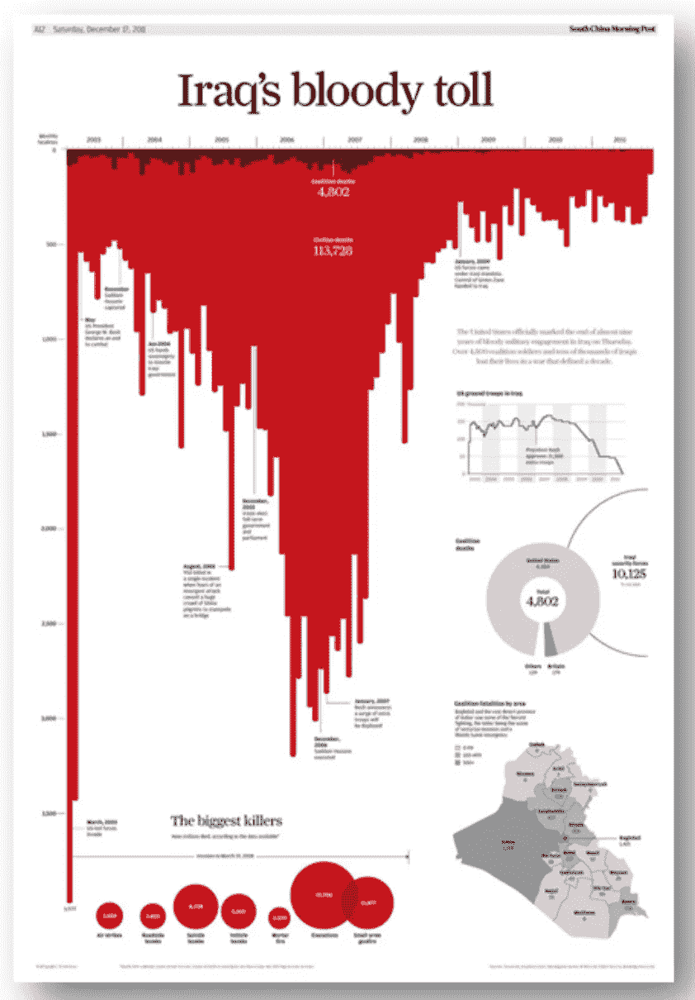*

*伊拉克的血腥工具(2011 年 12 月 17 日—南华早报)*

*图表中最引人注目的当然是红色“血腥”的使用，以及暗示滴血的倒轴。这是非常有效的煽动读者的情绪和标题“伊拉克的血腥收费”是非常恰当的。*

*现在考虑安迪·科特格里夫在下图中的旋转:*

*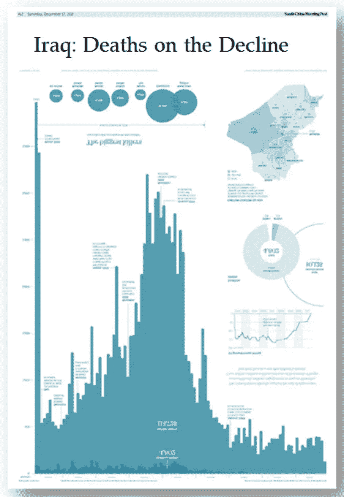*

**安迪·科特格雷夫的担当* [*伊拉克血腥屠杀*](https://gravyanecdote.com/uncategorized/should-you-trust-a-data-visualisation/)*

*事实上，他不仅使用了相同的数据，还使用了*相同的图表*——他所做的只是将图表向上旋转(从倒置的数字中可以看出)并赋予它不同的颜色。当然，现在一个不同的标题更合适:“伊拉克:死亡人数在下降”。*

*让我们再举一个可能会引起许多美国读者强烈共鸣的例子:下面是 2016 年美国总统大选地图*

*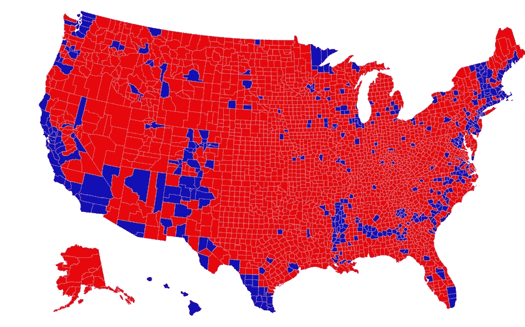*

*2016 年美国总统选举县地图(红色=共和党，蓝色=民主党)-来源:[土地不投票](https://www.core77.com/posts/90771/A-Great-Example-of-Better-Data-Visualization-This-Voting-Map-GIF)-人们通过下雨来投票*

*上面的地图用红色填充，似乎表明特朗普取得了压倒性胜利。但是你可能已经猜到了，用地图来表示人们的投票是非常误导人的。下面的[Karim dou EB](https://twitter.com/karim_douieb)给出了这种表述的平衡*

*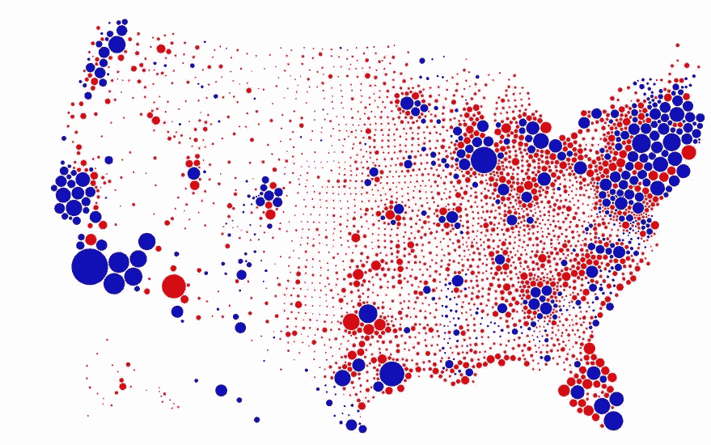*

*Karim Douï eb 人口调整后的 2016 年选举调整地图(红色=共和党，蓝色=民主党)*

*在这个可视化中，县的大小与其人口成比例，而不是与其地理面积成比例(毕竟所有人都投票，而不是土地面积！)并在视觉上展示了一个非常不同的画面。*

## *一个故事抵得上一千…数据点*

**“一个人的死亡是悲剧；100 万人死亡是一个统计数字”——*约瑟夫·斯大林(Josef Stalin)狡猾地利用这一数字为自己谋利(当然也损害了人类)。众所周知，故事比统计数据更有影响力，细节比一般的更引人注目，触及心灵比诉诸理性更有效…*

*我仍然感到震惊的是，即使受过教育的人应该意识到自己的偏见，这仍然是多么真实:例如，一个为难民筹集资金的慈善机构通过展示一个女孩的照片筹集的资金会比展示一群难民的照片筹集的资金更多(甚至更少展示统计数据)。更糟糕的是，展示同一个女孩和她的兄弟或家人也将筹集更少的钱……(有几个关于这个主题的研究，但你可以查看几个[这里](https://www.pnas.org/content/114/4/640.full)和[这里](https://www.musestorytelling.com/blog/importance-of-storytelling)*

# *IV-意见(解释/叙述层)*

*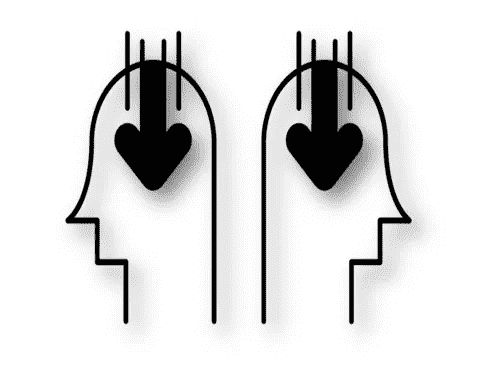*

*我最近被选为大陪审团的成员。在 4 周的时间里，我和其他 22 名大陪审团成员坐在一个房间里，助理地方检察官会过来向我们介绍他们针对某一特定被告的案件，我们必须投票决定是否有足够的证据起诉被告(意味着有足够的证据将案件提交审判)。我们在 4 周内回顾了约 40 例病例。*

*我最初认为这将是一个可怕的负担和巨大的时间浪费，实际上却是一个非常有趣的实验:他非常有见地地观察到不同的陪审员在面对相同的事实时如何得出不同的结论。事实上，在许多情况下，事实是不完整的——但这是人类思维的一个特征，用主观假设来填补这些事实的空白，并建立一个叙事——这不正是一种观点吗？我们没有用自己的感官目睹犯罪，我们被邀请在自己的头脑中建立一个故事，相应地填补空白。*

*判断是否有足够的证据将案件提交审判或驳回显然是一种*意见(*从这个角度来看，该系统并不完美，因为它依赖于人们的意见而不是纯粹的事实，但有趣的是，在许多方面，这是我们唯一的“公平”选择)。我同样认为解释或“理解”一个数据图表必然会形成一个关于它的*观点*——否则它只是纸上的数字。*

*让我们考虑另一个熟悉的类比:杯子满了 1/2 和杯子空了 1/2 都是“6 盎司杯子里有 3 盎司水”(客观现实)这一准确说法的准确意见(主观现实)。后者并不比前者更“真实”。有趣的是，人工智能将只能表达客观陈述，如“杯子里有 50%的水”，而不能区分半满/半空的观点。在可预见的未来，这些区别仍将是人类固有的——这正是我认为它们至关重要的原因。*

*简而言之，我们处理信息的方式只部分取决于信息本身，同样也取决于我们有偏见的感知。如果表示层(前一章)处理的是*作者*在传达数据时引入的偏见，那么解释层处理的是数据的*读者*在理解数据时引入的偏见。扩展一下我使用的比喻:如果表示层是关于作者用不同的颜色画笔来表示数据，那么解释层是关于读者通过他们自己的有色眼镜来看待事实*

*有几个因素可以显著影响这种解释，其中一些是我们人类固有的*潜意识偏见*，另一些根植于我们的*内在信仰、文化和世界观*，最后还有一些是*外部因素*，例如我们“消费”事实时碰巧进入的群体。*

## *1 —潜意识偏见—叙事谬误*

*诺贝尔经济学家丹尼尔·卡内曼写了一整本书《思考，快与慢》，主题是潜意识偏见。我不会试图在这里总结它——尽管我非常鼓励你去读它——但是我会用一个关于叙述谬误的例子来说明。*

## *叙事谬误*

*假设您正在尝试评估销售代表在创造收入方面的效率。你将每个客户的收入与销售代表给每个客户打电话的次数进行对比，并生成下图。*

*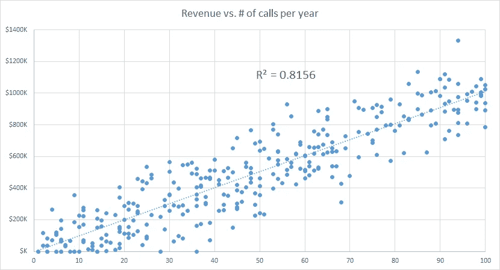*

*增加对客户的呼叫会增加收入*

*该散点图显示了客户呼叫次数与客户创造的收入之间的密切相关性。你把它展示给公司领导层，每个人都看到了清晰的模式:当我们增加对客户的拜访时，收入也会相应增加。因此，合理的结论是激励我们的销售人员打更多的客户电话——尤其是那些我们过去忽视的客户。*

*现在想象一下，你反转坐标轴，在 Y 轴上画出呼叫次数。图表如下所示。*

*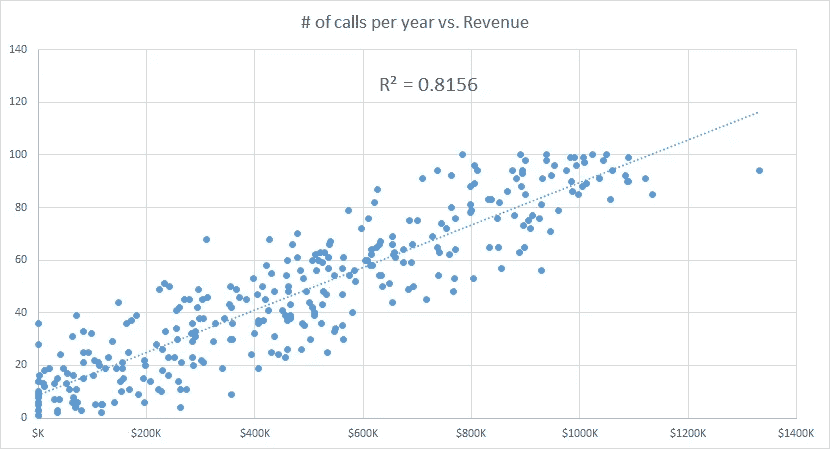*

*当客户收入较高时，销售人员会增加致电客户的次数*

*现在至少观众中的一些人会得出不同的结论:当客户收入更高时，销售人员往往会更频繁地拜访他们！*

*你可能已经猜到这两种说法都存在逻辑谬误。事实上，对这种相关性的一个完全合理的解释是影响这两个指标的第三个混淆变量，例如，客户规模/消费倾向可能会影响销售人员拜访客户的频率以及公司的收入，换句话说，销售人员足够聪明，可以拜访“值得”的客户。*

*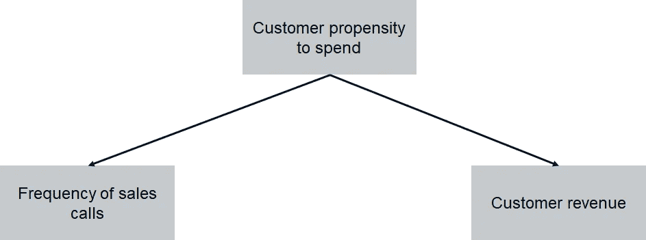*

*客户收入与销售拜访频率相关性的潜在解释*

*你们中的许多人可能对我们在统计学课上学到的著名的“相关性并不意味着因果关系”很熟悉。令人震惊的是，同样意识到相关性/因果关系差异的高管、经理和受过高等教育的人每天仍然经常陷入这个陷阱(实际上上述虚构的例子是从真实事件中获得的灵感)。*

*丹尼尔·卡内曼谈到了大脑“急于下结论”的倾向。尼古拉斯·纳西姆·塔勒布，另一个我最喜欢的作家，把这解释为叙事谬误*

*叙事谬误解决了我们在不解释事实的情况下观察事实序列的有限能力，或者，换句话说，在事实上强加一个逻辑链接，一个关系箭头。解释将事实结合在一起。他们使他们更容易记住；他们帮助他们变得更有意义。这种倾向可能出错的地方是当它增加我们理解的印象时*

*在我们的例子中，我们被训练试图通过 x 轴上的变量的行为来解释 y 轴上的变量。如果我们能把一个因果故事中的变量联系起来，那就有趣多了。但是，翻转轴就足以得到不同的解释……当然，受过训练的人不会相信他们在这方面的第一直觉，而是更深入地挖掘，他们通常会对相同的数据有不同于“常识”的解释。*

## *2-内在价值观和信念*

*潜意识偏见是人类本性中固有的，从定义上来说，在个体中是普遍的。相比之下，我们的价值观和信仰因人而异，因为它们受到个人教育、教养、文化环境、过去经历等的影响。*

*气候变化主题是展示这些值如何影响数据解释的理想选择。NOAA 的下图显示了地球大气中二氧化碳的增加，最近已经超过了 410 ppm。*

*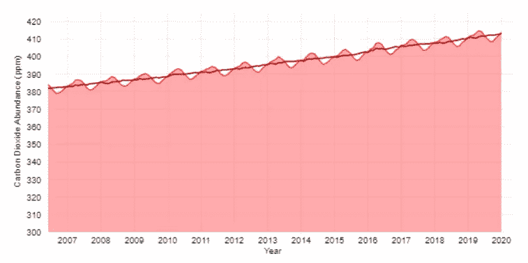*

*二氧化碳百万分率趋势—【climate.gov 资料来源*

*保守派评论员兼电台主持人马克·莱文(Mark Levin)利用这一信息辩称，二氧化碳只是地球大气中的一种微量气体。他谴责当权派经常极力劝阻反对意见，并宣称在气候变化问题上科学界近乎一致。“他们从未提及二氧化碳在大气中所占的比例有多小，”莱文说。[https://www . Washington examiner . com/Americans-for-carbon-CO2-mark-levins-idea-of-time-come](https://www.washingtonexaminer.com/americans-for-carbon-dioxide-mark-levins-idea-whose-time-has-come)*

*从纯事实的角度来看，莱文是对的:二氧化碳确实是大气中的一小部分。但是也许有人应该给他一杯水，里面有极少量的砷，并请他向我们展示他有多勇敢——毕竟它是如此之小…*

*玩笑归玩笑，这是对道德价值观和群体思维(在这种情况下是气候否定论者群体)如何严重影响事实解释的完美例证。一个更细致的图表可能如下，它着眼于一个更长的时间段:*

*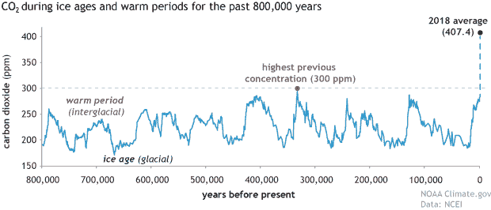*

*二氧化碳百万分率趋势——资料来源:Climate.gov 的 NOAA*

*这表明，410 ppm 是历史上前所未有的，引用一个更具戏剧性的数字将是“今天的二氧化碳浓度比过去 80 万年的历史峰值高 30%以上”。*

*我们在莱文身上看到的是*确认偏差*在起作用:当面对几个事实时，人们会挑选最能支持他们当前信念的数据，而忽略其他一切。我们在政治光谱的另一端看到了同样的确认偏见，人们挑选的数据会让它听起来最具戏剧性。现实情况是，虽然在这一论点的一端有科学上的多数，但这还不是一个完全的共识，因为在事实分析中仍然存在差距，不能以某种方式提供“不可辩驳的证据”, a)增加是由人类引起的，b)它将导致灾难。尽管存在不确定性(我将在下一章详细阐述),但我对如何解决这个问题有自己的看法。*

## *3-外部因素*

*我从霍华德·韦纳和哈里斯·l·兹韦林的一篇[文章](https://www.jstor.org/stable/20442243?seq=3#metadata_info_tab_contents)中借用了这个例子，但对其进行了扩展。我还接触了丹尼尔·卡内曼的书《思考的快慢》。*

*你是一名数据分析师，在一家领先的私人实验室开发一种新的癌症，领导指派你了解肾癌发病率最高的地区。你做了调查，并向领导展示了以下数据图*

**注:此场景纯属虚构，但数据来自美国国家癌症研究所**

**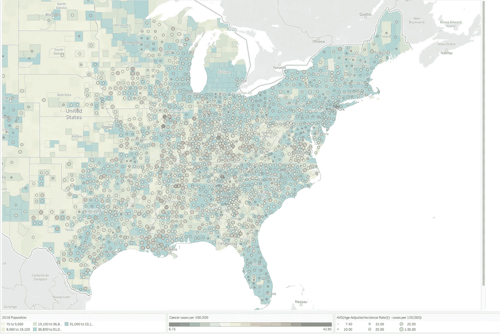**

**与美国各县人口相比，每 100，000 人的肾癌发病率——资料来源:Howard Wainer 和 Harris L. Zwerling 的数据——wiss am Kahi 的可视化**

**你把图表展示给围坐在会议桌旁的高管们，在最初的一分钟左右，没有人知道它是怎么回事。但就在这时，眼尖的 CEO 说:*“我明白了！癌症发病率最高的县大多是农村、中西部和南部人口稀少的地区。这些州的贫困程度更高，饮食脂肪含量更高，饮酒和吸烟过多，没有良好的医疗保健。完全说得通！*“现在每个人都明白了这个模式，并点头表示同意。**

**如果你自己再次点头表示同意，再想一想，因为结论实际上是错误的。事实上，癌症发病率最低的县*也是农村、人口稀少以及中西部、南部和西部的县*……下面的图表将人口为< 50，000 和> 50，000 的县分开，并显示它们如何划分肾癌的低发病率和高发病率。如你所见，在这两种类型的县中，癌症低发病率的县一样多，在较小的县中，癌症低发病率和高发病率大致相当。**

**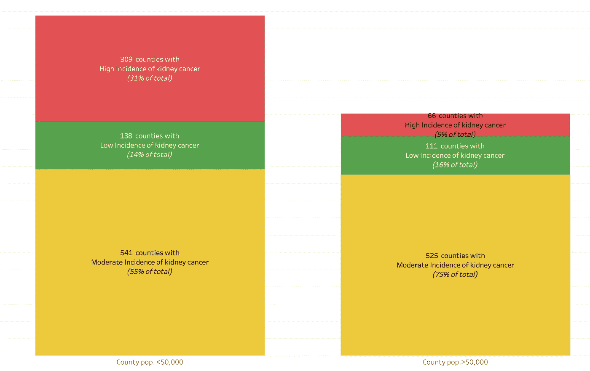**

**南部、西部和中西部癌症发病率低、中和高的县的分布——人口<50,000 vs. > 50，000 的县——资料来源:Howard Wainer 和 Harris L. Zwerling 的数据——wiss am Kahi 的可视化**

**这里的合理解释是*“大数定律”:*当我们的样本总体较小时，我们更有可能在平均发病率周围有较高的方差。因此，我们更有可能在较小的样本(在这种情况下是较小的县)中找到极端值(低或高)，而较大的样本往往更接近平均值，变化较小(实际上，您可以看到较大的县有更高的百分比属于“中等”类别。)**

**上述解释基本上是随机的——没有因果关系解释为什么较小的县会有较低或较高的发病率。但是我们的大脑不喜欢随机性，并且会一直积极地寻找因果关系(在丹尼尔·卡内曼的书中会有更多的论述)。**

**这和上面的叙事谬误类似。但这里还有另一个有趣的影响:注意，解释可能会完全不同:房间里的一些人可能已经注意到许多小县的癌症发病率非常低，并用农村生活方式的好处，没有污染等来解释这一点。这并没有发生:观点向一端的转变是由组织中具有道德权威的人(在这个例子中是 CEO)的权力动态和角色模型驱动的。虽然为了说明的目的，这个例子被明显地夸大了，但是请注意，这在组织中非常频繁地发生，尽管是以更微妙的方式。这些群体动态如何出现的例子包括，例如，谁具有更强的性格或权威，或者有时只是谁第一个发表意见。请注意，在这些情况下，通过在参与讨论之前征求每个人的意见，或者由对统计有更深入了解的人提供更清晰的图表，可以鼓励更健康的辩论。**

# **垂直行动——结束循环**

****

**在我朋友用来说明“事实胜于观点”的“太热/太冷”的例子中，有一点总是困扰着我，那就是感觉不对劲。我花了一些时间才弄明白是什么，事后看来很明显:如果辩论只是关于知道温度是多少，就像科学家试图测量自然现象一样，那么类比是有意义的，但如果类比涉及到人们是否对温度感到舒适，那么类比就不成立。事实上，知道温度“客观上”是华氏 68 度并没有以任何方式减少冷或热的主观感觉。毕竟，带来满足感的唯一方法是他们中的一个站起来调节恒温器，从而带来一个新的现实。换句话说，这个比喻暗示着客观真理应该永远胜过主观真理。然而，最终导致行动的往往与客观无关，而完全与主观有关。**

**这种“客观与主观”是许多学科中的一个古老的争论。然而，与本文相关的是，行动是主观——或集体主观——的结果，并且这些行动对现实有影响。所以我们描述的线性链条“现实→观点→行动”实际上是一个*闭环*。**

**在这里引入*反身性*的概念是值得的:到目前为止，我们一直在谈论观察者作为一个通过几个镜头(观察、分析、表现、解释……)理解数据和事实的个体，但是假设这个个体仅仅是一个现实的被动观察者，就像科学家观察蚂蚁一样。反身性认为，在许多领域，将个人纯粹视为被动的观察者是不正确的，因为他将形成的观点实际上会对他正在观察的情况产生影响——使关系*具有反身性。*换句话说:现实并不独立于参与者的感知——它可以被这种感知所塑造。在前面的章节中，我们已经确定了两个人在面对同样的事实时，是如何形成两种截然不同的观点的。我将在这里解释为什么这种感觉很重要，尤其是当它成为集体的反映时。事实上，这在与人类事务相关的领域尤其相关，例如金融或社会科学，在这些领域中，一群主观观察者同时也是他们所观察的客观现实的参与者。**

**卡尔·波普尔(Karl Popper)将反身性作为科学中的一个问题，他强调了预测对被预测事件的影响，称之为“[俄狄浦斯效应(Oedipus effect)](https://en.m.wikipedia.org/wiki/Self-fulfilling_prophecy)”,指的是希腊传说中实现神谕预言的事件序列受到预言本身的巨大影响。乔治·索罗斯(他的学生)后来在这个话题上有了很大的发展。在金融市场中可以找到一个简单的例子:**

**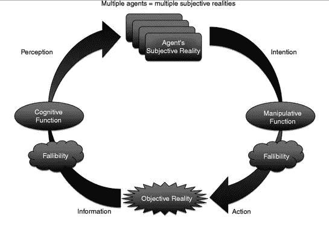**

**来源:乔治·索罗斯的《易错性、反身性和人类不确定性原理》**

**a)参与者(如对冲基金)对资产价格形成了与事实不同的偏见观点(即，基于主流经济理论的市场基本面应该已经反映了这一观点)，根据上述章节，很容易理解为什么这种观点会有偏见。索罗斯称之为*认知功能*，并引入了*易错性*的概念来描述人类的偏见**

**b)然后参与者会根据他们的偏见采取行动。市场会相应地调整价格。这将有利于价格更优惠的公司，因为它们将有更多的机会获得资本，并惩罚不公平地向下倾斜的公司。在某种程度上，这变成了一个自我实现的预言。索罗斯称之为*操纵功能。***

**c)参与者和现实之间的持续互动反映了这种理解和塑造现实的循环努力。**

**政治调查和民意测验也有类似的现象。由 CNN 或 Fox 发布的“不完美民意调查”不仅仅是潜在情绪的快照——它还会影响他们！**

**让我们用一个当代问题来说明为什么这也与我们的数据到行动框架密切相关:假新闻和假账户对世界各地的一些选举产生了重大影响。除了影响观点之外，许多这些虚假账户还创建了脸书页面，就各种有争议的话题组织示威活动——通常基于假新闻——真正的共同主持人在不知情的情况下被招募并组织了这些活动。所以“虚构的人”组织了真实的活动，由真实的人参加，他们的情绪被“虚构的新闻”煽动起来！因此，为了进一步证明现实和虚构之间的界限在这种情况下是如何模糊的，想象以下场景:**

**在某个城镇，一项调查显示，5%的人相信第 x 期。一个虚假账户创建了一个基于假新闻的演示，以推广第 x 期，招募真正的共同主持人，开始在城镇组织集会。一项新的调查显示，10%的城镇支持 X 问题…你认为哪一个百分比(5%或 10%)代表了城镇对 X 问题的真实看法？老实说，我自己也没有一个好的答案——但是这个例子说明了我们如何才能解开这个动态闭环:现实→意见→行动→现实**

# **结论——将所有这些应用到我们当前的危机中？**

**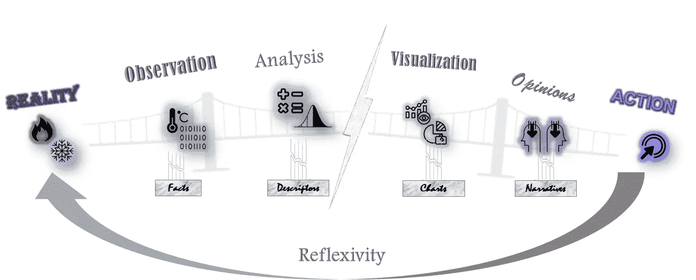**

**现在，我们已经，至少在概念上，完成了循环，我们已经建立了**

1.  **不要盲目相信事实和观察——大自然可能还没有选择亮出它所有的底牌**
2.  **总结和分析事实的描述符只是对现实的概括——而总结是不完美的**
3.  **“画家”可以操纵描述符的图表和表示来影响解释**
4.  **由于各种偏见(叙事谬误、价值观和信仰、外部群体压力、小数法则……)，人们可能对同一图表有不同的解读**
5.  **事实和行动之间的关系不仅仅是线性的，而是循环的，特别是对于涉及人类行为和集体行动(金融、社会科学……)的现象，这使情况更加复杂**

**那我们该怎么办？我确实想以积极的方式结束发言。我不认为我要努力的是放弃，而是要意识到心流中的不确定性，并保持适度的怀疑。这将继续区分我们人类和人工智能:人工智能本质上是客观的——它不受价值观和文化规范的阻碍，因此应该能够得出公正的结论(例如，基于结果的概率)。这些不完美不是我们软件中的小故障，而是让我们成为人类的一个特征。**

**某些权势集团坚信“答案就在数据中”。我希望通过上面的例子，我可以驱散这种误解。作为一名数据爱好者，我确实相信数据是一个更大难题中非常重要的一块，这个难题需要包括许多其他学科来进行决策，包括特定领域的专业知识，也包括哲学、伦理以及历史。即使面对不确定性，我们仍然可以明智地选择我们的行动。**

**现在我将结束这个循环，再次用气候变化来说明。虽然事实和数据往往是无可争议的，但科学界对因果关系没有完全的共识(例如，这是人类行动的原因吗？)和预测模型(即影响发生的速度有多快？)，因为这些是更高层次的顺序，更不容易伪造。话虽如此，我认为这种不确定性确实意味着某种行动方针:即使我们对悲观模型正确的概率赋予很小的可能性，预防原则也意味着我们不能什么都不做，因为失败的成本太高了。**

****脚注:****

***例如，最近我读到了村上春树的新书《客观不一定超越主观，你知道》。现实不一定会熄灭幻想。”***

***2 美国国家海洋与大气管理局***

***3 反身性与* [*一般均衡理论*](https://en.m.wikipedia.org/wiki/General_equilibrium_theory) *不一致，一般均衡理论规定市场走向均衡，非均衡波动仅仅是随机噪音，很快就会被纠正。在均衡理论中，长期均衡价格反映了潜在的* [*经济基本面*](https://en.m.wikipedia.org/wiki/Fundamental_analysis) *，不受价格影响。反身性断言，价格确实影响基本面，这些新影响的基本面然后继续改变预期，从而影响价格；这一过程以自我强化的方式继续。因为这种模式是自我强化的，市场趋向于不平衡***