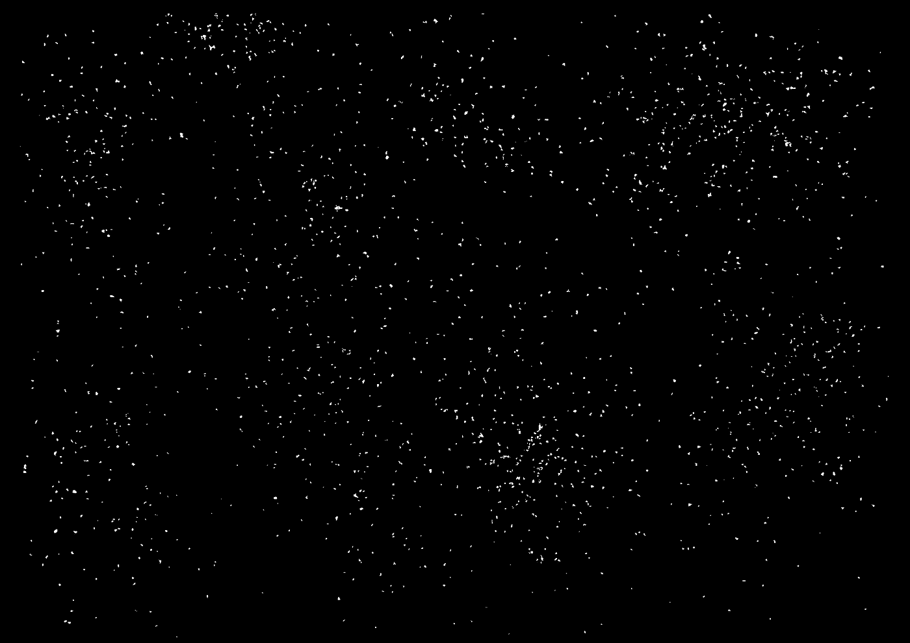
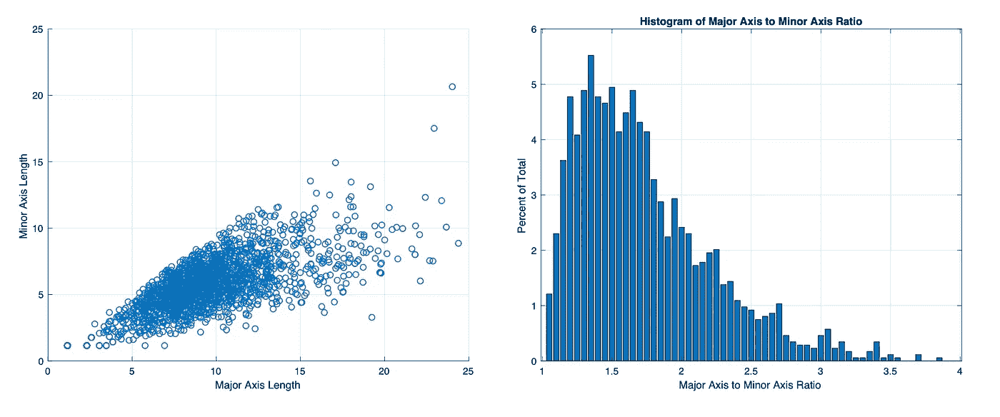
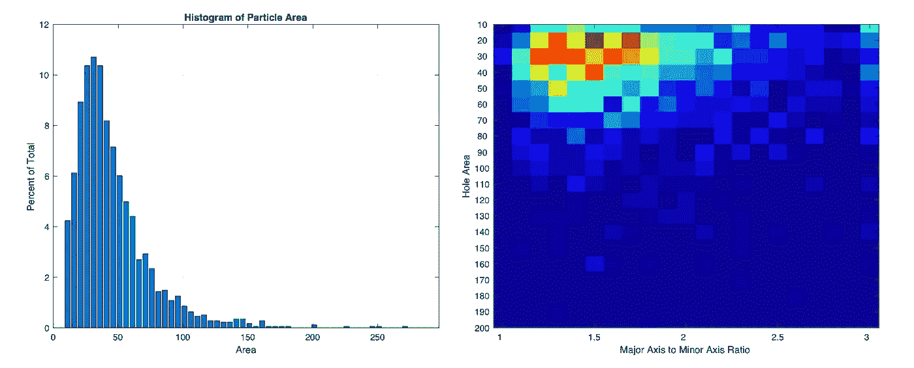
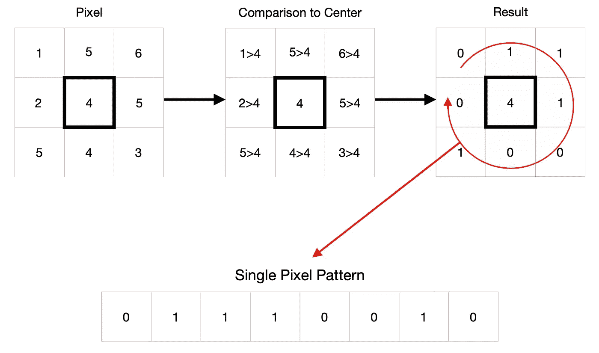
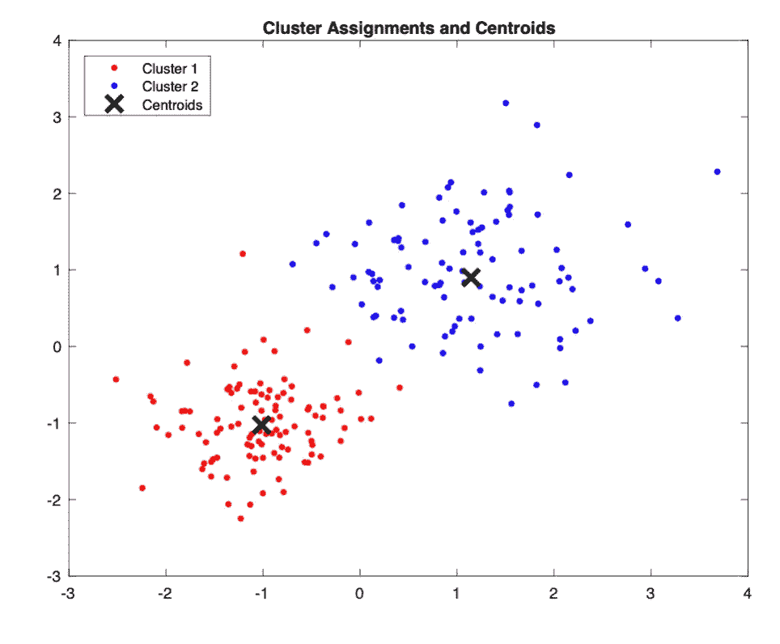
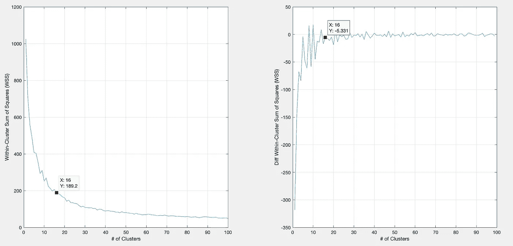
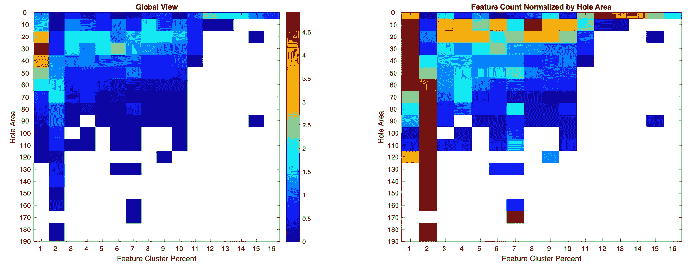
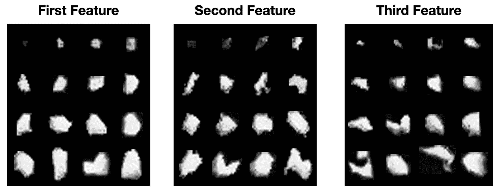

# 咖啡的形状

> 原文：<https://towardsdatascience.com/the-shape-of-coffee-fa87d3a67752?source=collection_archive---------33----------------------->

## 使用模式识别的颗粒分析

制作咖啡需要研磨，但哪种研磨机最好呢？我不确定，但我看到的是相当多的咖啡研磨分布数据。有些研磨机比其他研磨机更好，仅仅是因为它们有更紧密的分布，但是分布是唯一需要考虑的吗？

我最初研究颗粒大小是因为我编写了分析过滤孔的代码。可以使用相同的处理，但是我发现了两个主要的困难:

1.  在地面不接触的地方获取图像是很困难的。
2.  这项技术只能分辨 100 微米的 1 个像素，因此很难更好地感知更细微的颗粒。

另外，[粒子不是圆形的](https://medium.com/@rmckeon/coffee-is-not-round-5c102491be4c)。我没多想，因为我还有其他实验在进行，但一年后，我得到了一台显微镜。事实证明，大多数地面都不是圆形的。它们也不是正方形的。那么如何理解它们呢？你如何确定一个粒子的大小？半径不太有意义，但面积可能有意义。

如果你用面积来测量颗粒的大小，你会有两个尺寸分布非常相似但结果不同的研磨机吗？我被这个问题困扰着，为了理解咖啡渣，我求助于模式识别。

在这项工作中，我做了一个简单的预处理，然后我应用了一些标准的模式识别技术。对于每个粒子，我做了一个线性二进制模式(LBP)的特点是规模和旋转不变。然后我应用 k-means 聚类来确定粒子的类型。

我不知道这是否会成为理解粒子研磨的另一种方式，但我打算在未来进行以下测试:

1.  研磨设置
2.  筛过的粉末
3.  研磨机比较
4.  拍摄前与拍摄后的背景形状

# 初步加工

我把咖啡放在一张白纸或 iPad 屏幕上。然后我拍了一张照片。在这项工作中，我不担心规模，但这相对容易在以后的日期纳入。这里的关键是加工。然后我反转图像，对每个像素取 R*G*B 的乘积。应用一个简单的阈值后，我得到了这个图像:

这是一个特写图像。即使在这张图片中，你也可以看到各种各样的粒子形状。

最初，我看了一些指标，比如长轴与短轴之比。假设形状是一个椭圆。肯定有分布，而且不是线性相关的。我怀疑这表明了粒子形状的多样性。

然后我比较了长轴和短轴与面积的比率。同样，存在一个分布，它根据孔的面积而不同。

# 用于形状分析的模式识别

咖啡颗粒不是圆形的。不同的研磨设置或不同的研磨机会改变出来的颗粒形状吗？我们如何理解不同的形状？

## 线性二元模式

一种技术是使用线性二进制模式。这是一个应用于每个像素的简单模式，通过简单的等式(像素>中心像素)将周围的像素与中心像素进行比较来生成代码，如下所示。有 2⁸可能模式(256)，但如果你考虑围绕中心像素旋转，只有 59 个独特的模式。最后一个特征是图像中属于每个类别的像素百分比的 59 个元素长。

## k 均值聚类

之后，我们可以应用 K-means 聚类来查看不同类型的形状是如何分类的。K-均值聚类包括设置 K 个节点(在本例中为 16 个)，并将所有要素分组到它们最近的节点。然后，该算法反复调整节点和分组，以最好地分离数据。

[来自 Matlab 的两个节点示例](https://www.mathworks.com/help/stats/kmeans.html)

选择集群的数量更多的是一门艺术而不是一门科学。要使用的主要指标是类内平方和(WSS)，随着类数量的增加，会有一个收益递减的点，在本例中是 16 个类。

现在，我们可以在全局视图中比较这些不同簇的粒子面积，然后在每个空穴面积箱中进行归一化。

我不确定这说明了什么，只知道这是一种观察分布和颗粒大小的新方法。这是一个漂亮的图表，但最终，它能告诉我们什么呢？这些信息能够更好地区分好的研磨机吗？

我已经在网上看到了很多其他人的粒子分布，但我不清楚如何使用这些信息来区分最好、相当好、好、坏和最差。你可能会说研磨机不好，但我觉得好像少了点什么。我的经验是，我的 200 美元的韩国研磨机制作了很棒的浓缩咖啡，尽管与几千美元的研磨机相比，它并不被认为是一个很好的研磨机。希望，我们作为一个社区，将找到一些客观的衡量标准，这样人们将更容易花几千美元在磨床上。

如果你愿意，可以在 [Twitter](https://mobile.twitter.com/espressofun?source=post_page---------------------------) 和 [YouTube](https://m.youtube.com/channel/UClgcmAtBMTmVVGANjtntXTw?source=post_page---------------------------) 上关注我，我会在那里发布不同机器上的浓缩咖啡照片和浓缩咖啡相关的视频。你也可以在 [LinkedIn](https://www.linkedin.com/in/robert-mckeon-aloe-01581595?source=post_page---------------------------) 上找到我。

# 我的进一步阅读:

[咖啡不圆](https://medium.com/@rmckeon/coffee-is-not-round-5c102491be4c)

[搅拌还是旋转:更好的浓缩咖啡体验](/p/8cf623ea27ef)

[香辣意式浓缩咖啡:热磨，冷捣以获得更好的咖啡](/spicy-espresso-grind-hot-tamp-cold-36bb547211ef)

[断续浓缩咖啡:提升浓缩咖啡](/overthinking-life/staccato-espresso-leveling-up-espresso-70b68144f94)

[用纸质过滤器改进浓缩咖啡](/the-impact-of-paper-filters-on-espresso-cfaf6e047456)

[浓缩咖啡中咖啡溶解度的初步研究](/coffee-solubility-in-espresso-an-initial-study-88f78a432e2c)

[断奏捣固:不用筛子改进浓缩咖啡](/staccato-tamping-improving-espresso-without-a-sifter-b22de5db28f6)

[浓缩咖啡模拟:计算机模型的第一步](/@rmckeon/espresso-simulation-first-steps-in-computer-models-56e06fc9a13c)

[更好的浓缩咖啡压力脉动](/pressure-pulsing-for-better-espresso-62f09362211d)

[咖啡数据表](https://towardsdatascience.com/@rmckeon/coffee-data-sheet-d95fd241e7f6)

[工匠咖啡价格过高](/overthinking-life/artisan-coffee-is-overpriced-81410a429aaa)

被盗浓缩咖啡机的故事

[浓缩咖啡过滤器分析](/espresso-filters-an-analysis-7672899ce4c0)

[便携式浓缩咖啡:指南](/overthinking-life/portable-espresso-a-guide-5fb32185621)

克鲁夫筛:一项分析