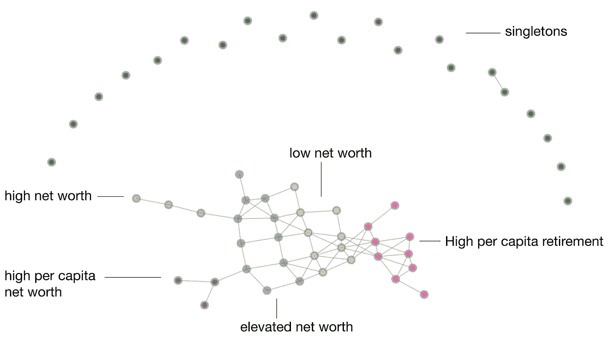

# 美国总统选举的格局

> 原文：<https://towardsdatascience.com/the-shape-of-the-united-states-presidential-elections-c336d80e4ddf?source=collection_archive---------20----------------------->

## 绘制选举结果的方法有很多——你可能没有尝试过这种方法(而且你还来得及赶上今年的选举)。

> *作者* [*菲利普【魏勒】*](/@p.weiler)*[*刘易斯*](https://towardsdatascience.com/@lewis.c.tunstall)*[*弗朗切斯科【帕尔马】*](https://towardsdatascience.com/@lapalmafrancesco) *和* [*托马斯*](/@t.boys_87095)**

**很少有人知道每个人在特定时间点对特定事情的看法。大选真实地反映了一个国家的居民如何看待他们国家的需求和优先事项。虽然我们必须谨慎下结论，但选民投票的方式反映了(在一定程度上！)他们的处境和他们的价值观。**

**选举之后，分析家们用一系列的例证来支持他们的结论，从而赋予这些原始材料以意义。一个反复出现的例子是选举地图。这张地图显示了实际的物理边界是如何与政治边界相一致的。具体来说，在美国，它传达了一个普遍的信息，即农村地区的选民是保守的，而人口稠密地区的选民是自由的。**

****

**选举地图用投票边缘着色**

**选举地图证实了我们的先验，并作为一个健全的检查。然而，它所代表的有限信息限制了我们能够提出的假设的多样性。**

> **找出因果关系并不总是容易的，因为它们不受地理位置的限制；有时我们只是不知道要寻找什么。**

**尽管你投票的方式完全是主观的，但研究表明，像你的社会经济背景，甚至你的邮政编码等因素都会影响你的投票偏好。制定适当的假设仍然是主观的，特别是在考虑高维数据集时，在变量之间建立正确的联系是一个真正的挑战。**

**为了揭示新的见解，使用一种系统的方法来直观地汇总数据符合我们的利益。这就是映射器算法可以帮助我们的地方。这是一种无监督的方法，它将数据分成不同的区域，并在适当的时候将它们连接起来。这些区域是产生新假说的关键。**

## **美国县域经济景观**

**县是美国一个州的行政分区。通常，县级分析提供了最详细的见解，因为关于它们的统计数据通常是可用的最小尺度。**

**通过使用 Mapper 算法，我们希望了解是否有一种自然的方式将各个县划分为社会经济类别，并将它们与投票行为联系起来。我们对 2016 年县级数据的研究使用了来自[美国经济分析局](https://apps.bea.gov/regional/downloadzip.cfm)的 21 个社会经济特征，例如，包括个人收入数据和人均退休。因为缺乏一些县(如阿拉斯加和夏威夷县)的数据，他们被排除在我们的研究之外。结果，我们统计了 3043 个县。**

## **我们的结果简而言之**

**我们的研究表明，我们可以根据经济指标将这些县分为五个主要区域:**

**1.高净值**

**2.高人均净资产**

**3.高人均退休率**

**4.高净值和平均净值**

**5.低净值**

****

**Giotto-learn Mapper 描绘的 2016 年美国社会经济景观**

**高人均退休人数本身就是一个集群，这并不是唯一令人惊讶的结果。结合低净值县，两者都占了绝大多数的县和表面积。同样值得一提的是，一个县的高净值并不能转化为高净值的个人，因此，在我们的研究中创造了两个独立的类别。**

**当结合选举结果时，我们发现在 2016 年，高人均退休和低净值地区是共和党的据点。除了一些高净值和中等净值的县以外，其余三个地区主要投票给民主党。**

**我们的结果是通过 Giotto-learn 实现的[映射器](https://github.com/giotto-ai/giotto-learn])获得的。你可以在这篇[博文](/visualising-high-dimensional-data-with-giotto-mapper-897fcdb575d7)中找到关于其内部运作的更详细的解释。如果你想复制我们的结果或者自己尝试，我们使用开源库 Giotto-learn 提供了[代码](https://github.com/giotto-ai/us-election-tda)来实现。Mapper 在美国投票中的另一个应用可以在[这里](https://www.nature.com/articles/srep01236)找到。**

# **方法论**

**成功应用 Mapper 需要选择:**

*   **过滤函数，即从数据集到低维空间的映射，**
*   **图像空间的盖子，**
*   **一种聚类方法**

****

**在 [Giotto-learn](https://github.com/giotto-ai/giotto-learn) 中运行映射器算法的工作流程**

**只需几行代码，Giotto-learn 的 Mapper 就会为你提供一个彩色的图表。这些节点表示分类，默认情况下，这些分类由分类内点的平均过滤器值来着色。当两个群集共享至少一个点时，将绘制一条边。在我们的例子中，一个点代表一个县。**

****

**按过滤器值着色的映射图**

**图表结构中的含义可以通过用感兴趣的变量给节点着色来揭示。例如，通过用每个节点成员的平均净值来给每个节点着色，我们可以看到哪些节点集是相似的。默认的“平均着色”过滤器值将连接的组件分为两个区域:高过滤器值和低过滤器值。单线态在过滤值上是多样的，因为它们覆盖了整个光谱。然而，这并不能提供太多的洞察力，因为过滤函数太抽象，难以解释。幸运的是，在 Giotto-learn 的 Mapper 实现中，很容易改变节点的颜色来从结构中提取洞察力。**

****给映射图着色以寻找含义****

****

**按个人收入着色的映射图**

****

**按人均收入着色的映射器**

****

**按人均退休人数着色的映射图**

**用个人收入、人均个人收入或人均退休来给图表着色，揭示了上面提到的五个相关区域。这五个区域之所以可见，是因为我们同时分析了 21 个特征。如果我们单独研究这些特征，获得这样的分类会困难得多，甚至是不可能的。**

**为了查看这在地图上是如何展开的，我们相应地给县地图着色。**

****

**地图绘制者图表和美国地图上用颜色标出的五个主要地区**

**虽然这些县在制图图中分离得很好，但当它们按位置绘制时，情况就不一样了。这些区域的拓扑结构非常重要，可能连专家都不会选择这样的分组。**

**为了显示映射器输出的重要性，我们可以用任何感兴趣的变量给图形着色。**

# **美国的投票行为**

**Mapper 图表通过分别用共和党和民主党赢得的县的百分比来给节点着色，帮助我们理解投票行为。我们的颜色范围从深蓝色(所有县都是民主党赢得的)、白色(两党赢得的县数量相等)到深红色(所有县都是共和党赢得的)。这些数据已经由[麻省理工学院选举数据和科学实验室](https://electionlab.mit.edu/data)提供。**

**我们不限于社会经济框架，也可以引入时间维度。保持映射图不变，并用不同年份的选举结果来着色，有助于我们理解投票行为是如何随着时间的推移而演变的。在这里，我们用新千年总统选举的结果来给节点着色。**

**为了反映一个集群的相对权重，我们可以通过改变节点的大小来增加另一个层次的信息。我们根据节点所负责的选举人的百分比来调整节点的大小。我们用下面的方式定义这个数字(每个县):给定一个州每个县的选举人数量，我们用这个县的人口百分比来加权。**

# **结果**

**在主连通分量中有两个极性相反的分量，它们与高/低滤波器值分离几乎完美地对齐。一般来说，共和党往往在选举人数量少的县表现强劲。我们注意到，2004 年以后，高净值、高人均净值、高人均退休的票数保持稳定。粗略来看，“摇摆”县包含在高净值、中等净值和低净值县中。关于单身一族的一个小事实是:他们几乎总是完全被其中一个政党赢得。**

## **投票的演变:2004 年至 2008 年**

**奥巴马总统赢得选举的那一年，我们注意到两件事:高人均退休和低净值地区不那么受共和党人支配。2004 年，高人均收入地区主要投票给共和党，而在 2008 年，它变成了民主党。**

****

**按选举结果着色的映射图**

## **投票的演变:2012 年至 2016 年**

**2016 年，我们看到共和党在上述地区的投票净进展。在传统的共和党地区，我们注意到与前几年相比，平均增长了 10-20%。然而，也有一个共和党人的据点被民主党人设法接管。**

****

**按选举结果着色的映射图**

## **各郡对选举团的贡献**

**民主党倾向于赢得大县(如洛杉矶，相当于 2.7%的选举人)，共和党赢得小但很多的县，这反映在 Mapper 图的节点中。我们可以根据每个县的平均选举人数量来划分两个新区域中的节点。第一个区域包含有少量选举人的县。对于第二个区域，情况正好相反。**

**例如，2016 年，一个大型深蓝色节点代表 4.5%的选举人，只包含 9 个县，其中 8 个县由民主党人赢得。与此同时，在共和党集群中，惊人的 700 个县总计占 10%的选举人，这意味着每个县只负责区区 0.015%的选举人。共和党赢得的每个县的选举人百分比总是小于民主党赢得的选举人百分比。**

## **从经济指标到投票行为**

**至于任何政治分析，我们需要小心我们的结论。由于我们无法获得投票后的民意调查数据，因此无法得出明确的结论。然而，这一分析表明，社会经济因素与投票行为之间存在持续的相关性:**

**1.在高净值县和大多数高净值县，民主党获得了更多的选票。**

**2.另一方面，共和党在高人均退休和低净资产地区得分。**

**3.摇摆票包含在两党各自的优势选区的边界区域。**

# **结论**

**Mapper 算法降低了数据的维度，并在保留拓扑属性的同时聚合数据。通过映射图，我们发现了不同的社会经济类别，这些类别似乎有投票趋势。**

**了解这些趋势以及它们如何随着时间的推移而变化，可能有助于为竞选活动制定策略。**

## **有用的链接:**

*   **[Github 上的 Giotto 库](https://github.com/giotto-ai/giotto-learn)**
*   **[装有密码的笔记本](https://github.com/giotto-ai/us-election-tda)**
*   **[教程](https://github.com/giotto-ai/tutorial_mapper/blob/master/Christmas%20Mapper.ipynb)关于映射器算法**
*   **更多学习资料请访问[网站](https://giotto.ai/)**
*   **[足球的形状](/the-shape-of-football-games-1589dc4e652a)及其[笔记本](https://github.com/giotto-ai/football-tda)**
*   **[检测股灾](/detecting-stock-market-crashes-with-topological-data-analysis-7d5dd98abe42)及其[笔记本](https://github.com/giotto-ai/stock-market-crashes)**