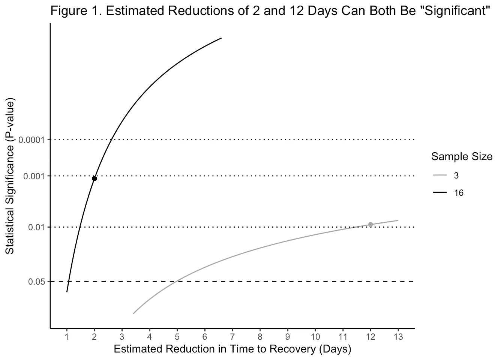
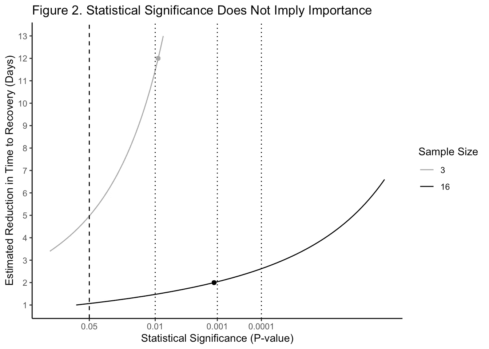
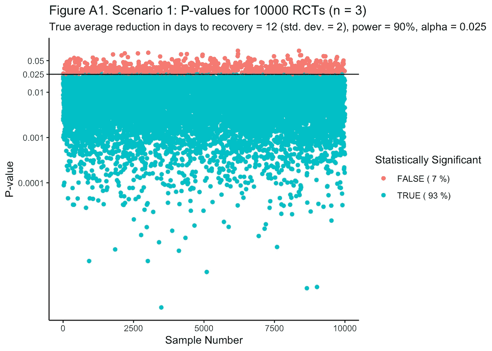
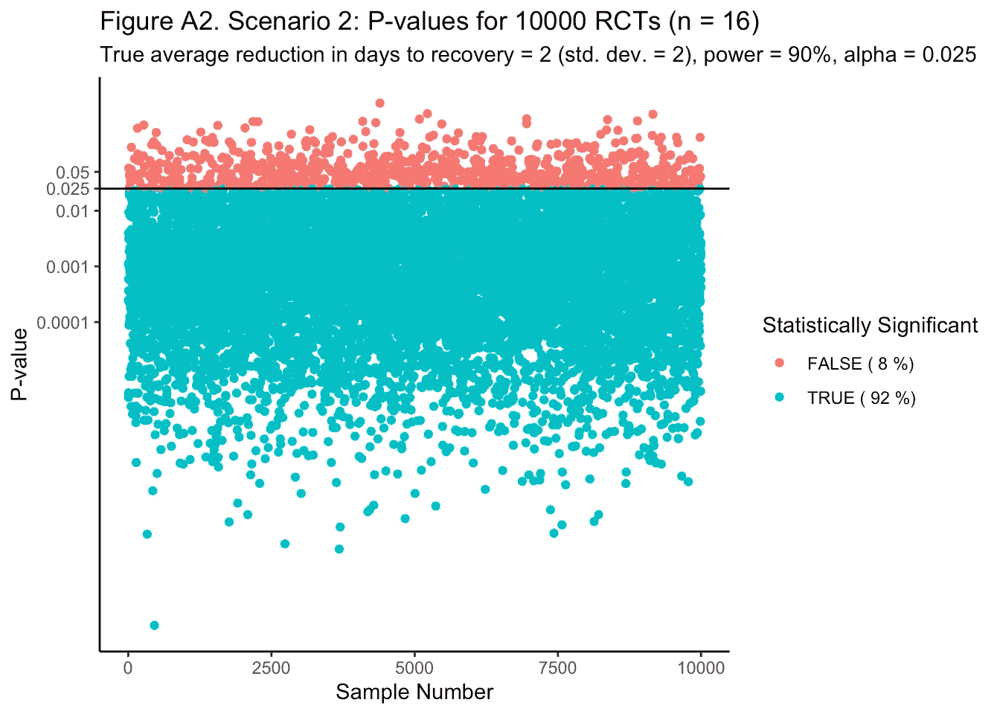

# 混淆 P 值与临床影响:显著性谬误

> 原文：<https://towardsdatascience.com/the-significance-fallacy-confusion-about-p-values-d7b5e530d0c?source=collection_archive---------39----------------------->

## 重要性并不意味着重要性——但是你需要它来判断质量

参见**附录**中的[*rpubs.com/ericjdaza/607888*](https://rpubs.com/ericjdaza/607888)*的重要性并不意味着重要性的证明示意图。*

> ***免责声明:**本文不支持或反对最近的 remdesivir 发现。相反，它是为了帮助你更好地区分临床发现的重要性和支持或反对这些发现的证据的质量。这两者在新闻中经常被混为一谈——甚至被医生和健康专家混为一谈！*
> 
> ***技术免责声明:**为了简单起见，我们将把恢复时间作为连续变量来分析，尽管[事件发生时间/存活分析](https://en.wikipedia.org/wiki/Survival_analysis)更合适。
> 
> **2021 年 7 月 26 日更新:**见我的更新帖子[放弃“统计学意义”](/ditch-statistical-significance-8b6532c175cb?sk=ca0fdc1447067647a9af8eddd2d24190)了解相关想法和建议在你的论文中使用的语言——以及回复评论者的批评。*

# *主要教训*

1.  *问问你自己，不管样本大小如何，随机对照试验报告的效应大小估计值是否有意义。*
2.  *训练你自己内在化那种重要性并不意味着重要性。(但是你需要统计学上的显著性，以便判断你的证据的质量。)*
3.  *记住*样本大小与效果大小*无关。*
4.  *当你真正的意思是“统计显著”时，千万不要只说“显著”。你会被误解为说“重要”。相反，总是说或写出整个短语“统计显著”。*

# *介绍*

*emdesivir 最近再次成为头条新闻，这要归功于一些新的发现，即它可能有助于缩短住院新冠肺炎患者的康复时间。请记住，这只是一个随机对照试验(RCT)，所以我们不会真的知道很多，直到更多的 remdesivir 随机对照试验完成。但是我们甚至可以从这个试验以及它是如何被报道的中学到很多。*

*在阅读或观看关于 RCT 的新闻时，请注意以下两点:*

1.  ***明显的混乱。**当你在新闻中听到有人写或谈论来自 RCT 的“重大”发现时，假设他们*想要*告诉你它在临床或科学上是否有意义或有用。但是相反，当他们真正想报告其科学或临床重要性时，他们会报告其*统计显著性*。他们会告诉你证据有多好，当他们真的想告诉你治疗有多有用的时候。这是因为他们把他们想要告诉你的科学或临床的事情(即重要性)与证据的质量(即统计学意义)相混淆，而没有真正意识到他们正在做的事情。这被称为“显著性谬误”( [Kühberger et al，2015](https://bmcresnotes.biomedcentral.com/track/pdf/10.1186/s13104-015-1020-4)；[Silva-aya guer 等人，2010 年](https://link.springer.com/article/10.1186/1471-2288-10-44)；巴尼特和马西森，1997 年。*
2.  ***(效果)大小很重要。**此外，听听他们报告的效果的估计大小(例如，[恢复时间从安慰剂组的 15 天减少到 remdesivir 组的 11 天](https://www.niaid.nih.gov/news-events/nih-clinical-trial-shows-remdesivir-accelerates-recovery-advanced-covid-19))。这一发现具有“统计显著性”，仅意味着在这一特定研究中有足够的统计证据表明观察到的差异可能是真实的(即，有足够多的患者被招募来检测平均差异)。问问你自己，效应大小在实际的医疗、临床和医院护理中有意义或有用吗？减 4 天够吗？可能会，也可能不会，这取决于具体情况以及特定社区或医院的需求。(例如，参见[沙利文和费恩，2012 年](https://www.jgme.org/doi/full/10.4300/JGME-D-12-00156.1)。)*

*不幸的是，对于我们的记者或卫生官员来说，我们将在下面看到统计学意义并不意味着科学或临床重要性。在阅读或聆听这样的报道时，千万不要、**千万不要、**千万不要、*千万不要、*千万不要仅仅抓住“重大”这个词不放。它通常意味着“有统计学意义”，如果没有效应大小的背景和它的临床有用性，它是没有用的。*****

*但是，在你将此斥之为“迂腐的统计政策”之前，请继续阅读…*

# *两种假设情景*

> *从数学上讲，仅仅知道一项发现是否具有“统计显著性”是不可能判断它在临床上或科学上是否重要的。*

*在 RCT 中,“统计显著”效应是指有足够的统计证据支持假设的效应，而不是无效应或其他基线效应(例如，来自护理标准)。这是否意味着该发现在临床或科学上有实际意义？也许是，也许不是。从数学上讲，仅仅知道一项发现是否“具有统计学意义”是不可能判断它在临床上还是科学上是重要的。(参见图 1 和图 2 以及位于 rpubs.com/ericjdaza/607888[的**附录**中的示例和验证草图。)](https://rpubs.com/ericjdaza/607888)*

*即使对于给定的效应大小，统计显著性也只能告诉你样本有多大——而不是效应大小有多重要。一般来说，样本大小与效果大小并不相关:招募更多的患者可以增加统计学意义，但不会改善或减少你的药物的临床效果。(本来就是这样。)*

*也就是说，“统计学意义”与证据的质量息息相关。但是它与“临床重要性”(即，证据显示的东西是否有意义或有用)没有任何关系。出现这种混乱是因为在 RCT 中，“统计学显著性”要么是由一个非常大的治疗效果产生的，要么是由一个效果的大量证据产生的。大多数人——包括我自己——很自然地认为“重大”一词指的是前者。然而，当这些事情中只有一件是真的时，一个发现仍然是“统计显著的”*，如下面的两个假设场景。**

*首先，让我们假设对所有患者的影响是相同的，但是恢复时间平均变化 2 天(即，标准偏差是 2 天)。我们还假设 15 天是恢复的真实基线时间(即对照结果)，因此我们将设计单组试验，其中所有患者都接受雷地昔韦治疗。*

*在图 1 中，我们看到，在 0.05 的统计显著性水平上，从一项招募 3 名患者的假设性研究中估计的 12 天的大恢复时间减少与从一项招募 16 名患者的研究中估计的 2 天的小恢复时间(p = 0.0012)在定性上是“显著的”(p = 0.0091)。但这作为临床重要性的声明毫无意义！*

**

*参见**附录**中的[*rpubs.com/ericjdaza/607888*](https://rpubs.com/ericjdaza/607888)*中重要性不意味着重要性的证明示意图。**

**这在图 2 中可能更清楚，坐标轴翻转了:估计平均减少 12 天(y 轴)不太“显著”(x 轴；p = 0.0091)而不是 2 天中的一天(p = 0.0012)。(图 1 和图 2 是使用双面 t 检验创建的，标准偏差设置为 2 天。代码和细节见**附录**。)**

> **样本大小与效果大小无关。**

**为了详细说明这两种情况:**

1.  ****确实有很大的影响，但证据很少。**假设 remdesivir 实际上大大缩短了平均 12 天的恢复时间。我们在随访的单臂 RCT 中招募了 3 名患者，并将这种未知的真实效果估计为平均减少 10.6 天——在 0.05 的水平上完成“显著 p 值”为 0.0157。效果如此之大，以至于我们只需要 3 个病人就能看到。(记住，一个 RCT 只能提供一个真实效果的估计。我们几乎肯定会估计真实的影响，每次都有一些变化；这里，10.6 天是对 12 天真实平均效应的估计。p 值也会因样本而异，除非另有说明，否则实际上只是真实 p 值的近似值。)**
2.  ****有一个小的真实影响，但是有很多证据。**现在假设 remdesivir 仅平均减少 2 天的恢复时间。我们招募了 16 名患者，估计这种未知的真实效果减少了 2.2 天，其“非常显著的 p 值”为 0.0002。(我们这里大得多的样本量让我们对真实效果有了更精确的估计。)这种影响非常小，我们需要 16 个病人才能看到。**

**大多数人会同意，第一个发现在直觉上更“重要”:越大越好。然而，这两个发现都是“统计显著的”，10.6 天的估计比 2.2 天的估计“不太显著”(即，更大的 p 值)，这与直觉相反。这两个简单的场景说明了为什么“显著性”——作为整个短语“统计显著性”的常见、被误导的简写——并不意味着科学或临床的“重要性”。**

**简单的解决办法:当你真正的意思是“统计上的显著”时，千万不要只说“显著”。你会被误解为说“重要”。相反，总是说或写出整个短语“统计显著”。**

**(要更深入地了解这个例子，请参见附录中的 R 代码和完整的模拟结果。)**

# **不仅仅是学术**

** [## 国家卫生研究院:新冠肺炎药物的关键研究显示患者对治疗有反应

### 政府对 Gilead 的 remdesivir 的研究，也许是最密切关注的治疗小说的实验药物…

www.statnews.com](https://www.statnews.com/2020/04/29/gilead-says-critical-study-of-covid-19-drug-shows-patients-are-responding-to-treatment/) 

当然，像新闻中这样具有统计学意义的发现仍然传达了好消息:在这个 RCT 中，似乎有足够的统计证据表明，当服用 remdesivir 时，恢复时间从 15 天减少到 11 天，具有临床意义(前提是 RCT 的功率适当；参见 [Brownlee，2018](https://machinelearningmastery.com/statistical-power-and-power-analysis-in-python/)Python 统计幂教程)。也就是说，可能有足够的统计支持(即，来自 1，063 名患者的样本)来声称这种影响大小可能接近真实情况。

但是如果上面的场景 2 是真的呢？媒体或健康专家会报道“remdesivir 显著缩短了恢复时间，从 15 天缩短至 13 天”(四舍五入)。你说什么

> ***千万不要*** 当你真正的意思是“统计上显著”时，就说“显著”。你会被误解为说“重要”。相反，总是说或写出整个短语“统计显著”。

想想这在临床上意味着什么。2.2 天的减量可能没有 10.6 天的减量重要。但是媒体和健康专家会称这两个减少的估计是“显著的”，错误地认为他们报告了临床重要性。也就是说，他们会将统计发现与科学或临床发现混淆。

重要的是，注意*甚至医生和健康专家也会犯这个错误*。**全部。的。时间。**

这意味着“统计学意义”和“临床重要性”之间的区别不仅仅是学术上的。它在塑造领导人如何决定治疗新冠肺炎患者的建议方面具有现实世界的公共卫生和政策影响。

> 统计学有助于科学——但它本身并不是科学。

但是为什么连专家都会犯这个错误呢？我认为原因与“相关性并不意味着因果关系”这句话的流行有关:我们都可以这么说——但我们都仍然不断地努力遵循它。我的理解和观点是，进化让我们将相关性误认为因果关系:看到因果关系——即使根本没有——比偶尔犯下这种认知错误更重要。我的猜测是，我们倾向于结果导向而不是证据导向，原因类似于为什么我们倾向于因果导向而不是关联导向。(进化心理学家和认知科学家，你们的想法？)

但在当今世界，犯下重要性谬误会产生全社会的后果——不仅仅是个人或部落的。有影响力的领导人制定了影响成百上千人的政策，他们不能犯这样的错误。不屈服于自然直觉需要一致的精神警惕。即使是我们这些受过如何不犯这种错误的专门训练的统计学家，仍然会犯错误:毕竟，我们是人。(我保证！)

# 摘要

统计学有助于科学——但它本身并不是科学。每当你把一个“统计上显著”的发现简单地称为“显著”，你[就错误地把统计学和科学](https://www.amstat.org/asa/News/ASA-P-Value-Statement-Viewed-150000-Times.aspx)混为一谈([瓦瑟斯坦和耶戈，2016](https://www.tandfonline.com/doi/full/10.1080/00031305.2016.1154108) )。据我所知，这很正常。

显著性谬误远非迂腐和学术，而是具有严重的健康含义:无意中将统计数据与科学混淆(特别是对于小效应规模而言)影响了影响数百万人的政策和医疗实践。这每天都影响着你的健康，以及你的朋友和家人的健康。

但正如我们所见，还是有希望的。我们都可以学会做以下事情:

1.  问问你自己，不管样本大小如何，RCT 报告的效应大小估计值是否有意义。
2.  训练自己内化*重要性并不意味着重要性*。(但是你需要统计学上的显著性，以便判断你的证据的质量。)
3.  记住*样本大小与效果大小*无关。
4.  当你真正的意思是“统计显著”时，千万不要只说“显著”。你会被误解为说“重要”。相反，总是说或写出整个短语“统计显著”。

如果我们中有足够多的人能做到这四件事，我们就能帮助我们的领导者做同样的事情——或者成为重要的领导者。

# 参考

*   p 值的暴政:统计学意义和常识之间的冲突。1997: 534–536.[journals.sagepub.com/doi/pdf/10.1177/00220345970760010201](https://journals.sagepub.com/doi/pdf/10.1177/00220345970760010201)
*   Python 中统计能力和能力分析的简明介绍。统计学。2018 年 7 月 13 日。[machinelingmastery . com/statistical-power-and-power-analysis-in-python/](https://machinelearningmastery.com/statistical-power-and-power-analysis-in-python/)
*   推论统计学中的显著性谬误。BMC 研究笔记。2015 年 12 月；8(1):84.[bmcrenotes . biomed central . com/track/pdf/10.1186/s 13104–015–1020–4](https://bmcresnotes.biomedcentral.com/track/pdf/10.1186/s13104-015-1020-4)
*   Silva-aya guer LC，Suárez-Gil P，Fernández-Somoano A .卫生科学研究中的零假设显著性检验(1995–2006):统计分析和解释。BMC 医学研究方法论。2010 年 12 月 1 日；10(1):44.【link.springer.com/article/10.1186/1471–2288–10–44 
*   使用效应大小——或者为什么 P 值不够。研究生医学教育杂志。2012 年 9 月；4(3):279–82.[www.jgme.org/doi/full/10.4300/JGME-D-12-00156.1](https://www.jgme.org/doi/full/10.4300/JGME-D-12-00156.1)
*   沃瑟斯坦 RL，耶戈纳。美国儿科学会关于 p 值的声明:背景、过程和目的。2016.[tandfonline.com/doi/full/10.1080/00031305.2016.1154108](https://www.tandfonline.com/doi/full/10.1080/00031305.2016.1154108)

# 附录

## 例子:重要性并不意味着重要性

参见**附录**中[rpubs.com/ericjdaza/607888](https://rpubs.com/ericjdaza/607888)处的示例和验证草图。

## RCT 模拟

在图 A1 ( `ggp_pvalues1`)中，我们看到所有 10，000 个模拟随机对照试验中的 93%给出了具有统计显著性的真实差异估计值 12(总体统计显著性水平为 0.025)。在图 A2 ( `ggp_pvalues2`)中，我们看到 92%的 RCT 同样给出了具有统计显著性的真实差异估计值 2。

## r 代码** 

# **关于作者**

**Daza 博士是一名生物统计学家和健康数据科学家，而不是流行病学家，他为个性化(n-of-1)数字健康开发因果推断方法。| ericjdaza.com[🇵🇭🇺🇸](https://www.ericjdaza.com/)t16】@埃里克森 t18】linkedin.com/in/ericjdaza|[statsof1.org](https://statsof1.org/)[@ stats of](https://twitter.com/statsof1)[@ fsbiostats](https://twitter.com/fsbiostats)**

**版权 2020 埃里克·j·达扎和 Stats-1。保留所有权利。**

***岗位也可在*[*【rpubs.com/ericjdaza/607888】*](https://rpubs.com/ericjdaza/607888)*任职。***

*****编者按:*** [*走向数据科学*](http://towardsdatascience.com/) *是一份以数据科学和机器学习研究为主的中型刊物。我们不是健康专家或流行病学家，本文的观点不应被解释为专业建议。想了解更多关于疫情冠状病毒的信息，可以点击* [*这里*](https://www.who.int/emergencies/diseases/novel-coronavirus-2019/situation-reports) *。***