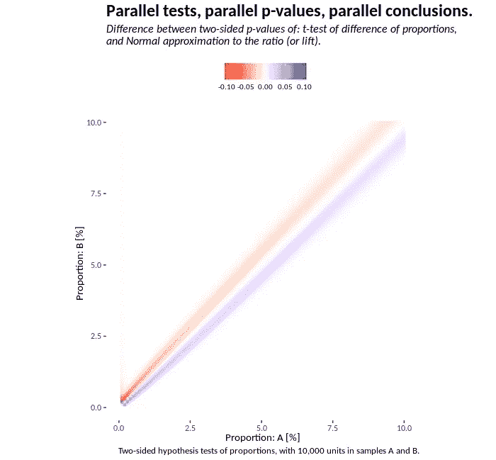
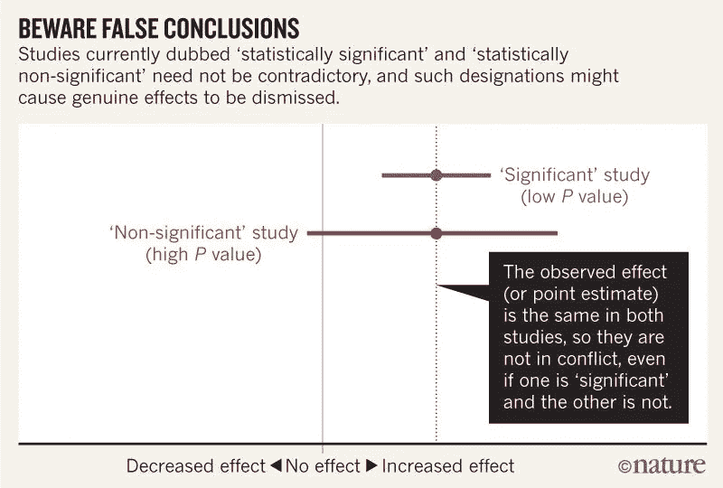

# p 值的重要问题

> 原文：<https://towardsdatascience.com/the-significant-problems-of-p-values-c31b2b6ed275?source=collection_archive---------14----------------------->

## 对 p 值的误解在研究中很常见。

p 值通常用于科学研究，并在教育实践中教授。本文将讨论零假设显著性检验。我将详细阐述 p 值的含义和误解。

# 零假设显著性检验

1925 年，[罗纳德·费雪](http://www.haghish.com/resources/materials/Statistical_Methods_for_Research_Workers.pdf)写了关于“显著性检验”的文章。费希尔试图检验一个假设，推断是否拒绝零假设。

1933 年，[杰吉·内曼和埃贡·皮尔森](https://www.jstor.org/stable/91247?origin=ads&seq=1)发表了关于假设检验的文章。他们的方法是比较两个简单的假设，推断采取什么行动。

[费希尔和尼曼-皮尔逊之间存在严重分歧。用于零假设显著性检验的现代程序是一个混乱的混合体。](https://www.uv.es/sestio/TechRep/tr14-03.pdf)[混合框架](https://statistics.laerd.com/statistical-guides/hypothesis-testing-3.php)是:

1.  陈述无效假设和替代假设。无效假设通常意味着没有影响或没有差异。
2.  陈述错误率。第一类错误是当零假设为真时拒绝零假设的长期概率。(这就是通常所说的显著性水平。)
3.  收集完数据后，计算测试统计量。
4.  对于检验统计，计算相关的 p 值。
5.  如果 p 值小于规定的显著性水平(步骤 2)，则拒绝零假设。如果 p 值更大，不要拒绝这个假设。

美国统计协会非正式地将 p 值定义为:

> 在特定的统计模型下，数据的统计汇总等于或大于其观察值的概率。

零假设显著性检验的主要目的是通过矛盾来证明。如果零假设是真的，那么观察到的数据可能是不寻常的。如果观察到的数据不寻常，拒绝那个假设。

# p 值不是什么

关于 p 值是什么，研究人员有很多困惑。[美国统计协会](https://amstat.tandfonline.com/doi/full/10.1080/00031305.2016.1154108)在 2016 年发表了他们的声明。该声明希望纠正对 p 值的误解。

p 值是给定模型和观测数据之间兼容性的度量。“统计显著性”是 p 值的二元分配。

p 值不是零假设为真的概率。

p 值*假设*零假设为真。这不是假设的概率。

**p 值不是结果偶然发生的概率。**

p 值计算*假设* chance 单独运行。同样，它不可能是那个假设的概率。

**0.05 的阈值是约定俗成的。**

这个惯例来自于*研究人员统计方法*中的一句话:

> P = .05 或 1/20 的值是 1.96 或接近 2；在判断一个偏差是否被认为是重大的时候，以这一点为界限是很方便的。

**p 值不显示效果的大小或重要性。**

当一项研究规模很大时，小的影响会产生“重大”的结果。

# 框架问题

零假设显著性检验框架有几个问题。

**Fisher 的 p 值与 Neyman-Pearson 假设检验不相容。结合两种方法会导致内部不一致。Fisher 的 p 值是一个间接的证据衡量标准，使用的数据来自一个单一的研究。尼曼-皮尔森框架是关于在许多研究中设定错误的长期频率。p 值在他们的决策过程中不起作用。**

经典统计学不为假设分配概率。研究人员经常问:给定我的数据，假设的概率是多少？p 值提供:给定假设，我的数据的概率是多少，或者更极端的情况？概率的经典定义是事件的长期频率。这个定义意味着我们不能给假说一个概率。这个假设成立与否。

分配假设很重要。我们赋予数据的基本分布很重要。这是进行 p 值计算的假设的一部分。使用不同模型下的相同数据，p 值可能会有很大差异。

相同的数据，不同的假设。(图片: [ggplot2](https://rpubs.com/anthonybmasters/parallel-tests) )

你如何收集数据很重要。关于 p 值计算的另一个经常被提及的假设是数据收集。如果我们打破这个假设，p 值只在我们不关心的另一个宇宙中有意义。

零假设被拒绝。完全没有影响或差异*通常是一个虚假的假设。*

***“重大”和“非重大”结果并不冲突。**两项研究可以估计完全相同的效应大小。一个是‘重大’。另一个不是。区别在于中央估计的精度。*

**

*在这里，同样的效果既有“显著的”也有“不显著的”。(图片:[自然](https://www.nature.com/articles/d41586-019-00857-9))*

***二元区分鼓励过度自信。有人认为如果 p = 0.051，他们不能拒绝零假设，但是如果 p = 0.051，他们会拒绝吗？“重要”和“不重要”之间可以是不重要的。***

***多重比较会给出误导性的结果。**对同时进行的多项测试的处理可能会令人困惑。[存在多种方法](http://nebc.nerc.ac.uk/courses/GeneSpring/GS_Mar2006/Multiple%20testing%20corrections.pdf)来“校正”显著性水平，但并不总是适用。*

***小影响不一定为零。**例如，我们可以跟踪一段时间内的估计失业率。每个变化都在抽样误差范围内。然而，大的变化可以从累积的小变化中发生。一点一点，一点变成很多。*

*在统计实践中，研究设计、数据收集和分析以及令人信服的表述至关重要。研究估计影响，我们应该用不确定性来描述。正如美国统计协会所说:*

> *没有一个单一的指数可以替代科学推理。*