# 用 Python 实现自然语言处理中单词嵌入的简单方法

> 原文：<https://towardsdatascience.com/the-simple-approach-to-word-embedding-for-natural-language-processing-using-python-ae028c8dbfd2?source=collection_archive---------30----------------------->

## 使用 Gensim 和 Plotly 探索单词嵌入

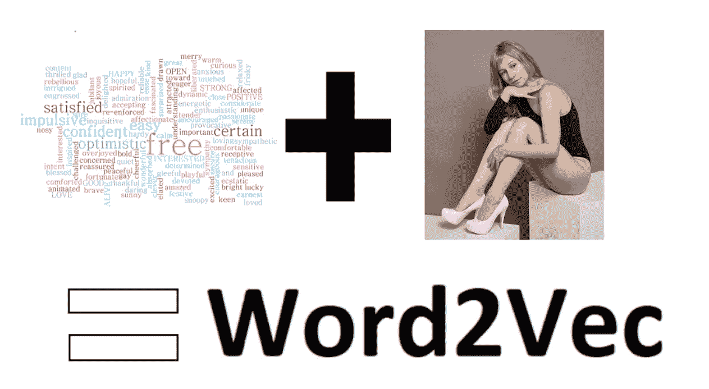

[画面一](https://www.needpix.com/photo/336813/word-cloud-words-tag-cloud-tagcloud-wordcloud-happy-optimistic-satisfied)、[画面二](https://pixabay.com/photos/model-posture-legs-bodysuit-cube-4689824/)

# 学习 NLP 的下一步？

当头脑风暴研究新的数据科学主题时，我总是倾向于自然语言处理(NLP)。这是一个快速发展的数据科学领域，不断有创新需要探索，我喜欢分析写作和修辞。NLP 自然符合我的兴趣！之前，我写了一篇关于使用“单词袋”模型开始 NLP 的[简单项目的文章。本文旨在通过探索使用 Word2Vec 通过 Python Gensim 库生成单词嵌入的快捷方式，从而超越简单的“单词包”方法。](/3-super-simple-projects-to-learn-natural-language-processing-using-python-8ef74c757cd9)

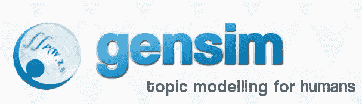

[https://radimrehurek.com/gensim/](https://radimrehurek.com/gensim/)

# 传统单词包 vs Word2Vec

当我开始探索自然语言处理(NLP)时，我了解的第一个模型是简单的单词袋模型。尽管它们非常有效，但也有局限性。

## 传统的词汇袋方法

**单词包(BoW)** 是描述文本语料库中**单词**出现的文本表示，但不解释单词的顺序。这意味着它对待所有的单词都是相互独立的，因此得名单词包。

BoW 由一组单词(词汇)和一个类似于*频率*或 *TF-IDF* 的指标组成，用来描述每个单词在语料库*中的值。*这意味着如果词汇表非常大，BoW 会导致稀疏矩阵和高维向量，这会消耗大量计算机资源。

为了简化弓向量化的概念，假设您有两个句子:

> *狗是白色的
> 猫是黑色的*

将句子转换为向量空间模型会以这样的方式转换它们，即查看所有句子中的单词，然后用数字表示句子中的单词。如果句子是一次性编码的:

> *狗是白色的猫是黑色的
> 狗是白色的= [1，1，0，1，1，0]
> 猫是黑色的= [1，0，1，1，0，1]*

BoW 方法有效地将文本转换成用于机器学习的固定长度向量。

## Word2Vec 方法

由谷歌的一组研究人员开发的 Word2Vec 试图解决 BoW 方法的几个问题:

*   高维向量
*   假设彼此完全独立的词

使用只有几层的神经网络，Word2Vec 试图学习单词之间的关系，并将它们嵌入到低维向量空间中。为此，Word2vec 根据输入语料库中与其相邻的其他单词来训练单词，从而捕获单词序列中的一些含义。研究人员设计了两种新方法:

*   连续的单词袋
*   跳跃图

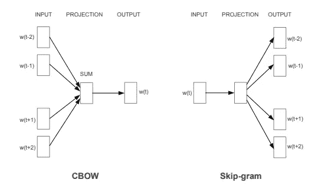

[CBOW 架构基于上下文预测当前单词，而 Skip-gram 根据当前单词预测周围的单词。](https://arxiv.org/abs/1301.3781)

这两种方法都会产生一个向量空间，该向量空间基于上下文含义将单词向量紧密地映射在一起。这意味着，如果两个单词向量很接近，那么基于它们在语料库中的上下文，这些单词应该具有相似的含义。例如，使用余弦相似性来分析他们的数据产生的向量，研究人员能够构建类似于**国王**减去**男人**加上**女人** =？

最匹配**皇后**的输出向量。

```
king - man + woman = queen
```

如果这看起来令人困惑，不要担心。应用和探索 Word2Vec 很简单，随着我对示例的深入，它会变得更有意义！

# 依赖性和数据

Python 库 [Gensim](https://radimrehurek.com/gensim/index.html) 使得应用 Word2Vec 以及其他几种算法来进行主题建模变得很容易。Gensim 是免费的，可以使用 Pip 或 Conda 安装:

```
pip install --upgrade gensimORconda install -c conda-forge gensim
```

**数据和所有代码可以在我的 GitHub 中找到，并且是与前一篇文章中使用的垃圾邮件数据集相同的 repo。**

[](https://github.com/bendgame/nlpBeginnerProjects) [## bendgame/nlpBeginnerProjects

### NLP 中级入门项目。通过创建帐户，为 bendgame/nlpBeginnerProjects 的开发做出贡献…

github.com](https://github.com/bendgame/nlpBeginnerProjects) 

导入依赖项

```
from gensim.models import Word2Vec, FastText
import pandas as pd
import refrom sklearn.decomposition import PCAfrom matplotlib import pyplot as plt
import plotly.graph_objects as goimport numpy as npimport warnings
warnings.filterwarnings('ignore')df = pd.read_csv('emails.csv')
```

我首先使用 Pandas 加载库并读取 csv 文件。

# 探索 Word2Vec

在处理电子邮件数据之前，我想用一个简单的例子来探索 Word2Vec，这个例子使用了几个句子的小词汇表:

```
sentences = [['i', 'like', 'apple', 'pie', 'for', 'dessert'],
            ['i', 'dont', 'drive', 'fast', 'cars'],
            ['data', 'science', 'is', 'fun'],
            ['chocolate', 'is', 'my', 'favorite'],
            ['my', 'favorite', 'movie', 'is', 'predator']]
```

## 生成嵌入

注意，句子已经被标记化了，因为我想在单词级而不是句子级生成嵌入。通过 Word2Vec 模型运行句子。

```
# train word2vec model
w2v = Word2Vec(sentences, min_count=1, size = 5)print(w2v)
#Word2Vec(vocab=19, size=5, alpha=0.025)
```

注意，在构建模型时，我传入了 **min_count =1** 和 **size = 5** 。也就是说，它将包含*出现≥ 1* 次的所有单词，并生成一个*固定长度为 5* 的向量。
请注意，打印时，模型会显示唯一 vocab 单词的计数、数组大小和学习率(默认为. 025)

```
# access vector for one word
print(w2v['chocolate'])#[-0.04609262 -0.04943436 -0.08968851 -0.08428907  0.01970964]#list the vocabulary words
words = list(w2v.wv.vocab)print(words)#or show the dictionary of vocab words
w2v.wv.vocab
```

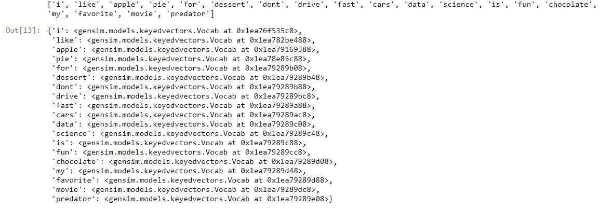

考察词汇的两种不同方法

注意，一次可以访问一个单词的嵌入。
注意，可以使用***w2v . wv . vocab .***以几种不同的方式复习词汇中的单词

## 可视化嵌入

既然已经使用 Word2Vec 创建了单词嵌入，那么可以使用一种方法来可视化它们，以在展平的空间中表示矢量。我使用 [Sci-Kit Learn 的主成分分析](https://scikit-learn.org/stable/modules/generated/sklearn.decomposition.PCA.html) (PCA)功能将单词向量展平到 2D 空间，然后使用 [matplitlib](https://matplotlib.org/) 将结果可视化。

```
X = w2v[w2v.wv.vocab]
pca = PCA(n_components=2)result = pca.fit_transform(X)# create a scatter plot of the projection
plt.scatter(result[:, 0], result[:, 1])
words = list(w2v.wv.vocab)for i, word in enumerate(words):
    plt.annotate(word, xy=(result[i, 0], result[i, 1]))plt.show()
```

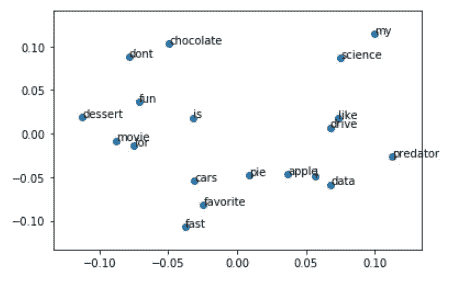

单词嵌入图

幸运的是，语料库很小，所以很容易可视化；然而，很难从标绘的点中解读出任何意义，因为该模型可以学习的信息如此之少。

# 可视化电子邮件单词嵌入

现在我已经完成了一个简单的例子，是时候将这些技巧应用到更大的数据中了。通过调用 dataframe ***head()检查邮件数据。***

```
df.head()
```

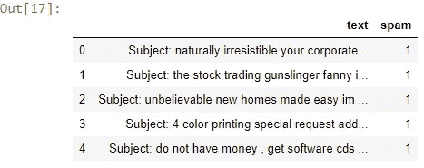

df.head()

## 清理数据

请注意，文本根本没有经过预处理！使用一个简单的函数和一些正则表达式，清除文本中的标点符号和特殊字符，并将其全部设置为小写很简单。

```
clean_txt = []
for w in range(len(df.text)):
    desc = df['text'][w].lower()

    #remove punctuation
    desc = re.sub('[^a-zA-Z]', ' ', desc)

    #remove tags
    desc=re.sub("&lt;/?.*?&gt;"," &lt;&gt; ",desc)

    #remove digits and special chars
    desc=re.sub("(\\d|\\W)+"," ",desc)
    clean_txt.append(desc)df['clean'] = clean_txt
df.head()
```

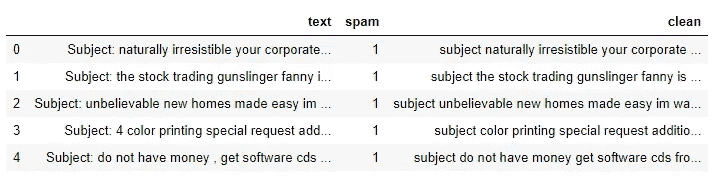

df.head()显示干净的文本

请注意，数据帧中添加了 clean 列，文本中的标点符号和大写字母已被清除。

## 创建语料库和向量

因为我想要单词嵌入，所以文本需要标记化。使用循环的*,我遍历标记每个干净行的数据帧。创建语料库后，我通过将语料库传递给 Word2vec 来生成单词向量。*

```
corpus = []
for col in df.clean:
    word_list = col.split(" ")
    corpus.append(word_list)#show first value
corpus[0:1]#generate vectors from corpus
model = Word2Vec(corpus, min_count=1, size = 56)
```

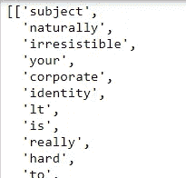

文集

请注意，数据已经进行了标记化，可以进行矢量化了！

# 可视化电子邮件单词向量

电子邮件数据的语料库比简单示例大得多。由于包含了很多单词，我不能像使用 matplotlib 那样绘制它们。

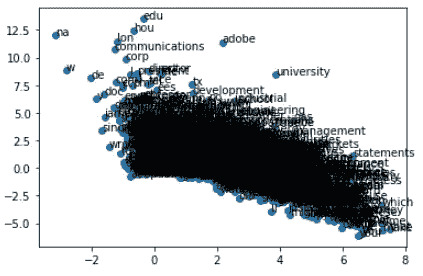

用 matplotlib 可视化电子邮件单词

祝你理解这一点！是时候使用不同的工具了。代替 *matplotlib* ，我将使用 **plotly** 生成一个可以缩放的交互式可视化。这将使探索数据点变得更加容易。

我再次使用主成分分析技术。然后我把结果和单词放入一个数据框中。这将使 plotly 中的图形和注释更容易。

```
#pass the embeddings to PCA
X = model[model.wv.vocab]
pca = PCA(n_components=2)
result = pca.fit_transform(X)#create df from the pca results
pca_df = pd.DataFrame(result, columns = ['x','y'])#add the words for the hover effect
pca_df['word'] = words
pca_df.head()
```

请注意，我将单词 column 添加到了 dataframe 中，因此当鼠标悬停在图表上的点上时，就会显示该单词。

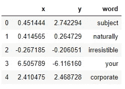

PCA_df.head()

[接下来，使用 ploty Scattergl 构建散点图，以在大型数据集上获得最佳性能](https://plotly.com/python/line-and-scatter/)。有关不同散点图选项的更多信息，请参考文档。

```
N = 1000000
words = list(model.wv.vocab)
fig = go.Figure(data=go.Scattergl(
    x = pca_df['x'],
    y = pca_df['y'],
    mode='markers',
    marker=dict(
        color=np.random.randn(N),
        colorscale='Viridis',
        line_width=1
    ),
    text=pca_df['word'],
    textposition="bottom center"
))fig.show()
```

注意，我使用 *Numpy* 为图形颜色生成随机数。这使它在视觉上更有吸引力！
注意，我将文本设置到 dataframe 的**单词**列。当鼠标悬停在数据点上时，会出现该单词。

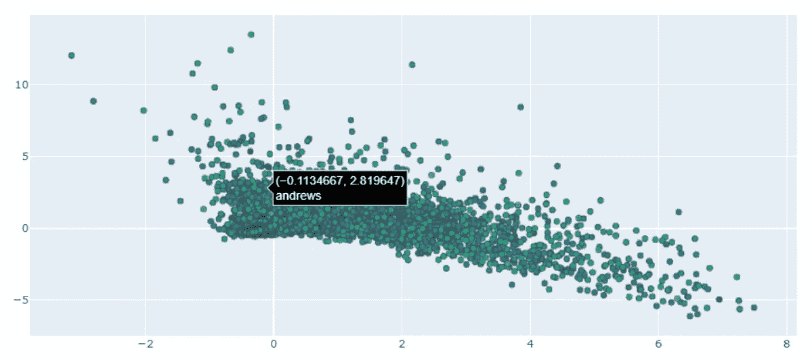

Plotly 很棒，因为它可以生成交互式图形，并且允许我放大图形，更近距离地检查点。

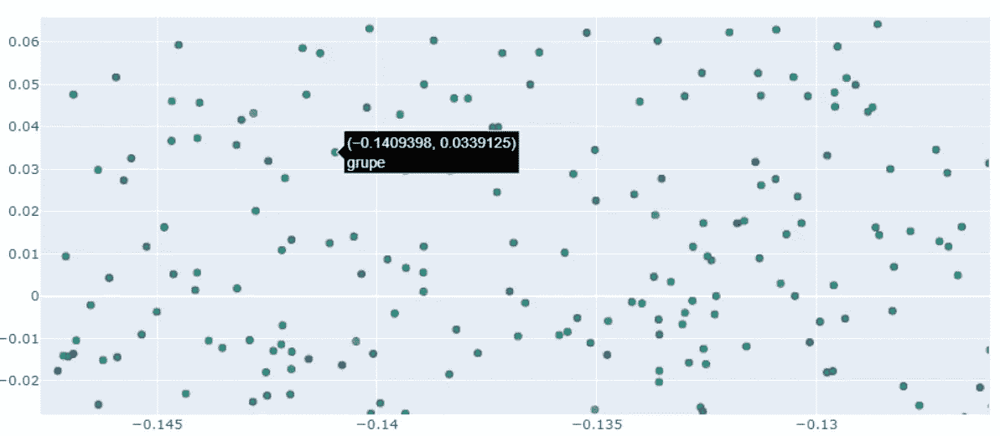

放大

# 使用单词嵌入进行分析和预测

除了可视化嵌入之外，还可以用一些代码来探索它们。此外，模型可以保存为文本文件，以便在将来的建模中使用。查看 Gensim 文档，了解完整的功能列表。

```
#explore embeddings using cosine similarity
model.wv.most_similar('eric')model.wv.most_similar_cosmul(positive = ['phone', 'number'], negative = ['call'])model.wv.doesnt_match("phone number prison cell".split())#save embeddings
file = 'email_embd.txt'
model.wv.save_word2vec_format(filename, binary = False)
```

Gensim 使用[余弦相似度](https://en.wikipedia.org/wiki/Cosine_similarity)来查找最相似的单词。
请注意，评估类比并找出与其他单词最不相似或不匹配的单词也是可能的。

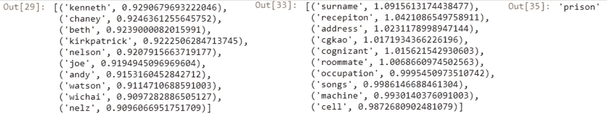

查找相似单词的输出

## 使用嵌入

我不会在本文中涵盖完整的示例，但是在预测建模中使用这些向量是可能的。为了使用嵌入，需要映射单词向量。为了使用训练好的模型将多个单词的文档转换成单个向量，通常取文档中所有单词的 word2vec，然后取其平均值。

```
mean_embedding_vectorizer = MeanEmbeddingVectorizer(model)
mean_embedded = mean_embedding_vectorizer.fit_transform(df['clean'])
```

要了解更多关于在预测建模中使用 word2vec 嵌入的信息，请查看 kaggle.com 的笔记本。

[](https://www.kaggle.com/reiinakano/basic-nlp-bag-of-words-tf-idf-word2vec-lstm) [## 基本自然语言处理:单词包，TF-IDF，Word2Vec，LSTM

### 使用 Kaggle 笔记本探索和运行机器学习代码|使用来自个性化医疗的数据:重新定义癌症…

www.kaggle.com](https://www.kaggle.com/reiinakano/basic-nlp-bag-of-words-tf-idf-word2vec-lstm) 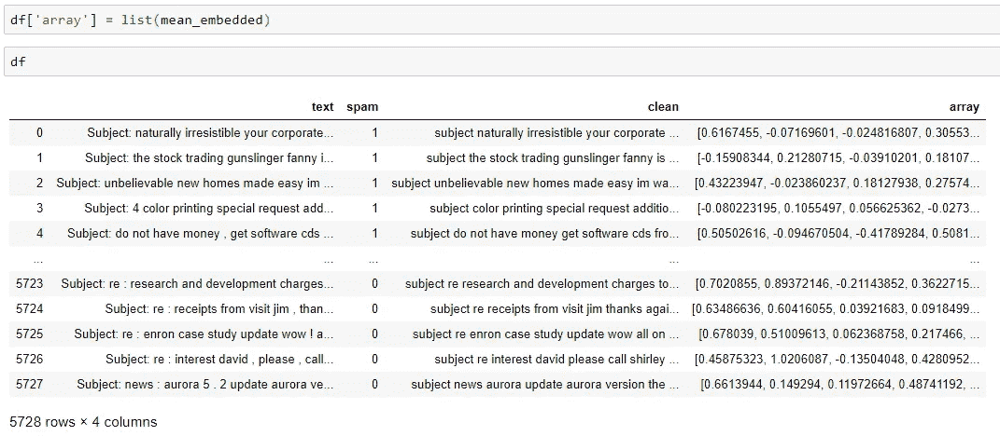

添加了数组列的数据帧

# 最后的想法

使用 Word2Vec 模型可用的新方法，很容易训练非常大的词汇表，同时在机器学习任务上获得准确的结果。自然语言处理是一个复杂的领域，但是有许多 Python 的库和工具可以使入门变得简单。如果您有兴趣了解更多关于 NLP 或数据科学的知识，请查看我的其他文章:

[](/ultimate-beginners-guide-to-collecting-text-for-natural-language-processing-nlp-with-python-256d113e6184) [## 用 Python 收集自然语言处理(NLP)文本的入门指南

### 通过 API 和 Web 抓取收集文本

towardsdatascience.com](/ultimate-beginners-guide-to-collecting-text-for-natural-language-processing-nlp-with-python-256d113e6184) 

# 谢谢大家！

*   *如果你喜欢这个，* [*在 Medium 上关注我*](https://medium.com/@erickleppen) *获取更多*
*   [*通过订阅*](https://erickleppen.medium.com/membership) 获得对我的内容的完全访问和帮助支持
*   *我们来连线一下*[*LinkedIn*](https://www.linkedin.com/in/erickleppen01/)
*   *用 Python 分析数据？查看我的* [*网站*](https://pythondashboards.com/)

[**—埃里克·克莱本**](http://pythondashboards.com/)