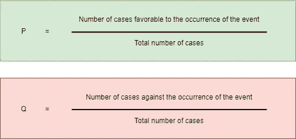
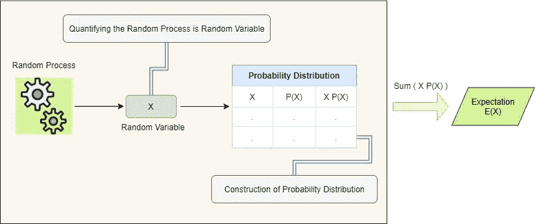
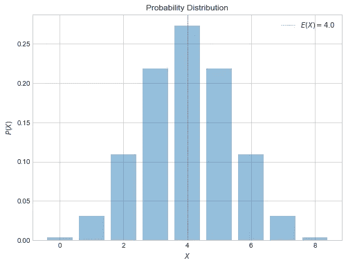
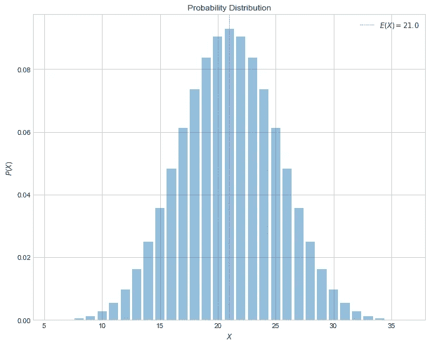

# 对期望简单而深刻的介绍

> 原文：<https://towardsdatascience.com/the-simple-but-profound-introduction-to-expectation-3dc6ac47d9c5?source=collection_archive---------40----------------------->

## "期待意想不到的事情显示了完全现代的智慧."——奥斯卡·王尔德


Sebastian Unrau 在 [Unsplash](https://unsplash.com?utm_source=medium&utm_medium=referral) 上拍摄的照片

在这篇文章/故事中，我们将通过美丽的图表及其背后的概念来理解期望的概念。这个故事是这篇[文章](/the-intuition-of-statistics-central-tendency-70f01949d61e)的延伸。

## 什么是期望？

期望值是当我们进行某个**实验**时，出现的**几率*高*的**随机变量**的**值**。**

## 实验或随机过程

任何事情都可以是实验或随机过程:从阅读一本书到写博客，从吃早餐到健身，从云的移动到树叶的脱落，任何事情都可以被视为我们的主题，并仔细监控每个行动的结果。

为了简单起见，让我们继续把掷硬币或掷骰子作为统计实验的主题。如果我们掷硬币和掷骰子，可能会有什么结果？硬币的结果是`Head`或`Tail`，骰子的结果是`1`或`2`或`3`或`4`或`5`或`6`。

## 随机变量

简单来说，**量化一个随机过程**定义为[随机变量](https://www.khanacademy.org/math/statistics-probability/random-variables-stats-library/random-variables-discrete/v/random-variables)。一个随机变量可以是统计(量化)整个月我们一天走了多少个脚步(随机过程)，也可以是整个月我们每天在镜子上看到自己美丽瑰丽的脸多少次等等。

通常随机变量被表示为`X`。为了简单起见，让我们把掷硬币和掷骰子(随机过程)的结果(量化值)作为我们的随机变量。

## 出现的机会

这被简单地称为**概率**。一些现实生活中的例子可以是，蜜蜂访问百合花或茉莉花或两者的机会，切叶蚁群赢得对黄色疯狂蚁群的战争的机会，或反之亦然。

## 解释概率的观察

让我们想象我们家有麻雀。麻雀夫妇快乐地筑巢并下一个蛋。现在，那个蛋变成小麻雀的概率是多少？嗯，这个问题有两种可能性或结果，要么鸡蛋可能孵化并成为小麻雀(快乐的结果)，要么鸡蛋会掉下来，打破并失去生命的本质(这真的在我家发生过几次，是悲惨的结果)。


照片由 [Belinda Fewings](https://unsplash.com/@bel2000a?utm_source=medium&utm_medium=referral) 在 [Unsplash](https://unsplash.com?utm_source=medium&utm_medium=referral) 上拍摄

我们都需要一个快乐的结局。在这里，在这种情况下，麻雀需要它们的蛋进化成小麻雀，但不要在上面的悲惨结局中崩溃并神秘地失去生命。

但是我们如何精确地量化它呢？我们的大脑理解数字。为了填补这个空白，数学家们提出了一个叫做概率的概念。

> 概率是指事件发生或不发生的机会。在这里，机会代表了可观测宇宙中任何事件的*不确定性(意味着它可能发生或不发生)*。因此，概率给出了不确定性元素的数值度量。

概率值的范围在`0`和`1`之间。如果我们知道某个特定事件是确定的，那么这个事件的概率是 1，例如，太阳每天都会升起，不管是什么季节。类似地，如果我们**不确定**某个事件是确定的，那么该事件的概率就不是 1。



拉普拉斯的定义和作者的形象

在上面的观察中，一个蛋成为小麻雀的概率是`1/2`，一个蛋面临悲惨结局的概率也是`1/2`。而确定和不确定结果的概率之和是`P + Q = 1`。

让我们把这些点联系起来，这次用流程图。



作者图片

因此，我们有一个随机过程，从中提取一个随机变量`X`，用它来构造一个概率分布表，我们取`XP(X)`的总和，最后，我们计算期望值，即`E(X)`。

## 是时候写点真正的代码了

按作者编码—导入所有必需的 API

按作者编码—计算期望值并返回概率分布表

我们将为**硬币**实例化，

作者代码—硬币的实例化

输出:

```
No. of Coins in the Experiment: 8
```



作者图片

```
E(X) = 4.0
```

8 枚硬币的概率分布表

该图清楚地显示了期望值`E(X)`是`4`。4 发生的概率很大。我们在代码中做了什么？我们随机得到 8 枚硬币，如果我们同时扔这 8 枚硬币，结果会是，

```
['HHHHHHHH', 'HHHHHHHT', 'HHHHHHTT', 'HHHHHTTT', ..., 'TTTTTTTT']
```

这就是我们的样本空间。一旦我们有了样本空间，我们现在对每个`H`或`T`进行计数，这个选择将是随机的(在代码的第 34 行中定义)。这里的**计数**基本上就是我们的随机变量。最后，我们计算计数的概率。根据我们的结果，我们有 4 个，因为最有可能发生和平均概率条形图清楚地描述了 4，它具有更高的高度。

我们将为**骰子**实例化，

作者代码—骰子的实例化

输出:

```
No. of Dice in the Experiment: 6
```



作者图片

```
E(X) = 21.0
```

6 个骰子的概率分布表

这个情节清楚地表明了期望`E(X)`是`21`。21 发生的概率很大。让我们来理解代码，我们随机得到 6 个骰子，它们一次全部掷出。所以我们有这样的总结果，

```
[1 1 1 1 1 1] = 6
[1 1 1 1 1 2] = 7
[1 1 1 1 1 3] = 8
...
[6 6 6 6 6 4] = 34
[6 6 6 6 6 5] = 35
[6 6 6 6 6 6] = 36
```

上述结果的 L.H.S 是我们的随机变量，也就是说，我们用 sum 来量化骰子的结果(在代码的第 40 行中定义)。最后，我们计算**和**的概率。根据我们的结果，我们有 21 个，因为最有可能发生，甚至概率条形图清楚地描述了 21 个具有更高的高度。

我们都需要注意的一件事是，从上面的图表(硬币和骰子)中我们观察到，4 和 21 有更大的高度。这也意味着 4 和 21 是我们进行的实验中最**预期的**结果。令人兴奋的是 4 和 21 位于图表的中心。这意味着什么？这意味着任何随机变量的期望都是该分布的一个**中心度量**。*由此可见，期望是中心倾向的量度之一。*

让我们先来关注一下硬币。以下是同时投掷 8 枚硬币的结果。

```
['HHHHHHHH' 'HHHHHHHT' 'HHHHHHTH', ..., 'TTTTTTTT']
```

现在，让我们假设我们对`H`感兴趣。所以，这就给了我们一个简单的理解，`Count(H)`是一个投掷 8 个硬币(随机过程)的量化标准。因此，我们现在可以说，`Count(H) = X`。下表中的`X`用四个不同的列表示(这样做是为了表格的可读性)。

量化随机过程 X

我们得到了随机变量`X`，现在我们可以单独计算概率。根据上面的定义，我们得到下面的概率。

P ( X)表

奇怪为什么用`256`做分母？256 是同时投掷 8 枚硬币产生的结果总数。

神奇的事情发生在我们计算`X P(X)`的时候。让我们快速计算一下。

X P ( X)表

```
X = 0 => 0 * P(0) => **0 * (1/256)**
X = 1 => 1 * P(1) => **1 * (8/256)**
X = 2 => 2 * P(2) => **2 * (28/256)**
X = 3 => 3 * P(3) => **3 * (56/256)**
X = 4 => 4 * P(4) => **4 * (70/256)**
X = 5 => 5 * P(5) => **5 * (56/256)**
X = 6 => 6 * P(6) => **6 * (28/256)**
X = 7 => 7 * P(7) => **7 * (8/256)**
X = 8 => 8 * P(8) => **8 * (1/256)****E(X) = Sum(XP(X)) 
     = [(0*1) + (1*8) + (2*28) + (3*56) +(4*70) + 
        (5*56) + (6*28) + (7*8) + (8*1)] / 256****E(X) = 4.0**
```

我们现在粗略地看一下没有概率的总结果。

```
[8, 7, 7, 6, 7, 6, 6, 5, 7, 6, 6, 5, 6, 5, 5, 4,
 7, 6, 6, 5, 6, 5, 5, 4, 6, 5, 5, 4, 5, 4, 4, 3,
 7, 6, 6, 5, 6, 5, 5, 4, 6, 5, 5, 4, 5, 4, 4, 3,
 6, 5, 5, 4, 5, 4, 4, 3, 5, 4, 4, 3, 4, 3, 3, 2,
 7, 6, 6, 5, 6, 5, 5, 4, 6, 5, 5, 4, 5, 4, 4, 3,
 6, 5, 5, 4, 5, 4, 4, 3, 5, 4, 4, 3, 4, 3, 3, 2,
 6, 5, 5, 4, 5, 4, 4, 3, 5, 4, 4, 3, 4, 3, 3, 2,
 5, 4, 4, 3, 4, 3, 3, 2, 4, 3, 3, 2, 3, 2, 2, 1,
 7, 6, 6, 5, 6, 5, 5, 4, 6, 5, 5, 4, 5, 4, 4, 3,
 6, 5, 5, 4, 5, 4, 4, 3, 5, 4, 4, 3, 4, 3, 3, 2,
 6, 5, 5, 4, 5, 4, 4, 3, 5, 4, 4, 3, 4, 3, 3, 2,
 5, 4, 4, 3, 4, 3, 3, 2, 4, 3, 3, 2, 3, 2, 2, 1,
 6, 5, 5, 4, 5, 4, 4, 3, 5, 4, 4, 3, 4, 3, 3, 2,
 5, 4, 4, 3, 4, 3, 3, 2, 4, 3, 3, 2, 3, 2, 2, 1,
 5, 4, 4, 3, 4, 3, 3, 2, 4, 3, 3, 2, 3, 2, 2, 1,
 4, 3, 3, 2, 3, 2, 2, 1, 3, 2, 2, 1, 2, 1, 1, 0]
```

我们现在将对上述数字进行频率分析。

```
Count(0) is **1**
Count(1) is **8**
Count(2) is **28**
Count(3) is **56**
Count(4) is **70**
Count(5) is **56**
Count(6) is **28**
Count(7) is **8**
Count(8) is **1**
```

如果我们观察，上面的频率与 P(X)列的 P(X)表的分子相匹配。如果我们计算结果的平均值，它将是 4，这是一个高频率。

现在很清楚了，期望值只是总结果的平均值。因此，通过查看概率分布图，可以找出该分布的期望值。

## 结论

无论我们何时进行实验，从长远来看，大多数结果都是集中的，因此它们是高度期望的。