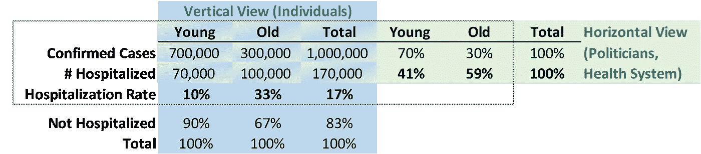
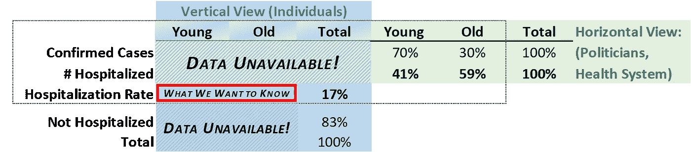
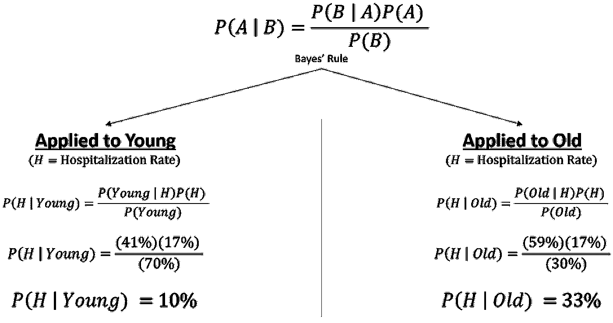
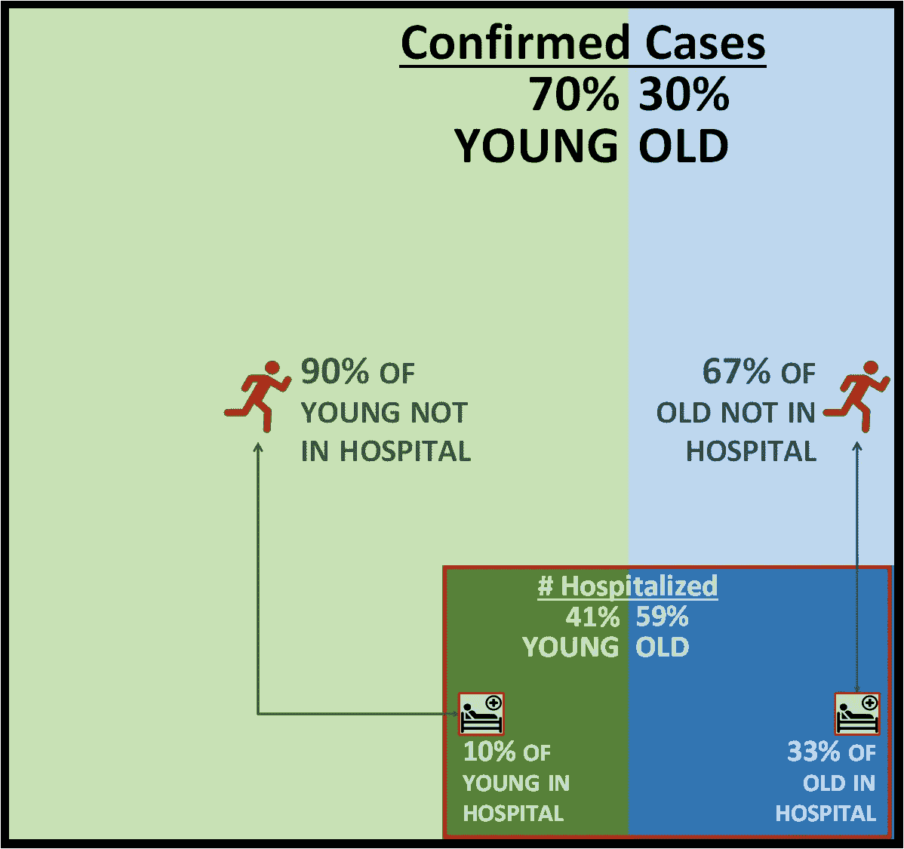
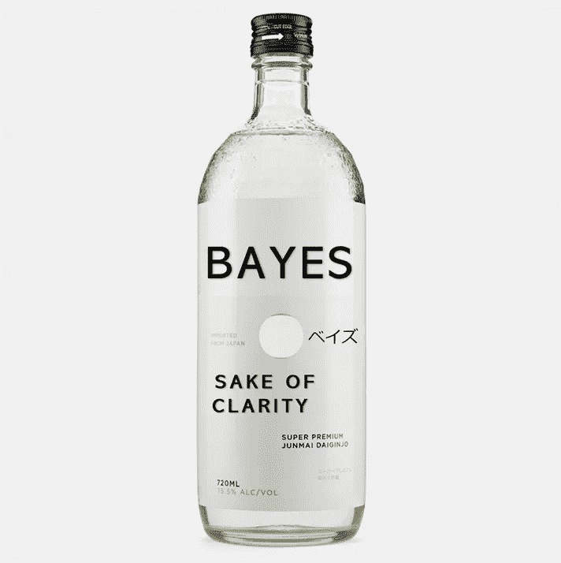

# 新冠肺炎数据如此令人困惑的原因很简单

> 原文：<https://towardsdatascience.com/the-simple-reason-why-covid-19-data-is-so-confusing-48a2f614391a?source=collection_archive---------42----------------------->

## 为什么准确的报告不够好

考虑报道新冠肺炎数据的两个说明性标题:

# **1 |年轻人在新冠肺炎住院人数中占很大比例**

*在美国首次报告的病例中，超过 40%需要住院治疗的患者年龄在 65 岁以下*。

# 2 |年轻人的新冠肺炎不太严重

*约 10%的 65 岁以下确诊新冠肺炎病例的成年人最终会住进医院，比更大年龄组的人住院的可能性低 70%。*

这两个说明性的标题都是准确的[1],然而却存在清晰性的危机:它们向更年轻、更健康的人传递了关于新冠肺炎风险的相互矛盾的信息。

40%的年轻人面临的潜在风险和 10%的更相关风险之间存在巨大差异。由信息冲突引起的认知失调会产生不良影响，包括人们不予理睬，或者更糟——得出错误的结论，或者最糟糕的——以错误的行为回应。

**穿越混乱**

读者必须调和两个标题，才能使其中任何一个成为有意义的新闻。[2]不幸的是，在没有更多信息的情况下，不可能调和这两个标题，所以我们用与这两个标题一致的(假设的)数据建立了一个表格:

两种视图:政治家和专业人士跨行查看数据，但媒体和普通大众希望查看列下的数据。

像这样的二维表格可以有两种解读方式:水平方向(各行的百分比总和为 100%)；和垂直方向(其中百分比加起来为 100%)。

**水平视图**对应第一个标题。这是政治家和专业人士的观点，他们放眼整个社会。重要的是，在这个视图中收集数据要容易得多——只需计算医院中的人数。以这种方式组织的数据对于资源和容量规划非常有用。

**垂直视图**对应第二个标题。这是普通大众的观点，包括大多数媒体。它回答了“这对我意味着什么？”不幸的是，垂直视图的数据更难收集，而且很少以这种方式呈现。

这就是了——同样的信息，两种准确但不同的观点和解释。原因很简单，年轻的成年人可以在住院率低的情况下占住院率的很大比例？年轻人比老年人多得多。

我们需要总体人口的这一关键“先验信息”来调和这两种观点，但它经常被忽略——这是丹尼尔·卡内曼(和其他人)所谓的“基础率忽视”的一种形式[3]

**混乱的观点，混乱的人**

现在我们明白了两种观点都是正确的，并且各自回答了不同但重要的问题，这意味着没有问题吗？

不，有一个很大的问题:大多数时候数据是以水平视图呈现给我们的，而我们大多数人感兴趣的是垂直视图问题:“它对我来说意味着什么？”[4]

混乱的观点导致混乱的人。许多人只是不予理会。其他人得出了错误的结论——在这种情况下，令人震惊但错误的结论是，超过 40%的年轻新冠肺炎患者正在住院治疗。"混杂的信息让人们追随他们的偏见，相信他们想要的一切."[5]

更糟糕的是:当“专家”(横向)观点和“大众”(纵向)观点不一致时，就会滋生对专家及其动机的不信任。不清晰的准确性可能会导致“回旋镖效应”，即试图说服而导致采取相反立场的意外后果。[6].

在新冠肺炎疫情的早期阶段，美国医务总监杰罗姆·亚当斯博士要求美国人停止购买口罩，因为“它们不能有效防止公众感染#冠状病毒，但如果医疗保健提供商不能让他们照顾病人，就会使他们和我们的社区处于危险之中。”他有理由担心医疗保健系统(横向视角)，但模糊了公众面临的风险(纵向视角)。[7]

然而，许多人都知道亚洲国家是如何将口罩视为人身安全的必需品的，这引起了人们的困惑，并让人对美国专家及其动机产生了怀疑。可悲的是，一些人的反应与专家的意图相反——起初是囤积口罩，后来(在专家改变方针后)拒绝佩戴口罩。

**数据科学家的准确性和清晰性**

认识到有两种观点，为数据科学家提供了一个领导追求准确性和清晰性的机会。我们之前提到过，通常很难为垂直视图编译人口数据。当我们把人口分成小群体时，尤其如此。

假设新冠肺炎住院数据缺少垂直视图的大部分数据:

假设您正在修补来自三个来源的信息:

1.  一项研究告诉我们，在新冠肺炎病例中，年轻人和老年人各占 70%—30%；
2.  一项医院调查显示，超过 40%的住院患者是年轻人；和
3.  测试数据显示，17%的新冠肺炎确诊病例正在住院治疗。

注意，1。第二。是水平视图数据，以及 3。是垂直视图数据。你想回答垂直视角的问题:“这对我意味着什么？”

贝叶斯法则提供了一种结合水平和垂直视图来推断缺失信息的优雅方式。即使大部分垂直视图不可用(通常是这样)，您也可能有足够的信息来创建它:

贝氏救援队。

求解“我们想知道的”

**水平和垂直视图的贝叶斯可视化:**小方框中表示的住院是准确的，但不清楚。大框中关于人口的上下文信息提供了急需的清晰度。

**为了清楚起见，我们能做什么？**

任何展示表格数据的人都可以通过阐明水平或垂直视图(只要有可能，两者都要)为公共话语提供很好的服务。*明确哪个方向加 100%！*清晰是一种天赋……你建议、教导和说服他人的能力——以及最终被理解的能力——取决于此。

现在庆祝吧！

# 参考

[1]这些标题是根据 2020 年 5 月中旬至下旬的报告和调查合成的。

[2]赫伯勒，雷。(2020 年 4 月 29 日)。[如何利用贝叶斯定理](/how-to-consume-news-more-intelligently-using-bayes-theorem-a3273d0fff5e)更智能地消费新闻。 [*走向数据科学*](https://towardsdatascience.com/) *。*

【3】[基础利率谬误](https://en.wikipedia.org/wiki/Base_rate_fallacy)。(2020).*维基百科。*(检索于 2020 年 6 月 7 日。)

[4]举一个最近来自瑞士的例子:Schild，Darcy。(2020 年 5 月 31 日)。根据一份新的报告，大约 40%的新冠肺炎重症监护病人不到 60 岁。*内幕。*

[5]约翰逊。如何组织公共卫生信息，让人们听到？ [*学人*](https://www.economist.com/) 。(2020 年 4 月 4 日。)

【6】[回旋镖效应(心理学)](https://en.wikipedia.org/wiki/Boomerang_effect_(psychology))。(2020).*百科。*(2020 年 6 月 7 日检索。)

[7]阿斯梅拉什，利亚。(2020 年 3 月 2 日)。[卫生局局长希望美国人停止购买口罩](https://www.cnn.com/2020/02/29/health/face-masks-coronavirus-surgeon-general-trnd/index.html)【视频文件】。 *CNN。*

**关于认知偏差和新冠肺炎的进一步阅读，如指数增长谬误和习得无助:**

[为什么我们低估了新冠肺炎](https://policyoptions.irpp.org/magazines/april-2020/why-we-underestimated-covid-19/)

[为什么有些人仍然不呆在家里](https://www.psychologytoday.com/us/blog/making-evil/202003/why-some-people-are-still-not-staying-home)

# 关于作者

[**马修·拉斐尔森**](https://www.linkedin.com/in/m-raphaelson/)马修是一名管理顾问，他通过数据科学帮助公司增加收入。此前，他是一名高级财务主管，拥有 25 年应用定量建模和数据科学来启动和管理数十亿美元业务的经验。他是 ProbabilityManagement.org 大学金融应用系主任，拥有斯坦福大学商学院的 MBA 学位。

[**Raj Dev**](https://www.linkedin.com/in/raj-dev/)Raj 是一位利用数据科学和分析技术做出人才和人员决策的倡导者。Raj 是 EleveneX 的管理合伙人。此前，Raj 是不可能食品公司的人力运营副总裁。在此之前，他曾在 Credit Sesame 和特斯拉担任高级管理职务。Raj 拥有耶鲁管理学院的工商管理硕士学位。