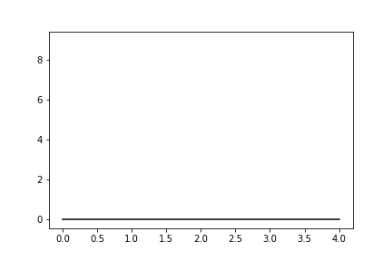
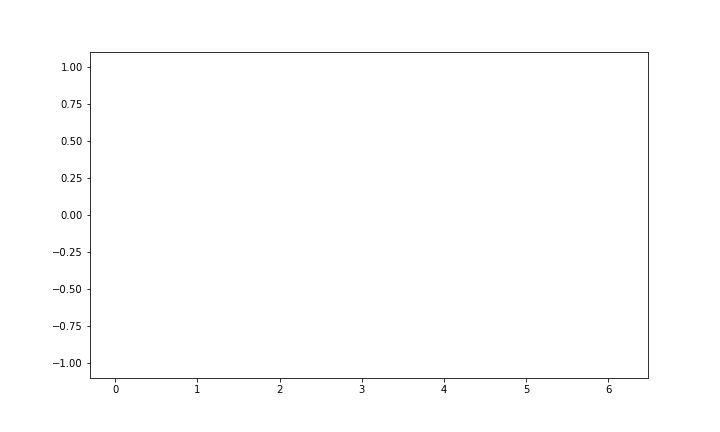
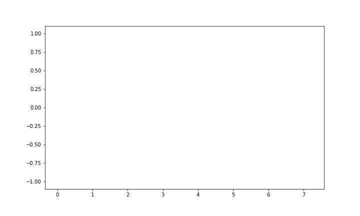
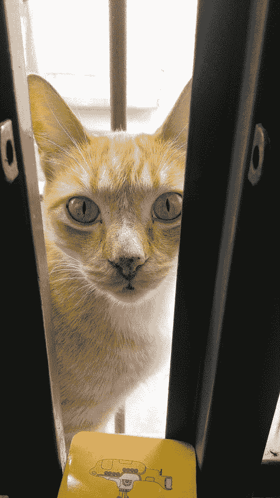
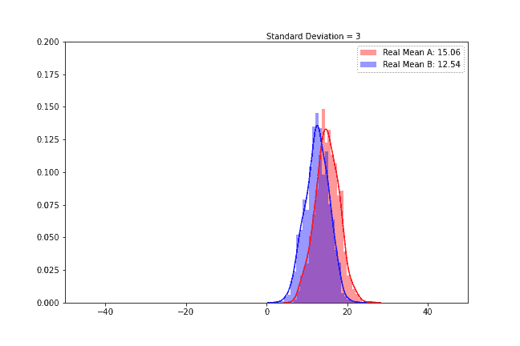
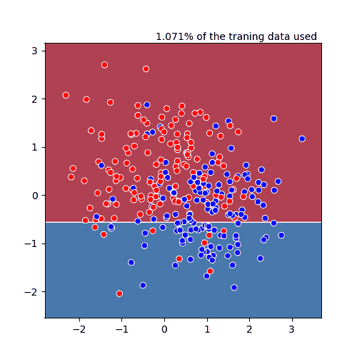
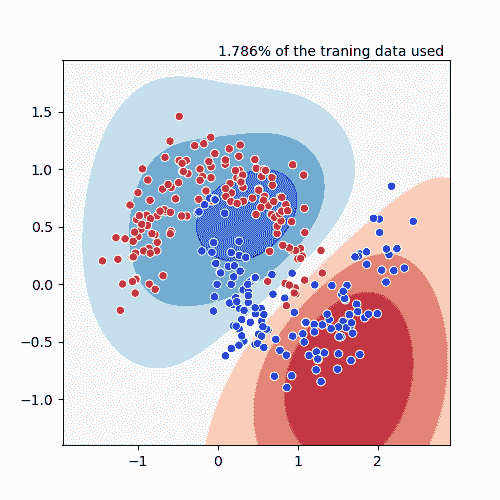

# 用 Python 制作 gif 和数学视频最简单快捷的方法

> 原文：<https://towardsdatascience.com/the-simplest-way-of-making-gifs-and-math-videos-with-python-aec41da74c6e?source=collection_archive---------23----------------------->


图像由作者提供——SVM 分类器的判定边界演变(用赛璐珞制成)

## 如何使用赛璐珞在几秒钟内制作出令人惊叹的动画

> 赛璐珞，简单的 Matplotlib 动画

我真的很喜欢使用数据可视化，当我必须解释一些结果或复杂模型时，我总是想知道提供更直接和直观的可视化交互的最佳方式是什么。

最近，我开始使用 gif 和快速视频。即使这使得编码部分更加困难和复杂，结果通常在交流我的发现和过程时更加有效。

**但是在 Python 中，总有更容易、更简单的方式，为了简化动画制作过程，** [**赛璐珞**](https://github.com/jwkvam/celluloid) **就这样诞生了。**

仅使用 50 行代码来处理 Matplotlib Artists 和 ArtistAnimations 赛璐珞从您想要绘制到相机抽象中的一系列图像创建一个动画。

让我们从用

```
$ pip install celluloid
```

现在让我们开始吧！

# 四个使用示例

1.  最简单的一个
2.  进化图
3.  使用图像
4.  使用动态标签和标题

# 最简单的一个

让我们创建一个简单的绘图来演示如何在 Jupyter 笔记本中运行代码的基本用法，但是**我们也可以使用方法****save(' filename . gif _ or _ MP4 ')**

```
from celluloid import Camera # getting the camera
import matplotlib.pyplot as plt
import numpy as np
from IPython.display import HTML # to show the animation in Jupyter
fig, ax = plt.subplots() # creating my fig
camera = Camera(fig)# the camera gets the fig we'll plot
for i in range(10):
    ax.plot([i] * 5, c='black') # 5 element array from 0 to 9
    camera.snap() # the camera takes a snapshot of the plot
animation = camera.animate() # animation ready
HTML(animation.to_html5_video()) # displaying the animation
```



作者图片

# 进化图

这是一个有趣的情节，但不是很有用。这个想法是绘制一点一点进化的数据集。

```
from celluloid import Camera # getting the camera
import matplotlib.pyplot as plt
import numpy as np
from IPython.display import HTML
fig, ax = plt.subplots(figsize=(10, 6)) # let's make it bigger
camera = Camera(fig)# the camera gets our figure
x = np.linspace(0, np.pi*2, 60) # a sine circle
y = np.sin(x) # sine
for i in range(len(x)):
    x_t = x[:i] # current dataset
    y_t = y[:i] # current sine
    ax.plot(x_t, y_t, c='blue')
    camera.snap()
animation = camera.animate()
HTML(animation.to_html5_video())
```



作者图片

一个有趣的小技巧，使情节看起来像手绘

```
x_t = x[:i] + 1.3*np.random.random(size=i)
```



作者图片

# 使用图像

图像可能对表达想法有很大帮助，使用图像的算法主要通过视频进行很好的解释

在这个例子中，我制作了我的猫和蒙克的尖叫之间的神经风格转换的动画。我对模型进行了 200 个时期的训练，并且每 10 个时期保存一次结果(我将在另一篇文章中详细解释这个算法)

在我的例子中，我保存了培训期间的 20 张照片，以使用该模式制作 GIF”。/NST/epochs/epoch_k.jpg "

```
from celluloid import Camera # getting the camera
import matplotlib.pyplot as plt
import numpy as np
from IPython.display import HTML
import os
fig, ax = plt.subplots() # make it bigger
camera = Camera(fig)# the camera gets our figure
for img in os.listdir("NST/epochs"):
    img_obj = plt.imread(os.path.join("NST/epochs"), img) # reading
    ax.imshow(img_obj) # plotting
    camera.snap()
animation = camera.animate()
HTML(animation.to_html5_video())
```



作者图片

# 使用动态标签和标题

这是赛璐珞最有趣的方面之一，在这里我们有能力让情节变得非常动态。

在这个例子中，我绘制了两个均值不同但标准差相同的正态分布，然后我改变了这个标准差，以评估它对每条曲线的影响。

我把标题上的当前标准差和真实均值作为每条曲线的标签。我必须将计算的标签作为元组传递，因为我使用了两条曲线，如果只有一条曲线，我可以使用 like PLT . legend([calculated _ label])，这很简单

```
from celluloid import Camera # getting the camera
import matplotlib.pyplot as plt
import numpy as np
import seaborn as sns
from IPython.display import HTML
std = 3 # start std 
Am = 15\. # mean of first normal
Bm = 12.5 # mean of second normal
fig, ax = plt.subplots(figsize=(9,6)) # empty fig
camera = Camera(fig)
for j in range(10):
    plt.ylim((0, 0.2)) # setting up the limits (or else it will auto ajust
    plt.xlim((-50, 50))

    A = np.random.normal(Am, std, size=(1000)) # creating the 1000-sized normals
    B = np.random.normal(Bm, std, size=(1000))    
    A_plot = sns.distplot(A, color='red') 
    B_plot = sns.distplot(B, color='blue')
    plt.legend(( 
        'Real Mean A: {:.2f}'.format(np.mean(A)),
        'Real Mean B: {:.2f}'.format(np.mean(B))
    ))

    ax.text(0.5, 1.01, "Standard Deviation = "+str(std), transform=ax.transAxes) # making the dynamic title
    camera.snap() # camera snapshot

    std += 1 # incrementing the std
anim = camera.animate() # animating the plots
HTML(anim.to_html5_video())
```



作者图片

# 完成了吗？

这只是我关于如何使用赛璐珞的基本想法，但说实话，可能性是无限的，我已经在几个应用程序中使用过，甚至是为了演示一些[机器学习算法如何学习检查一下](https://github.com/brunorosilva/ML-animations/tree/master/examples/animations)。

# 决策图表



作者图片—决策树分类器边界图([此处可用](https://github.com/brunorosilva/ML-animations/blob/master/examples/animations/decision_trees.gif)

# 支持向量机分类器



作者图片— SVM 分类器边界图[(此处可用)](https://github.com/brunorosilva/ML-animations/blob/master/examples/animations/svc.gif)

如果你喜欢这个教程，用过并且有效(或者无效)**请使用我个人资料中的链接联系我**