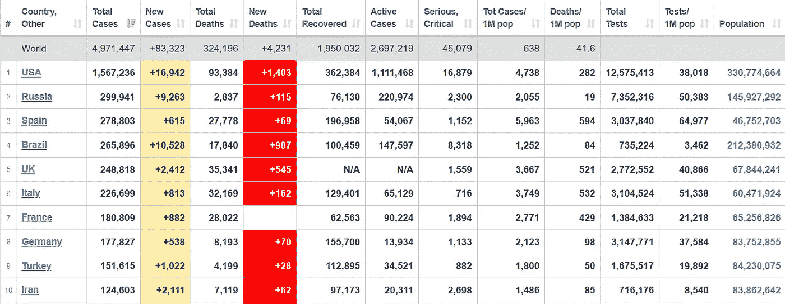
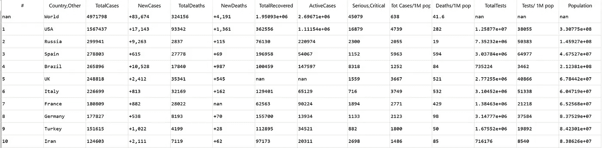

# 用 Python 抓取表格数据的最简单方法

> 原文：<https://towardsdatascience.com/the-simplest-way-to-scrape-tabular-data-with-python-d17abda3096d?source=collection_archive---------31----------------------->

## 数据科学基本指南

## 用 Python 脚本的 3 行代码抓取新冠肺炎统计数据的例子


插图作者[金彩云](https://medium.com/@chaeyunkim)

你们中的任何人可能已经从网站上读过几篇关于数据搜集的文章。他们大多建议用 **Node.js 搭配 Cheerio** 库或者 **Python 搭配美汤**。虽然当你掌握了这些技术后，这是非常有效的，但它需要你花费时间和精力，直到你完成所有的编码，找到你需要的元素，请求数据，清理数据以创建一个数据帧，然后才能进行实际的数据分析。*(当然，还有一些额外的时间来修复所有的 bug 和错误🐛)*

这篇短文将向您展示如何用三行 Python 脚本以最简单的方式从任何网站获取表格数据的教程！


(红色)熊猫——照片由[参宿七](https://unsplash.com/@rigels?utm_source=medium&utm_medium=referral)在 [Unsplash](https://unsplash.com?utm_source=medium&utm_medium=referral) 上拍摄

我们的英雄是(红色)熊猫！是的，你们所知道的受欢迎的熊猫很可爱，并且能够自动从 HTML 文件中提取表格数据。

# 从 Worldometer 收集实时新冠肺炎数据的示例:

例如，您想从 Worldometer [网站](https://www.worldometers.info/coronavirus/)获取表格数据。由于这个数据集是动态的，会随着时间的推移而变化，所以数据抓取是有意义的，每次运行脚本时我们都会得到最新的结果！



来自 [Worldometer](https://www.worldometers.info/coronavirus/) 的新冠肺炎表格数据示例。(作者截图—2020 年 5 月 19 日)

要抓取这个数据集，请在您的机器上准备好 Python 和 Pandas。我们将使用熊猫`read_html()`提取任何网页的所有表格。然而，我们不能仅仅用它来直接读取 URL，因为你可能会面对一个`error 403: Forbidden`。为了避免这个错误，我们将在使用 Pandas 读取 HTML 之前，先用`request`模块请求它来获取 HTML 正文。总的来说，该脚本如下所示:

**从 Worldometer 获取新冠肺炎数据的示例 Python 脚本。**(作者提供的示例脚本)

`dfs`是一个列表结果，包含来自所请求的 HTML 主体的表类的多个数据帧。让我们通过打印出第一个`dfs`来研究从上面的脚本中得到的数据帧。

```
print(dfs[0])
```



**示例输出新冠肺炎案例数据帧**(用 Spyder 探索)

# 是的，大概就是这样。

有了三行 Python 代码，你就可以得到新冠肺炎数据的更新数据框架来玩，**简单**和**容易**！

享受数据分析/可视化的乐趣！！我希望你喜欢这篇短文。如果您有任何问题、意见或建议，请随时给我留言。

关于我&查看我所有的博客内容:[链接](https://joets.medium.com/about-me-table-of-content-bc775e4f9dde)

安全**健康**和**健康**！💪

**感谢您的阅读。📚**