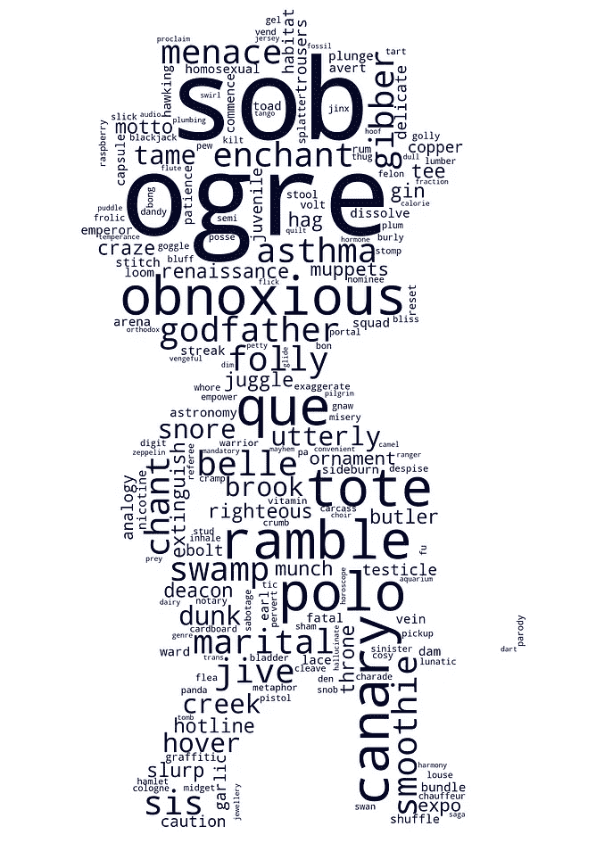

# 《辛普森一家》是学习英语单词的最佳电视节目

> 原文：<https://towardsdatascience.com/the-simpsons-is-the-best-tv-show-to-increase-your-english-vocabulary-f433fe060a74?source=collection_archive---------20----------------------->

## 《辛普森一家》和 83 部电视剧中所有剧集所用词汇的数据分析。跟着辛普森一家学英语，增加你的词汇量

斯蒂芬·格雷奇在 [Unsplash](https://unsplash.com?utm_source=medium&utm_medium=referral) 上拍摄的照片

《辛普森一家》(T4)播出了 32 季，娱乐了数百万人，被认为是有史以来最伟大的电视节目之一。但是你有没有想过这个电视节目可以让你的英语词汇更上一层楼？这是真的，尤其是当你把英语作为第二语言学习的时候。在本文中，我将通过比较 83 部热门电视节目中对话的词汇来证明这一点，包括*老友记*、*权力的游戏*、*生活大爆炸*、*实习医生格蕾*等等。你也会知道哪些《辛普森一家》679 集最适合你学英语。

# 《辛普森一家》有什么不同？

你有没有想过你是如何通过看电视节目来学习新单词的？这是通过重复。你在一集中听到一个词，然后在一周的电视节目中听到更多次。然后瞧！你刚刚学了一个新单词！这就是辛普森一家的独特之处。它在高级英语词汇中重复次数最多。有研究说至少 [6 次](https://www.cambridge.org/core/journals/studies-in-second-language-acquisition/article/effect-of-exposure-frequency-on-intermediate-language-learners-incidental-vocabulary-acquisition-and-retention-through-reading/2469BC59A78EF0C13BE42F35C107CB05)是你学会一个单词之前重复或接触的次数，也有人说是 [17 次](https://www.thoughtco.com/vocabulary-reps-4135612)。根据 83 部电视节目几乎所有剧集的文字记录，我计算了对话中至少重复 10 次(两次研究的平均值)的单词数。

《辛普森一家》是迄今为止用更高级的单词重复十次或更多次的电视节目(1929 个单词来自四级及以上)。《辛普森一家》*在《老友记》、*《权力的游戏》*和*《生活大爆炸》系列中，高级词汇重复了 10 次或更多次。在下面的情节中找到你最喜欢的电视节目。**

*作者图片*

*现在你可能会想，“如果《辛普森一家》的总播放时间比大多数电视节目都长，那么它有更多的单词重复是有道理的，”这是真的，但这不是发生这种情况的唯一原因。如果你仔细检查，你会发现两部电视剧比《T2》和《辛普森一家》播放时间更长，但重复次数更少。此外，*《辛普森一家》*的前 16 季比运行时间更少或更多的电视节目有更多的词汇重复。*

# *那些‘高级词汇’是什么？*

*研究表明，英语中 1000 个最常见的词族(1 级)涵盖了电影中 81.54%的词汇和电视节目中 85.11%的词汇。稍后，我将向您展示最常见的 3000 词家族(第 3 级)涵盖了一集《辛普森一家》中 94%的对话，但首先，我们来看看《辛普森一家》对话中那些来自第 4 级及以上的难词。剧透一下，你可能会发现很多俚语！*

******

*左边的词是辛普森对话中重复次数最多的高级词，右边的是重复次数最少的高级词。*

*在你开始奇怪为什么左边的单词看起来不那么难之前，你必须知道它们实际上是所有辛普森一家剧集中第 4 级及以上最常见的单词。也就是第一个词云里面的词是四级及以上里面最容易的。相比之下，右边的是重复至少 10 次的最不常见的高级单词。*

# *《辛普森一家》679 集中有哪些集涵盖了最基础和最高级的词汇？*

*无论你是英语初学者、中级还是高级学习者，你一生中可能至少有一次因为听不懂你最喜欢的角色讲的笑话而感到沮丧。我有好消息告诉你；我按照难度排列了所有辛普森一家剧集，就像我在[学习英语的 100 部最佳电影](/the-best-movies-to-learn-english-according-to-data-science-2dccb4b3ee23)中所做的那样。最右边的剧集涵盖了更多基础(1 级)或中级(1+2+3 级)词汇。覆盖率越高，就越容易理解一集《辛普森一家》。*

*将鼠标悬停在情节中的点上，查找您将要观看的下一集《辛普森一家》是什么！*

*作者图片*

*我发现第五季第 22 集《成功婚姻的秘密》覆盖了最高比例的一级词汇，这意味着这一集可能是你能轻松理解对话的一集。然而，你可能很难理解最左边几集的笑话，比如*《老粗和扫帚柄》*(第 21 季-第 7 集)和*杂耍鲍勃最后的闪光*(第 7 季-第 9 集)。*

*这是我在 YouTube 频道*上看到的一集*成功婚姻的秘密*中的一个片段。如果你说或学英语，你会注意到对话非常简单。**

*以下是《辛普森一家》中英语词汇最简单的 10 集:*

*   *S5E22:成功婚姻的秘密*
*   *S9E7:两位 Nahasapeemapetilons 夫人*
*   *第一季第六集:呻吟的丽莎*
*   *我们不一样的方式*
*   *丽莎·辛普森，这不是你的生活*
*   *S8E19:小学机密*
*   *第五季第十二集:巴特出名了*
*   *S9E16:哑铃赔偿*
*   *第一季第九集:快车道上的生活*
*   *S4E14:来自同一个星球的兄弟*

# *679 集里他们在说什么难懂的词？*

*如果我让你相信《辛普森一家》有增加英语词汇量的潜力，那么你应该考虑在每次看新一集的时候查看下表。在观看《辛普森一家》一集之前，你可以通过在下面的方框中搜索来找出你将会听到哪些难词。可以按词、集、季过滤。*

*在你看新一集之前，查找任何你觉得困难的单词的定义，你会增加下次看《辛普森一家》时理解笑话的机会！*

# *哪些角色说的话最难？*

*自然，荷马、玛吉、巴特和丽莎·辛普森的台词比其他角色多——这就是这部剧被称为《辛普森一家》的原因，对吗？然而，四个主要角色都没有在台词中使用复合句。实际上，像伯恩斯、斯金纳、克鲁斯蒂和弗兰德斯这些银幕时间较少的角色倾向于使用更高级的词汇。对你来说他们是最聪明的角色吗？*

*作者图片*

# *《辛普森一家》随机剧集中的词汇覆盖*

*《辛普森一家》一集的平均字数是 2472 个单词。《辛普森一家》对话中使用的大部分词汇属于最常见的 1000 个英语单词。大多数电视节目都会出现这种情况；那么对于非英语母语的人来说，通过看电视节目很容易习得一级和二级词汇。不过大部分电视剧单集都有一点高级词汇。幸运的是，像《辛普森一家》这样的电视节目有很多单词在每集中至少重复 10 次，这有助于建立高级词汇。*

*作者图片*

# *关于成绩单和词汇水平*

*最后，关于抄本和词汇水平的一些观察:*

*   *这 83 个电视节目的脚本是从不同的网站上获得的，粉丝们在这些网站上转录对话。为了找到《辛普森一家》中的角色台词，我使用了《T2》Kaggle 上的一个数据集。*
*   *这个分析背后的所有代码都可以在我的 [Github](https://github.com/ifrankandrade/netflix.git) 上找到。*
*   *《辛普森一家》剧集中听不到的词，比如场景描述和说话人的名字，都从文字记录中删除了。*
*   *我用来对电视节目中的词汇进行分类的大部分词汇表都是由 Paul Nation 的语料库制成的。你可以在这里下载一些列表[。](https://www.wgtn.ac.nz/lals/resources/paul-nations-resources/vocabulary-lists)*
*   *先前使用这些单词表的研究表明，这些单词表是可靠的；然而，通过分析《辛普森一家》几集，我发现了几个弱点。例如，一些动词如“to hoover”在四级及以上的列表中被考虑；结果，像胡佛小姐这样的角色名字被认为是高级词汇。然而，这种情况并不经常发生，因为还有一个专有名词列表帮助我过滤掉大多数角色的名字。*
*   *大多数感叹词被排除在“边缘词”列表之外。然而，其中一些像“哇”和“呀”被认为是 4 级或以上。对大多数人来说可能很常见的词，如“真棒”也包括在内。这与语料库中的文本有关。*

*如果你想看这个分析背后的代码，你可以在这里找到它[。记住，词汇不是很好理解电视节目的唯一因素。发音、口音和语速也可能会提高或降低你的理解水平。](https://github.com/ifrankandrade/tv-shows.git)*

# *最后的想法*

*我不得不承认我不是《辛普森一家》的忠实粉丝，但是在发现这个电视剧提供的好处后，我会考虑在我有空的时候看它！应该从哪一集开始看？*