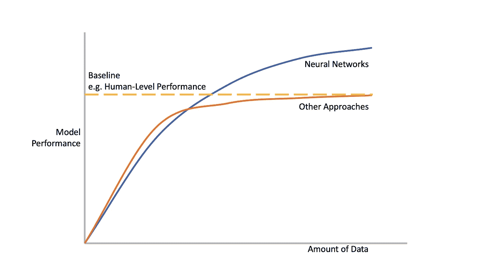

# 人工智能/人工智能公司无法规模化的最大原因是什么？

> 原文：<https://towardsdatascience.com/the-single-biggest-reason-why-ai-ml-companies-fail-to-scale-d22aa77c5452?source=collection_archive---------31----------------------->

## 你可以做三件事来避免它发生在你身上。

资料来源:Unsplash 上的马龙

“这个机器学习(ML)模型的准确性如何？”

“培训时间多长？”

“需要多少训练数据？”

在一家为机器人技术开发机器学习软件的公司工作，我每天都会听到这些问题。机器学习成了大家都想追求的闪亮对象。超过 80%的公司正在研究至少一个人工智能项目。

用户通常想知道装载一个新物品需要多长时间，以及模型的表现或概括程度如何。他们需要一种方法来衡量总体成本与性能。然而，以上问题的答案并不能给你一个完整的描述。更糟糕的是，它们具有误导性。

> M 模特培训只是冰山一角。大多数用户和 AI/ML 公司忽略的是获取适当数据集、清洗、存储、聚合、标记和建立可靠数据流以及基础设施管道的巨大隐性成本。

根据最近的研究，**公司在 AI/ML 项目中花费** [**超过 80%的时间在数据准备和工程任务上。**](https://www.cognilytica.com/2019/03/06/report-data-engineering-preparation-and-labeling-for-ai-2019/) 换句话说，如果你把大部分注意力放在构建和训练模型上，你的总工程努力和成本可能会比你最初的估计多五倍。

> 此外，机器学习模糊了用户和软件提供商之间的界限。

我们已经开始看到 AIaaS 或 MLaaS 的出现。[云中的模型随着数据的增加而不断改进。](/designing-the-user-experience-of-ml-products-8aef5afb510b)这是机器学习的最大好处，也是为什么 MLaaS 比 SaaS 更具挑战性。

来源:[巴斯蒂安·黄](https://medium.com/@Bastiane)([medium.com/@Bastiane](https://medium.com/@Bastiane))

模型从训练数据中学习。没有高质量的数据，模型就不会有好的表现。用户并不总是知道生成或注释适当数据集的最佳实践。事实上，大多数时候，他们不会。

当系统表现不佳时，用户倾向于责怪模型。因此，AI/ML 公司通常会花费大量的时间和资源来培训用户并与用户合作以确保数据质量，这成为了 AI 公司和客户之间的共同责任。

例如，为了在生产线上训练用于缺陷检测的模型，计算机视觉公司需要与其客户合作，以正确的角度和位置安装摄像机，检查分辨率和帧速率，确保每个场景都有足够的正面和负面训练样本。

对于机器人或自动驾驶汽车应用程序，数据收集甚至更加耗时和昂贵，因为有人需要控制机器人或车辆来执行某些操作。

即使有了所有的培训课程、用户手册和指南，您仍然不能完全控制用户生成的数据。一家机器视觉相机公司告诉我，他们有工程师**手动验证 100%的传入数据，以确保数据完整性。**

所有这些额外且经常被忽视的培训、手动检查、数据清理和标签任务都给人工智能公司带来了巨大的开销，使 MLaaS 成为一项更具挑战性、毛利率更低的业务。

为了建立一个更具可扩展性的人工智能/人工智能业务，我们可以做三件事:

**扩展性才是王道**。确定大量客户愿意为之付费的正确用例，并且您可以使用相同的模型架构解决这些用例。你最不想做的事情就是在没有标准产品供应的情况下为不同的公司构建和培训不同的模型。

**让尽可能多的东西自助**。尽可能自动化您的培训和数据管道，以提高运营效率并减少对人工的依赖。公司倾向于优先考虑客户可见的特性，而不是内部工具或自动化。但后者回报很快。确保为内部流程自动化分配足够的资源。

最后，确定并跟踪你的成本，尤其是隐性成本。您的工程师在清理、过滤或聚合数据上花费了多少时间？他们花了多少时间来确保第三方正确完成注释？他们多久需要帮助客户设置环境并正确收集数据一次？其中有多少可以自动化或外包？

> 我们连线吧！如果你喜欢读这篇文章，请在这里订阅我的个人博客！

*Bastiane Huang 是 OSARO 的产品经理，OSARO 是一家总部位于旧金山的初创公司，致力于开发软件定义的机器人。她曾在亚马逊的 Alexa 小组和哈佛商业评论以及该大学的未来工作倡议中工作。她写关于 ML、机器人和产品管理的文章。跟着她到这里* 。