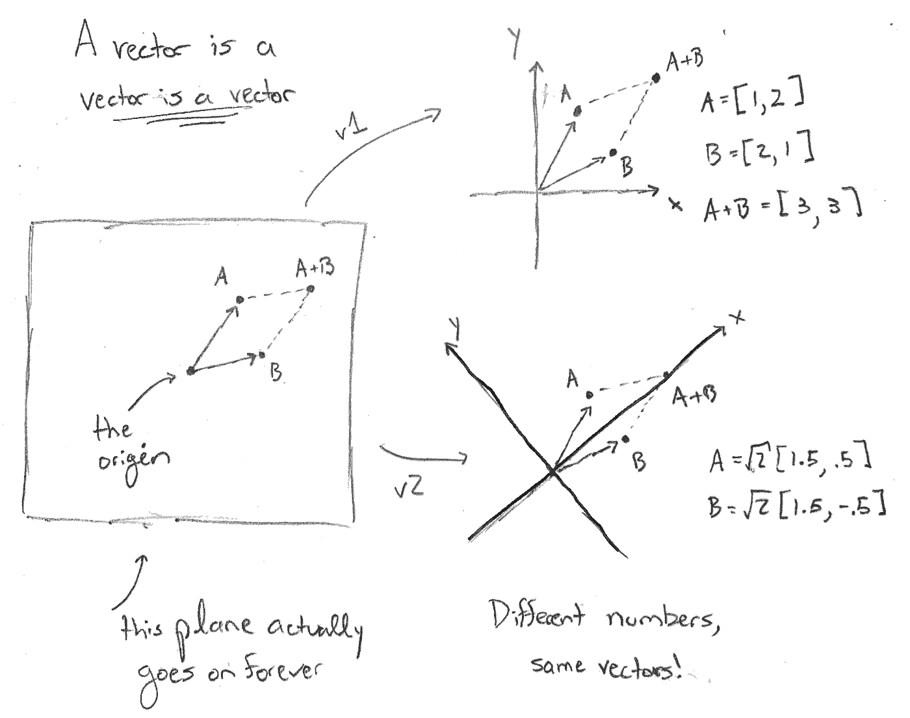
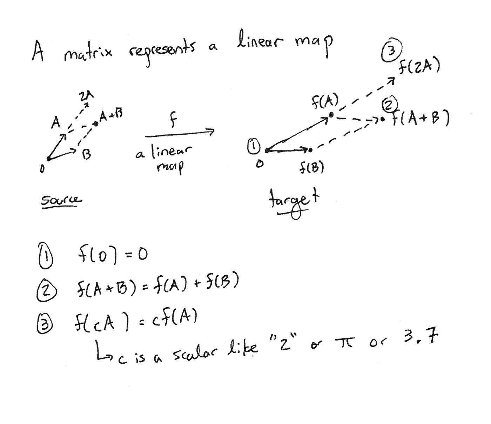
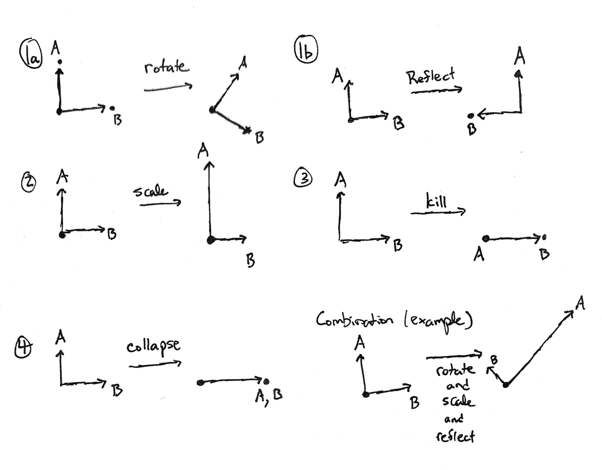
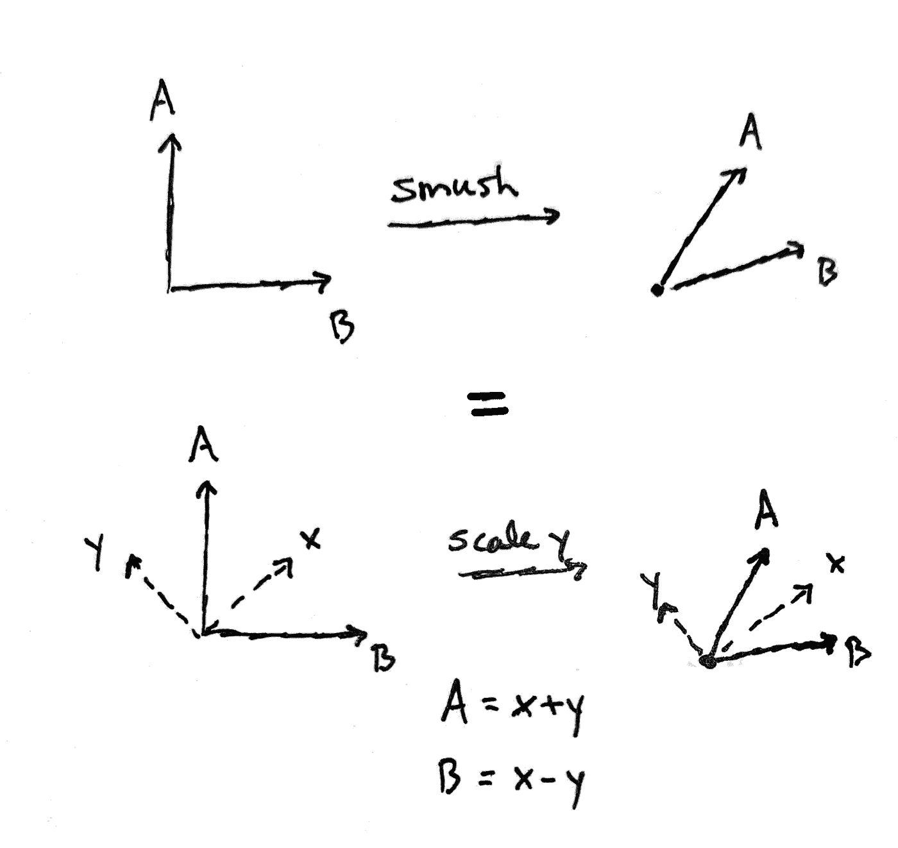
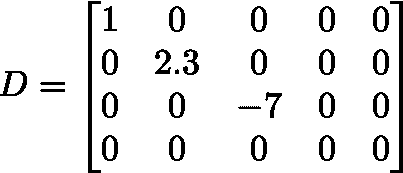
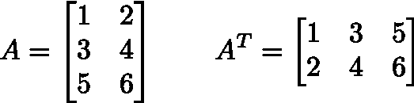
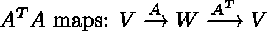

# 无代数的奇异值分解

> 原文：<https://towardsdatascience.com/the-singular-value-decomposition-without-algebra-ae10147aab4c?source=collection_archive---------35----------------------->

阿什·埃德蒙兹在 [Unsplash](https://unsplash.com?utm_source=medium&utm_medium=referral) 上拍摄的照片

## 用几何理解终极线性代数概念

这是一个不幸的现实，许多人试图用代数来学习线性代数，而实际上发生的事情本质上是一个几何问题(这意味着你可以用图片来理解)。我之前在[用几何学理解回归](https://medium.com/@rmcharan/regression-geometry-61fdd5515ab7)中描述过这个观点，这里我将尝试用奇异值分解做一些类似的事情。

奇异值分解是线性代数的基本概念。有了它，你可以理解，除了许多事情之外，矩阵到底是什么，各种其他相关的分解，特征值和特征向量，以及伪逆。在计算机科学/数据科学方面，奇异值分解是 NLP 中的[潜在语义分析](https://www.google.com/search?q=latent+semantic+analysis&oq=latent+semant&aqs=chrome.1.69i57j0l7.2743j0j7&sourceid=chrome&ie=UTF-8)等技术的基础，并且与在[推荐系统](https://en.wikipedia.org/wiki/Recommender_system)中使用的各种[协同过滤](https://en.wikipedia.org/wiki/Collaborative_filtering) / [矩阵分解](https://en.wikipedia.org/wiki/Matrix_factorization_(recommender_systems))算法相关。

为了得到奇异值分解，我们首先要消除向量是一列数字，矩阵是一组数字的神话。然后我们将介绍和描述分解。

这里假设的背景是你知道什么是向量(如果你认为它是一列数字的话，那就更好了)，同样也知道什么是矩阵。您应该熟悉:

1.  可以添加向量:[1，2] + [3，4] = [4，6]
2.  一个向量可以乘以一个常数:3[1，2] = [3，6]
3.  可以通过画一个从原点指向指定点的箭头来绘制矢量。
4.  矩阵可以相乘(稍微复杂一点，但是我们实际上不需要做任何实际的矩阵乘法，不用担心)。

技术说明:本文仅限于考虑实数和有限维(我们的向量由有限的数字列表组成，而不是无限的列表)。此外，我们添加了一个技术假设，即我们有一个内积结构，你可以认为这意味着勾股定理是有效的。我们所做的一切都将适用于复数或无限维:前者需要调整几个词；后者让事情变得极其复杂。

# 向量不是一系列数字

首先，让我们建立我们的几何背景:传统的欧几里得空间。你应该描绘一个完全平坦的无限平面(二维空间)或者我个人最喜欢的三维空间，就像我们生活的这个空间。

这就是问题所在。你可能习惯于在二维空间画 x 轴和 y 轴，或者在三维空间画 x 轴、y 轴和 z 轴。这是非常误导人的，所以请把它们从你的照片上抹去。取而代之的是，在空间的某个地方(通常是“中间”)放一个点，称它为原点。

请注意，我们将要做的一切都在 *n* 维中工作，其中 *n* 可以是一个大整数。我只是一个凡人，我只能在三维空间想象，我在二维空间画得最好。如果你能想到更多，你就有更多的力量。

## 向量是向量是向量

下图在左边显示了两个向量 A 和 B，以及它们的和。右边是向二维空间添加轴的两种不同方式。根据我们如何选择轴，我们得到不同的数字！我们不会担心这些数字之间的关系(当然，这是代数出现的地方，我保证我们不会这样做)。

要点是*矢量是矢量是矢量*:它的存在独立于用来描述它的数字，如果有的话。这是爱因斯坦相对论的一个重要观点:根据你的观点，你可能会描述不同的东西；但这并不能改变它*是什么*。

这里有几个要点。首先，向量*是什么*包括它的长度(离原点的距离)和它相对于其他向量的角度。这是几何学的精髓。第二，我们选择我们的轴是正交的(垂直的)，这不是我们必须做的。但是如果你不选择它们，事情会变得非常复杂，所以在整篇文章中，我们总是假设我们有正交轴。第三，我们应该在技术上选择一个 [*基准*](https://en.wikipedia.org/wiki/Basis_(linear_algebra)) 而不是*轴。*然而，这只是增加了代数，减去了直觉，让事情变得更加复杂。如果你关心的话，基只是通过选择长度为 1 的向量指向每个轴的正方向。

## 向量存在于向量空间中

这里不多说了。向量空间是一个有趣的词，指向量所在的空间。在某种意义上，它只是所有相关向量的集合。并且有一个特殊的向量 0(原点)。在上图中，向量生活在二维向量空间中。

我提出这个的唯一原因是因为我们需要一次处理不止一个向量空间。例如，我们可能有一个 2 维向量空间 *V* 和一个 4 维向量空间 W。V 中的向量与 W 中的向量无关(目前)。你不能把 V 中的向量和 W 中的向量相加。

# 矩阵不是一组数字

> "根据我的经验，如果抛开矩阵，涉及矩阵的证明可以缩短 50%。" *—埃米尔·阿廷*

这里的许多混乱源于这样一个事实，即在大量的计算环境中，矩阵*仅仅是一个数字阵列*，并不参与所涉及的完整的数学结构。但是，如果你正在读这篇文章，你可能会对完整的数学结构感兴趣。

## 矩阵是向量空间之间的(线性)映射

“地图”只是一种功能，但其内涵是“保留结构”函数(在数学中)是接受输入并给出输出的东西。在向量空间的上下文中，结构是“有一个原点”，“你可以添加向量”以及“将它们乘以一个常数”。这种结构被称为*线性*，因此在这个上下文中，我们总是含蓄地表示“线性映射”(因此得名:线性代数)。

因此，矩阵是一个函数 *f* ，它从一个向量空间(“源”)获取向量，并返回另一个向量空间(“目标”)中的向量。此外，它必须满足三个属性才能成为线性:

线性地图满足三个特性

在英语中:

在二维*源*向量空间中，我们可以选择如图所示的两个一般向量 A 和 B，并且该函数可以为这两个输入返回*任何*输出。在一个 *n-* 维的源中，我们需要挑选 *n 个*通用向量。目标可以是从 0 到 1 万亿或更高的任何维数。注意“一般”我排除了一些退化的情况，比如(说)如果 a 和 b 是同一个向量，或者 b 是这个设置的两倍 A.⁴，我们需要:

1.  该函数从原点到原点
2.  应用于和 f(A + B)的函数与我们先应用函数的和是一样的:f(A) + f(B)。
3.  对于标量倍数也是如此:f(cA) = c * f(A)。

请注意，有时，源和目标可能是相同的，但这在概念上不会改变任何事情。

关于矩阵的最后一点。就像当我们重新分配轴时，向量中的数字会改变一样，矩阵中的数字也会改变。它们取决于源和目标中使用的轴。所以实际上，矩阵是线性映射的一种*表示*，在源空间和目标空间中隐含或明确地选择轴。

在下文中，我们将假设每个矩阵都有一个隐含的轴选择；如果我们改变坐标轴，矩阵中的数字会改变，但线性地图本身不会改变。出于这个原因，我们会稍微滥用这个术语，用“矩阵”来表示“线性地图”这里的基本观点是，你根本不应该考虑数字数组:你应该考虑线性映射。

# 线性地图做什么

好了，现在让我们建立一个稳定的例子。下图显示了两个二维向量空间之间的线性映射可以做的一些事情。为简单起见，目标中的图像 f(A)和 f(B)仅标记为 A 和 B。

第 1-4 项显示了线性地图可以做的一些事情。此外，它可以做这些事情的任何组合，右下角显示了一个示例。

线性地图能做的事情。

要记住的重要一点是，在一个 *n-* 维空间中，更多的组合是有意义的。例如，对于 5 个维度和垂直向量 A、B、C、D 和 E，我们可能让 A、B 和 C 进行三维旋转，同时 C、D 的反射折叠到 C 上，而 E 消失。(是的，真的，这叫“杀死”病媒；一个暴力的比喻但那是数学家说的)。在某些情况下，在高于 2 或 3 的维度中会发生更多，但这不是那些情况之一。

# 奇异值分解

我们现在能够给出奇异值分解的非正式陈述。

**定理**(奇异值分解，非正式说法)。每个线性地图都是旋转、反射、缩放和矢量删除的组合，前提是轴选择正确。

几个要点。“杀死”一个矢量实际上只是把它缩小到零。也请注意，我忽略了折叠:正如我们将看到的，折叠实际上是由其他部分组成的。

因此，如果你理解了上面的图表(以及它在比如说 4 维空间中是如何工作的)，那么你就理解了在这个上下文中关于线性地图的所有知识的本质(官方说法是:具有内积结构的真实的有限维向量空间)。

这里有一个例子。如果你看上面的图表，你不会看到任何类似“smush”的东西事实上，所示的“smush”实际上是单个向量的缩放；但是我们需要考虑所示的向量 *x* 和 *y* ，而不是考虑 A 和 B。

正确地看，“Smushing”是单个向量的缩放

记住，我们说过要从二维源向量空间描述一个线性地图，我们只需要选择两个一般向量，然后看看它们去哪里。但关键是，如果仔细选择这两个向量，地图将允许一个简单的描述。

现在，我说我们应该仔细选择*轴*，而不是这两个向量。但是真正做一个就是做另一个。我建议将这两个向量命名为 *x* 和 *y* ，因为实际上，我们选择了 *x-* 和 *y* - *轴*，然后使 *x* 和 *y* 只是指向这些轴的向量。之前我们已经选择了 *A* 和 *B* 来为我们指出我们的轴(其中 *A* 轴沿着 *A* ，而 *B* 轴沿着*B*——我们可以随意命名这些轴)。所以考虑两个向量和考虑两个轴是一样的。做任何对你来说自然而然的事。

## 正式声明

奇异值分解的官方陈述必然只涉及最少量的代数，但我将努力用英语从几何角度解释它。

**定理**(奇异值分解)。

设 a 是一个有 *m* 行和 *n* 列的矩阵(m⨉n)，视为从一个 *n-* 维向量空间 *V* 到一个 *m* 维向量空间 *W* 的线性映射。

那么 A 可以被分解为三个矩阵 A = R*D*S 的乘积，其中:

*   s 是源和目标都为 v 的 n⨉n 旋转矩阵
*   d 是具有源 v 和目标 w 的 m⨉n 对角矩阵:它唯一的非零元素在对角线上。例如:

对角线上有 1，2.3，-7 和 0 的非正方形对角矩阵

*   r 是具有源 w 和目标 w 的 m⨉m 旋转矩阵

回想一下，线性映射 A 隐含地带有轴的选择，特别是通常的 x-、y-、z-等。-V 轴和 w 轴。

这意味着从 V 到 W 的线性映射 A 可以认为分三步发生。首先，使用 s 旋转 V 中的向量，其次，用一个常数(可能是 0，它会杀死向量，也可能是负的)沿每个轴缩放向量，然后通过使用隐式带有 A 的轴(使用 D)将它们放入 W 中。最后，对 W 中的向量进行旋转(使用 R)。

请注意矩阵乘法的工作方式，S 先作用，然后 D，然后 R(因为向量在右边)。

请注意，如果你在维基百科[上查找奇异值分解，你会看到一个稍微不同的陈述。我向你保证，我的版本也是真实的，而且简单得多。](https://en.wikipedia.org/wiki/Singular_value_decomposition)

维基百科上的陈述使用了 S 的“转置”，而不是 S 本身。这是为了明确旋转矩阵有效地重新调整我们选择的轴。Wikipedia 语句也允许 S 和 R 包含额外的反射，但是我们可以用 D 中的负比例来代替。

但是，一旦我们认识到一个旋转矩阵等价于改变轴(是的，我保证)，那么希望你会明白为什么上述定理的非正式陈述是正确的。如果允许我们首先选择合适的轴，我们可以把 A 写成一个对角矩阵，它缩放轴，并把它们从源 V 移动到目标 w。

一些术语:在源和目标中形成对角线的特殊轴称为左奇异向量(在目标中)和右奇异向量(在源中)。它们是 R 的列和 S 的行是左右奇异向量。D 对角线上的值称为*奇异值。*

# 部分校样草图

我将只提供矩阵 S、R 和 D 的构造，以给奇异值分解增加一点几何直觉。这还不足以成为充分的证据。

## 光谱定理

奇异值分解推广了[谱定理](https://en.wikipedia.org/wiki/Spectral_theorem)。谱定理之所以这么说，是因为其思想是，存在一个可以提取的矩阵“真实性质”的幽灵(“幽灵”)。在谱定理的上下文中,“真正的本质”是我们可以选择轴(使用奇异向量),这样矩阵只是一个缩放矩阵。“特征”是德语中“真实”的意思，因此在谱定理的上下文中，奇异向量被称为“特征向量”，奇异值被称为“特征值”。

谱定理只适用于具有相同源和目标的方阵。它也只对一些方阵([正常](https://en.wikipedia.org/wiki/Normal_matrix)的)有效，不是所有的。相比之下，奇异值分解适用于非方阵，适用于每个矩阵的*。*

## 矩阵转置

你可能听说过矩阵[转置](https://en.wikipedia.org/wiki/Transpose)。假设我们在选择轴的时候很友好，不淘气(它们需要垂直)，矩阵转置就是把矩阵翻转到对角线的另一边。

转置翻转一个矩阵，并把它放在一边

**转置是一个反向映射**。如果 A 把源 V 映射到目标 W，那么它的转置是向后的:转置是有源 W 和目标 V。

## 获取奇异值

设 A 是一个有源 V 和目标 w 的矩阵，跟随它的转置产生一个从源到自身的映射。

通过转置跟随映射导致从源到自身的映射

原来谱定理适用于这张图。特征向量提供了右奇异向量。同样，如果你先做 A 转置，然后做 A，你会得到左奇异向量。一旦有了这些，你要做的就是提取奇异值作为特征值的平方根。证明这是可行的有点复杂，但并不疯狂。

# 结论

我希望您已经看到，将矩阵视为线性映射而不是数字数组是理解它们的一种非常强大的方法。如果为源空间和目标空间选择了正确的轴组，每个线性图可以非常简单地描述为对角缩放矩阵。在应用中，人们感兴趣的往往是那些轴，因为它们在某种意义上提供了观察矩阵的“真实”或“潜在”方式。

作为练习，如果你已经理解了这一点，你应该能够理解 [Moore-Penrose 伪逆](https://en.wikipedia.org/wiki/Moore%E2%80%93Penrose_inverse#Singular_value_decomposition_(SVD))，它将逆矩阵推广到非方阵和不可逆矩阵。

# 参考资料/进一步阅读

如果你遵循这一点，你应该能够把这种理解带到任何好的线性代数教科书。我们称之为“轴”的东西变成了“基”,线性代数的大部分工作来自于对基的计算，以及用更多的术语更详细地考察矩阵能做什么。但是绝大多数可以通过奇异值分解的镜头来理解。

[1]正式地说，我们正在处理真实的有限维希尔伯特空间，并且该定理对任何[希尔伯特空间](https://en.wikipedia.org/wiki/Hilbert_space)都有适当的推广。如上所述，为了简单起见，本文将始终假设我们在一个具有内积结构的有限维实向量空间中工作(由于我们具有有限维，所以它自动成为希尔伯特空间)。

[2]特别是，如果轴不正交，矩阵的转置将不再包括在对角线上翻转数字。

[3]对于那些了解内情的人来说，我们假设我们有一个标准正交基，但是我们将尽可能避免谈论基。

[4]正式地，我们要求选择的源向量是[线性独立的](https://en.wikipedia.org/wiki/Linear_independence)并且跨越空间，这使得它们成为[基](https://en.wikipedia.org/wiki/Basis_(linear_algebra))。“一般”的官方定义是从代数几何中的[类属](https://en.wikipedia.org/wiki/General_position)的概念宽松地借用来的，并且粗略地意味着，在我们用来定义线性地图的基向量的选择空间中，不可接受的选择形成了至少为 1 的余维的子种类。