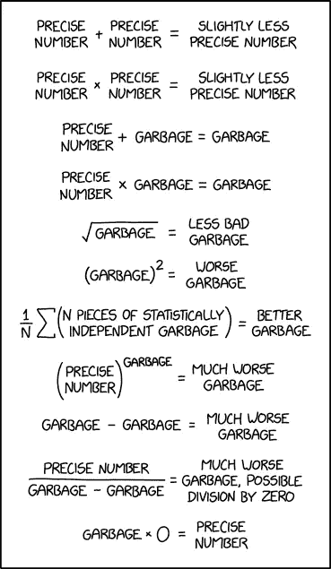

# 数据质量的六个方面——以及如何处理它们

> 原文：<https://towardsdatascience.com/the-six-dimensions-of-data-quality-and-how-to-deal-with-them-bdcf9a3dba71?source=collection_archive---------9----------------------->

## 在坚实的基础上构建您的模型和分析

图片由 [XKCD](https://xkcd.com/2295/)

垃圾进，垃圾出。这是一句耳熟能详的话，诞生于计算机科学的[早期，强调验证你的输入的重要性。](https://www.atlasobscura.com/articles/is-this-the-first-time-anyone-printed-garbage-in-garbage-out)

你可以拥有最巧妙、最优雅、经过充分测试的功能、模型或应用——但出来的东西和进去的东西一样好。

每当我们开发代码时，我们都提前对它将处理的数据的性质做出假设；一个简单的算术函数可能需要一个浮点数。点心亭的需求预测模型可以以特定的表格形式预测最近五年的销售数字。自动驾驶汽车控制器将从车辆周围的许多传感器接收不同的数据流。

如果这些假设被违反，那么会发生三种情况之一。

*   代码根据预期检查输入，并启动计划 b。这可能是为了警告用户数据有问题，然后优雅地停止。
*   代码遇到运行时错误，导致程序崩溃。
*   代码继续运行，忽略了错误的输入，并产生一个看似合理但不正确的输出。

第一个场景给你一个降落伞，第二个场景给你一个头痛，第三个场景给你一个多车连环相撞在一滩融化的 Cornetto 中。

> 错误的数据= >错误的决策

随着组织变得越来越数据成熟，重要的业务决策越来越依赖于数据分析和建模。如果做出这些决定的数据不符合标准，那么你基于这些数据的推理将是有缺陷的，可能会产生非常昂贵的后果。

这就是为什么理解数据质量并意识到您正在使用的数据可能在许多方面达不到您的要求如此重要。

## 准确(性)

照片由[威廉·沃比](https://unsplash.com/@wwarby?utm_source=medium&utm_medium=referral)在 [Unsplash](https://unsplash.com?utm_source=medium&utm_medium=referral) 拍摄

曾经创建的每一条数据都源于现实世界中的一个事件或测量。这可能是温度传感器的输出、金融交易的记录或某人在 web 表单中键入他们的名字。准确性描述了"[数据正确描述被描述的“真实世界”对象的程度。](https://www.openriskmanual.org/wiki/Data_Accuracy)”

为了实现这一点，从现实世界到数据集的旅程中的每一步都必须正确地保留原始数据的本质。

在测量或记录事件/对象的过程中，一开始就有可能出现错误。2020 年 5 月，由于填写令人困惑的申请表时出现错误，澳大利亚政府[将 COVID 19 工资补贴计划的支出承诺](https://www.abc.net.au/news/2020-05-22/jobkeeper-coronavirus-numbers-bungle-ato-question/12277598)高估了 600 亿澳元(390 亿美元)。雇主们被要求说明他们参加该计划的雇员人数。然而，在 0.1%的情况下，他们反而提交了他们所要求的补贴的美元价值——正确金额的 1500 倍*。这些错误被忽略了，它们的总价值流入了议会通过的一项法案。几周后，政府红着脸宣布了自己的错误，但可能不会因为在沙发背上发现 600 亿美元而太不高兴。*

在上面的例子中，简单地列出前 100 名左右的索赔人可能会对这个问题有所帮助。你会发现大型快餐和零售品牌，连锁酒店等。但是当你碰到一家当地的餐馆或小型旅游公司声称有几千名员工时，你就知道有问题了。

这突出了基本分析和概要分析对于理解数据集的重要性。在您做任何报告或建模之前，您需要仔细查看每个字段，看看它的值是否有意义，没有奇怪的惊喜。

准确性有一个密切相关的表亲:精度。环法自行车赛的赛段时间是以小时和秒来记录的，但这在奥运会的 100 米决赛中是行不通的。在数据类型转换过程中，或者由于用于进行初始测量的仪器的灵敏度，精度可能会降低，从而导致模型的方差降低。

## 完全

照片由 [Gabriel Crismariu](https://unsplash.com/@momentsbygabriel?utm_source=medium&utm_medium=referral) 在 [Unsplash](https://unsplash.com?utm_source=medium&utm_medium=referral) 拍摄

数据完整性表示“所需数据在数据集中的程度。”任何数据集都可能有缺口和缺失数据，但这些缺失数据会影响您回答问题的能力吗？要理解的关键是是否引入了会影响结果的偏见。

1936 年,《文学文摘》 [进行了一项民意调查](https://www.math.upenn.edu/~deturck/m170/wk4/lecture/case1.html),询问受访者是会投票给共和党人艾尔弗·兰登，还是现任民主党人富兰克林·罗斯福。然而，邮件列表主要是从电话簿中选择的。现在，在 1936 年，电话远未普及，被认为是奢侈品。因此，邮寄名单最终偏向上层和中产阶级选民，遗漏了那些买不起电话的人。一旦收到回复，*文学文摘*正确预测了压倒性胜利。然而不幸的是，在美国历史上最一边倒的选举中，兰登获得了压倒性胜利，而不是罗斯福，他最终赢得了 48 个州中的 46 个。通过使用更完整的数据集，如选民名册，或至少通过了解和调整因缺失数据而产生的偏差，投票数字可能会更接近目标。

完整性问题可能发生在记录级别，就像上面丢失整行的情况，但也可能发生在列级别，即一个字段 80%的时间都是空白的。这可能会使许多机器学习方法出错，并且如果缺失值不是均匀分布的，可能会再次引入偏差。为了缓解这个问题，有两种方法:

*   扔掉不完整的列
*   丢弃包含缺失数据的行
*   输入缺失的数据(即填空)

Yoghita Kinha 的优秀文章[如何处理数据集中的缺失值](https://www.kdnuggets.com/2020/06/missing-values-dataset.html)对上述方法进行了全面介绍。

一个更隐蔽、更隐蔽的完整性问题是，默认值给人一种完整字段的错觉，尽管实际的响应率要低得多。当我为一个零售时尚品牌建立客户终身价值模型时，这种情况曾经发生在我身上。在每个顾客档案上都有一个“性别”标志——M 代表男性，F 代表女性。该领域在数据集中具有很高的完整性，但是当一些基本分析显示大约 6 个月前女性客户的急剧变化时，就产生了怀疑。原来，在最近对注册表单的重新设计中，性别字段已经从没有默认值的必需下拉框变成了 default =“女性”的下拉框。这一小小的变化意味着，忽略该字段的客户现在被记录为女性，而不是被送回表单进行填写。

## 一致性

[本·科尔曼](https://unsplash.com/@ben_iamhere?utm_source=medium&utm_medium=referral)在 [Unsplash](https://unsplash.com?utm_source=medium&utm_medium=referral) 上拍照

如果数据在多个位置复制，它需要在所有实例中保持一致。对于一家百货商店，您可能通过忠诚度计划、邮件列表、在线账户支付系统和订单履行系统来保存特定客户的数据。在这个混乱的系统中，可能会有拼错的名字、旧地址和冲突的状态标志。这可能会在仅从数据点的一个实例读取数据的流程中导致问题，例如，如果客户取消订阅营销电子邮件，但这并没有反映在该客户的所有表现中，他们可能会继续收到通信，这让他们非常沮丧。不一致的联系方式也可能导致金钱浪费在打电话或寄信上。

在上面的例子中，拥有一个集成良好的客户数据平台，如[细分市场](https://segment.com/)或 [Omneo](https://www.omneo.io/) 可以帮助整合客户的单一视图，并确保一致性问题得到解决。

## 及时

照片由 [insung yoon](https://unsplash.com/@insungyoon?utm_source=medium&utm_medium=referral) 在 [Unsplash](https://unsplash.com?utm_source=medium&utm_medium=referral) 上拍摄

您的数据集是否足够新？在一个事件发生和它出现在你的数据中之间有多长时间的延迟。许多数据分析和建模将建立在历史快照的基础上，因此将它们运行到今天可能没有必要。然而，实时决策需要实时数据。如果雷达系统的数据只能一天一次批量下载，对空中交通管制员来说就没什么帮助了。如果由于连接问题，某些商店周日的销售数据被推迟，你周一管理层会议的数据就会被取消。

数据集的及时性可能依赖于导致其创建的数据集成管道。这可以是实时的，使数据在它描述的事件后很快可用，或者批量处理，这意味着数据被“冻结”直到下一次刷新。对这一渠道的改变可能会使你获得更多最新的数据，并对最近的事件作出更迅速的反应。

## 独特性

里卡多·戈麦斯·安吉尔在 [Unsplash](https://unsplash.com?utm_source=medium&utm_medium=referral) 上的照片

每个真实世界的对象或事件在一个特定的数据集中应该只表示一次。即，如果有 John Doe 的客户记录和 Johnny Doe 的客户记录，尽管他们实际上是同一个人。

因此，任何涉及客户的指标(客户数量、每个客户的花费、购买频率)都将因为包含一个人的重复表示而被丢弃。

发现这个问题意味着识别一个合适的主键。在 John Doe、Johnny Doe 示例中，他们可能有不同的姓名和客户 id，但电子邮件地址匹配，这是他们是同一个人的有力线索。这意味着在进行任何分析或建模之前，需要额外的数据整理步骤来整合这些客户记录。

## 有效期

[Max 陈](https://unsplash.com/@maxchen2k?utm_source=medium&utm_medium=referral)在 [Unsplash](https://unsplash.com?utm_source=medium&utm_medium=referral) 上拍照

数据集中的字段可能需要满足某些条件才能被视为有效。电子邮件地址必须有一个“@”符号，电话号码必须是一系列数字，会员等级字段可能需要是“金”、“银”或“铜”。

在许多情况下，使用正则表达式可以很容易地检查有效性。网上有一些数据库，比如 regexlib.com，其中包含了数千种常见数据类型的正则表达式。对于离散数据类型，比如上面的成员层示例，简单的频率统计可以告诉您是否存在有效性问题。如果你有除了“金”、“银”或“铜”之外的大量值，那么一定有问题。

一旦识别出无效数据，它实际上就变成了一个完整性问题，可以使用前面描述的方法来处理这个问题。

# 概括起来

约翰·巴克利普在 [Unsplash](https://unsplash.com?utm_source=medium&utm_medium=referral) 上拍摄的照片

在任何数据科学项目的开始，清楚地了解您的数据以及它从源到数据集的路径是非常重要的。虽然匆忙实现项目中更性感和更复杂的部分很有诱惑力，但是如果它建立在不稳定的基础上，那么这种努力就白费了。只有通过问问题、测试假设、分析和理解你的数据，你才会对你的分析质量真正有信心。