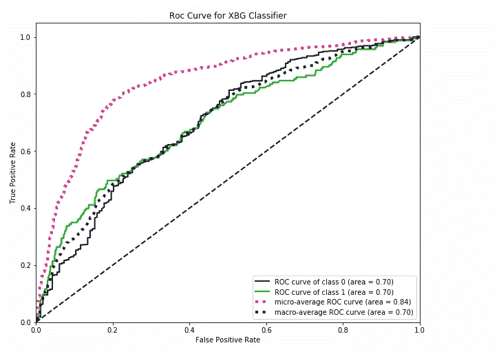

# 关于 Scikit-plot 你需要知道的六件关键事情

> 原文：<https://towardsdatascience.com/the-six-key-things-you-need-to-know-about-scikit-plot-119cbd869adb?source=collection_archive---------42----------------------->

## 向 scikit-learn 对象添加绘图功能的直观库。


来自[佩克斯](https://www.pexels.com/photo/assorted-color-artwork-equipment-set-1053687/?utm_content=attributionCopyText&utm_medium=referral&utm_source=pexels)的[马尔科·布拉泽维奇](https://www.pexels.com/@kerber?utm_content=attributionCopyText&utm_medium=referral&utm_source=pexels)的照片

> "想象给了你一些你不知道的问题的答案."— [本·施奈德曼](https://www.cs.umd.edu/users/ben/)

可视化是数据科学和机器学习中最重要的组成部分之一。如果你需要向某人展示你的结果，你可以向他们展示可视化的结果，而不是 Excel 中的一堆数字。当谈到机器学习实验时，在训练阶段可视化模型，结果非常重要，可以帮助你对下一步做什么做出好的决定。通过可视化你的结果，你可以注意到你从来没有期望看到的东西。Scikit-plot 可以帮助您执行机器学习项目中的任务。

# 什么是 Scikit-plot？

Scikit-plot 是一个 python 包，可以帮助您在机器学习项目的不同阶段可视化您的数据、模型(在训练期间)和实验结果。Scikit-plot 是一个谦逊的尝试，它提供了一个用尽可能少的样板文件生成快速、漂亮的图表和绘图的机会。

在本文中，您将学习 Scikit-plot 库中提供的以下模块:-

*   [估值器模块](https://scikit-plot.readthedocs.io/en/stable/estimators.html)
*   [指标模块](https://scikit-plot.readthedocs.io/en/stable/metrics.html)
*   [分解模块](https://scikit-plot.readthedocs.io/en/stable/decomposition.html)

> “一张照片最大的价值是当它迫使我们注意到我们从未期望看到的东西”——约翰·图基

# 装置

安装简单！首先，确保您已经安装了依赖项 [Scikit-learn](http://scikit-learn.org/) 和 [Matplotlib](http://matplotlib.org/) 。

然后运行:

```
pip install scikit-plot
```

如果使用 conda，您可以通过运行以下命令来安装 Scikit-plot:

```
conda install -c conda-forge scikit-plot
```

以下简单的机器学习项目将向您展示如何在您的下一个机器学习项目中实现这些 scikit-plot 模块。

我们将使用来自拉各斯和尼日利亚主要城市的保险数据集。我们将建立一个**预测模型**来确定一栋建筑在一定时期内是否会有保险索赔。我们将不得不预测在建筑物的保险期内至少有一次索赔的概率。你可以在这里下载数据集。

我们将从导入这个 ML 项目的重要包开始。

加载保险数据集。


前五行

在这个数据集中，我们有分类值和数值。

让我们看看数据集的形状

```
 data.shape(7160, 14)
```

我们有 14 个变量和 7160 行。

数据集中的列列表。


列列表

你可以在这里阅读[这个数据集中每个变量名的含义](https://github.com/Davisy/Machine-Learning-Project-with-Scikit-Plot/blob/master/Variable_Codebook.docx)。我们的目标变量是一个**索赔**，它有两个唯一的值。

*   1 如果建筑物在保险期内至少有一项索赔。
*   如果建筑物在保险期内没有索赔，则为 0。

我们将删除两列客户 Id 和地理代码。

检查数据集中缺失的值。


每个变量中缺少值

我们有 3 列缺少值，它们是*花园、建筑尺寸和入住日期*。

以下代码将使用*最频繁和平均策略处理所有缺失值。*

在数据集中，我们有一些分类变量将通过使用 scikit-learn 的 [*LabelEncoder 方法*](http://scikit-learn.org/stable/modules/generated/sklearn.preprocessing.LabelEncoder.html) 进行数字转换。

*Residential、Builiding _ Painted、Building_Fenced、Garden 和 NumberOfWindows* 变量已被转换成数值。

让我们把目标变量和自变量分开。

我们将使用 scikit-learn 中的 [*MinMaxScaler*](http://scikit-learn.org/stable/modules/generated/sklearn.preprocessing.MinMaxScaler.html) 对自变量进行缩放。

将数据集拆分为训练集和测试集。

我们将使用数据集的 *10%* 作为测试集。在我们进一步训练模型之前，一个独立变量列表将保存在 feature_columns 中。

现在让我们了解 scikit-plot 可以提供什么。

# 评估模块

scikit-plot 中的估计器模块包括专门为 scikit-learn 估计器(分类器/回归器)实例(如随机森林)构建的图。您可以使用自己的估计器，但是这些图假定 scikit-learn 估计器具有共同的特定属性。

现在让我们从 scikit-learn 创建我们的分类器。我们将使用 GradientBoosting 算法作为我们的分类器。

## 1.学习曲线图。

Scikit-plot 提供了一个 **plot_learning_curve 方法**，它可以为分类器生成一个训练和测试学习曲线图。该曲线可以帮助您更好地了解训练期间的模型行为。

我们将在 plot_learning_curve 方法中传递分类器、自变量、目标变量等重要参数，这意味着分类器将被训练，同时生成一条学习曲线。


学习曲线

正如你所看到的，学习曲线可以帮助你更多地了解你的模型行为。从图中可以看出，**的训练分数**随着训练样本数量的增加而减速，而**的交叉验证分数**试图在训练样本数量增加时保持其性能。

## 2.特征重要性图

数据集中包含大量要素并不意味着您可以创建性能良好的模型。有时候，一些重要的特性是您创建一个具有良好性能的模型所需要的。

Scikit-plot 可以通过使用 **plot_feature_importances 方法**生成分类器特征重要性的图。

我们将在 plot_feature_importances 方法中传递重要参数，这些参数是经过训练的模型分类器并列出特征名称。


重要性特征

上面的图显示了一个重要特性的列表，从最重要的特性到最不重要的特性。我们数据集中最重要的特征是**建筑尺寸**，最不重要的特征是**花园**。

这意味着我们可以移除数据集中的花园要素，因为它对模型预测没有太大贡献。

# 度量模块

度量模块包括机器学习评估度量的图，例如混淆矩阵、轮廓分数、ROC 等。

## 4.混淆矩阵图

[混淆矩阵](/understanding-confusion-matrix-a9ad42dcfd62)是大多数数据科学家和机器学习工程师都非常了解的。混淆矩阵是一种总结分类算法性能的技术。
您可以使用 **plot_confusion_matrix** 方法从预测和真实标签生成混淆矩阵图。

我们将传递 plot_confusion_matrix 方法中的重要参数，它们是真实标签和预测标签。


混淆矩阵

从上图可以看出，0 类的 *96%* 预测正确，1 类只有 *21%* 预测正确。

## 4.受试者工作特征曲线

[Roc 曲线](/understanding-auc-roc-curve-68b2303cc9c5)是预测二元结局概率的有用工具。这是对于 0.0 和 1.0 之间的多个不同候选阈值的*假阳性率* (x 轴)相对于*真阳性率* (y 轴)的曲线图。

Scikit-plot 可以通过使用 **plot_roc** 方法从标签和预测得分/概率生成 ROC 曲线。

我们将在 plot_confusion_matrix 方法中传递真实标签和预测概率来生成图。



受试者工作特征曲线

该图显示了 4 条不同的曲线及其面积值，分别为

*   0 类 Roc 曲线。
*   第一类 Roc 曲线。
*   微观平均 Roc 曲线。
*   宏观平均 Roc 曲线。

## 5.精确回忆曲线

[精度-召回曲线](http://scikit-learn.org/stable/auto_examples/model_selection/plot_precision_recall.html)是不同阈值的*精度* (y 轴)和*召回* (x 轴)的曲线图，用于评估分类器输出质量。当类别非常不平衡时，精确召回是预测成功的有用度量。

精度-召回曲线显示了不同阈值的精度和召回之间的折衷。曲线下的高区域表示高召回率和高精度，其中高精度与低假阳性率相关，高召回率与低假阴性率相关。两者的高分表明分类器正在返回*准确的结果*(高精度)，以及返回所有肯定结果的大部分(高召回率)。

Scikit-plot 可以通过使用 **plot_precision_recall** 方法从标签和概率中生成精度-召回曲线。

我们将在 plot_precision_recall 方法中传递真实标签和预测概率来生成绘图。


精确召回

该图显示了 3 条不同的曲线及其面积值，分别为

*   0 级精度-召回曲线
*   第一类精确召回曲线
*   微观平均精确召回曲线

# 分解模块

分解模块包括专门为 scikit-learn 估计器构建的图，这些估计器用于降维，例如 PCA。您可以使用自己的估计器，但是这些图假定 scikit-learn 估计器具有共同的特定属性。

## 6.PCA 成分方差

主成分分析(PCA)是最早的多元分析技术之一。然而，它不仅幸存了下来，而且可以说是减少多元数据维度的最常见方法，以揭示有时隐藏的、通常隐藏在它下面的简化结构。其他人将它定义为一种**数学算法**，它减少了数据的维度，同时保留了数据集中的大部分变化。

在实践中使用主成分分析的一个重要部分是估计需要多少成分来描述数据的能力。这可以通过查看作为组件数量的函数的累积*解释方差比*来确定。PCA 中的解释方差比率计算由每个选定组件解释的方差百分比。

Scikit-plot 可以使用**plot _ PCA _ component _ variance**方法生成 PCA 成分的解释方差比率。

我们将在 plot_precision_recall 方法中传递具有`**explained_variance_ratio_**`属性的 PCA 实例来生成曲线。


方差比

上面的曲线量化了前 N 个分量中包含了多少总的 *14 维方差*。例如，我们看到数字的前 *3 个分量*包含大约 *81.4%* 的方差，而您需要大约 *8 个分量*来描述接近 *100%* 的方差。

可以阅读 [Matt Brems](https://towardsdatascience.com/@matthew.w.brems) 写的文章，了解更多关于 PCA 的知识。

[](/a-one-stop-shop-for-principal-component-analysis-5582fb7e0a9c) [## 主成分分析的一站式商店

### 在教科书的开始，我用我的研究生统计理论课，作者(乔治卡塞拉和罗杰…

towardsdatascience.com](/a-one-stop-shop-for-principal-component-analysis-5582fb7e0a9c) 

# 包裹

在本文中，您了解了如何向 scikit 添加绘图功能——学习对象并通过查看彩色绘图获得洞察力。你可以开始在你的下一个[机器学习项目](https://medium.mybridge.co/30-amazing-machine-learning-projects-for-the-past-year-v-2018-b853b8621ac7)中实现 scikit-plots。

如果您对绘制集群感兴趣，scikit-plot 具有 Clusterer 模块，包括专门为 scikit-learn Clusterer 实例构建的图，您可以查看[文档](https://scikit-plot.readthedocs.io/en/stable/cluster.html#)以了解关于 Clusterer 模块的更多信息。

本文的数据集和源代码可以在 Github 上找到。

[](https://github.com/Davisy/Machine-Learning-Project-with-Scikit-Plot) [## davisy/带有 Scikit-Plot 的机器学习项目

### Scikit-plot 是一个谦逊的尝试，为缺乏审美的程序员(比如我自己)提供机会…

github.com](https://github.com/Davisy/Machine-Learning-Project-with-Scikit-Plot) 

如果你学到了新的东西或者喜欢阅读这篇文章，请分享给其他人看。也可以随意发表评论。在那之前，下一篇文章再见！也可以通过推特 [@Davis_McDavid](https://twitter.com/Davis_McDavid) 联系到我。

***最后一件事:*** *在下面的链接里多看看类似这样的文章。*

[](https://medium.com/analytics-vidhya/why-you-need-to-explore-your-data-how-you-can-start-13de6f29c8c1) [## 为什么您需要探索您的数据以及如何开始

### 探索性数据分析逐步指南。

medium.com](https://medium.com/analytics-vidhya/why-you-need-to-explore-your-data-how-you-can-start-13de6f29c8c1) [](https://medium.com/analytics-vidhya/feature-selection-by-using-voting-approach-e0d1c7182a21) [## 使用投票方法的特征选择

### 特征选择是自动或手动选择那些对…贡献最大的特征的过程

medium.com](https://medium.com/analytics-vidhya/feature-selection-by-using-voting-approach-e0d1c7182a21) [](https://medium.com/analytics-vidhya/how-to-run-machine-learning-experiments-with-python-logging-module-9030fbee120e) [## 如何用 Python 日志模块运行机器学习实验

### 有时候“打印”并不是一个好主意

medium.com](https://medium.com/analytics-vidhya/how-to-run-machine-learning-experiments-with-python-logging-module-9030fbee120e)